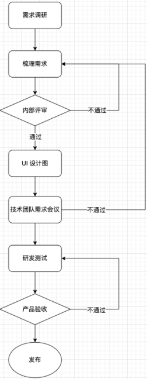
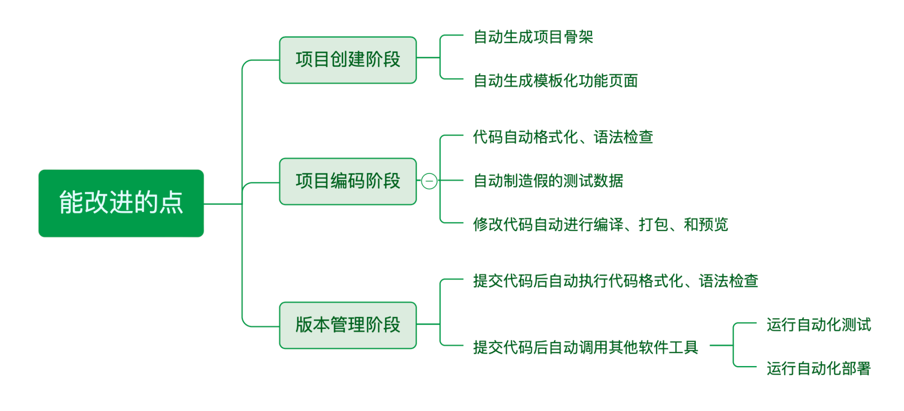
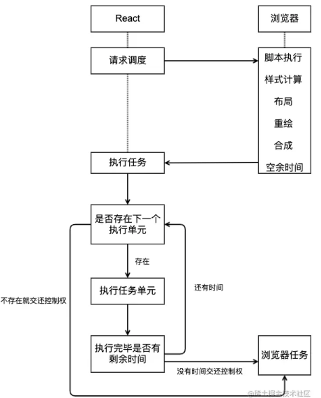
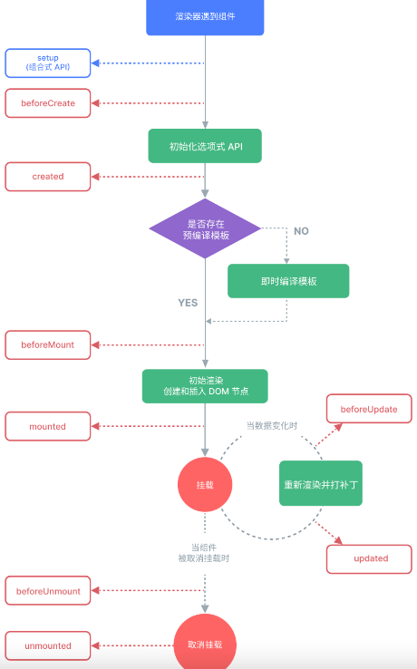
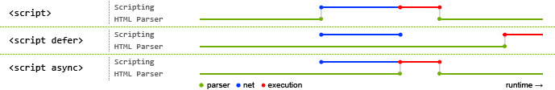
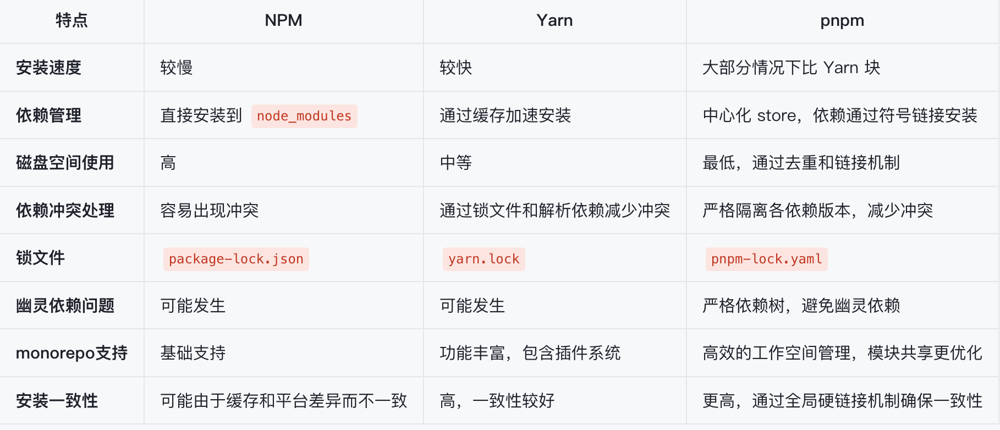
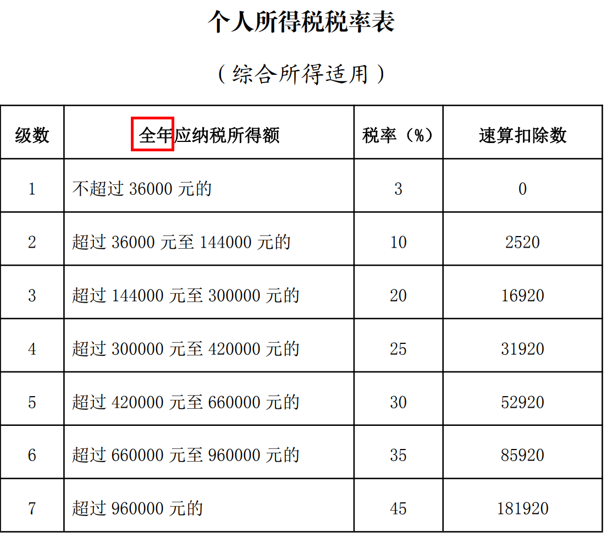

# 振涛教育人工智能学院2312A专属，项目经理李忠国整理，切勿外泄！

# 辅助标题-定屏幕上

| **要求**      | **详细说明**                                     |      |
| ------------- | ------------------------------------------------ | ---- |
| **1.主动权 ** | 以点带面  压迫感                                 |      |
| **2.总分总**  | 思维逻辑清晰                                     |      |
| **3.自信**    | 闻声识人 避免嗯 啊， 敢说 即使说错，也是自信的错 |      |
| **4.放松**    | 自然 放松 微笑 以聊天的方式面试                  |      |


# 最近在学习什么新技术

---

| **技术方向**         | **关键技术点**                                               | **如何学习**                                                 |
| -------------------- | ------------------------------------------------------------ | ------------------------------------------------------------ |
| **框架与工具链**     | [React 19+](https://react.dev/)、[Solid.js](https://www.solidjs.com/)/[Qwik](https://qwik.builder.io/)/[Svelte 5](https://svelte.dev/)、[Vite](https://vitejs.dev/)/[Turbopack](https://turbo.build/pack)/[Bun](https://bun.sh/) | 实践[Server Components](https://nextjs.org/docs/app/building-your-application/routing/server-components)与并发渲染；对比框架响应式机制；优化构建配置 |
| **AI驱动开发**       | [GPT-5代码生成](https://openai.com/)、[Figma AI转代码](https://www.figma.com/ai)、[LLM+低代码](https://retool.com/) | 用[V0.dev](https://v0.dev/)重构旧代码；探索[Figma to React](https://www.figma.com/developers)工作流；搭建AI辅助低代码平台 |
| **跨平台与边缘计算** | [Tauri 2.0](https://tauri.app/)、[Edge SSR](https://developers.cloudflare.com/workers/)/[Vercel Edge](https://vercel.com/features/edge-functions) | 开发Tauri桌面应用；部署[Next.js Edge Runtime](https://nextjs.org/docs/app/api-reference/edge)；对比SSR性能 |
| **Web3与去中心化**   | [EVM](https://ethereum.org/)/[Solana](https://solana.com/)钱包、[IPFS](https://ipfs.tech/)/[Arweave](https://arweave.org/) | 实现[RainbowKit](https://rainbowkit.com/)钱包集成；部署IPFS静态资源；研究[SIWE认证](https://login.xyz/) |
| **性能优化**         | [Islands架构(Astro)](https://astro.build/)、[WASM](https://webassembly.org/)、[UnoCSS](https://unocss.dev/) | 对比[Astro vs SPA](https://docs.astro.build/en/concepts/islands/)；用[Rust+WASM](https://rustwasm.github.io/)重构模块；落地原子化CSS |
| **开发协作**         | [Turborepo](https://turbo.build/repo)/[Nx](https://nx.dev/)、[TS 5.5+](https://www.typescriptlang.org/)、[Playwright 2.0](https://playwright.dev/) | 搭建[Turborepo模板](https://turbo.build/repo/docs/handbook)；实践[TS高级类型](https://www.typescriptlang.org/docs/handbook/advanced-types.html)；自动化视觉测试 |
| **可持续与无障碍**   | [WCAG 3.0](https://www.w3.org/WAI/standards-guidelines/wcag/)、[绿色Web](https://www.websitecarbon.com/) | 集成[axe-core](https://www.deque.com/axe/)自动化扫描；优化[CDN路由](https://vercel.com/docs/edge-network/overview) |

# 你都熟悉哪些AI大模型：

---

### **一、通用大语言模型（LLM）**
| 模型名称           | 开发者     | 核心特点                                           | 访问方式             |
| ------------------ | ---------- | -------------------------------------------------- | -------------------- |
| **GPT-4/4o**       | OpenAI     | 多模态理解、强推理能力、支持长上下文（128k token） | 付费API/Plus订阅     |
| **Claude 3系列**   | Anthropic  | 超长上下文（200k token）、强文档分析、道德约束严格 | API/Claude官网       |
| **Gemini 1.5 Pro** | Google     | 多模态原生支持、超长上下文（1M token）、免费版可用 | Google AI Studio     |
| **Llama 3**        | Meta       | 开源可商用、70B/8B 参数版本、推理性能强            | HuggingFace/本地部署 |
| **Mistral-8x22B**  | Mistral AI | 开源、混合专家模型（MoE）、多语言支持              | 开源下载             |
| **通义千问 2.5**   | 阿里云     | 中文优化、多轮对话、知识增强                       | 阿里云API/通义官网   |
| **文心一言 4.0**   | 百度       | 中文领域专家、多模态生成、企业级定制               | 百度智能云API        |

---

### **二、多模态大模型**
| 模型名称               | 核心能力                                      | 典型应用场景               |
| ---------------------- | --------------------------------------------- | -------------------------- |
| **GPT-4o**             | 文本/图像/语音交互、实时联网搜索              | 跨模态内容生成、数据分析   |
| **Gemini Ultra**       | 原生多模态（图像/视频/音频/代码）、强逻辑推理 | 复杂问题解决、学术研究     |
| **DALL·E 3**           | 文生图（高分辨率+细节控制）                   | UI设计灵感、插画生成       |
| **Stable Diffusion 3** | 开源文生图模型、高可控性                      | 商业级图像生成、定制化训练 |
| **Sora**               | 文生视频（60秒连贯视频）                      | 动态原型演示、营销素材生成 |
| **MidJourney**         | 艺术风格图像生成（抽象/写实/3D）              | 概念设计、视觉创意探索     |

---

### **三、代码专用模型**
| 模型/工具          | 特点                                     | 适用场景                     |
| ------------------ | ---------------------------------------- | ---------------------------- |
| **GitHub Copilot** | 基于GPT-4的代码补全、支持VSCode等IDE     | 实时编码辅助、快速原型开发   |
| **Code Llama**     | Meta开源的代码生成模型（7B/13B/34B参数） | 本地部署、私有代码库适配     |
| **Tabnine**        | 全语言支持、基于自定义模型的智能补全     | 团队协作、代码规范一致性     |
| **DeepSeek-Coder** | 国产代码模型、支持中英双语、上下文理解强 | 中文注释生成、本土化开发需求 |

---

### **四、开源可商用模型**
| 模型名称          | 特点                                         | 资源地址    |
| ----------------- | -------------------------------------------- | ----------- |
| **Llama 3**       | Meta开源、商业友好、70B参数版本性能接近GPT-4 | HuggingFace |
| **Mistral-8x22B** | 混合专家架构、推理效率高                     | 官方GitHub  |
| **Falcon-180B**   | 当前最大开源模型（180B参数）、多语言支持     | HuggingFace |
| **Qwen-72B**      | 阿里开源、中英双语优化、支持长上下文         | ModelScope  |

---

### **五、中国本土大模型**
| 模型名称       | 机构   | 特色                               |
| -------------- | ------ | ---------------------------------- |
| 文心一言 4.0   | 百度   | 中文语义理解强、企业工作流深度集成 |
| 通义千问 2.5   | 阿里   | 多模态生成、电商场景优化           |
| 智谱AI GLM-4   | 清华系 | 开源生态完善、学术研究常用         |
| 星火大模型 3.5 | 讯飞   | 语音交互强、教育/医疗领域专用      |
| 商量 3.0       | 腾讯   | 微信生态融合、小程序开发支持       |

---

### **六、前沿探索方向**
1. **AI Agent框架**  
   - AutoGPT（自主任务分解）
   - LangChain（工作流编排）
2. **小参数高性能模型**  
   - Phi-3（微软3.8B参数媲美大模型）
   - DeepSeek-MoE（动态计算节省资源）
3. **垂直领域模型**  
   - Med-PaLM 2（医疗诊断）
   - AlphaFold 3（生物分子预测）

---

### **🔧 开发者选型建议**
- **快速原型开发**：GPT-4 + GitHub Copilot  
- **中文场景优化**：文心一言/通义千问 + DeepSeek-Coder  
- **隐私敏感场景**：Llama 3 本地部署  
- **多模态需求**：Gemini 1.5 Pro 或 GPT-4o  


# 互联网的常见名词

B2B：企业对企业

B2C：企业对个人

DevOps: Development 和 Operations 的组合词，是开发和运营维护的总称

JD：job description，是指职位描述，是其缩写

RBAC：一般指基于角色的访问控制

RD：研发（Research and Development）

FE：前端（Front-End），前端开发（Front-End Development）

QA：测试（QUALITY ASSURANCE，中文意思是“质量保证”）

UE：用户体验（User Experience，简称 UX 或 UE）

OP：运维（Operations）

DB：数据库

PM：产品经理

PV（Page View）页面浏览量

UV（Unique Visitor）独立访客（问）数

DV（Depth of Visit）网站访问深度

TP（Time On Page）页面停留时间

RV（Repeat Visitor）重复访客

DAU（Daily Active User）日活跃用户数量

MAU（Monthly Active User）月活跃用户人数

SEO（Search Engine Optimization）搜索引擎优化

KA（Key Account）关键客户/重要客户


# 1.项目负责人

主要的工作是参与`前端工程化`,`基础设施建设`，比如，`三库一架`、`多包仓库`、`私有仓库`、`文档系统`、`监控统`、`CI/CD`的开发, 三库一架, 也就是我们公司内部组件库  Hooks库  插件库  自定义脚手架，除此之外，也负责了`5个0到1的项目开发`以及现有项目多条业务线的二次开发迭代和维护，`参与落地20多个项目开发`， 涉及医疗、物流、人工智能、金融、新能源的ToB ToC项目，其中也会参与项目需求评审，项目评估，风险规避  跨部门合作沟通，项目整体把控，需要说明的是，我作为前端项目负责人，主要工作还是负责公司业务线的项目开发落地工作，项目的基建，项目0到1的开发，带过3个前端开发，主要负责项目的开发，落地，技术攻关，但是我担任项目负责人期间没有参与团队的绩效管理。

## 1.行业业务

| **行业**     | **业务场景**                                                 |
| ------------ | ------------------------------------------------------------ |
| **AI大模型** | **1. 智能表单生成器**：基于用户输入和数据结构，自动生成动态表单组件，支持校验逻辑和数据绑定，提升表单开发效率。                                      **2. 代码质量优化工具**：利用 AI 对前端代码进行自动化检查与优化，包括代码格式、性能改进、潜在漏洞检测等，提高代码质量。                                  **3. 智能UI设计工具**：通过大模型分析用户需求，快速生成高保真 UI 原型，支持实时调整设计风格和布局。                                                 **4. 页面性能监测助手**：利用 AI 实时分析前端页面性能问题，提供优化建议，如加载时间优化、资源压缩等。                                                   **5. 用户行为分析与反馈**：通过嵌入式 AI 模型，分析用户行为路径，提供页面交互优化建议，提升用户体验。                                                    **6. 动态内容生成模块**：基于上下文理解和自然语言生成技术，动态生成页面内容，如新闻摘要、产品描述等。                                                   **7. 跨端适配解决方案**：利用 AI 自动优化代码，实现前端页面在不同设备和屏幕尺寸上的无缝适配。                                                         **8. 数据驱动组件开发**：通过模型预测用户需求，自动生成符合业务逻辑的数据驱动型前端组件。                                                             **9. 可访问性增强工具**：利用大模型分析页面的无障碍问题，自动修复并优化页面以满足 Web 可访问性标准（如 WCAG）。                                         **10. 图像处理与识别模块**：集成 AI 模型，提供图像上传、识别、分类和优化功能，适用于电商、医疗等多种场景 |

| **行业**       | **业务场景**                                                 |
| -------------- | ------------------------------------------------------------ |
| **金融行业**   | **1. 资产管理平台**：用于投资组合管理、自动化风险评估、收益分析、智能化的财务报表生成。<br>**2. 支付清算系统**：支持实时支付、跨国支付、交易清算和自动对账功能。<br>**3. 移动支付应用**：包括用户账户管理、转账、支付、消费记录管理等，提供便捷的移动端支付体验。<br>**4. 保险服务平台**：保险产品推荐、保单管理、在线保费计算、理赔服务，支持用户个性化定制保险方案。<br>**5. 金融风控系统**：整合大数据和 AI 技术，实时监控和预测金融风险，进行贷款风控、信用评估。 |
| **医疗行业**   | **1. 电子病历系统（EMR）**：涵盖患者健康档案管理、病历存储、历史治疗记录，支持跨院数据互通与医生间的协作。<br>**2. 远程医疗平台**：医生可通过该平台提供在线诊疗、健康监测、视频会诊、处方开具等服务。<br>**3. 医疗设备管理系统**：用于追踪设备状态、维护历史、使用效率，确保设备的正常运作并降低医疗事故发生率。<br>**4. 预约挂号与排队管理系统**：患者可以在线预约医生，查看候诊时间，支持智能排队提醒，提升患者就医体验。<br>**5. 医疗保险平台**：整合医保报销流程，支持患者在线查询报销进度，核算药品费用。 |
| **物流行业**   | **1. 运输管理系统（TMS）**：提供物流调度、运输路线规划、车辆管理、货物追踪，优化运输效率，减少成本。<br>**2. 仓储管理系统（WMS）**：自动化库存管理、订单处理、商品分拣、出入库优化，确保仓库运转高效。<br>**3. 供应链管理系统（SCM）**：涵盖从采购、库存到物流配送的全链路管理，确保供应链流畅运行，降低供应链风险。<br>**4. 快递物流管理平台**：提供包裹追踪、配送状态更新、签收确认、运输路径优化等功能，提升用户体验。<br>**5. 智能货运匹配平台**：基于 AI 和大数据进行智能匹配，帮助货主与承运商高效对接，实现智能调度与运输优化。 |
| **新能源行业** | **1. 智能电网管理系统**：用于电力资源分配、电力调度、负荷预测、电力使用的实时监控与优化，保障电网运行的稳定性和可持续性。<br>**2. 充电桩管理平台**：管理充电桩的分布、使用情况，支持充电记录查询、实时电价显示，优化电动车用户充电体验。<br>**3. 光伏发电管理平台**：监控太阳能光伏设备的发电情况，分析发电效率，支持设备状态监控与异常告警，推动绿色能源的发展。<br>**4. 能源交易平台**：支持企业和个人参与能源交易，提供绿色电力交易、碳排放配额交易，助力新能源市场化发展。<br>**5. 新能源车队管理系统**：包括新能源车辆的调度、路线规划、实时监控、充电站信息查询，帮助企业降低能耗和运营成本。 |
| **电商行业**   | **1. 商品管理系统**：支持商品上架、分类管理、定价、库存更新、销售分析，帮助商家管理商品的全生命周期。<br>**2. 订单管理系统**：包括订单生成、支付处理、发货管理、售后服务，提供一站式订单管理服务。<br>**3. 客户关系管理（CRM）系统**：分析用户行为，提供个性化营销策略、忠诚度计划、积分管理等，帮助电商平台提升用户粘性。<br>**4. 营销推广系统**：通过数据分析，进行精准广告投放，支持优惠券发放、折扣促销、限时抢购等营销活动，提升平台的营销效果。<br>**5. 多渠道分销系统**：支持 B2B、B2C 业务，打通线上线下销售渠道，实现多平台商品分发与库存管理。 |
| **教育行业**   | **1. 在线教育平台**：提供课程学习、考试系统、作业提交、视频直播、录播课程等功能，帮助学生随时随地进行学习。<br>**2. 校园管理系统**：包括学生信息管理、排课系统、考勤记录、成绩管理，优化学校日常运营效率。<br>**3. 远程教育系统**：支持教师与学生进行实时互动授课，提供多种互动方式如答疑、打分、作业批改等。<br>**4. 在线考试系统**：提供考试创建、自动阅卷、成绩分析、排名统计等功能，实现高效的考试管理。<br>**5. 培训机构管理系统**：帮助机构管理学员报名、课程安排、收费处理、培训进度跟踪，提高管理效率。 |
| **零售行业**   | **1. 会员管理系统**：通过积分系统、会员等级、消费记录管理、个性化推荐，帮助零售商提高会员粘性和复购率。<br>**2. 库存管理系统**：支持实时库存更新、商品入库出库管理、库存预警，帮助商家优化补货策略。<br>**3. 收银系统**：支持多种支付方式的 POS 收银系统，自动生成销售报表和财务报表，提升门店运营效率。<br>**4. 促销活动管理系统**：支持优惠券发放、折扣活动、会员特惠、满减促销等多种促销活动，结合用户行为数据进行精准推送。<br>**5. 店铺管理系统**：支持多门店的商品、订单、会员、销售数据的统一管理，实时监控每个店铺的经营情况。 |
| **制造行业**   | **1. 生产管理系统（MES）**：帮助制造企业管理生产计划、工艺流程、产能分析，实时跟踪生产进度，确保生产效率。<br>**2. 供应链管理系统**：实现供应商管理、物料采购、库存管理、物流调度，优化供应链环节，确保物料及时供给。<br>**3. 质量管理系统（QMS）**：帮助企业管理产品质检流程、缺陷检测、合规性检查，生成质检报告，确保产品质量达标。<br>**4. 设备管理系统**：对生产设备进行实时监控，管理设备的运行状态、保养计划、维修记录，降低设备故障率。<br>**5. 成本控制系统**：跟踪每个生产环节的成本，帮助企业优化成本控制策略，提高生产效率和利润率。 |
| **房地产行业** | **1. 房产交易平台**：提供房源发布、在线看房、价格评估、合同签署、交易撮合等功能，提升房产交易的便捷性与透明度。<br>**2. 租赁管理平台**：支持租赁合同签订、租金支付、租期管理、租金催缴提醒，提升房东和租客的租赁体验。<br>**3. 物业管理系统**：提供物业费缴纳、维修申请、社区公告、住户服务等功能，提升社区物业管理的智能化水平。<br>**4. 楼盘销售管理系统**：支持楼盘信息展示、销售数据统计、客户预约、意向跟踪等功能，帮助房产公司提升销售业绩。<br>**5. 房地产金融平台**：提供房贷申请、审批、还款管理、利率计算等功能，打通购房与金融服务链条。 |

## 2.项目开发流程

.


## 3.框架搭建全流程

| **拆分**                         | **做法**                                                     | **备注**                                                     |
| -------------------------------- | ------------------------------------------------------------ | ------------------------------------------------------------ |
| **1. 路由拆分**                  | 1. **`拆分路由`**：<br> 一级路由包括 **注册**、**登录**、**layout 布局**、**404** 页面，确保页面结构清晰可维护；<br> 二级路由为 **layout** 下的所有功能模块，减少路由嵌套，提升用户体验。<br>2. **`权限设计`**：<br> Vue 采用 **`RBAC 权限控制`**，通过用户角色动态加载路由和权限；<br> React 通过封装高阶组件 **`AuthRouter`**，判断 **token** 进行鉴权，未登录用户自动重定向至登录页。 | **`路由设计与权限管理`** 是确保前端应用结构合理与访问安全的核心，避免了不必要的权限泄露与性能损耗。 |
| **2. 状态拆分**                  | 1. **`Vuex/Pinia`**：拆分模块化管理状态，将 **mutations**、**actions** 和 **getters** 按照业务逻辑独立拆分，确保状态管理清晰、可维护。<br>2. **`Redux`**：拆分 **store**、**action**、**reducer**，结合 **Redux-thunk** 处理异步状态，提升数据流的灵活性和可追踪性。 | **`状态管理`** 是项目的核心之一，通过模块化拆分和异步状态管理，确保应用的灵活性与可扩展性。 |
| **3. axios 二次封装**            | 1. **`请求拦截`**：在请求头中自动添加 **token**，确保每次请求都带有身份验证信息，防止未授权请求。<br>2. **`响应拦截`**：简化响应数据，统一处理 **401** 错误（未授权），自动清除用户信息和 **token**，并重定向到登录页面。<br>3. **`请求重连机制`**：为网络请求添加 **重连机制**，设置最大重连次数（如 3 次），在请求失败时自动重试，增强请求的健壮性。<br>4. 设置统一 **baseUrl** 和请求超时机制，确保请求时长受控，避免长时间卡顿。 | **`axios 重连机制`** 增强了网络请求的稳定性，特别适用于网络不稳定或 API 请求频繁的场景。 |
| **4. 区分环境与全局变量**        | 1. **`环境区分`**：使用 **`.env.development`** 和 **`.env.production`** 文件定义不同环境变量，确保开发和生产环境中使用的变量各自独立，避免误用。<br>2. **`全局变量`**：通过 **`process.env`** 定义全局 **baseUrl** 和其他配置，保证项目能够根据不同环境加载正确的资源。<br>3. 根据 **环境变量** 动态调整日志输出，开发环境打印详细调试日志，生产环境仅记录错误和关键信息，减少不必要的日志输出。 | **`环境区分`** 和 **`全局变量管理`** 是前端项目中必不可少的部分，确保项目在不同环境中的行为一致且可控。 |
| **5. 主题定制与动态换肤**        | 1. **`UI 框架主题定制`在 **`theme.less`** 中定义自定义 CSS 变量，覆盖 **Element UI**、**Ant Design** 或 **Vant** 等组件库的默认样式，实现个性化品牌定制。<br>2. **`动态换肤`**：通过 CSS 变量实现动态换肤功能，用户可以在应用中自由切换主题，无需重新加载页面。 | **`动态换肤`** 提升了用户体验和项目的灵活性，确保组件库主题能够适配多种场景。 |
| **6. 代码规范与风格统一**        | 1. 使用 **`ESLint`** 和 **`Prettier`** 进行代码风格检查和自动格式化，在代码提交前确保代码符合项目规范。<br>2. 配置 **`Husky`** 和 **`lint-staged`**，确保每次提交代码前自动进行风格检查和格式化，防止低质量代码进入主分支。 | **`代码规范化`** 是保证团队协作和代码可维护性的关键，避免了风格不一致和代码混乱问题。 |
| **7. Gitflow 工作流管理**        | 1. **`Gitflow`**：使用 Gitflow 工作流管理分支，按照 **`master`**、**`develop`**、**`feature`**、**`release`** 和 **`hotfix`** 进行分支管理，确保开发和发布过程有条不紊。<br>2. 在每个功能开发的最后阶段，合并到 **develop** 分支进行集成测试，确保在发布之前解决潜在的合并冲突和问题。 | **`Gitflow`** 是大型项目标准的版本管理模式，确保多团队协作和项目迭代顺畅。 |
| **8. 跨域问题解决方案**          | 1. **`CORS`**：在后端服务器配置 **CORS** 头，允许前端不同域的请求访问资源，确保跨域数据交互安全。<br>2. **`Nginx 反向代理`**：通过 **Nginx** 配置反向代理，将所有前端请求转发到同一域名下，规避浏览器的跨域限制。<br>3. 在开发阶段通过 **`webpack-dev-server`** 配置跨域代理，简化本地开发和调试中的跨域问题。 | **`跨域处理`** 是前后端分离项目的关键，通过反向代理和 CORS 配置，确保数据交互的安全性和兼容性。 |
| **9. 部署与自动化构建（CI/CD）** | 1. **`手动部署`**：通过 **`npm run build`** 打包项目，将打包后的静态文件手动上传到服务器，适用于简单项目或小规模团队。<br>2. **`CI/CD 自动化部署`**：通过 **`Jenkins`** 或 **`GitHub Actions`** 配置持续集成与持续部署流程，每次提交代码后自动运行测试、打包，并将构建结果自动部署到服务器。<br>3. **`Docker` 和 `Kubernetes`**：在生产环境中采用容器化部署，使用 **Docker** 构建镜像，并通过 **Kubernetes** 实现集群管理和自动扩容，确保系统的高可用性和扩展性。 | **`CI/CD 自动化部署`** 和 **`容器化部署`** 提升了项目发布的稳定性和效率，适合大型项目的持续交付需求。 |
| **10. 性能监控与错误捕获**       | 1. 使用 **`Sentry`** 或 **`LogRocket`** 监控项目的线上性能和错误，实时捕获用户侧的异常情况，便于及时修复。<br>2. 结合 **`Google Lighthouse`** 进行性能监控，定期评估项目的加载速度、交互响应等性能指标，确保项目处于最佳状态。 | **`性能监控`** 和 **`错误捕获`** 是生产环境中保证项目稳定运行的关键，确保问题能够在第一时间被发现和修复。 |


## 4.前端技术管理工作

[前端技术管理工作](https://fe.ycy88.com/keywords/team-mgt/3_team-mgt-1-0)


## 5.团队规范

[1.项目结构规范]()

[2.开发编码规范](https://fe.ycy88.com/keywords/standard/22_1coding-specification)

[3.code review规范](https://fe.ycy88.com/keywords/standard/22_4code-review)

[4.gitflow规范](https://fe.ycy88.com/tools/team/12_GitFlow)

## 4.技术选型

[Vue项目技术选型](https://fe.ycy88.com/keywords/standard/29_vue3-best-practices)

- 选型标准
  - 项目方面
  - 团队方面
  - 技术方面


- 项目方面

  ```
  明确项目周期和特点，包括项目的规模和重要程度，确定是进行快速探索性质的项目，还是稳扎稳打的正式项目。
  ```

  - 项目周期
    - 对于简单的活动页面项目，比如各种独立的活动页和宣传页，选择擅长的即可，提效。
    - 然而，对于正式、周期长、大型的复杂项目，需要从整体的角度去考虑技术选型。
  - 项目特点
    - 项目要求SEO、数据需要动态渲染，可以考虑使用 Next.js 和 Nuxt.js。
    - 项目要求跨端，可以考虑使用Uniapp、Flutter、React Native。

- 团队方面

  ```
  团队因素主要考虑团队成员的因素，包括成员的技术栈、后期招聘成本
  ```

  - 成员技术栈

    - 选择了某个技术栈，一定是团队大部分成员都掌握的，比如：大部分会 vue，很少会 react，那么项目尽量选择 vue

    - 当前技术栈如果出现问题，那么最好是有个人能够去兜底，不然等官方维护或者切换框架就提高了成本

      

  - 招聘成本

    - 作为技术 leader、项目管理者，项目的技术栈选择一定要是当前主流的技术栈，人员发生变动，如果是冷门的技术栈，就很难进行人员招聘
    - 比如开发一个前端项目，如果使用了 JQuery或者 Angular，即增加招聘成本也影响项目性能

    

- 技术方面

  ```
  易用性、可维护性、可拓展性、性能、技术成熟度、跨平台兼容性、生态等。如果是开源项目，github的star数，可以作为一个重要的参考依据。
  ```

  - 可维护性+可拓展性+生态
    - 当前的技术栈是否还有开发人员在维护，是否有持续更新，可查看版本记录
    - 社区是否活跃、和其他技术栈是否能兼容

# 2.项目亮点和难点

## 1.前端工程化

> 作为项目负责人，经过多个项目迭代后 不断总结的前端工程化方案，**工程化是一套解决问题的思想 涉及前端的`开发、测试、部署` 为了`降本`和`增效`两个方面**



使用 **Node.js** 构建脚手架工具，通过 **Commander.js** 或 **Inquirer.js** 实现命令行交互，并结合 **Yeoman** 或 **Plop.js** 进行项目模板生成,`通过命令行参数快速生成标准化的项目结构、文件模板、依赖管理和构建工具`，在短时间内搭建基础架构,`确保项目的规范统一`，还集成了 `Git Hooks 和 CI/CD` 流程，支持自动化构建、测试和部署，覆盖项目创建、运行、测试、提交和发布。


### 1.自定义脚手架基础

| **搭建基建-公司内部自定义脚手架详细步骤    ** | 实现步骤                                                     | **备注**                                                     |
| --------------------------------------------- | ------------------------------------------------------------ | ------------------------------------------------------------ |
| **1. 项目初始化**                             | 1. 使用 **`npm init`** 或 **`yarn init`** 创建项目，定义 **`package.json`**，合理配置依赖、脚本。<br>2. 配置 **`.gitignore`**，并引入 **`Git 分支管理规范 Gitflow`**，确保分支管理规范性，使用 `master`（生产）、`develop`（开发）、`feature`（功能）、`release`（发布）和 `hotfix`（修复）等分支。<br>3. 引入 **`Commitizen (git cz)`** 强制执行 Git 提交规范，规范化提交信息，自动生成 **changelog**。<br>4. 采用 **`Monorepo`** 和 **`pnpm workspaces`** 管理多组件库和插件的代码，确保各子包的依赖管理和版本控制高效。 | **`Gitflow`** 和 **`Commitizen`** 是主流的版本管理和提交规范，**`pnpm workspaces`** 与 **`Monorepo`** 实现高效的多包管理。 |
| **2.配置开发环境**                            | 1. 使用 **`Webpack`** 或 **`Vite`** 构建工具，确保构建速度和编译效率，使用 **`Babel`** 处理现代 JS 特性。<br>2. 引入 **`ESLint`** 和 **`Prettier`** 进行代码检查和格式化，保证代码质量。<br>3. 利用 **`Husky`** 和 **`lint-staged`** 配置 Git 钩子，确保代码提交前经过自动化格式化和检查。<br>4. 引入 **`Storybook`**，为组件库提供独立的开发和测试环境，使开发者能高效开发、测试每个组件。 | **`pnpm workspaces`** 可以高效管理多个组件库的依赖，**`Storybook`** 提供了可视化的组件开发和展示环境，提升开发体验。 |
| **3.模块化设计**                              | 1. 使用 **`插件化架构`** 设计脚手架，允许开发者按需选择模块，最大化灵活性，确保功能模块独立。<br>2. 提供统一的 **`API 接口`** 和钩子机制，使插件之间的通信和组合更加便捷。<br>3. 使用 **`pnpm workspaces`** 配合 **`Monorepo`** 模式，将各功能模块和组件化封装，确保可维护性和可扩展性。<br>4. 确保每个模块设计为 **`低耦合、高内聚`**，使组件库和插件能独立开发、测试，并实现高效复用。 | **`pnpm workspaces`** 高效管理模块依赖，提升复用性，**`Monorepo`** 提供了模块和组件的统一管理架构。 |
| **4.项目模板创建**                            | 1. 在 **`templates`** 文件夹中准备多种技术栈模板（React、Vue、Node.js 等），并确保每个模板符合最佳实践。<br>2. 使用 **`Inquirer.js`** 实现交互式命令行选择框架、状态管理工具、测试框架等。<br>3. 提供 **`模板生成脚本`**，根据用户选择自动生成项目结构，自动安装依赖。 | **`模板系统`** 和 **`用户交互设计`** 提升了脚手架的易用性，生成脚本提高了开发效率。 |
| **5.CICD**                                    | 1. 使用 **`Jenkins`** 或 **`GitHub Actions`** 实现 CI/CD 流程，确保每次提交自动化测试、构建和发布。<br>2. 自动化打包、压缩、优化构建的静态资源，提升性能。<br>3. 将打包的结果发布到 **`npm`** 或私有仓库，确保用户通过命令行便捷安装：**`npm install -g <your-cli>`**。 | **CI/CD 流程** 是现代开发标准，自动化测试、构建、发布提高了团队的开发效率。 |
| **6. 文档与测试**                             | 1. 提供详尽的 **`README`** 和 **`API 文档`**，通过 **`docsify`** 或 **`VuePress`** 自动生成文档页面。<br>2. 使用 **`Jest`** 或 **`Mocha`** 编写单元测试，确保各组件和功能模块的稳定性。<br>3. 通过 **`Storybook`** 展示每个组件的使用方法，并结合 **`pnpm workspaces`** 管理组件的依赖和测试环境，确保模块化开发和测试无缝进行。 | **`Storybook`** 为组件库提供了独立开发和测试环境，**`pnpm workspaces`** 实现了多个包之间的依赖管理和共享测试环境。 |
| **7. 发布脚手架**                             | 1. 发布到 **`npm`** 或私有仓库，使用 **`SemVer`** 管理版本，并提供长期支持（LTS）。<br>2. 持续迭代、修复问题，并通过 **`changelog`** 记录版本更新，确保用户了解新版本内容。<br>3. 定期维护和更新脚手架，结合社区反馈，优化功能和用户体验。 | **`SemVer`** 版本管理和 **`changelog`** 是项目长期维护的重要工具，确保用户了解更新内容。 |

好的，以下是仅包含 **高逼格、一般程序员较少接触的点** 的精简版。这些内容专注于深度技术、独特的实现方式和系统架构创新，具备一定的挑战性，常规的基础配置和功能就不展示了。

------

### 2.自定义脚手架难点

#### **1. 高度自定义的插件机制与生命周期管理**

**技术点：**
 设计一套 **多阶段插件生命周期管理系统**，每个插件可以在特定阶段注入行为（如项目初始化、构建前、构建后、部署等），提供前端脚手架中极高的可定制性。插件机制不仅限于简单的功能扩展，甚至可以动态生成项目结构、依赖管理和不同的构建逻辑。

**实现细节：**

- 插件系统通过 **hook 管理**，允许每个插件在指定时机执行自定义代码。
- 通过自定义 **生命周期钩子** 机制，允许插件定义 `beforeBuild`、`afterBuild`、`beforeDeploy` 等阶段的行为。
- 插件支持跨项目共享，用户可以根据需要动态选择和配置插件。

```javascript
// 插件生命周期示例
class PluginSystem {
  constructor() {
    this.plugins = [];
  }

  registerPlugin(plugin) {
    this.plugins.push(plugin);
  }

  executeHook(hookName, context) {
    this.plugins.forEach(plugin => {
      if (plugin[hookName]) {
        plugin[hookName](context);
      }
    });
  }
}

// 示例插件：自动生成环境配置文件
const autoGenerateEnvPlugin = {
  beforeBuild: (context) => {
    const fs = require('fs');
    const envConfig = generateEnvConfig(context);
    fs.writeFileSync('./config/.env', envConfig);
  },
};

// 注册并执行钩子
const pluginSystem = new PluginSystem();
pluginSystem.registerPlugin(autoGenerateEnvPlugin);
pluginSystem.executeHook('beforeBuild', { env: 'production' });
```

**为什么高逼格：**

- 提供了完全自定义的生命周期和插件化机制，允许开发者深度定制构建、部署和项目生成过程，甚至在构建过程中动态生成配置文件、模板或代码。

------

#### **2. 基于动态模板引擎的自定义项目结构生成**

**技术点：**
 基于 **动态模板引擎**，根据用户选择的项目需求（如框架、构建工具、语言）自动生成对应的项目文件和目录结构。模板引擎不仅可以生成标准的项目结构，还能智能优化目录结构、命名规则等，支持高效的团队协作。

**实现细节：**

- 使用 **Handlebars.js** 或 **Mustache.js** 等模板引擎结合预设的配置模板，动态生成项目目录、文件内容以及配置文件。
- 根据团队需求，生成自定义的代码目录结构（如组件目录、服务层目录、工具类目录等）。
- 提供 `cli` 工具，自动读取模板配置，生成项目文件。

```javascript
const handlebars = require('handlebars');
const fs = require('fs');

// 预定义模板
const template = `
src/
  components/
    {{componentName}}/
      {{componentName}}.vue
  services/
    {{serviceName}}.js
`;

// 编译模板
const compiled = handlebars.compile(template);
const result = compiled({ componentName: 'Button', serviceName: 'api' });

// 生成文件
fs.writeFileSync('projectStructure.txt', result);
```

**为什么高逼格：**

- 自动化的项目结构和文件生成，支持自定义模板，极大减少手动配置的工作量，帮助团队快速统一开发风格和结构。

------

#### **3. 基于 Proxy 的高阶自动配置系统**

**技术点：**
 设计一个基于 **JavaScript Proxy API** 的自动化配置管理系统，使得每个配置项（如 Webpack、Vite 配置）都可以被动态代理和自动优化。通过 Proxy，可以监听对配置对象的操作，实时校验和自动调整配置，确保所有配置始终符合预定的最佳实践。

**实现细节：**

- 使用 `Proxy` 拦截对象的设置和获取，动态生成符合要求的配置。
- 自动检测配置是否符合某些标准，或者自动合并来自多个来源的配置。
- 支持实时修改和推送配置更改，无需手动干预。

```javascript
const configHandler = {
  get(target, prop) {
    if (prop in target) {
      return target[prop];
    }
    console.warn(`Configuration ${prop} not found, using default.`);
    return target[prop] || null;
  },
  set(target, prop, value) {
    if (prop === 'env' && !['development', 'production'].includes(value)) {
      console.error('Invalid environment setting.');
      return false;
    }
    target[prop] = value;
    return true;
  },
};

const config = new Proxy({
  env: 'development',
  build: 'webpack',
}, configHandler);

// 示例：动态修改配置
config.env = 'production';
console.log(config.env);  // production
```

**为什么高逼格：**

- 通过 `Proxy` API 动态控制配置对象，使得配置更加灵活、智能。此技术点在前端开发中较为少见，尤其是应用于构建配置的自动化和实时调整。

------

#### **4. 集成多层级异步并行任务管理系统**

**技术点：**
 构建一个异步并行任务管理系统，支持多层级任务的依赖和并行执行（例如：在构建过程中并行执行 Linter、单元测试、构建脚本等）。任务管理系统能够识别任务之间的依赖关系并动态调度。

**实现细节：**

- 使用 **Promise** 和 **async/await** 实现任务的异步并行执行。
- 在任务之间建立依赖关系，并动态计算任务的执行顺序。支持并行执行无依赖任务、串行执行有依赖的任务。
- 通过 CLI 工具让用户可视化管理任务的执行状态。

```javascript
class TaskRunner {
  constructor() {
    this.tasks = [];
  }

  addTask(task, dependencies = []) {
    this.tasks.push({ task, dependencies });
  }

  async run() {
    let runningTasks = [];

    for (let { task, dependencies } of this.tasks) {
      // 等待依赖任务完成后再执行
      await Promise.all(dependencies.map(dep => dep));
      runningTasks.push(task());
    }

    await Promise.all(runningTasks);
  }
}

// 示例：并行执行多个任务
const runner = new TaskRunner();
runner.addTask(() => console.log('Linting...'), []);
runner.addTask(() => console.log('Building...'), []);
runner.addTask(() => console.log('Running tests...'), []);

runner.run();
```

**为什么高逼格：**

- 这种 **多层级任务调度系统** 能够动态管理任务的执行顺序与依赖关系，极大提高自动化脚本的灵活性和可扩展性，适用于复杂的构建和部署流程。

------

#### **5. 基于 WebAssembly 的高效代码构建加速**

**技术点：**
 在构建过程中，使用 **WebAssembly (Wasm)** 来加速某些计算密集型的任务（例如：代码压缩、图片处理、代码优化等）。通过 WebAssembly，能够将这些任务通过低级语言编译为高效的二进制代码执行，从而提高构建速度。

**实现细节：**

- 将部分构建过程（如文件压缩、图片处理等）使用 C/C++ 等语言编写，并编译为 WebAssembly 模块。
- 使用 WebAssembly 提供更高效的执行性能，避免纯 JavaScript 实现带来的性能瓶颈。

```javascript
// 假设已经编译了 C/C++ 代码为 WebAssembly 模块
const wasmModule = await WebAssembly.instantiateStreaming(fetch('compress.wasm'));

const compressFile = wasmModule.instance.exports.compress;
compressFile(fileBuffer);
```

**为什么高逼格：**

- 利用 **WebAssembly** 的高效执行特性，在前端构建过程中通过低级语言加速任务，这种技术点一般程序员很少会接触，且对性能优化有显著作用。

## 2.监控系统

### 1.市面主流3款

| **监控系统**          | **主要功能**                                                 | **应用场景**                                                 | **缺点**                                                     |
| --------------------- | ------------------------------------------------------------ | ------------------------------------------------------------ | ------------------------------------------------------------ |
| **Sentry**            | 提供前端错误监控和性能分析，能够捕捉 JS 错误、分析崩溃信息、进行源映射解析，还支持实时报警。集成简单、覆盖面广，支持各种前端框架，如 React、Vue 和 Angular。 | 适用于各类前端项目，尤其是生产环境中需要快速定位和修复问题的场景，帮助开发者减少用户影响并提升应用质量。 | 对于小型项目，某些高级功能需要付费，复杂项目的自定义化功能较少，依赖第三方服务的限制也较大。 |
| **LogRocket**         | 通过会话回放和前端性能监控，重现用户操作，捕捉页面渲染问题、API 请求、JS 错误等。开发者可以清楚了解用户行为，定位问题根源并加以修复。 | 前端用户体验监控的最佳选择，适合需要跟踪用户操作并复现问题的场景，特别在处理用户反馈和分析性能瓶颈时表现出色。 | 存储大量用户会话数据可能增加成本，长时间会话可能对性能有影响，数据量大的情况下对存储和管理要求较高。 |
| **New Relic Browser** | 全栈监控中的前端模块，提供全面的页面加载、JS 错误、AJAX 请求监控，结合后端监控，提供端到端的性能分析，帮助团队全面了解系统表现。 | 适用于大型复杂项目，尤其是前后端监控需要联动的场景，帮助企业级应用实现从前端到后端的全面监控和优化。 | 对中小型团队来说，费用较高且设置较复杂。过度依赖第三方工具，定制化能力有限，不适合非常灵活的监控需求。 |

### 2.自己实现监控系统

[性能监控原理](https://juejin.cn/post/6899430989404045320)

| **模块**                | **详细优化设计思路**                                         |
| ----------------------- | ------------------------------------------------------------ |
| **1. SDK 架构设计**     | 1. **高内聚低耦合设计**：各功能模块（如错误监控、性能监控、用户行为追踪等）之间通过消息机制解耦，每个模块内部通过事件总线进行通信，避免直接依赖，方便模块独立维护和扩展。<br>2. **插件化与按需加载**：核心功能通过插件机制动态加载，用户可根据项目需求加载特定功能插件，减小 SDK 体积。<br>3. **兼容性与框架无关**：确保与多种前端框架（如 Vue、React、Angular）无缝集成，避免使用特定框架的生命周期或事件机制，采用浏览器原生 API 提供通用监控能力。 |
| **2. SDK 初始化与配置** | 1. **动态配置与环境感知**：SDK 初始化时提供一个统一的 `init()` 方法，接受配置项（如监控级别、日志上报策略、数据加密策略等），并可根据环境变量（如开发、生产）自动调整配置，适配不同环境需求。<br>2. **自动化配置优化**：SDK 默认配置项针对常见场景优化，开发者可通过 minimal 配置快速集成，适合小型项目快速使用。高级用户可自定义每个模块的行为，调整监控深度与日志详细度。 |
| **3. 错误监控设计**     | 1. **全局错误捕捉与分类**：不仅通过 `window.onerror` 捕捉同步错误，还要通过 `try-catch` 捕获业务代码中的异常，并提供错误分类机制（如脚本错误、资源加载错误、Promise 异常、跨域错误等），让开发者快速定位问题来源。<br>2. **错误堆栈压缩与错误聚合**：使用 `Error.stack` 提供详细的堆栈信息，将重复错误进行聚合分析，减少相同错误的冗余上报。堆栈信息通过压缩算法减少传输量，并与源映射集成（如 Source Map），实现错误堆栈的还原，方便调试。 |
| **4. 用户行为追踪设计** | 1. **高效事件监听与行为优化**：通过事件委托方式绑定 `click`、`input` 等用户交互事件，减少性能开销。对用户行为追踪做智能采样，避免在频繁操作下记录大量冗余数据；当操作频率过高时，进行数据去重或合并处理，避免影响性能和传输压力。<br>2. **操作序列化与回放功能**：记录 DOM 操作序列，将用户行为序列化为快照并压缩，支持在后台重现用户操作场景，结合错误监控和性能监控的数据，还原用户问题出现时的完整操作路径。<br>3. **无感上报策略**：基于浏览器的空闲时间（使用 `requestIdleCallback`），在不影响用户体验的情况下上报数据，减少对主线程的阻塞。 |
| **5. 性能监控设计**     | 1. **Web Vitals 指标扩展**：通过 `PerformanceObserver` 监听核心 Web Vitals 指标（如 FCP、LCP、CLS、FID），支持自定义性能指标采集，开发者可监控业务关键节点的性能（如首屏渲染时间、自定义交互延迟等）。<br>2. **长任务检测与优化**：通过 `Performance API` 检测页面中超过 50ms 的长任务，并分析造成性能瓶颈的原因（如渲染阻塞、脚本执行耗时等），帮助开发者识别并优化页面卡顿问题。<br>3. **性能数据智能分析与报告**：自动生成性能报告，包括资源加载时间、交互帧率、页面卡顿分析等数据，定期将报告发送至开发团队，帮助优化项目性能。 |
| **6. API 请求监控设计** | 1. **API 请求监控与链路追踪**：通过重写 `XMLHttpRequest` 和 `fetch` 的原型方法捕获所有 HTTP 请求，并记录每个请求的详细信息（如请求方法、耗时、状态码、响应大小、错误等）。支持链路追踪，通过 `traceId` 或 `spanId` 将前端请求与后端服务调用关联，帮助开发者追踪完整的服务调用链。<br>2. **API 健康度监控**：监控 API 的成功率、失败率、超时率等指标，生成健康度报告，并在 API 出现性能问题时及时报警，帮助运维团队优化服务稳定性。 |
| **7. 崩溃与内存监控**   | 1. **内存泄漏监控与崩溃分析**：通过 `Performance.memory` 定期采集内存使用情况，结合页面运行时的 DOM 操作频率、数据量变化，分析可能导致内存泄漏的节点。通过监控页面的内存占用，发现内存异常增长或浏览器崩溃的情况，帮助开发者提前定位问题。<br>2. **崩溃快照与恢复机制**：当页面崩溃或未响应时，自动保存崩溃快照，捕捉页面状态（如 DOM 结构、内存快照、当前任务队列等），帮助分析崩溃原因。SDK 提供崩溃恢复机制，允许用户重新加载页面时恢复未保存的数据，减少用户流失。 |
| **8. 日志与报警设计**   | 1. **日志缓存与智能上报**：通过 `localStorage` 或 `IndexedDB` 缓存用户操作日志和错误日志，确保日志不会因网络问题而丢失。当网络恢复时，SDK 自动进行批量上传，避免频繁上报带来的网络压力。<br>2. **智能日志去重与聚合**：对日志进行去重和聚合，避免重复上报相同的错误。日志会分级处理，高优先级日志（如崩溃、重大错误）立即上报，低优先级日志定期或延迟上报，确保日志传输的实时性与效率。<br>3. **自定义报警规则与频率限制**：支持开发者自定义报警规则（如 JS 错误过多、API 响应超时、内存泄漏等），并通过邮件、短信、Webhook 等方式报警。为避免过度报警，SDK 会对报警频率进行限制，确保每个问题只报警一次，减少开发者维护负担。 |
| **9. 数据隐私与安全**   | 1. **监控数据加密与传输安全**：所有监控数据（如用户行为、错误日志、性能报告等）在传输时都将进行 AES 或 RSA 加密，防止数据被拦截或篡改。同时，数据的存储也会经过加密处理，确保敏感信息的安全。<br>2. **隐私合规与用户同意**：确保 SDK 采集的数据符合 GDPR 等隐私法规，用户需明确同意后方可进行数据采集。支持用户撤回同意时自动停止数据上报，并清除已有的用户数据，确保隐私合规。 |

### 3.GA埋点方案

| 方案类型       | 实现步骤                                                     | 优点                                           | 缺点                                          | 适用场景                                 | 优化策略                                                     |
| -------------- | ------------------------------------------------------------ | ---------------------------------------------- | --------------------------------------------- | ---------------------------------------- | ------------------------------------------------------------ |
| **手动埋点**   | 1. 引入 GA SDK: `<script async src="https://www.googletagmanager.com/gtag/js?id=GA_TRACKING_ID"></script>`<br>2. 手动调用 GA API：`gtag('event', 'action', { 'event_category': 'category', 'event_label': 'label' });` | 1. 精准追踪<br>2. 灵活控制<br>3. 数据准确      | 1. 工作量大，易遗漏<br>2. 难以维护，扩展性弱  | 小型项目，关键行为追踪（如注册、订单）   | 1. **封装埋点函数**：减少重复逻辑<br>2. **配置化管理**：集中管理埋点，简化维护<br>3. **结合 A/B 测试**：提升用户体验优化 |
| **自动化埋点** | 1. 全局监听用户行为：如 `click` 事件<br>2. 自动解析 DOM 元素，动态上报埋点 | 1. 快速部署<br>2. 覆盖全局行为，减少手动工作量 | 1. 容易误报<br>2. 对 DOM 结构敏感，性能影响大 | 复杂页面、大量行为跟踪（如电商平台）     | 1. **事件代理**：优化性能<br>2. **黑/白名单机制**：精准过滤无关数据<br>3. **分区域监听**：提高数据质量，减少误报 |
| **无埋点方案** | 1. 引入第三方 SDK（如 Hotjar）<br>2. 自动捕捉所有用户行为并上报分析 | 1. 减少开发成本<br>2. 全局实时监控             | 1. 数据冗余大<br>2. 精准度低，依赖外部服务    | 大型项目，全面监控所有行为（如社交平台） | 1. **数据去重与过滤**：提升数据质量<br>2. **结合手动埋点**：保证关键行为追踪<br>3. **选择最优 SDK**：降低成本，提升分析效率 |

## 3.组件库封装

| **组件库架构能力维度**     | **实现思路**                                                 |
| -------------------------- | ------------------------------------------------------------ |
| **1. Monorepo 管理模式**   | 1. **``Monorepo 优势``**：通过 **Monorepo** 管理多个包，优化了 **依赖共享、代码复用、统一配置** 的开发体验，解决了多仓库管理带来的维护复杂性。可根据项目规模灵活选择 **Lerna**（轻量场景）或 **Nx**（适合大型项目），尤其在 Nx 的 **任务缓存** 和 **分布式任务执行** 下提升构建速度。<br>2. **``Monorepo 实践中的挑战与解决方案``**：解决跨包依赖复杂性，采用集中管理与版本发布策略，防止版本号紊乱。自动化构建和发布脚本与 **CI/CD** 集成，实现跨团队合作。 |
| **2. pnpm workspace 使用** | 1. **``高效依赖管理与缓存机制``**：相比 npm 和 yarn，**pnpm workspace** 提供了更高效的依赖管理，支持软链接机制，并解决了模块间 **Hoisting 冲突**，大幅减少磁盘占用。特别是在 Monorepo 场景下，pnpm workspace 通过共享依赖优化了构建时间和空间占用。<br>2. **``一致性与性能保障``**：确保所有子项目依赖版本统一，避免多个版本冲突问题，尤其是在微前端架构中，能确保各模块无缝集成与运行。 |
| **3. Changelog 自动生成**  | 1. **``标准化版本发布与变更记录``**：通过 **`semantic-release`** 实现 Git 提交自动生成 changelog，确保版本发布的规范性和一致性，支持多包的自动化变更日志管理。根据 **Conventional Commits** 标准化提交记录，自动生成详细的 **版本发布说明**，提高团队协作效率。<br>2. **``复杂 Monorepo 场景的 Changelog 管理``**：在组件库中，每个子包都有独立的更新日志和 changelog 管理，清晰跟踪每个包的变更历史。 |
| **4. 版本管理与发布策略**  | 1. **``独立版本 vs 统一版本``**：根据组件库间的依赖关系，选择 **独立版本** 或 **统一版本** 策略。在依赖较少的情况下，独立版本管理更灵活；而强依赖组件库则需要保持统一版本号，确保发布流程的简洁性。<br>2. **``自动化发布与语义化版本控制``**：通过 **CI/CD 集成** 实现自动化发布，在主分支合并时自动触发测试、构建和发布。采用 **Semantic Versioning**（Semver）规范，明确区分修复、功能添加与破坏性更新。 |
| **5. 组件库封装设计**      | 1. **``按需加载与 Tree Shaking``**：确保组件库支持 **按需加载**，避免全量引入组件，使用 `babel-plugin-import` 配置按需加载，确保与 **Webpack** 或 **Rollup** 的 **Tree Shaking** 配合使用，移除未使用代码，提升构建性能。<br>2. **``TypeScript 类型支持``**：提供全局和按需加载的 **TypeScript 类型声明**，确保开发者获得完备的类型推断支持，提升组件库的可维护性与开发体验。 |
| **6.文档与测试**           | 1. **``文档自动化与展示平台``**：通过 **Storybook** 或 **Docusaurus** 生成高度交互的组件文档，展示各组件的状态、交互效果，提升组件库的可用性和开发体验。<br>2. **``测试覆盖率与自动化测试``**：使用 **Jest** 进行单元测试，确保组件功能的完整性；使用 **Cypress** 进行端到端测试，保证在实际业务中的可靠性。使用 **`codecov`** 或 **`coveralls`** 监控测试覆盖率，确保组件库的高质量输出。 |
| **7. 版本兼容与升级策略**  | 1. **``严格遵循 Semver 规范``**：采用 **Semantic Versioning**，确保版本号清晰区分功能更新、修复和重大变更。对于 **破坏性更新**，提供详细的迁移指南，确保用户可以平滑升级。<br>2. **``向后兼容策略``**：为常用 API 保持 **向后兼容**，避免小版本更新时对用户造成困扰。提供渐进式迁移策略，帮助用户快速适应新版本变化。 |
| **8. 组件库的架构演进**    | 1. **``从基础组件到业务组件的扩展``**：组件库的架构应支持从基础 UI 组件扩展到业务组件，保证各模块的独立性和复用性。业务组件通过组合基础组件，提供更高层次的封装。<br>2. **``微前端与分布式开发支持``**：组件库设计要适应 **微前端架构**，支持跨项目共享组件，结合 **Module Federation** 或 **Qiankun** 进行分布式组件管理，支持多个项目共同使用组件库而不产生版本冲突。 |
| **9.多端适配与性能优化**   | 1. **``响应式设计与跨端支持``**：组件库需要支持响应式设计，确保在不同屏幕尺寸和设备上的一致性表现。使用 **CSS 变量** 或 **媒体查询**，实现灵活的样式适配，支持 PC、移动端和大屏应用场景。<br>2. **``性能优化与动态加载``**：通过 **lazy loading** 优化性能，按需加载组件；对于大数据量展示，使用 **虚拟滚动（Virtual Scrolling）** 优化渲染性能。确保组件库在高性能场景下依然流畅运行。 |
| **10. 国际化与本地化支持** | 1. **``国际化（i18n）策略``**：组件库要支持多语言配置，使用 **`vue-i18n`** 或 **`react-intl`** 等插件，实现文案的动态加载与切换，确保组件库能够在全球化项目中使用。<br>2. **``多地区本地化支持``**：组件库需支持 **本地化** 的时间、货币、单位等格式，通过配置实现自动化处理，确保业务在不同地区和文化下的正确使用。 |

### 1.Monorepo工具对比

| 工具                | 定义及功能                                                   | 优点                                                         | 缺点                                                         | 适用场景                                                     |
| ------------------- | ------------------------------------------------------------ | ------------------------------------------------------------ | ------------------------------------------------------------ | ------------------------------------------------------------ |
| **Rush**            | 微软主导的企业级Monorepo管理工具，专为大规模项目设计，提供 **增量构建**、**全局缓存**、**依赖管理** 和 **CI集成**。 | 1. **增量构建和全局缓存**，大幅提高构建效率。<br>2. 版本锁定，依赖管理清晰，确保一致性。<br>3. 适合大团队，支持复杂 **CI/CD** 流程。 | 1. 学习成本高，初次配置复杂，需要深入理解工具机制。<br>2. **小型项目** 不推荐，复杂度过高。 | **超大规模企业项目**，团队协作密集、复杂依赖和构建场景，如企业级平台、跨团队开发。 |
| **Lerna**           | 轻量化Monorepo工具，支持多个包的 **版本管理**、**发布** 和 **增量构建**，适合快速迭代。 | 1. **易于上手**，轻量灵活，适合中小团队。<br>2. 支持常用包管理工具，如 `npm`、`Yarn`，兼容性强。 | 1. 缓存机制弱，大型项目性能有限，构建速度慢。<br>2. 复杂项目中 **依赖管理效率** 较低，难以处理跨项目依赖。 | **中小型项目**，版本发布频繁，需求变动大，快速交付的场景。   |
| **Yarn Workspaces** | `Yarn` 扩展功能，支持多个包 **依赖共享** 及 **快速安装**，简化依赖管理流程。 | 1. 与 `Yarn` 深度集成，**安装速度快**，依赖共享方便，减少重复安装。<br>2. 操作简便，配置轻量，适合小团队快速上手。 | 1. 不适合复杂项目，灵活性有限，**构建能力** 较弱。<br>2. 缺少复杂构建和依赖优化的支持，难以应对大型项目。 | **中小型项目**，依赖管理简单，注重开发效率的场景，或已有 `Yarn` 生态的项目。 |
| **pnpm Workspaces** | 使用 **硬链接** 实现高效依赖共享，优化磁盘空间占用，提升依赖安装速度，适合大规模依赖管理。 | 1. **安装速度极快**，磁盘占用小，硬链接机制提高依赖共享效率。<br>2. **严格依赖管理**，避免版本冲突。 | 1. 相较于 `Yarn`，社区支持较弱，**复杂项目集成难度较高**。<br>2. **初次配置** 复杂度较高，需要时间适应。 | 适合需高效依赖管理和磁盘优化的 **大型项目**，特别是依赖多且重，性能要求高的项目场景。 |
| **Nx**              | 全面性的Monorepo解决方案，支持 **前后端协同开发**，适用于微前端、微服务架构，具备 **增量构建** 和 **缓存机制**。 | 1. **增量构建** 和 **缓存** 机制显著提升构建效率。<br>2. 支持 **微前端**、**微服务** 及 **多语言开发**，适应复杂项目需求。<br>3. 提供 **可视化工具**，便于监控依赖关系和任务流。 | 1. **学习曲线陡**，初次配置复杂，依赖管理难度大，需结合具体项目精细配置。<br>2. **大型项目下** 的依赖分析和任务调度可能产生额外管理成本。 | 适用于 **大型项目**，涉及前后端协作、微前端或微服务架构，尤其需要高效构建和复杂依赖管理的场景，如企业级应用和技术平台。 |

## 4.复杂万能表单组件

| **万能表单组件维度**          | **全面优化与深入总结**                                       |
| ----------------------------- | ------------------------------------------------------------ |
| **1. 需求背景**               | 1. **``业务场景与挑战``**：传统静态表单在应对动态复杂业务时，难以满足需求，尤其在 **后台管理系统**、**大型 ToB 项目** 中，表单字段复杂、动态配置多、联动逻辑频繁等场景对表单系统的灵活性提出了极高要求。<br>2. **``高可复用性与低维护成本``**：该表单组件需要通过 **配置驱动** 实现高复用性，以 **最小的开发成本** 应对各种复杂的业务场景，避免手动编码的繁琐和维护难度。 |
| **2. 技术选型**               | 1. **``React-Hook-Form + useReducer``**：`react-hook-form` 是轻量且高性能的表单管理库，特别适合复杂多表单项场景，减少 **不必要的渲染**，确保性能的最优。通过 `useReducer` 处理复杂表单状态，结合 `useContext` 实现跨组件的 **状态共享与通信**。<br>2. **``递归渲染与动态组件``**：递归生成表单项，结合 React.memo 进行深度性能优化，避免表单联动时的 **重复渲染**，确保性能瓶颈得到有效控制。<br>3. **``TypeScript 全覆盖``**：使用 **TypeScript** 为表单系统提供类型支持，确保在复杂项目中的稳定性和开发体验，减少运行时错误。 |
| **3. 配置驱动表单实现方案**   | 1. **``动态配置与结构定义``**：通过 JSON 或 JS 对象定义表单结构、字段类型、验证规则、联动逻辑等，**避免手动硬编码**。配置文件包含核心表单信息：字段类型（如 `input`、`select`）、验证规则（必填、正则匹配）、联动逻辑（`dependencies`）、数据源（`dataSource`）等，确保 **灵活性与可扩展性**。<br>2. **``递归生成与联动机制``**：使用递归函数处理复杂嵌套表单，并结合 `useEffect` 实现字段之间的动态联动，确保表单能够 **实时响应数据变化**。<br>3. **``动态验证与异步加载``**：通过 `react-hook-form` 提供的 `setValue` 和 `trigger`，动态调整校验规则，支持异步数据源加载和表单回填。 |
| **4. 复杂状态管理与联动机制** | 1. **``useReducer 管理复杂表单状态``**：`useReducer` 在处理复杂状态变化时，能很好地组织表单状态，清晰管理多层嵌套和字段联动。通过 `dispatch` 实现状态变更，确保表单值、验证信息等保持同步。<br>2. **``高级联动与依赖处理``**：表单字段之间的联动通过 `dependencies` 机制来实现，允许根据某个字段的变化动态调整其他字段的显示状态、验证规则和数据源。通过 `useEffect` 监听字段变化，**确保联动逻辑的动态更新**。<br>3. **``高性能动态校验``**：根据用户输入实时触发校验，结合防抖机制，减少不必要的多次校验，确保性能和用户体验的平衡。 |
| **5. 高性能与异步处理优化**   | 1. **``局部渲染与防抖机制``**：针对高频次输入场景，使用 **`lodash.debounce`** 实现防抖处理，避免表单频繁触发校验逻辑，确保仅在必要时更新表单状态，提升整体性能。<br>2. **``惰性加载与虚拟滚动``**：在大规模表单中，采用 **按需渲染** 和 **虚拟滚动** 技术，按用户滚动加载表单项，避免一次性渲染全部表单项的性能瓶颈。<br>3. **``异步数据源支持与回填``**：支持异步加载 `select`、`checkbox` 等数据源，并根据后端返回值进行表单数据的自动回填，确保复杂场景下的表单使用体验。对于异步回填，可以使用 `Promise.all` 同步加载多个表单项的数据源，提升加载速度。 |
| **6. 可扩展性设计**           | 1. **``自定义表单元素与动态注册机制``**：组件库支持开发者传入自定义的表单组件，如 `DatePicker` 或 `Rich Text Editor`，通过 **开放接口** 允许开发者注册并扩展自定义组件。可通过 `React Context` 共享上下文，实现跨组件通信。<br>2. **``国际化支持与多语言``**：表单的所有文案、提示信息支持 **国际化**（i18n），通过配置文件传递多语言内容。结合 `i18next` 等国际化插件，提供多语言切换功能，确保表单在全球化项目中适用。<br>3. **``布局灵活性与响应式支持``**：支持自定义布局，包括单列、多列、网格和响应式布局，满足多终端适配需求。高级用户可通过 **拖拽式布局编辑** 实时调整表单结构。 |
| **7. 文档与自动化测试支持**   | 1. **``Storybook 与 Docusaurus 文档生成``**：使用 **Storybook** 生成交互式文档，展示各个表单元素的使用场景、状态和交互效果，结合 **Docusaurus** 自动生成文档网站，帮助开发者快速理解组件的用法。<br>2. **``单元测试与端到端测试``**：通过 **Jest** 和 **Cypress** 进行全面的单元测试和端到端测试，确保组件库的稳定性与可靠性。使用 **mock 数据** 模拟表单的实际使用场景，确保复杂交互逻辑能够得到充分测试。<br>3. **``测试覆盖率与持续集成``**：结合 **`codecov`** 或 **`coveralls`** 监控测试覆盖率，通过 CI/CD 集成持续测试与自动化发布，确保组件库质量的持续提升。 |
| **8. 版本管理与发布策略**     | 1. **``Semver 版本管理与向后兼容``**：组件库遵循 **Semver** 版本规范，确保在发布破坏性更新时标注为大版本，并为用户提供详细的 **迁移指南**。在功能迭代中，保持常用 API 的 **向后兼容性**，避免小版本更新对现有使用者造成影响。<br>2. **``自动化版本发布与 Changelog 管理``**：结合 **`semantic-release`** 实现版本的自动化发布，并通过提交记录生成详细的 **Changelog**，帮助用户理解每次更新的改动和重要性。结合 CI/CD 系统，确保版本发布流程的自动化和规范化，提高团队协作效率与版本管理的透明度。 |
| **9. 微前端与分布式开发支持** | 1. **``微前端架构支持与跨项目共享``**：表单组件库支持 **微前端架构**，通过 **Module Federation** 或 **Qiankun** 实现跨项目组件共享，支持多个业务线共用表单库，减少重复开发和维护成本。<br>2. **``分布式开发与跨团队协作``**：组件库设计应适应 **分布式团队开发模式**，通过 Monorepo 管理多个组件包，并结合 **pnpm workspace** 管理依赖。通过 Lerna 或 Nx 优化包之间的构建、测试与发布流程，确保跨团队开发时的协作高效性与代码一致性。 |
| **10. 性能监控与优化**        | 1. **``前端性能监控与异常处理``**：结合 **Sentry** 或 **LogRocket** 实现表单的线上性能监控，及时捕捉用户侧的异常和表单交互问题，确保用户体验的稳定性。<br>2. **``性能优化策略``** |


## 5.低代码

### 1.市面低代码框架

**1.收费产品**

| **平台名称**     | **所属公司** | **使用场景**                                                 | **框架/技术栈**                                              | **特点和优势**                                               |
| ---------------- | ------------ | ------------------------------------------------------------ | ------------------------------------------------------------ | ------------------------------------------------------------ |
| **宜搭**         | 阿里云       | 企业级业务管理、流程自动化，适用于中大型企业的业务应用开发，如财务管理系统、人力资源系统、项目管理工具等。 | 基于 **Ant Design** 的前端框架，后端主要使用 Java 和 Spring Boot，支持与阿里云其他产品集成。 | 拥有强大的数据管理功能和丰富的业务组件库，支持多种外部系统集成，适合复杂的企业应用场景。 |
| **飞书多维表格** | 字节跳动     | 适用于中小型企业内部的协作办公场景，如数据报表生成、简单的工作流审批、团队协作工具等。 | 使用 **React** 技术栈，后端基于字节跳动的云端服务，支持与飞书其他产品无缝集成。 | 界面简洁，适合轻量级业务需求，结合飞书的协作能力，提供了强大的团队协作与数据处理能力。 |
| **轻流**         | 轻流科技     | 适用于中小企业的业务流程自动化、客户关系管理（CRM）、企业数据管理（ERP）等场景，尤其适合自定义表单与工作流审批场景。 | 前端基于 **Vue.js**，后端使用 Node.js 和 Express 架构，数据库为 MySQL。 | 强调表单自定义与流程自动化，用户可以通过拖拽方式快速构建业务流程，支持第三方系统集成，如企业微信、钉钉等。 |


### 2.低代码架构设计

---

#### **目录结构**
```bash
├── src
│   ├── core                      # 低代码核心引擎
│   │   ├── schema-parser         # DSL 解析器（AST 转换）
│   │   ├── component-registry    # 组件注册中心（元数据管理）
│   │   ├── data-binding          # 双向数据绑定引擎（基于 Proxy 实现）
│   │   └── runtime-engine        # 动态渲染引擎（Virtual DOM 驱动）
│   ├── editor                    # 可视化编辑器模块
│   │   ├── canvas-renderer       # 画布渲染器（基于 Fabric.js 优化）
│   │   ├── event-pipeline        # 事件编排系统（可视化逻辑流）
│   │   ├── props-panel           # 属性面板（动态表单生成）
│   │   └── undo-manager          # 操作历史栈（Command 模式实现）
│   ├── targets                   # 多端代码生成器
│   │   ├── web                   # H5 目标生成（Rax + CSS Modules）
│   │   │   ├── codegen           # AST → Rax 代码转换
│   │   │   └── style-compiler    # 样式隔离编译器（BEM 规范）
│   │   ├── miniprogram           # 小程序目标生成（Rax → Taro 转换）
│   │   └── ssr                   # SSR 服务端渲染适配层
│   ├── components                # 内置组件库
│   │   ├── base                  # 基础组件（Button/Form 等）
│   │   ├── business              # 业务组件（审批流/报表等）
│   │   └── container             # 布局容器（响应式栅格系统）
│   ├── services                  # 后端服务交互层
│   │   ├── api-gateway          # BFF 层（GraphQL 聚合）
│   │   ├── model-manager         # 数据模型管理（ORM 映射）
│   │   └── permission            # 细粒度权限校验（RBAC 策略引擎）
│   ├── utils                     # 工具库
│   │   ├── layout-engine         # 自动布局引擎（Constraint Solver）
│   │   ├── i18n                  # 多语言编译时替换
│   │   └── validators            # 动态表单校验器（JSON Schema 驱动）
│   └── assets                    # 静态资源
│       ├── themes                # 主题系统（CSS Variables 管理）
│       └── icons                 # SVG 图标库（按需加载）

```

---

#### **核心架构设计**  
1. **DSL 分层架构**  
   - **UI 描述层**：基于 JSON Schema 定义组件树及属性（支持扩展 $actions 事件流）  
   - **逻辑控制层**：通过可视化编排生成 JS 代码片段（沙箱执行环境隔离）  
   - **数据映射层**：声明式绑定后端 API 模型（支持 GraphQL 片段内联）  
2. **动态渲染引擎实现**  
   - **组件热插拔**：通过 `component-registry` 动态注册/卸载组件（Webpack Module Federation 集成）  
   - **差异化更新**：对比新旧 Virtual DOM 树，按需更新 DOM（基于 Inferno 优化算法）  
   - **样式隔离**：编译时为每个组件生成唯一 CSS 命名空间（PostCSS 插件实现）  
3. **多端代码生成策略**  
   - **目标抽象语法树（TAST）**：将通用 AST 转换为目标框架特定结构（如 Rax/Taro）  
   - **运行时适配层**：针对小程序等环境，动态替换 DOM API 为小程序原生方法  
   - **按需 Polyfill**：基于 `browserslist` 动态注入兼容性代码（核心-js 按模块引用）   


### 3.前端低代码 DSL 分层

---

#### **1. UI 描述层（UI Description Layer）**

```javascript
/**
 * UI Schema 解析器 - 将 JSON 描述的 UI 结构转换为可渲染的组件树
 * 技术实现：递归解析 + 组件注册中心 + 动态属性求值
 * 安全机制：防止 XSS 攻击的属性过滤
 */
class UISchemaParser {
  constructor(componentRegistry) {
    this.registry = componentRegistry; // 组件注册中心（管理所有可用组件元数据）
    this.cache = new WeakMap();        // 缓存解析结果提升性能
  }

  /**
   * 解析单个 Schema 节点
   * @param {Object} node - UI Schema 节点 
   * @returns {BaseComponent} 组件实例
   */
  parseNode(node) {
    // 安全检查：校验组件类型是否合法
    if (!this.registry.has(node.type)) {
      throw new Error(`未知组件类型: ${node.type}`);
    }

    // 动态属性求值（处理 {{}} 插值语法）
    const evaluatedProps = this.evaluateProps(node.props); 

    // 创建组件实例
    const ComponentClass = this.registry.get(node.type);
    const instance = new ComponentClass(evaluatedProps);

    // 递归处理子节点
    if (node.children) {
      instance.children = node.children.map(child => 
        this.parseNode(child)
      );
    }

    return instance;
  }

  /**
   * 动态属性求值（支持响应式数据绑定）
   * @param {Object} rawProps - 原始属性对象
   * @returns {Proxy} 代理后的属性对象
   */
  evaluateProps(rawProps) {
    return new Proxy(rawProps, {
      get(target, key) {
        const value = target[key];
        // 检测插值表达式 {{api.data}}
        if (typeof value === 'string' && value.startsWith('{{')) {
          const path = value.slice(2, -1).trim(); // 提取路径 api.data
          return this.dataResolver.resolve(path); // 从数据仓库获取实时值
        }
        return value;
      },
      set(target, key, value) {
        // 禁止直接修改原始 Schema
        throw new Error('UI Schema 是只读的');
      }
    });
  }
}
```

---

#### **2. 逻辑控制层（Logic Control Layer）**

```javascript
/**
 * 逻辑代码生成器 - 将可视化编排的操作转换为可执行代码
 * 关键技术：AST 转换 + 沙箱隔离 + 源码映射
 */
class LogicCodeGenerator {
  /**
   * 将流程图转换为安全可执行代码
   * @param {Flowchart} flowchart - 用户编排的逻辑流程图 
   * @returns {string} 生成的 JavaScript 代码
   */
  generate(flowchart) {
    // 步骤 1：转换为中间表示（Intermediate Representation）
    const ir = this.convertToIR(flowchart);

    // 步骤 2：优化逻辑（合并连续 API 调用等）
    const optimizedIR = this.optimize(ir);

    // 步骤 3：生成 ES6 代码
    let code = `
      // Auto-generated code - DO NOT EDIT
      async function execute(context) {
        try {
          ${this.generateStepCode(optimizedIR)} 
        } catch (err) {
          context.logError(err);
        }
      }
    `;

    // 步骤 4：生成 Source Map 便于调试
    const map = this.generateSourceMap(flowchart, code);
    return { code, map };
  }

  /**
   * 生成沙箱执行环境（安全隔离）
   */
  createSandbox() {
    const context = {
      callAPI: (name, params) => {/* 受限的 API 调用方法 */},
      showToast: (msg) => {/* 安全的 UI 操作方法 */},
      // ... 其他白名单方法
    };

    return new Proxy(window, {
      get(target, key) {
        // 仅允许访问 context 中的安全方法
        return key in context ? context[key] : undefined;
      },
      set() { 
        throw new Error('沙箱环境禁止修改全局对象');
      }
    });
  }
}

/**
 * 逻辑执行器 - 在隔离环境中运行生成的代码
 */
class LogicExecutor {
  constructor(code) {
    this.sandbox = this.createSandbox();
    this.execute = new Function('context', code); // 动态创建函数
  }

  run(contextData) {
    // 注入数据上下文
    const context = { ...this.sandbox, ...contextData };
    return this.execute(context);
  }
}
```

---

#### **3. 数据映射层（Data Mapping Layer）**

```javascript
/**
 * 数据绑定引擎 - 实现声明式数据到 UI 的响应式更新
 * 核心技术：Proxy 代理 + 脏检查 + 批量更新
 */
class DataBindingEngine {
  constructor(rootComponent) {
    this.root = rootComponent;
    this.observers = new Map(); // 维护数据路径到组件的映射
    this.updateQueue = [];       // 批量更新队列
  }

  /**
   * 建立数据监听
   * @param {string} path - 数据路径（如 'api.orderList'）
   * @param {BaseComponent} component - 需要更新的组件
   */
  observe(path, component) {
    if (!this.observers.has(path)) {
      // 首次监听时创建 Proxy
      const proxy = this.createProxy(path);
      this.observers.set(path, { proxy, components: new Set() });
    }
    this.observers.get(path).components.add(component);
  }

  /**
   * 创建响应式数据代理
   */
  createProxy(path) {
    let value = this.dataStore.get(path);

    return new Proxy({ value }, {
      set: (target, prop, newValue) => {
        if (prop === 'value' && target.value !== newValue) {
          target.value = newValue;
          this.scheduleUpdate(path); // 触发更新调度
        }
        return true;
      }
    });
  }

  /**
   * 调度批量更新（防抖处理）
   */
  scheduleUpdate(path) {
    if (!this.updateQueue.includes(path)) {
      this.updateQueue.push(path);
    }
    
    // 下一帧统一处理更新
    requestAnimationFrame(() => {
      this.updateQueue.forEach(p => {
        const { components } = this.observers.get(p);
        components.forEach(comp => comp.update());
      });
      this.updateQueue = [];
    });
  }
}

/**
 * GraphQL 数据适配器 - 将后端数据映射为前端组件需要的格式
 */
class GraphQLDataAdapter {
  /**
   * 执行查询并转换数据
   * @param {string} query - GraphQL 查询语句
   * @param {Object} variables - 查询变量
   * @returns {Promise} 转换后的数据
   */
  async fetch(query, variables) {
    // 1. 发送 GraphQL 请求
    const response = await this.sendRequest(query, variables);

    // 2. 执行数据转换
    return this.transform(response.data);
  }

  /**
   * 数据转换核心逻辑
   * 示例：将 { edges: [{ node: {...} }] } 转换为普通数组
   */
  transform(data) {
    // 递归处理嵌套结构
    const walk = (obj) => {
      if (Array.isArray(obj)) {
        return obj.map(walk);
      } else if (obj && typeof obj === 'object') {
        // 检测 GraphQL 连接器模式
        if ('edges' in obj) {
          return obj.edges.map(edge => walk(edge.node));
        }
        // 处理其他结构
        return Object.fromEntries(
          Object.entries(obj).map(([k, v]) => [k, walk(v)])
        );
      }
      return obj;
    };

    return walk(data);
  }
}
```

---

#### **关键设计注释说明**

1. **UI 描述层**  
   - **组件注册中心**：采用「中心化注册 + 动态加载」模式，支持热插拔组件  
   - **属性代理**：通过 Proxy 实现：
     - **惰性求值**：只在访问属性时解析动态绑定  
     - **不可变性**：防止误修改原始 Schema  
   - **缓存机制**：使用 WeakMap 根据 Schema 节点内存地址缓存解析结果

2. **逻辑控制层**  
   - **代码生成三阶段**：
     - **IR 转换**：确保不同流程图能统一处理  
     - **逻辑优化**：合并冗余操作，提升执行效率  
     - **代码生成**：输出人类可读的 ES6 代码  
   - **沙箱设计**：
     - **双重防护**：Proxy 白名单 + Web Worker 隔离  
     - **安全方法**：仅暴露审批过的上下文方法  

3. **数据映射层**  
   - **响应式引擎**：
     - **批量更新**：通过 requestAnimationFrame 合并多次变更  
     - **精确追踪**：Observer 模式精确到字段级更新  
   - **GraphQL 适配**：
     - **连接器解包**：自动处理 Relay 风格的分页结构  
     - **递归转换**：深度处理嵌套数据结构  

4. **跨层级协作**  
   - **更新触发流程**：
     ```mermaid
     sequenceDiagram
       用户交互->>逻辑层: 触发事件
       逻辑层->>数据层: 修改数据
       数据层->>UI层: Proxy 触发更新
       UI层->>渲染引擎: 提交补丁
       渲染引擎->>DOM: 最小化更新
     ```


## 6.鉴权

### 1.鉴权所有方案

| **鉴权方案**                    | **业务场景**                                                 | **具体实现思路**                                             | **优点**                                                     | **缺点**                                                     | **具体解决措施**                                             |
| ------------------------------- | ------------------------------------------------------------ | ------------------------------------------------------------ | ------------------------------------------------------------ | ------------------------------------------------------------ | ------------------------------------------------------------ |
| **1.Token 鉴权 (JWT)**          | **单页面应用（SPA）**、**移动端应用**，如电商平台、社交媒体。 | 1. 用户登录后，服务端生成包含用户 ID、角色和权限的 **JWT** 并返回给前端。<br>2. 前端将 Token 安全地存储在 **HttpOnly Cookie** 或 **localStorage** 中，避免 XSS 攻击。<br>3. 每次请求时，前端在 **Authorization Header** 中携带 Token 发送至后端。<br>4. 服务端验证 Token 的有效性，并解析用户信息进行授权。 | 1. **无状态**，适合分布式架构和跨域请求。<br>2. **轻量化**，无需依赖服务器存储会话。 | 1. Token 一旦泄露，存在被盗用的风险。<br>2. 无法服务端主动撤销 Token。 | 1. 使用 **HTTPS** 确保 Token 在传输过程中不被窃听。<br>2. 设置 **短期过期时间** 并实现**Token 刷新机制**。<br>3. 使用 **HttpOnly Cookie** 存储 Token，防止 XSS 攻击。 |
| **2.Session 鉴权**              | **传统 Web 应用**，如企业管理系统、CRM 系统。                | 1. 用户登录后，服务端生成唯一的 **Session ID** 并存储在服务器。<br>2. 前端将 **Session ID** 存储在 **HttpOnly Cookie** 中，避免 XSS 攻击。<br>3. 服务端每次通过 **Session ID** 验证用户身份，检查权限后返回资源。 | 1. **高安全性**，所有身份信息存储在服务端，前端只存储 Session ID。<br>2. 支持服务端主动注销用户。 | 1. 需要服务端存储会话，扩展性差，无法支持分布式架构。        | 1. 使用 **HttpOnly Cookie** 存储 **Session ID**，防止客户端访问。<br>2. 实现 **Session 共享机制**（如 Redis），支持分布式架构。<br>3. 定期清理过期 Session，节省服务器资源。 |
| **3.OAuth 2.0 鉴权**            | **社交平台**、**SaaS 应用**，如 GitHub、Slack，支持第三方登录。 | 1. 用户点击第三方登录按钮，前端重定向至授权服务器（如 Google、Facebook）。<br>2. 授权服务器验证用户并返回 **Authorization Code**。<br>3. 前端使用 **Authorization Code** 向授权服务器请求 **Access Token**。<br>4. 前端携带 **Access Token** 向后端请求资源，后端通过 Token 验证用户身份并提供资源。 | 1. **用户体验好**，支持免注册登录。<br>2. 利用第三方平台的现有用户信息，降低用户注册门槛。 | 1. 实现复杂，涉及回调、Token 交换、授权验证。<br>2. 依赖第三方服务的稳定性。 | 1. 使用 **OAuth 2.0 PKCE (Proof Key for Code Exchange)** 提升授权码交换安全性。<br>2. 在第三方授权时检查 **回调 URL**，防止钓鱼攻击。 |
| **4.双因素认证 (2FA)**          | **金融系统**、**支付平台**，如银行系统、支付网关。           | 1. 用户登录后输入用户名和密码，服务端初步验证身份。<br>2. 服务端生成一次性验证码（**OTP**）并通过短信、邮件或 Google Authenticator 发送给用户。<br>3. 用户输入 OTP，前端将其发送至服务端进行验证，服务端验证通过后授予访问权限。 | 1. **高安全性**，即使密码泄露，仍需 OTP 验证，进一步保障账户安全。 | 1. 增加用户登录复杂度，可能影响用户体验。                    | 1. 使用 **短信网关或 Google Authenticator** 实现 OTP 生成和验证。<br>2. OTP 设置**短有效期**，防止 OTP 重用。<br>3. 通过 **备份代码** 提供 OTP 失效时的应急方案。 |
| **5.RBAC (基于角色的访问控制)** | **企业级应用**、**后台管理系统**，如 ERP 系统、项目管理工具。 | 1. 用户登录后，服务端根据用户身份信息分配对应的角色（如管理员、普通用户）。<br>2. 每个角色绑定不同的权限，前端根据用户角色显示相应的功能模块，隐藏无权限操作。<br>3. 前端每次请求资源时，后端验证用户角色是否具备相应权限，决定是否授予访问。 | 1. **细粒度权限控制**，支持复杂的业务场景，灵活应对权限变动。 | 1. 复杂的角色和权限设计增加了实现和维护的难度，容易出现安全漏洞。 | 1. 设计**角色-权限映射表**，定期审查权限分配，防止权限遗留。<br>2. 在服务端实现权限验证逻辑，避免权限直接暴露在前端。<br>3. 提供动态角色管理，支持权限的实时更新。 |
| **6.SAML 鉴权**                 | **企业级单点登录 (SSO)**，如大型企业内部系统跨多个子系统的身份认证。 | 1. 用户通过 SSO 系统登录，SSO 系统生成身份验证票据，并将其返回给服务提供者（如企业内部子系统）。<br>2. 服务提供者通过票据验证用户身份，并授予用户访问权限，用户无需在各个系统中重复登录。<br>3. SSO 系统集中管理用户身份，支持在多个子系统中进行无缝切换。 | 1. **高安全性**，适合企业级单点登录需求，避免重复登录。<br>2. 提升用户体验，减少登录频率。 | 1. 实现复杂，依赖 XML 协议和 SAML 协议的实现，适合大型企业内部系统。 | 1. 通过 **签名和加密** 对 SAML 消息进行保护，防止中间人攻击。<br>2. 使用 **HTTPS** 传输 SAML 消息，防止数据篡改。<br>3. 提供集中管理的 SSO 平台，支持跨多个系统的身份验证。 |
| **7.API Key 鉴权**              | **开放 API 平台**、**第三方开发集成**，如 Google Maps API、Weather API。 | 1. 开发者通过平台申请唯一的 **API Key**。<br>2. 前端通过请求头或 URL 参数携带 API Key 请求资源。<br>3. 服务端验证 API Key 的有效性后授予访问权限，一般用于简单的公开 API 访问，不涉及复杂的用户身份认证。 | 1. 实现简单，适合无需复杂认证的场景。<br>2. 方便第三方集成，支持开放 API 的访问。 | 1. **安全性较低**，API Key 容易泄露。<br>2. 无法进行细粒度权限控制，只能对全局 API 进行控制。 | 1. 实现 **API 限流**，防止 API Key 被滥用。<br>2. 设置 **API Key 过期时间**，定期更新以保证安全。<br>3. 对敏感操作额外增加认证（如 IP 白名单或 Token 验证）。 |

### 2.RBAC权限

`菜单权限  按钮权限  接口权限(axios 二次封装  请求头带token)`

**1.Vue项目RBAC权限**

| **序号** | **权限应用**                 | **详细步骤/要点**                                            |
| -------- | ---------------------------- | ------------------------------------------------------------ |
| 1        | **拆分静态路由与动态路由**   | 1.1 静态路由：系统启动时即加载，无需权限控制，常用于登录页、404等公共页面。<br>1.2 动态路由：根据用户权限动态加载，通常需要在获取用户权限信息后，根据用户的角色进行路由的筛选和添加。<br>1.3 配置文件：在路由配置文件中，将动态路由和静态路由分离，静态路由直接加载，动态路由需通过 `router.addRoutes` 动态添加。 |
| 2        | **根据用户权限动态添加路由** | 2.1 获取用户权限信息：通常在用户登录后，通过接口或缓存获取用户的权限信息，如用户的角色 `roles` 和其对应的菜单 `menus`。<br>2.2 筛选动态路由：根据 `roles.menus` 中的权限数据，使用 `Array.filter()` 筛选出用户有权限访问的路由。<br>2.3 添加路由：使用 `router.addRoutes([...filterRoutes, { path: '*', redirect: '/404', hidden: true }])` 动态将筛选后的路由添加到路由表。<br>2.4 确保路由信息更新：在添加动态路由后，使用 `next(to.path)` 来确保路由刷新，修复 VueRouter 已知问题。 |
| 3        | **权限拦截机制**             | 3.1 路由前置守卫：通过 `router.beforeEach()` 进行权限拦截，在每次路由跳转前判断用户是否拥有访问目标页面的权限。<br>3.2 Token 校验：首先判断用户是否已登录（即是否存在 `token`），如存在，则继续校验用户的权限信息。<br>3.3 动态获取用户信息：如果用户没有用户信息（如 `userId`），则通过 `store.dispatch('user/getUserInfo')` 获取用户信息，包括角色和权限。<br>3.4 判断是否拥有权限：通过用户权限列表 `roles.menus` 和路由配置的 `name` 进行匹配，确定用户是否能访问目标路由。 |
| 4        | **根据权限显示左侧菜单**     | 4.1 获取用户权限：通过 `roles.menus` 确定用户有权限访问的菜单项。<br>4.2 菜单配置：在左侧菜单的配置文件中，每个菜单项都应包含 `name` 属性，用于和用户的权限进行匹配。<br>4.3 动态显示：根据用户权限，筛选出用户可见的菜单，并动态渲染左侧菜单，未授权的菜单项不会展示。 |
| 5        | **退出登录重置路由**         | 5.1 重置路由：在用户退出登录时，为防止权限信息残留，使用 `resetRouter()` 方法重置路由，确保用户下次登录时权限信息重新加载。<br>5.2 清空用户信息：在退出登录的 `logout` action 中，通过 `context.commit('removeToken')` 清除 `token`，并通过 `context.commit('setUserInfo', {})` 重置用户信息为一个空对象。 |
| 6        | **按钮权限控制**             | 6.1 自定义指令控制按钮权限：使用 Vue 的自定义指令 `v-permission` 来控制按钮的显示与隐藏。<br>6.2 权限判断：通过用户的操作权限 `roles.points` 判断用户是否有权限执行某个操作。如果用户没有对应权限，直接删除或禁用该按钮。<br>6.3 指令应用示例：在 Vue 组件中使用自定义指令 `<el-button v-permission="'add-employee'" size="mini" type="primary">` 来实现按钮权限的动态控制。 |
| 7        | **自定义指令控制操作权限**   | 7.1 自定义指令：通过封装 Vue 自定义指令 `v-permission`，实现对任意操作（如按钮）的权限控制。<br>7.2 权限校验：指令在 `inserted()` 钩子中触发，获取用户的操作权限 `roles.points`，根据绑定值 `binding.value` 判断用户是否有权限进行该操作。如果没有权限，则删除该 DOM 元素或禁用对应按钮。<br>7.3 实际应用：例如，在员工管理页面，用户没有“添加员工”权限时，按钮会被自动移除。 |

**2.React项目RBAC权限**

| **序号** | **权限应用**                 | **详细步骤/要点**                                            |
| -------- | ---------------------------- | ------------------------------------------------------------ |
| 1        | **拆分静态路由与动态路由**   | 1.1 静态路由：系统启动时即加载，无需权限控制，通常用于公共页面（如登录页、404等）。<br>1.2 动态路由：根据用户权限动态加载，通常需要在获取用户权限信息后，根据用户角色进行筛选和添加。<br>1.3 配置文件：静态路由与动态路由分离，静态路由直接通过 React Router 的 `<Route />` 组件加载，动态路由通过 `useEffect` 和 `useState` 动态控制。 |
| 2        | **根据用户权限动态添加路由** | 2.1 获取用户权限：在用户登录后，通过 API 获取用户权限信息，例如 `roles.menus`。<br>2.2 筛选动态路由：通过 `roles.menus` 的权限数据，使用 `Array.filter()` 筛选出用户有权限访问的动态路由。<br>2.3 使用状态管理路由：通过 `useState` 保存动态路由信息，在路由组件中使用 `useEffect` 监听权限变化，并使用 `<Switch>` 和 `<Route>` 渲染筛选出的动态路由。<br>2.4 动态更新：确保在权限信息发生变化后，页面能够根据新权限信息重新渲染动态路由。 |
| 3        | **权限拦截机制**             | 3.1 路由守卫：使用 React Router 的 `useHistory()` 和 `useEffect()` 进行权限拦截，在每次路由跳转时，判断用户是否拥有访问目标页面的权限。<br>3.2 Token 校验：首先检查用户的 `token`，如果没有 `token` 则跳转到登录页面。<br>3.3 获取用户信息：如果用户没有 `userInfo`，则调用 API 获取用户信息，并存储到全局状态中（如通过 `useContext` 或 `Redux`）。<br>3.4 权限校验：在 `useEffect` 中，判断 `roles.menus` 是否包含目标路由的 `name`，决定是否允许用户访问该页面。 |
| 4        | **根据权限显示左侧菜单**     | 4.1 获取权限：通过用户权限数据 `roles.menus` 获取用户有权限访问的菜单项。<br>4.2 菜单配置：每个菜单项应有对应的权限标识 `name`，用于与用户权限匹配。<br>4.3 动态渲染菜单：使用 React 的条件渲染 `{menus.includes(item.name) && <Menu.Item ... />}` 动态渲染左侧菜单，未授权的菜单项不展示。<br>4.4 使用 `useEffect` 监听权限变化，确保菜单能根据用户权限的变化动态更新。 |
| 5        | **退出登录重置路由**         | 5.1 重置路由：使用 `useHistory().replace('/login')` 在用户退出时重置路由，跳转至登录页面。<br>5.2 清空用户信息：在退出登录的函数中，通过全局状态管理器（如 `useContext` 或 `Redux`）将用户 `token` 和 `userInfo` 清空，并重置权限信息为默认状态。<br>5.3 重置路由表：确保用户退出登录后，重新登录时动态路由信息重新加载，防止权限信息残留。 |
| 6        | **按钮权限控制**             | 6.1 自定义 Hook 控制按钮权限：使用 `usePermission` 自定义 Hook 检查用户是否具备操作权限。<br>6.2 权限判断：`usePermission` 内部根据用户的操作权限 `roles.points` 判断是否允许执行操作。如果没有权限则返回 `false`，前端可以使用条件渲染 `{hasPermission && <Button ... />}` 来控制按钮显示。<br>6.3 示例：在组件中使用自定义 Hook `<Button disabled={!usePermission('add-employee')}>添加员工</Button>` 来实现按钮权限控制。 |
| 7        | **自定义 Hook 控制操作权限** | 7.1 自定义 `usePermission` Hook：封装一个权限校验的 Hook，内部逻辑是从用户权限数据 `roles.points` 获取用户的操作权限。<br>7.2 权限校验：在 `usePermission` 中通过 `roles.points.includes(permission)` 判断用户是否有权限执行特定操作。<br>7.3 实际应用：在页面组件中通过 `const hasPermission = usePermission('add-employee')` 获取操作权限结果，并在按钮、操作项等处使用该结果来动态控制是否允许用户操作。<br>7.4 动态更新：确保用户权限变化时，自定义 Hook 能及时更新权限信息。 |

### 3.访问控制权限

| **鉴权方案**                  | **具体实施措施**                                             | **可落地步骤**                                               |
| ----------------------------- | ------------------------------------------------------------ | ------------------------------------------------------------ |
| **RBAC (基于角色的访问控制)** | 1. 设计**角色-权限映射表**，将角色与权限的关系存储在数据库中。<br>2. 实现后端**权限检查逻辑**，每次请求时验证用户的角色与其权限。<br>3. 使用 **JWT** 携带角色信息，减少频繁的权限查询。<br>4. 在前端隐藏无权限功能，防止用户访问未授权功能。 | 1. **数据库设计**：创建角色表和权限表，建立多对多关系，确保每个角色可以绑定多个权限。<br>2. **后端实现权限校验**：每次请求时，服务器根据用户的角色检查其权限。<br>3. **前端实现**：根据后端返回的角色信息，前端控制功能的显示，隐藏无权限操作。<br>4. **定期审查**角色权限分配。 |
| **ABAC (基于属性的访问控制)** | 1. 实现**属性匹配引擎**，根据用户属性和环境属性进行动态权限分配。<br>2. 使用**缓存机制**提高权限计算效率。<br>3. 支持实时**动态权限更新**，基于环境变化调整权限。 | 1. **属性设计**：定义用户属性和环境属性（如职位、部门、时间、位置），并在用户登录时获取这些信息。<br>2. **属性匹配引擎**：编写后端服务，通过用户属性和环境属性动态匹配访问权限。<br>3. **缓存权限**：将权限结果缓存，避免重复计算，提升系统性能。<br>4. **实时更新**：通过 WebSocket 等方式实现权限的实时更新。 |
| **PBAC (基于策略的访问控制)** | 1. 设计**策略管理系统**，集中管理权限策略。<br>2. 使用**策略优先级机制**避免冲突。<br>3. 实现**日志审计系统**，跟踪权限策略执行情况，确保合规。 | 1. **策略管理系统**：设计可配置的策略系统，管理员可以动态添加、修改、删除权限策略。<br>2. **策略优先级**：建立规则，确保不同策略间不冲突，优先级高的策略优先执行。<br>3. **审计日志**：记录每个策略的执行过程，确保有据可查，防止权限滥用。 |
| **基于标签的访问控制**        | 1. 设计**标签管理系统**，为用户打上适当标签，并根据标签赋予权限。<br>2. 支持**自动标签更新**，根据用户行为调整权限。<br>3. 提供**标签优先级系统**，解决多标签冲突问题。 | 1. **标签系统设计**：定义标签（如 VIP 用户、普通用户），在用户注册或更新时打标签。<br>2. **前端处理**：根据用户的标签决定前端功能展示。<br>3. **后端验证**：每次请求时，后端根据标签验证用户权限。<br>4. **自动更新**：根据用户行为或时间自动调整标签，如购买服务后升级为 VIP。 |
| **MAC (强制访问控制)**        | 1. 实现**安全级别分类系统**，确保用户和资源都得到正确分级。<br>2. 使用**强制权限校验**，系统根据安全级别强制执行访问控制，用户无法自行更改。<br>3. 定期**安全审查**，防止权限遗留或安全级别错误。 | 1. **资源与用户分级**：对每个资源和用户进行安全级别分类（如机密、绝密）。<br>2. **强制执行**：在后端根据用户和资源的安全级别强制执行权限控制，用户无权更改自己的权限。<br>3. **安全审查**：定期检查安全级别和访问日志，确保权限不会被滥用。 |
| **DAC (自主访问控制)**        | 1. 为用户提供**清晰的权限设置界面**，帮助其正确设置资源共享权限。<br>2. 设计**权限模板**，为用户提供推荐的权限设置，避免错误配置。<br>3. 实现**权限更改日志记录**，监控权限变化行为。 | 1. **权限设置界面**：设计直观的界面，用户可以轻松为每个资源设置共享权限。<br>2. **权限模板**：为常见的场景提供默认模板，用户可以快速选择合适的权限配置。<br>3. **日志记录**：对每次权限变更操作进行日志记录，方便管理员审计和回溯，防止错误操作。 |

## 7.大文件上传

### 1.实现

| **核心模块**       | **前端实现**                                                 | **后端实现**                                                 |
| ------------------ | ------------------------------------------------------------ | ------------------------------------------------------------ |
| **分片上传**       | - 使用 `File.slice()` 分割大文件为固定大小（如 5MB）的块。<br>- 为每个分片生成唯一标识（如 `文件哈希+分片索引`）。 | - 接收分片文件，存储到临时目录。<br>- 记录分片元信息（如分片索引、文件哈希、总片数）。 |
| **文件哈希计算**   | - 使用 `SparkMD5` 或 `crypto.subtle.digest()` 计算文件唯一哈希（用于秒传和分片校验）。<br>- 通过 Web Worker 避免主线程阻塞。 | - 校验前端传递的哈希与已存文件是否一致（秒传逻辑）。<br>- 分片上传时验证分片哈希。 |
| **断点续传**       | - 本地持久化存储已上传分片信息（如 `localStorage` 或 `IndexedDB`）。<br>- 上传前查询后端已上传分片列表，跳过已传分片。 | - 提供接口返回已上传的分片索引列表。<br>- 合并时校验所有分片完整性。 |
| **并发控制**       | - 限制并行上传的分片数量（如 3-5 个），避免浏览器线程阻塞和服务器压力。 | - 服务端处理分片请求时做好并发资源管理（如数据库锁、分片存储隔离）。 |
| **分片合并**       | - 所有分片上传完成后，发送合并请求。                         | - 按分片索引顺序拼接临时分片文件，生成完整文件。<br>- 删除临时分片，返回最终文件存储路径。 |
| **秒传**           | - 上传前先发送文件哈希到后端校验，若存在则直接跳过上传。     | - 建立文件哈希与存储路径的映射表，快速判断文件是否存在。     |
| **进度监控**       | - 监听每个分片的 `onprogress` 事件，汇总计算总进度。<br>- 使用 `EventEmitter` 或 Vue/React 状态管理实时更新进度条。 | - 记录每个分片的上传状态，可提供全局进度查询接口。           |
| **错误处理与重试** | - 网络错误或校验失败时自动重试（限制最大重试次数）。<br>- 失败分片加入重试队列。 | - 分片保存时校验完整性（如 MD5），返回错误状态码。<br>- 清理无效或超时分片。 |
| **安全性**         | - 上传前校验文件类型和大小。<br>- 请求头添加 Token 或签名防止未授权上传。 | - 限制单用户/IP 上传频率。<br>- 最终文件扫描病毒或敏感内容。 |
| **存储优化**       | - 无（前端仅处理分片逻辑）。                                 | - 使用云存储（如 AWS S3）或分布式文件系统（如 HDFS）存储大文件。<br>- 临时分片可定期清理。 |

**关键代码示例**：

```javascript
// 前端：分片上传逻辑（伪代码）
async function uploadFile(file) {
  const chunkSize = 5 * 1024 * 1024; // 5MB
  const totalChunks = Math.ceil(file.size / chunkSize);
  const fileHash = await calculateHash(file); // 计算文件哈希

  // 查询已上传分片
  const uploadedChunks = await api.getUploadedChunks(fileHash);
  
  for (let i = 0; i < totalChunks; i++) {
    if (uploadedChunks.includes(i)) continue; // 跳过已传分片
    const chunk = file.slice(i * chunkSize, (i + 1) * chunkSize);
    const formData = new FormData();
    formData.append('chunk', chunk);
    formData.append('hash', fileHash);
    formData.append('index', i);
    await api.uploadChunk(formData); // 上传分片，可并发控制
  }
  
  await api.mergeChunks(fileHash, file.name); // 合并请求
}

// 后端：分片合并逻辑（伪代码，Node.js）
async function mergeChunks(hash, fileName) {
  const chunkDir = path.join('temp', hash);
  const chunks = fs.readdirSync(chunkDir).sort((a, b) => a - b);
  const filePath = path.join('uploads', fileName);
  
  await Promise.all(
    chunks.map((chunkPath, index) => 
      fs.promises.appendFile(filePath, fs.readFileSync(path.join(chunkDir, chunkPath)))
    )
  );
  fs.rmdirSync(chunkDir, { recursive: true }); // 清理临时分片
}
```

### **2.优化**：
| **核心模块**       | **前端实现**                                                 | **后端实现**                           |
| ------------------ | ------------------------------------------------------------ | -------------------------------------- |
| **动态分片策略**   | **分片大小动态调整逻辑**：<br>- **网络类型**：通过 `navigator.connection.effectiveType` 判断：<br>  - `3g`/`slow-2g`：1MB<br>  - `4g`/`wifi`：5-10MB（默认 5MB）<br>- **设备性能**：通过 `navigator.deviceMemory` 判断：<br>  - 内存 ≤2GB：分片减少 50%（避免内存溢出）<br>- **文件大小**：<br>  - 文件 ≥1GB：分片提升至 10MB（减少请求次数） | - 无需调整，按分片索引和哈希接收。     |
| **分片上传**       | - 动态计算分片大小后，使用 `File.slice()` 切割文件。<br>- 分片大小在单次上传中固定，确保断点续传一致性。 | - 同前，存储分片时记录分片索引和哈希。 |
| **网络与设备兼容** | - 兼容性处理：<br>  - 不支持 `navigator.connection` 时，降级为默认 5MB。<br>  - 不支持 `navigator.deviceMemory` 时，忽略内存限制。 | - 无                                   |

**关键代码示例（动态分片逻辑）：**

```javascript
// 前端：动态计算分片大小
function calculateChunkSize(file) {
  let chunkSize = 5 * 1024 * 1024; // 默认 5MB

  // 根据网络类型调整
  const connection = navigator.connection || {};
  if (connection.effectiveType === '3g' || connection.effectiveType === 'slow-2g') {
    chunkSize = 1 * 1024 * 1024; // 3G 环境降级为 1MB
  } else if (connection.effectiveType === '4g' || connection.effectiveType === 'wifi') {
    chunkSize = 5 * 1024 * 1024; // WiFi/4G 默认 5MB
  }

  // 根据设备内存调整（兼容性处理）
  if (navigator.deviceMemory !== undefined && navigator.deviceMemory <= 2) {
    chunkSize = Math.max(1 * 1024 * 1024, chunkSize * 0.5); // 低内存设备分片减半
  }

  // 根据文件大小调整
  if (file.size >= 1 * 1024 * 1024 * 1024) { // ≥1GB 使用 10MB 分片
    chunkSize = 10 * 1024 * 1024;
  }

  return chunkSize;
}

async function uploadFile(file) {
  const chunkSize = calculateChunkSize(file); // 动态计算分片大小
  const totalChunks = Math.ceil(file.size / chunkSize);
  // ...（后续分片逻辑同前）
}
```

### 3.**注意事项**：
- **分片一致性**：单个文件上传过程中，分片大小固定，避免因动态调整导致分片索引混乱。
- **浏览器兼容**：通过 `'connection' in navigator` 和 `'deviceMemory' in navigator` 做兼容判断，降级为默认策略。

## 8.双Token/无感刷新

### 1.意义

1. refreshToken 刷新token 无法访问资源服务器，访问tonken 无法访问用户服务器，给抓包、攻击提高了复杂度
2. 资源服务器可以直接解析accessToken 访问token ，仅在 访问token 过期后才访问用户服务器，缓解了用户服务器的压力

| **序号** | **功能模块**        | **详细步骤/要点**                                            |
| -------- | ------------------- | ------------------------------------------------------------ |
| 1        | **双Token机制**     | 1.1 **访问令牌（Access Token）**：用于访问受保护资源，通常有效期较短（如30分钟）。<br>1.2 **刷新令牌（Refresh Token）**：用于获取新的访问令牌，有效期较长（如几个月）。<br>1.3 **登录和Token发放**：<br> - 用户登录后，服务器生成并返回访问令牌和刷新令牌。<br> - 刷新令牌存储位置应考虑安全性（如使用HttpOnly和Secure标志的Cookies）。<br>1.4 **Token过期处理**：<br> - 访问令牌过期时，前端使用刷新令牌请求新的访问令牌。<br> - 请求拦截器检测访问令牌是否过期，并在必要时自动刷新。 |
| 2        | **无感刷新实现**    | 2.1 **自动Token刷新**：<br> - 设置一个定时器，每隔5分钟自动刷新Token。<br> - 获取刷新令牌，使用它请求新的访问令牌，并将新的访问令牌存储到 `sessionStorage` 中。<br>2.2 **失败处理**：<br> - 如果刷新Token失败，清除 `sessionStorage` 并重定向到登录页面，要求用户重新登录。 |
| 3        | **需要考虑的问题**  | 3.1 **并发请求处理**：<br> - 如果多个请求同时检测到Token过期，应防止多个请求同时刷新Token，使用全局变量 `isRefreshing` 标记刷新状态，所有等待的请求加入队列 `failedRequestsQueue`，Token刷新完成后统一处理。<br>3.2 **Token被篡改或伪造**：<br> - 使用强加密算法生成Token（如RS256），定期轮换密钥，使用HTTPS传输Token，设置HttpOnly和Secure标志，并使用Token黑名单机制。<br>3.3 **刷新时机选择**：<br> - 通过用户行为监测系统（如点击、键盘输入、滚动等），在用户活跃时自动刷新Token，减少操作干扰。 |
| 4        | **Token刷新机制**   | 4.1 **全局变量与Promise缓存**：<br> - 使用 `isRefreshing` 标记是否正在刷新Token，防止重复刷新。<br> - 使用 `failedRequestsQueue` 存储等待Token刷新的请求队列，确保Token刷新后重新发送请求。<br>4.2 **响应拦截器处理401错误**：<br> - 如果响应返回401错误，且请求未重试过，使用刷新令牌请求新的访问令牌，并重新发送原始请求。<br> - 如果Token正在刷新，所有新的请求加入 `failedRequestsQueue` 队列，刷新完成后统一处理。<br>4.3 **刷新成功或失败处理**：<br> - 刷新成功时，更新访问令牌，重新发送所有排队请求。<br> - 刷新失败时，清除 `sessionStorage` 并重定向到登录页面。 |
| 5        | **Token安全性处理** | 5.1 **生成安全Token**：使用强加密算法（如RS256）生成具有足够熵值的Token。<br>5.2 **Token验证**：签名验证Token有效性，设置合理的过期时间，并定期检查和更新密钥。<br>5.3 **HTTPS与Cookie安全标志**：通过HTTPS传输Token，并设置HttpOnly、Secure标志，防止JavaScript访问和网络传输被劫持。<br>5.4 **使用Token黑名单**：当Token被撤销或失效时，将其加入黑名单，在每次验证Token时检查其是否在黑名单中。 |

## 9.单点登录

**是身份验证解决方案，通过一次性用户身份验证登录多个应用程序和网站。**

[单点登录](https://juejin.cn/post/6933115003327217671#heading-18)

## 10.虚拟长列表(不定高)

1. **动态测量与位置缓存**  
   - 首次渲染时用预估高度占位，渲染完成后通过 `getBoundingClientRect` 获取真实高度，记录到数组（如 `positions: { top, height }[]`）  
   - 后续滚动时复用已缓存的高度，未渲染项继续用预估值，实现「渐进式高度校准」。

2. **滚动优化**  
   - 使用 `requestAnimationFrame` 节流滚动事件，避免频繁触发渲染。  
   - 计算当前可视区域起始索引（`startIndex`）和结束索引（`endIndex`），公式：  
     ```  
     startIndex = 第一个满足 positions[i].top + positions[i].height > scrollTop 的 i  
     endIndex = 第一个满足 positions[i].top > scrollTop + containerHeight 的 i  
     ```

3. **缓冲区扩展**  
   - 可视区域上下额外渲染缓冲区（如 2 屏高度），快速滚动时优先显示缓冲区内容，避免白屏。  
   - 动态计算缓冲区范围：  
     ```  
     renderStart = Math.max(0, startIndex - bufferSize)  
     renderEnd = Math.min(total, endIndex + bufferSize)  
     ```

4. **快速定位**  
   
   - 总高度由缓存数组最后一项的 `top + height` 动态生成，滚动条比例映射到实际位置。  
   - 二分查找优化索引计算，时间复杂度从 O(n) 降至 O(log n)。

------

## 12.CICD

[持续集成部署](https://juejin.cn/post/7250083673189253176#heading-3)

| **步骤**           | **描述**                                                     | **关键点**                                                   |
| ------------------ | ------------------------------------------------------------ | ------------------------------------------------------------ |
| **1. 定义流水线**  | 在项目根目录创建 `.gitlab-ci.yml` 文件，用于定义 CI/CD 流程。 | 指定阶段（stages），如 `build`、`test`、`deploy` 等。        |
| **2. 配置作业**    | 在 `.gitlab-ci.yml` 中定义具体的作业（Jobs），每个作业对应一个任务。 | 配置 `script`（执行命令）、`stage`（所属阶段）、触发条件（如 `only` 或 `rules`）。 |
| **3. 设置 Runner** | 配置 GitLab Runner，用于执行 CI/CD 作业。                    | 可选择共享 Runner 或私有 Runner，支持 Docker、Shell 等执行器。 |
| **4. 运行测试**    | 在流水线中添加测试作业，确保代码质量。                       | 使用测试框架（如 JUnit、PyTest）运行单元测试、集成测试等。   |
| **5. 构建项目**    | 编译代码或生成构建产物（如 Docker 镜像、静态文件）。         | 使用 `image` 指定运行环境，输出 artifacts（构建产物）。      |
| **6. 部署**        | 将构建产物部署到目标环境（如测试、生产）。                   | 配置 `environment` 和部署脚本，支持手动或自动部署。          |
| **7. 监控与反馈**  | 查看流水线状态，获取日志和结果反馈。                         | 通过 GitLab UI 查看作业日志、失败原因，设置通知（如邮件、Slack）。 |

**示例 `.gitlab-ci.yml`**

```yaml
# 定义流水线的阶段，按顺序执行
stages:
  - build  # 构建阶段：编译代码或生成构建产物
  - test   # 测试阶段：运行自动化测试
  - deploy # 部署阶段：将产物部署到目标环境

# 构建作业：负责编译项目并生成构建产物
build_job:
  stage: build  # 指定此作业属于构建阶段
  script:       # 定义要执行的命令列表
    - echo "正在构建项目..."  # 输出提示信息，便于日志查看
    - npm install           # 安装项目依赖（假设是 Node.js 项目）
    - npm run build         # 执行构建命令，生成 dist 目录
  artifacts:    # 配置构建产物的保存
    paths:      # 指定需要保存的文件或目录
      - dist/   # 保存构建生成的 dist 目录，供后续作业使用
    expire_in: 1 week  # 构建产物保留一周后自动删除

# 测试作业：运行自动化测试以验证代码质量
test_job:
  stage: test   # 指定此作业属于测试阶段
  script:       # 定义测试相关的命令
    - echo "正在运行测试..."  # 输出提示信息
    - npm test              # 执行测试命令（假设使用 Jest 或其他测试框架）
  dependencies: # 指定依赖的前置作业
    - build_job # 表示需要 build_job 的构建产物（如 dist/）

# 部署作业：将构建产物部署到生产环境
deploy_job:
  stage: deploy  # 指定此作业属于部署阶段
  script:        # 定义部署相关的命令
    - echo "正在部署到生产环境..."  # 输出提示信息
    - scp -r dist/ user@server:/var/www  # 使用 scp 将 dist 目录上传到服务器
  environment:   # 定义部署的目标环境
    name: production  # 环境名称为 production
    url: https://example.com  # 可选：部署后访问的 URL
  only:          # 设置触发条件
    - main       # 仅在 main 分支上运行此作业
  when: manual   # 设置为手动触发，而不是自动运行

# 可选：全局变量配置（对所有作业生效）
variables:
  NODE_ENV: "production"  # 设置环境变量，例如指定 Node.js 环境为生产模式
```

# 3.项目性能优化


## 实际举例：

页面滑动时 越滑动越慢，我是通过google page speed在线项目性能分析工具快速定位性能问题，他会给出优化方向，和具体做法，优化完成后，再一次测试性能，直到达标，项目性能指标分前后端2种

## 1.项目性能衡量指标

### 1.后端性能监控指标

TP50、TP90、`TP99`、TP999 特别用于`衡量请求的响应时间，这里需要后端做优化`

| **指标**   | **`应用场景`**                                       | **示例**                      | **`推荐值`** |
| ---------- | ---------------------------------------------------- | ----------------------------- | ------------ |
| **TP50**   | 判断系统的典型性能，但不够全面，不能反映长尾请求情况 | 50%的请求响应时间 <= 100ms    | <= 100ms     |
| **TP90**   | 评估系统在较高负载下的性能，识别较慢请求             | 90%的请求响应时间 <= 200ms    | <= 200ms     |
| **`TP99`** | `监控系统性能的极端情况，确保极少数请求不会过慢`     | 99%的请求响应时间 <= 500ms    | `<= 500ms`   |
| **TP999**  | 评估系统最差情况下的表现，适用于高可用性要求高的系统 | 99.9%的请求响应时间 <= 1000ms | <= 1000ms    |

### 2.前端性能监控指标

**浏览器在一帧中都做了什么**

**浏览器中的画面都是一帧一帧渲染出来的**，通常来说渲染的帧率与设备的刷新率保持一致。一般情况下，设备的屏幕刷新率为1秒钟60次，一次16.7ms(毫秒)  当**每一帧绘制毫秒低于16.7ms时，页面渲染时流畅**的；当大于16.7毫秒时，会出现一定程度的卡顿现象。

每一帧的渲染流程主要包括：事件处理 → JavaScript 执行 → 样式计算 → 布局 → 分层 → 绘制 → 合成 → 显示。所有这些操作必须在 16.7 毫秒内完成，才能保证页面流畅。

| **指标** | **描述                                                                                                               ** | **优化方向                                                                                                         ** | **具体做法**                                                 | **优化前** | **优化后** |
| -------- | ------------------------------------------------------------ | ------------------------------------------------------------ | ------------------------------------------------------------ | ---------- | ---------- |
| **FCP**  | 首个内容绘制时间，反映页面加载进度                           | 减少阻塞资源，优化CSS和JS加载，提升加载速度                  | 1. **关键资源优先加载**：通过`<link rel="preload">`和`<link rel="prefetch">`确保首屏关键资源优先加载。                                                                              2. **CSS优化**：拆分CSS为关键部分和非关键部分，将关键CSS内联到HTML中，减少外部CSS文件的请求数，非关键CSS可延迟加载。                                                                                                3. **JS优化**：通过`async`或`defer`加载JS，确保JS执行不阻塞页面渲染；减少包体积，使用Tree Shaking去除无用代码，结合ESM模块优化加载。                                                                                           4. **资源压缩与缓存**：通过Gzip、Brotli对CSS、JS等静态资源进行压缩，结合`Cache-Control`头确保静态资源长期缓存。 | **3.0s**   | **1.0s**   |
| **LCP**  | 最大内容绘制时间，衡量页面主体内容加载速度                   | 优化图片、字体加载，懒加载，提升关键内容展示速度             | 1. **图片优化**：使用CDN分发图片资源，结合图片格式优化（如WebP、AVIF）并压缩图片文件（使用工具如ImageMagick、TinyPNG）；通过`srcset`属性提供不同分辨率的图片，并结合`<picture>`标签提供多种格式。                                                                            2. **懒加载策略**：使用`loading="lazy"`懒加载非首屏图片，并结合Intersection Observer API预加载即将进入视口的内容。                                                                                                     3. **字体优化**：通过字体子集化工具（如Font Squirrel）优化字体体积，避免加载不必要的字符；使用`font-display: swap`避免字体加载延迟阻塞文本渲染。                                                                        4. **服务器响应优化**：通过减少页面重定向、优化TTFB（首字节时间）加速LCP元素加载，提升关键内容的渲染速度。 | **4.5s**   | **2.0s**   |
| **FID**  | 首次输入延迟，衡量页面交互响应速度                           | 优化JS执行时间，减少阻塞，提升用户交互体验                   | 1. **代码分割与懒加载**：通过`Webpack`或`Vite`等构建工具的`splitChunks`插件，将JS代码按需加载，避免一次性加载过大脚本；利用动态导入（`import()`）在用户交互后加载非关键功能代码。                                                2. **减少主线程阻塞**：将复杂计算、数据处理任务放入Web Worker中处理，避免阻塞主线程；使用`requestIdleCallback`优化任务调度，将低优先级任务推迟到页面空闲时执行。                                                            3. **长任务拆分**：使用`setTimeout`或`requestAnimationFrame`将长任务拆分为多个小任务，避免主线程被单个任务长时间占用，提升交互响应速度。                                                                                  4. **第三方脚本优化**：减少第三方脚本加载，确保第三方脚本使用`async`或`defer`属性加载，避免阻塞页面交互；使用服务端预处理和最小化脚本体积，减少对性能的影响。 | **200ms**  | **50ms**   |
| **CLS**  | 累积布局偏移，衡量视觉稳定性                                 | 设置明确尺寸，避免布局变化，提升页面稳定性                   | 1. **图片和视频设置明确尺寸**：在HTML中为图片、视频等多媒体元素明确指定`width`和`height`属性，防止加载后调整大小引发布局偏移。                                                                                           2. **广告位预留空间**：为动态广告和第三方嵌入内容预留固定的占位符或尺寸，确保这些内容加载时不会影响页面布局稳定性；可以通过CSS中的`min-height`预设广告容器高度。                                                                 3. **字体加载优化**：使用`font-display: swap`确保文字在自定义字体加载期间以系统字体显示，避免文字跳动问题。                   4. **避免动态内容加载**：对于需要动态加载的内容（如表单、按钮等），提前确定其占位空间或使用占位符图片，避免加载过程中因内容大小变化引起的页面抖动。                                                                           5. **动画和过渡优化**：避免使用影响布局的CSS动画属性（如`top`、`left`、`width`等），优先使用`transform`来实现元素的移动和缩放，减少布局重排。 | **0.25**   | **0.05**   |
| **TTFB** | 首字节时间，反映服务器的响应速度                             | 优化服务器响应，使用CDN和缓存                                | 1. **服务器响应时间优化**：优化服务器处理逻辑，减少不必要的数据库查询和接口请求，使用缓存技术（如Redis）减少重复计算和请求延迟；优化后端框架的处理效率，使用如Nginx反向代理提升静态资源加载效率。                                      2. **启用HTTP/2或HTTP/3**：通过HTTP/2或HTTP/3多路复用技术，在同一个TCP连接中同时传输多个资源，减少连接建立时间和阻塞，提升首字节响应速度。                                                                              3. **使用CDN缓存**：通过全球CDN节点加速静态资源分发，减少静态资源传输路径和延迟；使用CDN缓存策略将静态资源缓存在离用户最近的服务器节点，避免不必要的服务器请求。                                                                4. **减少服务器请求数**：通过合并资源文件（CSS、JS）、减少HTTP请求次数（如精灵图、内联关键CSS等）减少与服务器的交互；使用`lazy loading`策略避免加载非必要的资源。                                                                 5. **DNS优化与预加载**：通过DNS预取（`dns-prefetch`）和连接预加载（`preconnect`）减少DNS解析时间和建立连接的时间；使用`prefetch`和`preload`指令提前加载下一步可能用到的资源。 | **1.5s**   | **500ms**  |


## 2.优化工具使用

### **1.Lighthouse** 

**4种使用方式**

| **使用方式**            | **步骤**                                                     | **备注**                                     |
| ----------------------- | ------------------------------------------------------------ | -------------------------------------------- |
| **1.Chrome DevTools**   | 1. 打开 Chrome 浏览器并导航至要测试的网页<br> 2. 按下 `F12` 或右键点击页面，选择“检查”打开开发者工具<br> 3. 切换到 “Lighthouse” 标签<br> 4. 选择要测试的项目（性能、可访问性、SEO 等）<br> 5. 点击“生成报告”按钮，等待 Lighthouse 生成结果 | 适用于快速分析单个网页性能                   |
| **2.命令行（CLI）**     | 1. 安装 Node.js 和 npm<br> 2. 运行 `npm install -g lighthouse` 安装 Lighthouse<br> 3. 使用命令 `lighthouse <URL>` 运行测试<br> 4. 查看生成的 HTML 或 JSON 格式报告 | 适用于自动化测试和集成 CI/CD 工具            |
| **3.google PageSpeed ** | 1. 打开 [PageSpeed<br> 2. 输入要测试的 URL<br> 3. 点击“分析”按钮<br> 4. 查看 Lighthouse 生成的报告 | 适用于在线测试，生成实际用户环境下的性能数据 |
| **4.npm 包集成**        | 1. 安装 Lighthouse npm 包<br> 2. 在项目中通过脚本集成 Lighthouse 进行性能测试<br> 3. 运行集成的测试脚本，查看结果 | 适用于项目中集成性能分析工具                 |

### 2.Performance

**使用方式**

| **使用方式**          | **步骤**                                                     | **备注**                                                 |
| --------------------- | ------------------------------------------------------------ | -------------------------------------------------------- |
| **1.Chrome DevTools** | 1. 打开 Chrome 浏览器并导航至要测试的网页<br>2. 按下 **`F12`** 或右键点击页面，选择“检查”打开开发者工具<br>3. 切换到 **`Performance`** 标签<br>4. 点击“录制”按钮开始捕获性能数据<br>5. 完成测试操作后，点击“停止”按钮，查看性能报告 | **`实时查看`**页面的性能瓶颈，如 CPU、内存使用率、帧率等 |
| **2.命令行 (CLI)**    | 1. 安装 Node.js 和 npm<br>2. 通过 npm 安装 Chrome Headless 浏览器<br>3. 使用 **`puppeteer`** 或类似工具运行页面性能测试<br>4. 导出性能数据，查看帧率、加载时间等指标 | 适用于 **`自动化性能测试`**，可与 CI/CD 集成             |
| **3.远程设备测试**    | 1. 将移动设备连接到电脑<br>2. 在 Chrome DevTools 中，点击 **`设备`** 图标，选择连接的设备<br>3. 在移动设备上操作网页，同时在 DevTools 的 **`Performance`** 标签中查看性能数据 | 适用于测试 **`移动设备的性能表现`**                      |

## 3.网络层面优化

| **序号** | **优化方案**                  | **业务场景**                                                 | **具体实施措施**                                             | **可落地步骤**                                               |
| -------- | ----------------------------- | ------------------------------------------------------------ | ------------------------------------------------------------ | ------------------------------------------------------------ |
| 1        | **CDN 加速**                  | **内容管理系统**、**电商平台** 等需要快速加载静态资源的大型应用。 | 1. 将静态资源托管至 CDN 节点，用户请求时就近访问，减少延迟。<br>2. 设置缓存头（Cache-Control），确保资源长期缓存，减少请求频率。<br>3. 实现按需加载，仅在需要时加载特定资源。 | 1. 选择优质的 **CDN 服务提供商**，如 Cloudflare、AWS CloudFront。<br>2. 在打包过程中，配置静态资源路径指向 CDN。<br>3. 设置缓存策略，确保资源版本更新时缓存失效。 |
| 2        | **HTTP/2 和 HTTP/3**          | **高并发场景**、**实时应用**，如社交平台、在线游戏。         | 1. 使用 HTTP/2 或 HTTP/3 协议，开启多路复用，减少请求的阻塞问题。<br>2. 启用服务器推送，提前发送关键资源。<br>3. 支持 TLS1.3 提高加密效率，减少握手时间。 | 1. 在服务器配置中启用 **HTTP/2 或 HTTP/3**，如在 Nginx 中启用 HTTP/2 支持。<br>2. 确保证书支持 **TLS1.3**，提升加密效率。<br>3. 对重要资源进行服务器推送（如 CSS 和 JS 文件）。 |
| 3        | **Lazy Load**                 | **图片密集型页面**，如图片社交平台、新闻门户。               | 1. 对图片和视频实现懒加载，确保只有在用户滚动到视口时才加载资源。<br>2. 对长页面中的非关键元素进行懒加载，减少页面初次加载时间。 | 1. 使用 HTML5 的 `loading="lazy"` 属性对图片和 iframe 进行懒加载。<br>2. 对于视频和其他资源，使用 **IntersectionObserver API** 实现懒加载。<br>3. 优化滚动性能，避免过多监听滚动事件。 |
| 4        | **资源预加载**                | **单页面应用（SPA）**、**大型电商平台**，用户需要快速导航到其他页面。 | 1. 使用 `<link rel="preload">` 预加载关键 CSS、JS 和字体等资源，提升首屏渲染速度。<br>2. 使用 `<link rel="prefetch">` 提前预取用户可能访问的后续页面资源。 | 1. 确定页面的**关键资源**，并在 `<head>` 标签中使用 `<link rel="preload">` 进行预加载。<br>2. 对用户行为进行分析，使用 `<link rel="prefetch">` 提前加载用户可能会访问的后续页面资源。<br>3. 配置打包工具生成预加载文件。 |
| 5        | **DNS 预解析和 TCP 连接复用** | **多域名站点**、**跨域资源加载**，如广告平台、第三方 API 集成。 | 1. 使用 `<link rel="dns-prefetch">` 提前解析 DNS，减少域名解析时间。<br>2. 启用持久连接，保持 TCP 连接活跃，减少重复连接的开销。<br>3. 启用连接复用，避免重复的 DNS 解析和连接建立。 | 1. 在 `<head>` 标签中添加 `<link rel="dns-prefetch">`，提前解析第三方域名的 DNS。<br>2. 配置 Nginx 或其他 Web 服务器，启用 **Keep-Alive**，保持 TCP 连接活跃。<br>3. 对常用的第三方域名启用连接复用，减少重复连接和解析时间。 |
| 6        | **Gzip/Brotli 压缩**          | **内容丰富的新闻站点**、**电商平台** 等页面内容较多的站点。  | 1. 启用 Gzip 或 Brotli 压缩，将 HTML、CSS、JS 等文本文件压缩传输，减少带宽占用。<br>2. 优先选择 Brotli，压缩效果优于 Gzip。 | 1. 在 Nginx、Apache 或其他服务器中启用 **Brotli** 或 **Gzip** 压缩，优先选择 Brotli。<br>2. 对常用的文件类型（如 HTML、CSS、JS）进行压缩传输，设置文件大小的最小阈值，确保小文件不进行压缩，避免压缩时间超过传输节省的时间。 |
| 7        | **缓存机制优化**              | **需要频繁更新的页面**，如新闻门户、社交平台。               | 1. 对静态资源设置长缓存策略，确保用户重复访问时直接从浏览器缓存加载资源。<br>2. 对频繁变化的资源（如 HTML 文件）使用短缓存或 ETag 机制进行版本控制。 | 1. 在 Nginx 或 Apache 中配置缓存策略，对静态资源（如 CSS、JS、图片）设置长缓存，版本变更时修改文件名确保缓存失效。<br>2. 使用 **ETag** 机制对 HTML 文件进行版本控制，确保用户始终获取最新版本的页面。 |
| 8        | **使用 WebP 格式图片**        | **图片丰富的页面**，如电商平台、图像社交平台。               | 1. 使用 WebP 格式替代传统的 PNG 或 JPEG 图片，减少图片文件大小。<br>2. 对不支持 WebP 的浏览器提供 PNG 或 JPEG 作为备用格式。 | 1. 使用图片处理工具（如 Photoshop、ImageMagick）或第三方服务（如 Cloudinary）将图片转换为 WebP 格式。<br>2. 在 HTML 中使用 `<picture>` 标签提供多种图片格式，确保兼容性。<br>3. 配置打包工具或 CDN 自动转换图片格式以适应浏览器的支持情况。 |
| 9        | **分片上传**                  | **大文件上传场景**，如视频平台、在线教育平台。               | 1. 实现分片上传功能，将大文件拆分为小片段分批上传，避免单次上传失败导致重传。<br>2. 后端支持分片合并，并使用文件哈希值校验完整性。 | 1. 在前端使用 File API 或第三方库（如 fine-uploader）将文件拆分为小块，上传时逐块发送。<br>2. 在后端使用文件哈希值验证每个分片的完整性，并在所有分片上传完成后合并文件。<br>3. 实现断点续传功能，确保上传中断时能够从上次中断的地方继续上传。 |

## 4.代码层面优化

| **序号** | **优化方案**                  | **业务场景**                                                 | **具体实施措施**                                             | **可落地步骤**                                               |
| -------- | ----------------------------- | ------------------------------------------------------------ | ------------------------------------------------------------ | ------------------------------------------------------------ |
| 1        | **代码拆分 (Code Splitting)** | **单页面应用（SPA）**，如大型电商平台、在线学习平台。        | 1. 使用 Webpack、Vite 等打包工具将不同页面或模块的代码分离成独立包，用户访问时才加载对应的代码包。<br>2. 对第三方库进行按需加载，减少初次加载的体积。 | 1. 在 Webpack 配置中使用 `dynamic import` 实现代码拆分。<br>2. 配置 `optimization.splitChunks` 进行共享代码的拆分。<br>3. 使用 Vite 的按需加载功能为不同路由或模块生成单独的 JS 文件。 |
| 2        | **Tree Shaking**              | **单页面应用（SPA）**，如内容管理系统、后台管理系统。        | 1. 使用 Webpack、Rollup 等打包工具去除未使用的代码（Tree Shaking）。<br>2. 确保第三方库支持 ES Modules 格式，便于打包工具移除无用代码。 | 1. 在 Webpack 中配置 `mode: 'production'`，启用 Tree Shaking 功能。<br>2. 使用支持 ES Modules 的第三方库，避免使用 CommonJS 格式。<br>3. 在 Rollup 中配置 `treeshake: true` 选项，确保移除未引用的模块。 |
| 3        | **减少 DOM 操作**             | **数据密集型页面**，如表格系统、数据大屏展示系统。           | 1. 合并多次 DOM 操作，避免频繁更新 DOM。<br>2. 使用虚拟 DOM 或 document fragment 减少真实 DOM 操作的次数，提高渲染性能。 | 1. 使用 React、Vue 等框架的虚拟 DOM 特性，减少真实 DOM 的操作。<br>2. 对需要批量插入的 DOM 元素，使用 `document fragment` 合并操作后一次性插入到页面中。<br>3. 避免在循环中频繁操作 DOM，改为先构建节点再统一插入。 |
| 4        | **减少重排和重绘**            | **需要频繁交互的页面**，如实时数据监控系统、在线编辑器。     | 1. 避免频繁修改布局相关的 CSS 属性（如 `width`、`height` 等），减少重排。<br>2. 批量修改样式，避免每次修改都触发重绘。<br>3. 使用 `transform` 和 `opacity` 实现动画效果，避免影响布局。 | 1. 对涉及布局的属性修改，使用 `requestAnimationFrame` 进行批处理。<br>2. 在执行批量 DOM 操作时，使用 `classList` 批量添加/移除类，避免频繁修改单个样式。<br>3. 使用 CSS 的 `transform` 和 `opacity` 进行过渡动画，避免触发重排和重绘。 |
| 5        | **长列表虚拟化**              | **需要显示大量数据的页面**，如电商后台管理系统、社交媒体评论列表。 | 1. 使用虚拟滚动技术，仅渲染当前可见的列表项，减少内存占用和渲染压力。<br>2. 使用 IntersectionObserver 实现懒加载，确保列表滚动时逐步加载数据。 | 1. 在长列表场景下使用 `react-virtualized`、`vue-virtual-scroll-list` 等库实现虚拟滚动。<br>2. 通过 `IntersectionObserver` 监听滚动位置，动态加载当前可见区域的内容。<br>3. 对超出视口的元素进行懒加载，减少初次渲染的内容量。 |
| 6        | **图片懒加载**                | **图片密集型页面**，如图片社交平台、新闻门户。               | 1. 使用 `loading="lazy"` 或 IntersectionObserver API 实现图片懒加载，减少页面初始渲染的负担。 | 1. 对于图片和 iframe 使用原生的 `loading="lazy"` 属性，减少页面首次加载的资源量。<br>2. 对不支持 `loading="lazy"` 的浏览器，使用 `IntersectionObserver` 来监听图片的进入视口，加载图片。<br>3. 使用 Vue、React 等框架中的懒加载库，进一步简化操作。 |
| 7        | **使用 Web Workers**          | **需要复杂计算的页面**，如数据分析平台、在线图像处理平台。   | 1. 将复杂的计算任务或数据处理任务交给 Web Workers 处理，避免阻塞主线程的 UI 渲染。<br>2. 使用 Web Workers 进行并行处理，加快数据处理速度。 | 1. 创建独立的 Web Worker 文件，将耗时的计算逻辑放入其中。<br>2. 使用 `postMessage` 和 `onmessage` 实现主线程与 Worker 线程的通讯。<br>3. 对复杂计算或多任务并行处理，使用多个 Web Worker 协同工作，提升整体性能。 |
| 8        | **缓存 API 请求**             | **数据密集型应用**，如金融系统、社交平台。                   | 1. 对频繁调用的 API 使用 IndexedDB 或 Service Workers 缓存，减少不必要的网络请求。<br>2. 对相同数据多次请求的 API 使用请求合并策略，减少重复请求。 | 1. 对常用的 API 数据进行缓存，使用 **Service Workers** 或 **localStorage** 进行本地存储。<br>2. 在数据变化不频繁的场景下，使用 **ETag** 或 **Cache-Control** 机制缓存 API 响应。<br>3. 对于短时间内多次请求相同数据的 API，使用**防抖**或**节流**策略。 |
| 9        | **Debounce 和 Throttle**      | **高频率用户交互的页面**，如搜索建议、滚动事件监听。         | 1. 对高频触发的事件（如搜索输入、滚动事件）使用 Debounce 或 Throttle 技术，减少事件处理的频率，提升性能。 | 1. 使用 **Lodash** 或自定义 `debounce` 和 `throttle` 函数，对输入事件、滚动事件等高频事件进行防抖处理。<br>2. 在 React、Vue 等框架中使用状态管理库，将防抖或节流的逻辑与状态变更分离。<br>3. 对频繁触发的动画、鼠标移动等事件进行节流，减少无意义的计算。 |

###   1.动态预加载

动态预加载，游戏中的不同场景分为主要场景和次要场景。主要场景资源通过动态预加载，不是script标签写死的sel=preload, 而次要场景的资源采用懒加载策略，在需要时动态加载

| **场景类型** | **加载策略**                                                | **实现方式**                                                 | **优点**                                                     | **缺点**                                                     |
| ------------ | ----------------------------------------------------------- | ------------------------------------------------------------ | ------------------------------------------------------------ | ------------------------------------------------------------ |
| **主要场景** | **动态预加载                                             ** | 1. 基于用户行为和游戏逻辑，**利用 JavaScript 动态创建(注意是动态创建) `link` 标签，设置 `rel="preload"`，提前加载必要资源。<br>**2. 通过智能预测即将进入的主要场景，调用后台服务静默下载场景所需的资源，确保资源在场景切换时可用。<br>3. 可使用**带宽管理工具**，根据用户的网络情况调整加载资源的优先级。 | 1. **提升用户体验**：通过提前加载资源，减少场景切换时的延迟，确保场景顺畅切换。<br>2. **更高资源利用率**：按需加载，避免加载不必要的资源。 | 1. **实现复杂**：动态预加载需准确预测用户行为，避免加载过多不必要的资源。<br>2. **带宽负担**：可能因预加载占用带宽，影响实时网络请求性能。 |
| **次要场景** | **懒加载策略**                                              | 1. 使用 `IntersectionObserver` 检测用户接近次要场景时触发懒加载，或在用户需要时使用动态导入 `import()` 加载模块。<br>2. 场景内资源如图片、视频等，可以通过 `lazy` 属性或 **按需加载工具** 实现懒加载。 | 1. **节省带宽与内存**：只在需要时加载，避免初始页面加载过多无用资源，减少内存和流量消耗。<br>2. **提高首屏速度**。 | 1. **首次加载延迟**：首次进入次要场景时，可能因资源未提前加载导致短暂等待。<br>2. **用户体验问题**：次要场景交互需迅速响应。 |

#### 1. **动态预加载实现**
- **行为预测与加载触发**：通过检测用户在游戏中的行为（如导航操作、任务完成等），智能预测用户即将进入的主要场景。提前触发 `link` 标签预加载资源：
  
   ```javascript
   function preloadResource(url, type) {
       const link = document.createElement('link');
       link.rel = 'preload';
       link.as = type; // 资源类型，如 'script', 'image', 'font' 等
       link.href = url;
       document.head.appendChild(link);
   }
   
   // 调用预加载函数，提前加载主要场景资源
   preloadResource('path/to/scene-script.js', 'script');
   preloadResource('path/to/scene-image.jpg', 'image');
   ```
   
- **带宽优化**：结合 **Network Information API**，动态调整预加载的策略。例如，在用户网络质量较好时，快速预加载资源，而在网络较差时降低加载优先级，避免影响游戏实时交互。
   ```javascript
   if (navigator.connection.downlink > 2) {
       preloadResource('high-res-image.jpg', 'image');
   } else {
       preloadResource('low-res-image.jpg', 'image');
   }
   ```

**次要场景的懒加载策略**

- **IntersectionObserver 实现懒加载**：在用户即将进入次要场景时，使用 `IntersectionObserver` 检测元素的可见性并触发资源加载。例如，当场景内的关键元素出现在视口范围内时加载相关资源。
  
   ```javascript
   // 创建一个 IntersectionObserver 实例来监听元素是否进入视口
   const observer = new IntersectionObserver((entries, observer) => {
       // 遍历所有被观察的元素
       entries.forEach(entry => {
           // 检查元素是否已经进入视口
           if (entry.isIntersecting) {
               // 如果元素进入视口，动态加载次要场景的模块
               import('./secondary-scene.js').then(module => {
                   // 模块加载完成后，初始化次要场景
                   module.initScene();
               });
               // 加载完成后，停止观察当前元素，避免重复加载
               observer.unobserve(entry.target);
           }
       });
   });
   
   // 选择需要懒加载的元素
   const target = document.querySelector('.secondary-scene-trigger');
   // 将选定的元素加入观察列表中，等待其
   ```
   
- **懒加载资源的延迟优化**：次要场景的静态资源（如图片、音频）可以使用原生的 `loading="lazy"` 属性，确保只有在资源可见时才会被加载。此外，还可以设置资源的低优先级，以确保主要场景的资源获取不被延迟。

## 5.webpack打包优化

| **优化维度**                     | **核心优化建议**                                             | **备注**                       |
| -------------------------------- | ------------------------------------------------------------ | ------------------------------ |
| **代码分割**                     | 1. 使用 **`SplitChunksPlugin`** 将依赖分割成多个 bundle，优化加载速度<br>2. 通过 **`动态导入`** (Dynamic Import) 按需加载模块 | 减少首屏加载时间，优化资源利用 |
| **Tree Shaking**                 | 1. 启用 **`Tree Shaking`** 移除未使用的代码<br>2. 配置 **`sideEffects: false`** 优化依赖库打包 | 减少打包体积，移除无用代码     |
| **缓存**                         | 1. 启用 **`缓存`**，使用 **`Cache-Control`** 缓存策略<br>2. 为静态资源添加 **`hash`** 或 **`chunkhash`** | 提升重复访问时的加载速度       |
| **图片和资源优化**               | 1. 使用 **`image-webpack-loader`** 等工具压缩图片<br>2. 使用 **`url-loader`** 或 **`file-loader`** 处理静态资源 | 优化资源加载速度，减少资源占用 |
| **代码压缩**                     | 1. 启用 **`TerserPlugin`** 压缩 JavaScript 文件<br>2. 使用 **`css-minimizer-webpack-plugin`** 压缩 CSS | 减少打包体积，提升加载性能     |
| **多线程打包**                   | 1. 使用 **`thread-loader`** 启用多线程打包<br>2. 使用 **`parallel-webpack`** 提高打包速度 | 提升打包性能，减少打包时间     |
| **预编译依赖**                   | 1. 使用 **`DllPlugin`** 和 **`DllReferencePlugin`** 预编译依赖库<br>2. 缓存未变化的第三方库 | 减少构建时间，提高打包效率     |
| **按需加载**                     | 1. 配置 **`lazy loading`** 按需加载非关键资源<br>2. 使用 **`import()`** 动态导入模块 | 优化资源利用，减少不必要的加载 |
| **使用生产模式**                 | 1. 使用 **`mode: 'production'`** 启用生产环境配置<br>2. 启用 **`webpack.DefinePlugin`** 配置环境变量 | 启用默认优化选项，优化打包效果 |
| **CSS 和 JS 分离**               | 1. 使用 **`MiniCssExtractPlugin`** 分离 CSS 文件<br>2. 避免将所有 CSS 打包到一个文件中，使用按需加载 | 减少首屏加载时间，提升加载性能 |
| **模块联邦 (Module Federation)** | 1. 使用 **`Module Federation`** 共享跨应用模块<br>2. 在多个项目之间共享依赖库 | 提升模块复用，减少重复打包依赖 |
| **DevTool 优化**                 | 1. 在开发环境中使用 **`cheap-module-source-map`** 提升构建速度<br>2. 在生产环境中禁用 **`source-map`** 减少体积 | 优化开发体验，减少生产环境体积 |

## 6.浏览器架构

| **序号** | **组件**            | **实际应用场景**                                             | **优化措施**                                                 | **高逼格优化方案**                                           |
| -------- | ------------------- | ------------------------------------------------------------ | ------------------------------------------------------------ | ------------------------------------------------------------ |
| 1        | **用户界面**        | 确保 UI 流畅交互，特别是在用户输入 URL、操作浏览器按钮等时不影响页面渲染。 | 1. 避免过度动画效果。<br>2. 使用轻量级 UI 框架，如 Ant Design、Element-UI，但要注意减少不必要的复杂性。 | 1. 使用 `requestIdleCallback` 在空闲时处理低优先级任务，如用户行为分析或日志统计，不阻塞主线程。 |
| 2        | **浏览器引擎**      | 处理用户请求、加载页面，并协调渲染和网络模块，确保浏览器输入和输出的响应速度。 | 1. 避免复杂页面重定向。<br>2. 减少跨站资源加载，提升页面首屏渲染速度。 | 1. 使用预加载技术（Preload、Prefetch），在用户访问页面前提前加载资源。<br>2. 利用 Service Workers 实现离线缓存，提升页面加载速度。 |
| 3        | **渲染引擎**        | 页面渲染的核心，确保 DOM 和 CSSOM 树的快速生成，并实现流畅的页面布局和绘制。 | 1. 使用 `documentFragment` 进行批量 DOM 操作。<br>2. 避免内联样式的频繁更改，减少重排和重绘次数。 | 1. 利用虚拟 DOM 和增量更新技术（如 React Fiber、Vue 的 Diff 算法）提升渲染性能。<br>2. 通过 `will-change` 提前声明变化，减少重绘和重排。 |
| 4        | **JavaScript 引擎** | JavaScript 逻辑处理的核心，特别是涉及 DOM 操作和异步任务时，需要避免主线程阻塞。 | 1. 使用 `async/await` 处理异步任务，避免阻塞渲染线程。<br>2. 减少不必要的全局变量和事件监听器的使用。 | 1. 使用 Web Workers 将复杂计算和非 UI 相关的任务放在后台线程中执行，避免阻塞主线程。<br>2. 引入树摇优化（Tree Shaking），减少不必要的代码体积。 |
| 5        | **网络模块**        | 处理页面资源的加载与请求响应，确保页面的网络请求快速并高效传输数据。 | 1. 使用 HTTP/2 加快多资源并发加载。<br>2. 减少 HTTP 请求次数，合并资源文件。 | 1. 实施 CDN 加速，通过内容分发网络提升全球用户访问速度。<br>2. 使用 Service Worker 进行离线缓存和智能预加载，提升页面的可用性和性能。 |
| 6        | **UI 渲染线程**     | 负责将渲染树转换为屏幕上的图像，处理页面的布局和绘制任务。   | 1. 使用 `requestAnimationFrame` 优化动画流畅度，避免阻塞渲染线程。<br>2. 减少 DOM 树的深度和复杂性。 | 1. 利用 GPU 加速提升图形渲染性能，如 CSS 动画、3D 渲染等。<br>2. 使用 `intersectionObserver` 实现懒加载，避免不必要的页面渲染和加载。 |
| 7        | **图层合成器**      | 负责处理页面的滚动、动画等效果，将页面分成不同图层合成。     | 1. 将动画元素、复杂的滚动元素提升为单独的渲染层，减少重新布局的代价。<br>2. 避免频繁触发 Layout 和 Paint 操作。 | 1. 使用 `will-change` 属性提前通知浏览器哪些元素会发生变化，避免频繁的合成和重绘。<br>2. 利用 GPU 合成层渲染大规模动画和复杂效果，提升渲染效率。 |
| 8        | **浏览器进程**      | 负责管理选项卡、窗口的生命周期，提升浏览器的整体稳定性与安全性。 | 1. 避免打开过多选项卡，以减少系统资源占用。                  | 1. 使用多进程架构确保浏览器稳定性，避免一个选项卡的崩溃影响其他页面。 |
| 9        | **渲染进程**        | 每个选项卡对应一个独立的渲染进程，负责页面的渲染和 JavaScript 执行。 | 1. 优化页面的加载顺序，确保首屏内容快速呈现。<br>2. 使用 `defer` 和 `async` 属性异步加载 JavaScript，减少阻塞渲染的风险。 | 1. 利用代码拆分技术（如 Webpack 的 `import()` 进行懒加载），仅在需要时加载特定模块，减少页面初始加载体积。 |
| 10       | **GPU 进程**        | 负责将图形渲染交给 GPU 处理，提升页面的渲染速度和效率。      | 1. 使用 CSS3 硬件加速提升动画和 3D 效果的性能。<br>2. 避免过多使用高负载的 CSS 动画和过度的页面变换效果。 | 1. 使用 Canvas、WebGL 等技术，充分利用 GPU 加速高性能图形渲染，如数据可视化、游戏等。<br>2. 避免不必要的 GPU 消耗，保持页面流畅性。 |
| 11       | **插件进程**        | 负责处理浏览器中的插件（如 Flash、PDF 插件），确保插件的独立性和稳定性。 | 1. 降低插件的使用频率，避免过度依赖插件。                    | 1. 使用现代 Web API（如 WebAssembly、PWA 等）替代传统插件，提升性能和兼容性，减少插件进程的开销。 |

# 4.网络


### 1.HTTP

#### 1.常见HTTP状态码

**成功（2XX）**

| 状态码 | 原因短语        | 说明                                                         |
| ------ | --------------- | ------------------------------------------------------------ |
| 200    | OK              | 表示从客户端发来的请求在服务器端被正确处理                   |
| 201    | Created         | 请求已经被实现，⽽且有⼀个新的资源已经依据请求的需要⽽建⽴<br />通常是在POST请求，或是某些PUT请求之后创建了内容, 进行的返回的响应 |
| 202    | Accepted        | 请求服务器已接受，但是尚未处理，不保证完成请求<br />适合异步任务或者说需要处理时间比较长的请求，避免HTTP连接一直占用 |
| 204    | No content      | 表示请求成功，但响应报⽂不含实体的主体部分                   |
| 206    | Partial Content | 进⾏的是范围请求, 表示服务器已经成功处理了部分 GET 请求<br />响应头中会包含获取的内容范围 (常用于分段下载) |


**重定向（3XX）**

| 状态码  | 原因短语           | 说明                                                         |
| ------- | ------------------ | ------------------------------------------------------------ |
| 301     | Moved Permanently  | 永久性重定向，表示资源已被分配了新的 URL<br />比如，我们访问 **http**://www.baidu.com 会跳转到 **https**://www.baidu.com |
| 302     | Found              | 临时性重定向，表示资源临时被分配了新的 URL, 支持搜索引擎优化<br />首页, 个人中心, 遇到了需要登录才能操作的内容, 重定向 到 登录页 |
| 303     | See Other          | 对于POST请求，它表示请求已经被处理，客户端可以接着使用GET方法去请求Location里的URI。 |
| **304** | **Not Modified**   | **自从上次请求后，请求的网页内容未修改过。<br />服务器返回此响应时，不会返回网页内容。(协商缓存)** |
| 307     | Temporary Redirect | 对于POST请求，表示请求还没有被处理，客户端应该向Location里的URI重新发起POST请求。<br />不对请求做额外处理, 正常发送请求, 请求location中的url地址 |

因为post请求, 是非幂等的,  从302中, 细化出了 303 和 307

简而言之: 

- 301  302  307  都是重定向
- `304 协商缓存`


**客户端错误（4XX）**

| 状态码  | 原因短语        | 说明                                        |
| ------- | --------------- | ------------------------------------------- |
| **400** | **Bad Request** | **请求报⽂存在语法错误(（传参格式不正确）** |
| 401     | UnAuthorized    | 权限认证未通过(没有权限)                    |
| 403     | Forbidden       | 表示对请求资源的访问被服务器拒绝            |
| 404     | Not Found       | 表示在服务器上没有找到请求的资源            |
| 408     | Request Timeout | 客户端请求超时                              |
| 409     | Confict         | 请求的资源可能引起冲突                      |

**服务端错误（5XX）**

| 状态码 | 原因短语                   | 说明                                                         |
| ------ | -------------------------- | ------------------------------------------------------------ |
| 500    | Internal Sever Error       | 表示服务器端在执⾏请求时发⽣了错误                           |
| 501    | Not Implemented            | 请求超出服务器能⼒范围，例如服务器不⽀持当前请求所需要的某个功能，<br />或者请求是服务器不⽀持的某个⽅法 |
| 503    | Service Unavailable        | 表明服务器暂时处于超负载或正在停机维护，⽆法处理请求         |
| 505    | Http Version Not Supported | 服务器不⽀持，或者拒绝⽀持在请求中使⽤的 HTTP 版本           |

当前端看到控制台报出 `400 时, 前端先检查传参格式是否有误`。

#### 2.http缓存

| **缓存类型**        | **机制**                                         | **关键字段**                                                | **工作原理与特性**                                           | **状态码**           |
| ------------------- | ------------------------------------------------ | ----------------------------------------------------------- | ------------------------------------------------------------ | -------------------- |
| **强缓存**          | 浏览器直接使用缓存，不向服务器发送请求。         | `Expires` <br> `Cache-Control`                              | 1. **`Expires`**：基于绝对时间控制缓存，时间到期后缓存失效，可能受客户端与服务器时间差异影响。<br>2. **`Cache-Control`**：通过 `max-age` 设置相对时间，支持 `no-cache`、`no-store` 等选项，优先级高于 `Expires`，能够更灵活地控制缓存策略。 | 无请求，直接使用缓存 |
| **协商缓存**        | 浏览器向服务器发送请求，服务器验证缓存是否可用。 | `Last-Modified/If-Modified-Since` <br> `ETag/If-None-Match` | 1. **`Last-Modified`**：服务器返回资源的最后修改时间，浏览器请求时带上 `If-Modified-Since` 进行对比，判断资源是否发生修改。<br>2. **`ETag`**：服务器生成资源的唯一标识符 `ETag`，浏览器请求时通过 `If-None-Match` 检查资源是否变化，`ETag` 精度高于 `Last-Modified`，解决了 `Last-Modified` 无法准确标识频繁修改和时间同步的问题。<br>3. 若缓存未失效，服务器返回 `304 Not Modified`，浏览器使用本地缓存。 | `304 Not Modified`   |
| **`Expires`**       | 通过绝对时间控制缓存过期。                       | `Expires`                                                   | 1. `Expires` 以绝对时间标识缓存失效时间。<br>2. 由于基于服务器时间，如果客户端和服务器的时间不一致，可能导致缓存问题。 | 无请求，直接使用缓存 |
| **`Cache-Control`** | 通过相对时间控制缓存行为，优先级高于 `Expires`。 | `Cache-Control`                                             | 1. **`max-age`**：缓存有效期，单位为秒。<br>2. **`no-cache`**：强制浏览器每次都需要向服务器验证缓存是否可用。<br>3. **`no-store`**：完全禁止缓存，每次都需要从服务器获取资源。 | 无请求，直接使用缓存 |
| **`Last-Modified`** | 通过资源最后修改时间判断缓存有效性。             | `Last-Modified` <br> `If-Modified-Since`                    | 1. 服务器返回资源的最后修改时间 `Last-Modified`，浏览器请求时带上 `If-Modified-Since` 进行对比，判断资源是否变化。<br>2. **问题**：`Last-Modified` 精度只能到秒，无法处理 1 秒内多次修改的情况。<br>3. 服务器时间可能不一致，导致缓存判断不准确。<br>4. **解决方案**：通过结合 `ETag` 使用，`ETag` 可以更准确标识资源变化。 | `304 Not Modified`   |
| **`ETag`**          | 通过资源唯一标识符判断缓存有效性，精度更高。     | `ETag` <br> `If-None-Match`                                 | 1. 服务器生成资源唯一标识符 `ETag`，浏览器请求时带上 `If-None-Match` 进行对比，判断资源是否变化。<br>2. **为什么需要 `ETag`**：<br>  1. **`Last-Modified` 只能精确到秒，若 1 秒内多次修改，无法准确标识资源变化。**<br>  2. 服务器时间不同步，`Last-Modified` 可能不准确。<br>  3. **`ETag` 更加精确**，可解决这些问题。`ETag` 是服务器自动生成或由开发者定义的唯一标识符，确保缓存准确性。<br>  4. `ETag` 和 `Last-Modified` 可以一起使用，先验证 `ETag`，再验证 `Last-Modified`。 | `304 Not Modified`   |

**缓存机制流程总结**：

| **缓存流程** | **解释**                                                     |
| ------------ | ------------------------------------------------------------ |
| **强缓存**   | 1. 浏览器首先根据 `Expires` 或 `Cache-Control` 判断是否命中强缓存，若命中，则直接从缓存中加载资源，不发送请求到服务器。 |
| **协商缓存** | 2. 若强缓存未命中，浏览器向服务器发送请求，通过 `Last-Modified` 或 `ETag` 验证缓存是否仍然有效，若缓存有效，服务器返回 `304 Not Modified`，浏览器继续使用本地缓存资源。 |
| **完整请求** | 3. 如果协商缓存也未命中，服务器将返回完整的资源内容，浏览器更新本地缓存并加载新资源。 |

#### 3.http 场景属性

**总结：**

1. **高优先级属性**：`max-age` 和 `no-cache` 常用于控制缓存时长和获取最新资源。
2. **敏感信息控制**：`no-store` 和 `private` 确保缓存安全，特别是处理个人隐私和敏感数据。
3. **验证机制**：`etag` 和 `last-modified` 提供了更细致的版本控制和缓存验证机制。
4. **优化体验**：`stale-while-revalidate` 和 `stale-if-error` 提高了缓存使用的灵活性，确保高可用性。

| **属性**                     | **描述**                                                     | **应用场景**                                         |
| ---------------------------- | ------------------------------------------------------------ | ---------------------------------------------------- |
| **`max-age`**                | 设置缓存的最大存储时间，单位为秒，在该时间内直接从缓存读取。 | 常用于静态资源（如 JS、CSS）缓存，提升加载速度。     |
| **`no-cache`**               | 每次请求都需向服务器验证资源是否更改，未修改时才使用缓存副本。 | 适用于需要确保获取最新内容的场景，如动态内容。       |
| **`no-store`**               | 不存储任何缓存，每次都从服务器获取最新资源。                 | 适用于敏感信息，如支付或个人数据。                   |
| **`private`**                | 缓存只对单个用户有效，不能被共享缓存（如 CDN）存储。         | 适用于个性化内容或用户私人数据。                     |
| **`public`**                 | 允许所有缓存（包括代理、CDN）存储该响应内容。                | 用于公共资源（如图片、CSS 文件），允许大规模缓存。   |
| **`etag`**                   | 唯一标识资源版本，判断资源是否更新，用于精确缓存控制。       | 适用于频繁更新的资源，如 API 响应。                  |
| **`last-modified`**          | 资源最后修改时间，客户端可用 `If-Modified-Since` 进行验证。  | 适用于静态资源，配合 `etag` 提供时间维度的缓存控制。 |
| **`immutable`**              | 指示资源不可变，不会发起重新验证请求，永远使用缓存副本。     | 适用于不会更改的静态资源，如版本化的文件。           |
| **`s-maxage`**               | 针对共享缓存（如 CDN）设置的缓存过期时间。                   | 适用于需要代理服务器缓存的资源。                     |
| **`must-revalidate`**        | 缓存过期后必须重新验证，确保内容始终最新。                   | 适用于内容准确性要求高的场景，如交易页面。           |
| **`stale-while-revalidate`** | 允许缓存过期后继续使用过期副本，直到新资源获取到。           | 提高用户体验，防止加载时间过长。                     |
| **`stale-if-error`**         | 当服务器出错时，允许使用过期缓存副本。                       | 用于保障可用性，避免服务器故障时用户请求失败。       |
| **`Vary`**                   | 指定基于请求头的不同响应版本，常用于处理内容协商（如根据 `User-Agent` 返回不同内容）。 | 适用于根据请求头返回不同响应的场景。                 |

#### 4.取消HTTP缓存

| **类型**         | **操作方式**                                                 | **描述**                                                     |
| ---------------- | ------------------------------------------------------------ | ------------------------------------------------------------ |
| **取消强缓存**   | 设置 `Cache-Control: no-store`                               | `no-store` 会禁止缓存的任何内容，浏览器每次都会直接从服务器获取资源。用于确保不缓存任何内容，常用于敏感数据传输（如支付、账户信息）。 |
| **取消协商缓存** | 设置 `Cache-Control: no-cache` 和 `Pragma: no-cache`         | `no-cache` 会强制客户端每次请求都发送到服务器进行验证，即使存在缓存也不能直接使用，必须确认资源是否修改。`Pragma` 确保兼容老旧 HTTP/1.0 代理服务器。 |
| **完全取消缓存** | 同时设置 `Cache-Control: no-store, no-cache, must-revalidate` 和 `Expires: 0` 以及 `Pragma: no-cache` | `no-store` 完全禁止缓存，`no-cache` 强制每次验证，`must-revalidate` 确保过期时强制重新获取资源，`Expires: 0` 和 `Pragma: no-cache` 确保彻底禁用缓存。 |

### 2.TCP和UDP区别

| **区别维度**      | **TCP** (传输控制协议)                                       | **UDP** (用户数据报协议)                                     |
| ----------------- | ------------------------------------------------------------ | ------------------------------------------------------------ |
| **1. 连接方式**   | TCP 是面向连接的协议，传输数据前需要通过三次握手建立连接，传输完成后需要通过四次挥手断开连接，确保双方准备就绪。 | UDP 是无连接的协议，发送数据时无需建立连接，直接将数据报发送给目标，不保证目标主机是否处于可接收状态。 |
| **2. 传输可靠性** | TCP 提供可靠的传输机制，包括顺序控制、丢包重传和数据完整性检查，确保数据准确传输且顺序无误。 | UDP 不提供可靠性保障，没有顺序控制、丢包重传机制，数据报可能乱序到达，且丢包后不会进行重传。 |
| **3. 传输效率**   | TCP 由于需要进行握手、确认、重传和流量控制等操作，开销较大，传输效率较低，适合对数据可靠性要求高的场景。 | UDP 不需要连接建立和流量控制，传输过程简单，开销小，传输效率高，适合实时性要求高但对丢包容忍的场景。 |
| **4. 使用场景**   | TCP 适用于对数据完整性和传输可靠性要求高的应用，如网页浏览、文件传输、电子邮件等。 | UDP 适用于对实时性要求高、对丢包不敏感的场景，如视频会议、在线游戏、流媒体传输等实时通讯场景。 |

### 3.HTTP各版本区别

| **维度**       | **HTTP/1.1**                                                 | **HTTP/2**                                                   | **HTTP/3**                                                   |
| -------------- | ------------------------------------------------------------ | ------------------------------------------------------------ | ------------------------------------------------------------ |
| **传输层协议** | 基于 **TCP**，受限于 TCP 的连接管理和传输效率。              | 基于 **TCP**，但通过多路复用和头部压缩优化传输效率。         | 基于 **UDP**，使用 **QUIC** 协议，彻底优化传输层，规避 TCP 的固有问题。 |
| **连接复用**   | **无多路复用**，每个请求一个连接，容易造成 **队头阻塞**。    | **多路复用**，一个连接传输多个请求，减少连接消耗和阻塞。     | **多路复用**，基于 QUIC 提升性能，解决队头阻塞问题，传输更快。 |
| **头部压缩**   | 不支持头部压缩，传输冗余较大。                               | 使用 **HPACK** 头部压缩，减少重复头部信息。                  | 使用 **QPACK**，更灵活高效的头部压缩，优化在 UDP 上的传输。  |
| **连接建立**   | **三次握手** + **TLS 两次握手**，耗时较长。                  | 虽然仍需三次握手，但 TLS 1.3 优化了握手时间。                | **0-RTT** 连接建立，首次握手后支持零时延连接，大幅减少时延。 |
| **安全性**     | 支持 **明文 HTTP** 和 **TLS**，加密为可选项，存在潜在安全风险。 | 强制使用 **TLS 1.2/1.3**，所有传输加密。                     | **默认使用 TLS 1.3**，基于 QUIC 内置的安全性，传输更安全、更高效。 |
| **队头阻塞**   | **严重队头阻塞**，TCP 连接无法并发处理多个请求。             | 应用层解决了队头阻塞问题，但 TCP 层面依然存在队头阻塞。      | QUIC 协议彻底消除了 TCP 的队头阻塞，实现高效并发处理。       |
| **应用场景**   | 适用于小规模、低并发场景，逐渐被 HTTP/2 取代。               | 支持高并发和更快速的响应，适用于现代网站、API 服务和移动应用。 | 适用于低延迟、高并发的实时通信，如视频流、在线游戏、实时协作，未来网络标准。 |

**4.Http3 为啥使用UDP**

HTTP/3 选择 UDP 是为了彻底颠覆传统基于 TCP 的传输瓶颈。通过在 UDP 之上构建的 QUIC 协议，HTTP/3 不仅解决了队头阻塞问题，还通过 0-RTT 连接大幅缩短了延迟，同时内置更强的加密和更灵活的流量控制机制。QUIC 打破了 TCP 固有的局限

### 4.网络7层协议

| **层级** | **名称**   | **功能描述**                                                | **典型协议**        | **具体应用场景**                                             | **与其他层的关系**                                           |
| -------- | ---------- | ----------------------------------------------------------- | ------------------- | ------------------------------------------------------------ | ------------------------------------------------------------ |
| 第7层    | 应用层     | 提供应用程序接口，直接与用户交互，实现应用服务              | HTTP、FTP、SMTP     | 浏览器访问网站、发送邮件、文件传输，用户使用浏览器访问Web服务 | 应用层依赖表示层，确保数据格式转换正确；通过传输层提供可靠的数据传输，并最终在物理层传输数据。 |
| 第6层    | 表示层     | 负责数据格式转换、加密解密、压缩解压处理，确保数据可理解    | SSL/TLS、JPEG、MPEG | HTTPS 加密通信、图片视频压缩传输，视频会议中音视频数据解码、压缩 | 表示层依赖会话层和传输层提供的数据连接，通过加密、格式转换确保上层应用能够理解和使用数据。 |
| 第5层    | 会话层     | 管理会话的建立、维护、同步与终止，保证数据的有序传输        | NetBIOS、RPC、SQL   | 视频会议保持会话稳定性、在线游戏连接保持、文件传输中的会话控制 | 会话层依赖传输层确保数据传输的完整性，管理应用层多次请求的数据流，并在传输层中断时能够重建连接或恢复数据传输。 |
| 第4层    | 传输层     | 提供端到端的可靠数据传输，负责数据分段、流量控制、错误检测  | TCP、UDP            | 文件传输（使用TCP确保完整性）、视频直播（使用UDP减少延迟）、数据分段传输 | 传输层通过端口号标识不同的应用层协议，并将数据分段，确保数据通过网络层正确路由传输，最终在物理层传输比特流。 |
| 第3层    | 网络层     | 负责路由选择和逻辑地址管理，将数据包从源地址传输到目标地址  | IP、ICMP、IGMP      | IP地址分配、跨网段数据包路由选择（如互联网中的路由器传输）、数据包分发 | 网络层利用数据链路层的物理地址来传输数据帧，并将来自传输层的段封装为数据包，负责选择最佳路径传输到目标设备。 |
| 第2层    | 数据链路层 | 在同一物理网络上的节点之间传输数据帧，提供MAC地址寻址和纠错 | Ethernet、PPP       | 局域网数据交换（交换机使用MAC地址转发数据帧）、以太网传输、错误检测与纠正 | 数据链路层将来自网络层的数据包封装为帧，通过物理层传输，并在传输过程中进行纠错和流量控制。它为网络层提供传输介质，确保数据包在物理网络上正确传输。 |
| 第1层    | 物理层     | 负责比特流的物理传输，定义物理介质（电缆、光纤）和传输信号  | IEEE 802.3、RS-232  | 通过网线、电缆、光纤等介质传输数据，确保设备之间的物理连接（如WiFi信号传输、以太网信号传输） | 物理层为整个网络提供数据传输的基础，将来自数据链路层的数据帧转化为信号传输到接收端，并最终通过数据链路层重新组装为帧，传递给网络层。 |

### 5.抓包工具

以下是对三种最常用抓包工具的全面详细、高逼格的精简总结表格：

| **工具名称**  | **核心功能**                                             | **适用场景**                             | **优势**                                                     | **劣势**                                      |
| ------------- | -------------------------------------------------------- | ---------------------------------------- | ------------------------------------------------------------ | --------------------------------------------- |
| **Wireshark** | **强大的网络协议分析工具**，支持**实时抓包**与多协议分析 | **网络调试**、**协议分析**、**安全审计** | **开源免费**，支持**丰富协议**，**强大过滤和分析功能**       | 界面复杂，学习曲线较陡                        |
| **Fiddler**   | 专注于**HTTP/HTTPS 抓包**，支持请求响应查看、修改与重放  | **Web 开发调试**、**性能测试**           | **HTTPS 解密**支持，**界面简洁**，适合 HTTP 流量分析         | 对非 HTTP 协议支持有限，功能比 Wireshark 单一 |
| **Charles**   | 支持**HTTP/HTTPS 抓包**，特别适用于移动端应用调试        | **移动端网络调试**、**请求分析**         | **移动设备代理**支持，**网络条件模拟**，可修改请求和响应数据 | 付费工具，功能比 Wireshark 和 Fiddler 相对少  |

### 6.前端安全攻防

****

| **安全威胁**         | **描述**                                                     | **攻击方式**                                 | **防范措施**                                                 | **具体项目场景**                                             |
| -------------------- | ------------------------------------------------------------ | -------------------------------------------- | ------------------------------------------------------------ | ------------------------------------------------------------ |
| **1.XSS攻击**        | 恶意脚本注入，窃取用户数据或执行恶意操作。                   | 在输入框、URL等注入JavaScript代码。          | 1. **输入验证和输出转义** 2. 启用 **CSP** 3. 禁用不必要的JavaScript。 | 在**社交媒体项目**中，防止用户在评论区输入恶意脚本窃取其他用户的Cookie或重定向至钓鱼网站。 |
| **2.敏感数据泄露**   | 前端暴露敏感信息如API密钥或用户数据，导致数据被窃取。        | 通过控制台或抓包工具查看暴露的敏感数据。     | 1. 避免在前端暴露 **敏感信息** 2. 使用 **HTTPS** 3. 限制前端暴露的 **API 权限**。 | 在**SaaS平台**中避免API密钥在前端暴露，确保使用后端代理请求。 |
| **3.CSRF攻击**       | 利用用户登录状态发送伪造请求，执行敏感操作。                 | 诱导用户点击恶意链接或提交表单。             | 1. 使用 **CSRF令牌** 2. 启用 **SameSite Cookie** 3. 对敏感操作启用 **双因素认证**。 | 在**电商平台**上防止黑客利用CSRF进行伪造的购物请求或篡改账户信息。 |
| **4.前端依赖包漏洞** | 使用不安全的第三方库，导致攻击者利用漏洞进行恶意攻击。       | 利用第三方库中的已知漏洞进行XSS等攻击。      | 1. 使用 **Snyk** 定期检查依赖包 2. 更新第三方库 3. 启用 **SRI**。 | 在**内容管理系统**中防止使用过时的富文本编辑器引发的XSS攻击。 |
| **5.HTTP不安全传输** | 未使用HTTPS导致传输的敏感数据被拦截和篡改。                  | 黑客通过中间人攻击拦截HTTP请求中的敏感信息。 | 1. 使用 **HTTPS** 加密数据传输 2. 启用 **HSTS** 强制使用HTTPS。 | 在**支付系统**中确保所有交易数据通过HTTPS传输，避免中间人攻击导致支付数据泄露。 |
| **6.恶意代码注入**   | 通过第三方脚本或库注入恶意代码，执行未授权操作或窃取数据。   | 黑客利用不安全的第三方脚本注入恶意代码。     | 1. 使用 **可信CDN** 2. 对第三方脚本启用 **SRI** 3. 启用 **CSP** 限制脚本来源。 | 在**广告平台**中防止广告脚本加载恶意代码影响用户浏览器的安全。 |
| **7.Clickjacking**   | 使用透明iframe覆盖合法网站诱导用户点击隐蔽的按钮。           | 在页面上嵌入恶意的透明iframe。               | 1. 使用 **X-Frame-Options: DENY/SAMEORIGIN** 2. **Frame Busting** 技术。 | 在**银行支付系统**中防止用户点击恶意iframe进行非法支付操作。 |
| **8.本地存储滥用**   | 在`localStorage`或`sessionStorage`中存储敏感信息，导致信息被窃取。 | 通过XSS攻击读取localStorage中的敏感数据。    | 1. 避免在本地存储中保存 **敏感信息** 2. 使用 **HTTP-only Cookie** 存储重要信息。 | 在**认证系统**中防止用户Token存储在localStorage而被黑客通过XSS窃取。 |
| **9.暴力破解**       | 黑客通过大量密码组合尝试暴力破解用户账号。                   | 黑客通过自动化工具暴力破解登录凭据。         | 1. 启用 **账户锁定机制** 2. 使用 **CAPTCHA** 验证防止机器人攻击。 | 在**用户登录系统**中防止黑客暴力破解用户账户，尤其是弱密码账户。 |

# 5.鸿蒙App开发

[1.开发指南](https://developer.huawei.com/consumer/cn/doc/harmonyos-guides-V5/application-dev-guide-V5)

[2.架构和性能](https://developer.huawei.com/consumer/cn/doc/best-practices-V5/bpta-best-practices-long-list-V5)

# 6.JSBridge跨端技术

| **特性**          | **详细说明**                                                 |
| ----------------- | ------------------------------------------------------------ |
| **1. 基本概念**   | JSBridge 是 Web 端和 Native 端之间的桥梁，允许 JavaScript 调用 Native 功能，反之亦然。它主要用于在 WebView 环境下，让移动端应用中的 HTML5 页面与原生功能互通，实现类似于本地应用的体验。通过它，JavaScript 可以访问本地资源（如相机、存储、传感器），而 Native 端也可以调用 JavaScript 函数，提供双向通信的能力。 |
| **2. 工作原理**   | JSBridge 通过在 WebView 中注入对象的方式，将 Native 方法暴露给 JavaScript 层。<br>1. **JavaScript 调用 Native 功能**：JavaScript 通过调用暴露的接口，将请求发送到 Native 层。<br>2. **Native 拦截并处理请求**：Native 层监听并处理请求，执行相应操作（如调用相机、文件系统等）。<br>3. **Native 返回结果**：Native 执行完操作后，将结果通过 JSBridge 传回 JavaScript。 |
| **3. 跨平台实现** | JSBridge 的跨平台实现依赖于各平台的 WebView 技术：<br>1. **iOS**：使用 **JavaScriptCore** 或 **WKWebView**，在 JavaScript 环境中注入 Native 对象，从而实现调用本地功能。<br>2. **Android**：通过 **WebView.addJavascriptInterface**，将 Native 对象暴露给 JavaScript 使用，便于调用设备功能。<br>3. **统一接口**：为了保持跨平台一致性，开发者通常封装一套 JSBridge 接口，提供统一的调用方式。 |
| **4. 通信流程**   | JSBridge 通信流程包括：<br>1. **JavaScript 端发起调用**：JavaScript 通过调用 JSBridge 提供的接口，发送请求（如调用相机、文件上传）。<br>2. **Native 端拦截请求**：Native 端通过 WebView 拦截请求，并解析其中的数据，执行相应的操作。<br>3. **返回结果**：Native 执行完操作后，将结果返回给 JavaScript，通常通过回调函数或 Promise 处理结果。 |
| **5. 优势**       | JSBridge 的优势在于：<br>1. **双向通信**：支持 Web 和 Native 之间的双向调用，实现丰富的功能交互。<br>2. **灵活性高**：可以根据不同业务需求，灵活地调用设备功能（如摄像头、GPS、麦克风等），适应各种复杂的场景。<br>3. **跨平台兼容**：通过封装统一接口，保证在 iOS 和 Android 等不同平台上的一致性，降低开发和维护成本。<br>4. **扩展性强**：可以不断扩展功能，接入新的 Native 能力。 |
| **6. 使用场景**   | JSBridge 广泛应用于以下场景：<br>1. **调用设备功能**：如相机、麦克风、GPS、传感器等设备接口，满足拍照、录音、定位等需求。<br>2. **文件操作**：处理文件上传、下载，访问本地存储等操作，适合需要和本地文件系统交互的业务场景。<br>3. **支付和认证**：通过调用 Native 端的支付 SDK，或使用指纹、面部识别等本地认证功能，保障用户安全并提升体验。<br>4. **复杂交互**：如处理大规模图像渲染、数据计算等复杂操作，借助 Native 端的性能优势。 |
| **7. 性能与挑战** | 1. **性能瓶颈**：在高频调用场景下，JSBridge 的通信开销可能较大，尤其是在需要频繁与 Native 端交互时，如实时图像处理、频繁的硬件调用，可能导致延迟和性能瓶颈。<br>2. **通信延迟**：由于需要在 Web 和 Native 之间建立通信通道，存在一定的网络和系统开销，导致交互响应的延迟，特别是在低网速或低性能设备上更为明显。<br>3. **优化建议**：减少无效的通信请求，避免频繁通信，充分利用 Native 的批量处理能力，结合异步操作，提升整体性能。 |
| **8. 安全性**     | 1. **权限控制**：JSBridge 的双向通信涉及设备的敏感功能（如相机、存储），需要严格管理 JavaScript 调用 Native 方法的权限，防止恶意代码执行敏感操作。<br>2. **加密通信**：通过 HTTPS 通道进行加密通信，确保数据的传输安全，防止中间人攻击。<br>3. **输入验证**：对传入的数据进行严格的输入验证，确保 JavaScript 传递给 Native 的数据不包含恶意代码。<br>4. **数据隔离**：避免不同域名的 JavaScript 共享敏感数据，提升数据安全性。 |
| **9. 框架与工具** | 常用的跨平台框架：<br>1. **Weex**：阿里推出的跨平台框架，基于 JSBridge 实现 Web 与 Native 交互，主要应用于电商平台和移动端项目。<br>2. **React Native**：Facebook 推出的框架，通过桥接机制，允许 React 代码调用 Native 模块，具有较高的性能和稳定性，适合中大型项目开发。<br>3. **Flutter**：Google 推出的跨平台框架，通过 Dart 和 Native 端通信，渲染性能极佳，适用于性能要求高的应用。 |
| **10. 异常处理**  | 在使用 JSBridge 时，需要处理以下异常情况：<br>1. **无响应或超时**：Native 端可能会因为任务过载或硬件问题未能及时响应。建议使用 **Promise** 或 **Callback** 机制处理超时或错误，确保应用的健壮性。<br>2. **兼容性问题**：不同平台的实现细节差异可能导致不一致行为。建议使用 Polyfill 或平台适配层进行兼容性处理。 |


# 7.微前端

## 1.为什么要使用微前端

| **原因类别**        | **具体原因**                                                 | **大厂实际开发场景**                                         |
| ------------------- | ------------------------------------------------------------ | ------------------------------------------------------------ |
| **1. 老旧系统兼容** | 1. **增量重构**：逐步替换老旧前端系统，无需一次性全部重写，降低风险和成本。2. **渐进融合**：在老旧系统中嵌入新的微前端模块，逐步提升用户体验。 | - 某大型保险公司通过微前端替换老旧的 JSP 系统为现代 React 模块。- 某金融系统保留后台老系统，但用户端逐步切换到新微前端。 |
| **2. 模块解耦**     | 1. **独立部署**：每个模块可独立构建和发布，减少对主项目的依赖，提升发布效率。2. **隔离问题**：单个模块出问题不会牵连整个应用，降低全局风险。 | - 某 SAAS 平台可单独更新“订单管理”模块，不影响其他功能。- 某大厂通过微前端将 A 模块的问题隔离，保障主应用可用性。 |
| **3. 团队协作**     | 1. **独立开发**：不同团队各自负责一个微前端应用，无需深度耦合。2. **责任明确**：模块边界清晰，团队对自己的功能和质量负责，减少沟通成本。 | - 某大型电商平台由商品、订单、支付团队分别维护独立模块，快速迭代。- 支付团队完全负责支付模块的更新与维护。 |
| **4. 持续交付**     | 1. **快速迭代**：微前端允许小步快跑，快速验证新功能并上线。2. **低风险部署**：模块独立部署，支持灰度发布、回滚，降低整体上线风险。 | - 某大厂通过微前端分批灰度新功能，收集反馈后再大规模发布。- 某支付公司微前端灰度流程可向 10% 用户推送新功能，出现问题立即回滚。 |
| **5. 技术多样性**   | 1. **技术栈自由**：允许各团队选择合适的前端框架，逐步迁移老旧技术或尝试新技术。2. **技术演进**：在同一项目中逐步引入新技术，避免一次性大规模升级的风险与成本。 | - 某企业主站用 Angular，微前端方式让部分业务逐步迁移到 React。- 某大型平台将部分老模块置于微前端，减小整体改动范围。 |
| **6. 性能优化**     | 1. **渐进式加载**：微前端分片加载，只加载当前需要的模块，减轻首屏压力。2. **按需更新**：更新时只重新加载变更的模块，降低带宽和服务器压力。 | - 某新闻网站首页只加载新闻模块，点进分类后再拉取对应模块。- 某在线教育平台更新“考试模块”时，用户无需重新加载整个应用。 |
| **7. 业务复用**     | 1. **模块复用**：业务模块可在不同应用中共享，减少重复开发。2. **共享逻辑**：将常用组件和功能模块抽离为独立微前端应用，供多业务线调用。 | - 某银行“用户登录模块”可同时用于官网、网银系统、APP Webview。- 某电商平台统一“购物车模块”在 PC、移动端多处集成。 |
| **8. 跨业务集成**   | 1. **模块整合**：支持不同业务子系统的动态加载与整合，提供一致的用户体验。2. **跨域协作**：可轻松集成多个团队代码，无需共享底层架构。 | - 某企业通过微前端整合多个子系统，实现统一门户。- 某物流平台的订单和运输模块由不同团队开发，但可无缝衔接。 |
| **9. 独立性**       | 1. **独立生命周期**：每个微前端应用有独立的开发、测试、构建、发布流程，减少依赖冲突。2. **多团队并行**：支持多团队并行开发，避免因人员规模扩大而导致的协作瓶颈。 | - 某大厂将“用户信息模块”打包为独立应用，无需主应用协调开发周期。- 某科技公司允许 10+ 团队同一时期并行开发功能模块。 |

## 2.qiankun存在的问题

| **序号** | **不足之处**       | **详细描述**                                                 | **解决方案**                                                 |
| -------- | ------------------ | ------------------------------------------------------------ | ------------------------------------------------------------ |
| 1        | **样式隔离不彻底** | 浏览器的样式继承机制导致子应用间的全局样式、第三方库样式可能相互影响，尤其在使用公共样式或 UI 组件库时，CSS 样式可能会冲突。 | 1. 使用 **CSS Modules**：为每个子应用定义独立的样式作用域，避免全局样式影响。<br>2. **Scoped CSS**：在 Vue 中使用 `scoped` 属性，使得样式仅作用于当前组件。<br>3. 通过 **Shadow DOM** 为子应用创建完全独立的样式作用域，彻底避免样式冲突。 |
| 2        | **全局变量污染**   | 子应用可能依赖于相同的全局对象（如 `window`、`document`），引发状态污染，导致多个子应用之间的全局变量相互干扰，破坏了隔离性，进而影响应用的稳定性。 | 1. 使用 **Proxy 沙箱**：通过 `Proxy` 代理全局对象的访问，为每个子应用创建独立的全局作用域。<br>2. 通过沙箱隔离每个子应用的全局变量，避免不同子应用对同一对象进行读写操作。<br>3. 使用 **消息传递机制**，通过发布-订阅模式在应用之间传递信息，替代全局变量的共享。 |
| 3        | **内存泄漏问题**   | 子应用在卸载时，可能没有清理事件监听器、定时器等全局资源，导致内存泄漏。久而久之，这种积累会拖慢整个应用，严重时可能造成应用崩溃。 | 1. 在子应用的生命周期钩子（如 `beforeUnmount`）中，确保注销所有的 **事件监听器** 和 **定时器**，避免资源被无意保留。<br>2. 使用 **WeakMap** 或 **WeakSet** 等弱引用数据结构存储全局资源，这样当不再需要时，内存可以被自动回收。<br>3. 定期进行 **内存分析**，使用浏览器开发者工具检测并修复潜在的内存泄漏。 |
| 4        | **第三方库冲突**   | 子应用可能依赖不同版本的第三方库，如果多个子应用共用全局变量，版本差异会导致冲突，甚至影响整个系统的稳定性，特别是在依赖旧版本库时问题更加严重。 | 1. 利用 **externals** 配置：在 Webpack 中将常用的第三方库设为外部依赖，避免子应用之间加载不同版本的库，减少冲突。<br>2. 使用 **Web Components**：为每个子应用创建独立的 Web Components，确保不同子应用的库运行在隔离的环境中，不会互相影响。<br>3. 通过 **模块联邦（Module Federation）**，共享第三方库的加载，确保相同库的单一实例，避免加载不同版本。 |
| 5        | **路由冲突**       | 主应用和子应用可能使用不同的路由框架，或者同一 URL 路径可能被不同子应用使用，导致路由跳转异常，出现重复匹配或者页面无法正常加载的情况。 | 1. 使用 **路由前缀**：为每个子应用定义不同的 URL 前缀，确保子应用的路由不会与主应用或其他子应用冲突。<br>2. 使用 Qiankun 提供的 **主-子应用路由同步机制**，在主应用中监听子应用的路由变化，确保路径同步。<br>3. 使用 **hash 模式** 路由，避免路由冲突与刷新时的页面错误问题。 |
| 6        | **资源加载冲突**   | 如果多个子应用加载相同的静态资源（如图标、字体或脚本），可能导致重复加载或资源冲突，影响页面性能和资源一致性，导致最终的 UI 呈现不一致。 | 1. 使用 **CDN 加速**：将常用的静态资源上传到 CDN，确保所有子应用使用相同的资源版本，避免重复加载。<br>2. 利用 **按需加载** 策略：为不同子应用配置独立的静态资源加载策略，避免不必要的资源重复加载，减少加载时间。<br>3. 通过 **Subresource Integrity (SRI)** 校验资源的完整性，确保资源版本一致，避免冲突。 |
| 7        | **运行时环境差异** | 子应用可能运行在不同的浏览器或设备上，尤其在移动端和桌面端存在不同的运行时 API 支持时，可能导致兼容性问题，进而影响应用体验的一致性和稳定性。 | 1. **引入 Polyfill**：针对不兼容的浏览器或设备引入 Polyfill，确保新特性可以在旧设备上正常运行。<br>2. **环境检测**：在应用启动时检测运行时环境，动态加载合适的 Polyfill 或子应用，确保兼容性。<br>3. 通过 **User-Agent** 检测设备类型，针对不同平台动态加载不同的资源或功能。 |

## 3.理想的沙箱隔离

| **序号** | **理想沙箱目标**               | **详细描述**                                                 | **实际实现方法**                                             |
| -------- | ------------------------------ | ------------------------------------------------------------ | ------------------------------------------------------------ |
| 1        | **完全的全局变量隔离**         | 子应用的全局变量和主应用、其他子应用的全局变量必须完全隔离，确保全局变量访问和修改仅限于子应用自己的作用域，防止变量冲突和污染。 | 1. 使用 **Proxy** 代理全局对象，将每个子应用的全局变量隔离到沙箱内。通过 Proxy 拦截对子应用中的 `window`、`document` 等对象的访问和修改。<br>2. 通过 **WeakMap** 将每个子应用的全局对象存储在独立的作用域中。 |
| 2        | **样式的完全隔离与作用域控制** | 子应用的样式必须完全隔离，不得影响其他子应用和主应用的样式，保证不同子应用的样式互不干扰，避免样式冲突。 | 1. 使用 **Shadow DOM** 为每个子应用创建独立的样式作用域，确保其 CSS 样式不会泄漏到全局。<br>2. 利用 **CSS Modules** 或 **Scoped CSS** 实现样式的局部作用域，防止样式覆盖或冲突。 |
| 3        | **动态加载与卸载资源管理**     | 子应用在加载和卸载时应动态管理其资源，确保在卸载时清除所有的脚本、样式、事件监听器、定时器等，避免残留资源影响其他应用。 | 1. 在子应用的生命周期钩子（如 `beforeUnmount`）中，清理所有事件监听器、定时器、全局状态等资源，防止内存泄漏。<br>2. 通过 **WeakRef** 或 **WeakMap** 等弱引用数据结构存储子应用的全局对象，确保内存可以自动释放。 |
| 4        | **网络请求的隔离与限制**       | 子应用发出的网络请求（如 AJAX、WebSocket）应独立于其他应用，确保网络请求的权限和作用域限制在子应用范围内，避免子应用间的数据共享和干扰。 | 1. 使用 **Service Worker** 代理子应用的网络请求，确保请求在子应用的沙箱范围内处理，不泄漏到主应用。<br>2. 配置 **CORS** 和 **API Gateway**，为子应用设定严格的请求策略，防止跨域或跨应用的数据共享。 |
| 5        | **子应用独立的运行时环境**     | 子应用应在独立的运行时环境中执行，不能与主应用或其他子应用共享执行上下文，确保各子应用的执行逻辑相互独立，防止意外的上下文污染。 | 1. 使用 **iframe** 为子应用创建独立的 JavaScript 执行环境，完全隔离主应用和子应用的执行上下文。<br>2. 通过 **Web Workers** 在后台处理复杂计算任务，将逻辑处理与主线程隔离，确保不同子应用的独立性。 |
| 6        | **全局事件的隔离与控制**       | 子应用的全局事件（如 `window` 的 `resize`、`scroll` 事件）在卸载时应彻底清理，避免影响其他子应用或主应用的正常运行，确保事件生命周期与应用生命周期一致。 | 1. 在子应用的生命周期钩子（如 `beforeUnmount`）中，注销所有注册的全局事件监听器，避免内存泄漏和事件冲突。<br>2. 使用 **事件代理机制** 实现对子应用的全局事件监听的统一管理，保证事件与应用生命周期同步。 |
| 7        | **性能与内存优化**             | 理想的沙箱不仅要提供隔离功能，还要尽可能减少性能开销，优化内存使用，避免加载过多的资源，确保主应用和子应用的运行效率不受沙箱机制的影响。 | 1. 通过 **懒加载** 和 **按需加载** 策略，动态加载子应用的资源，减少首屏渲染时的资源消耗。<br>2. 利用 **浏览器性能 API** 监控子应用的性能表现，并通过优化渲染路径、减少不必要的资源加载来提升整体性能。 |
| 8        | **低侵入性与灵活性**           | 沙箱应尽量减少对子应用的代码侵入，实现无缝接入，支持不同技术栈和框架（如 Vue、React、Angular），确保不同应用的兼容性和灵活性。 | 1. 实现沙箱时应基于 **非侵入式设计**，允许子应用无须大规模改造即可接入微前端架构。<br>2. 使用 **微前端框架（如 Qiankun）** 提供对多种前端技术栈的支持，保证不同技术栈的子应用可以顺利集成。 |
| 9        | **错误隔离与恢复能力**         | 子应用在运行时若发生错误，不能影响主应用和其他子应用的正常运行，沙箱应具备错误隔离和恢复能力，确保系统的整体稳定性和鲁棒性。 | 1. 通过 **错误边界（Error Boundary）** 捕获子应用的运行时错误，防止其蔓延至主应用或其他子应用。<br>2. 引入 **监控系统**，实时捕获子应用异常，并通过自动恢复机制确保系统在发生故障时可以快速恢复。 |
| 10       | **沙箱生命周期管理**           | 沙箱应具备完整的生命周期管理，从子应用加载、渲染到卸载各个阶段均应有清晰的管理策略，确保子应用与主应用及其他子应用的生命周期协调一致。 | 1. 沙箱应提供完善的 **生命周期钩子**（如 `beforeMount`、`beforeUnmount`），确保子应用在不同阶段能够正确加载资源并在卸载时清理资源。<br>2. 支持 **生命周期扩展机制**，允许根据需求自定义钩子行为，实现灵活管理。 |

## 5.Shadow DOM 如何解决弹框样式隔离

| **序号** | **理想目标**               | **详细描述**                                                 | **实际实现方法**                                             |
| -------- | -------------------------- | ------------------------------------------------------------ | ------------------------------------------------------------ |
| 1        | **弹框样式的完全隔离**     | 弹框在不同子应用之间容易出现样式冲突，理想状态下弹框的样式应该完全隔离，确保各自的样式互不干扰，同时不影响主应用的全局样式。 | 1. 使用 **Shadow DOM** 为弹框组件创建独立的 DOM 树和样式作用域，确保弹框内的样式不影响外部页面，也不受外部全局样式影响。<br>2. 将弹框组件封装成 **Web Components**，使其拥有独立的样式作用域和逻辑，确保全局样式隔离。 |
| 2        | **样式作用域的全局控制**   | 通过 Shadow DOM，弹框的样式作用域只限于该组件内部，任何全局样式（如 body 的字体或颜色）不会渗透到 Shadow DOM 内部，也不会将其样式传播到外部。 | 1. 在弹框组件中使用 **:host** 选择器，使得组件能够响应外部状态变化而不影响样式隔离。<br>2. 通过 **Scoped CSS** 与 **Shadow DOM** 结合，确保外部全局样式和组件内部样式完全隔离。 |
| 3        | **CSS 样式冲突的彻底避免** | 传统弹框可能会受全局 CSS 覆盖，导致设计偏离预期，而使用 Shadow DOM 后，弹框的样式定义局部化，不会受到全局样式的影响，从而确保样式一致性和稳定性。 | 1. 利用 **Shadow DOM** 层级隔离机制，确保外部样式表无法影响弹框内部的布局和样式。<br>2. 弹框组件中的所有样式通过 Shadow DOM 层进行封装，外部无法修改组件内的样式，实现样式的独立性和稳定性。 |
| 4        | **弹框的跨项目一致性**     | 在大型项目或微前端架构下，不同团队可能使用不同的样式规范或框架，Shadow DOM 能确保各团队的弹框组件样式互不影响，保证弹框在各个子应用中的一致性和独立性。 | 1. 使用 **Web Components** 创建标准化的弹框组件，确保组件样式独立，方便在不同项目中复用，减少样式冲突。<br>2. 通过 **CSS Variables** 实现可配置的弹框样式，进一步提高样式的灵活性和一致性。 |
| 5        | **提升开发和调试体验**     | 通过 Shadow DOM 提供的独立样式作用域，开发者可以更轻松地管理和调试弹框样式，无需担心全局样式的影响，大大简化了样式调试工作，提升开发效率。 | 1. 借助开发者工具中的 **Shadow DOM 可视化工具** 直接查看组件内部样式，方便开发者调试和优化弹框组件。<br>2. 使用 **Scoped CSS** 将样式与功能分离，减少样式冲突的调试成本。 |

## 6.Shadow DOM 如何支持自定义字体 

**总结：**

1. **引入字体**：在 Shadow DOM 内部通过 `<style>` 标签定义 `@font-face` 引入自定义字体，确保字体样式局部化。
2. **资源优化**：通过 CDN 或本地缓存优化字体加载，减少加载延迟，提升用户体验。
3. **独立作用域**：通过 Shadow DOM 实现字体的局部化，保证字体样式不影响外部文档，同时实现组件内的字体样式隔离。

| **步骤** | **自定义字体支持策略**           | **详细描述**                                                 | **具体实现方法**                                             |
| -------- | -------------------------------- | ------------------------------------------------------------ | ------------------------------------------------------------ |
| 1        | **使用 `<style>` 标签引入字体**  | 在 Shadow DOM 内部通过 `<style>` 标签直接引入自定义字体，将字体样式局部化，只作用于当前 Shadow DOM 内部的元素。 | 1. 在 Shadow DOM 的模板中，通过 `<style>` 标签定义 `@font-face` 引入自定义字体。<br>2. 将自定义字体的 `@font-face` 声明嵌入到 Shadow DOM 内部，确保字体仅对该组件生效。示例如下：<br>```js<br>const shadow = this.attachShadow({ mode: 'open' });<br>shadow.innerHTML = `<style>@font-face { font-family: 'MyFont'; src: url('myfont.woff2'); }</style><div style="font-family: 'MyFont';">Hello World</div>`;<br>``` |
| 2        | **使用外部字体 URL 引入**        | 如果自定义字体是外部的 URL，可以通过 `@font-face` 规则在 Shadow DOM 内部的样式表中引入该字体，确保字体的正确加载和显示。 | 1. 在 Shadow DOM 的 `<style>` 标签内，通过 `@font-face` 引入外部 URL 的自定义字体文件。<br>2. 确保字体文件的 URL 正确，并且字体加载前做好回退字体处理。<br>例如：<br>```css<br>@font-face { font-family: 'CustomFont'; src: url('https://example.com/fonts/customfont.woff2') format('woff2'); }<br>``` |
| 3        | **字体资源的本地缓存与优化**     | 为了优化加载速度，可以将自定义字体文件存储在本地或 CDN 上，以减少字体加载的延迟，避免字体加载对用户体验造成影响。 | 1. 将字体文件上传至 CDN，并使用 `@font-face` 引入 CDN 上的字体资源，确保字体的快速加载。<br>2. 通过 **浏览器缓存** 优化字体的加载时间，减少对网络请求的依赖。 |
| 4        | **字体的作用域控制**             | 确保自定义字体只在 Shadow DOM 内部生效，避免字体样式影响外部文档的其他部分，保证字体样式的局部化和模块化，确保字体样式的独立性。 | 1. 在 Shadow DOM 的 `<style>` 标签内定义自定义字体，并通过组件内部的样式规则将字体应用于组件内的文本。<br>2. 通过 **Scoped CSS** 或 `:host` 选择器确保字体只影响当前 Shadow DOM 内的内容。 |
| 5        | **跨多个 Shadow DOM 的字体复用** | 当多个组件使用相同的自定义字体时，可以通过全局定义的 `@font-face` 提高字体的复用性，确保多个 Shadow DOM 共享相同的字体，而不需要在每个组件中重复引入。 | 1. 在主文档中全局引入自定义字体，并在各个 Shadow DOM 内部的样式中引用该字体。<br>2. 如果必须在 Shadow DOM 内部引入，使用 CDN 的字体 URL，并在各个 Shadow DOM 组件中共享该字体。 |
| 6        | **字体加载与 FOUT 问题优化**     | 解决 FOUT（Flash of Unstyled Text）问题，确保在字体加载过程中提供回退字体，避免自定义字体加载延迟导致页面内容闪烁的情况。 | 1. 使用 **Font Loading API** 检测字体加载状态，在字体加载完成前使用回退字体，避免闪烁问题。<br>2. 定义合理的字体加载顺序，确保自定义字体能够尽快加载并显示，同时避免 FOUT 现象。 |

## 7.Shadow Dom问题

**Shadow DOM  比如elementUI  会把一些元素渲染到body，会逃逸掉原来的body  渲染到另一个地方去了，没有样式 如何解决**

当使用 **Shadow DOM** 时，一些像 **Element UI** 这样的组件库，会将弹框等组件直接渲染到 `body` 外层（例如 `el-dialog` 或 `el-tooltip`），从而逃逸了 Shadow DOM 的作用域，导致这些元素失去了原有的样式。由于 Shadow DOM 的样式隔离机制，这些渲染到 `body` 的元素不会继承 Shadow DOM 内部的样式，造成样式缺失问题。为了解决这一问题，有几种可行的方案：

| **解决方案**                | **详细描述**                                                 | **具体实现方法**                                             |
| --------------------------- | ------------------------------------------------------------ | ------------------------------------------------------------ |
| **1. 手动控制渲染容器**     | 可以通过配置或自定义组件，将原本渲染到 `body` 的元素改为渲染到 Shadow DOM 内部，确保这些元素保持在 Shadow DOM 的作用域内，从而继承正确的样式。 | 1. 修改 Element UI 弹框组件的渲染方式，将其 `append-to-body` 属性设置为 `false`，确保弹框在 Shadow DOM 内部渲染。<br>2. 自定义 `Portal` 组件，将这些需要全局渲染的元素通过编程方式插入到 Shadow DOM 中。 |
| **2. 动态插入样式**         | 在组件被渲染到 `body` 之外时，手动将样式动态插入到 `body`，确保弹框等组件即使在 `body` 外部渲染也能加载正确的样式。 | 1. 使用 JavaScript 动态插入需要的 CSS 样式：<br>```js<br>const style = document.createElement('style');<br>style.innerHTML = `.el-dialog { /* 样式定义 */ }`;<br>document.head.appendChild(style);<br>``` |
| **3. 使用 `Scoped` 样式**   | 通过 `scoped` 或 **CSS Modules** 局部化样式，确保弹框组件的样式即使在 `body` 外部渲染时，样式也能正常生效。 | 1. 使用 `scoped` 样式局部化，确保弹框组件样式不会因为渲染位置改变而丢失。<br>2. 在 Shadow DOM 外部的样式表中定义相关的样式规则，确保渲染到 `body` 的组件能够加载正确的样式。 |
| **4. 使用 `::part` 选择器** | 通过 **Shadow DOM 的 `::part` 选择器**，允许外部样式控制 Shadow DOM 内部某些元素的样式，从而确保渲染到 `body` 的元素可以通过 `part` 属性传递样式，解决样式隔离问题。 | 1. 在组件内部的需要渲染到 `body` 的元素上加上 `part` 属性：<br>```html<br><div part="dialog">...</div><br>```<br>2. 在外部样式表中使用 `::part` 选择器定义样式：<br>```css<br>::part(dialog) { /* 样式 */ }<br>``` |
| **5. 自定义 `Portal` 机制** | 使用 **Portal** 机制，控制弹框或其他全局元素的渲染位置，使其能够渲染在 Shadow DOM 内部或通过编程方式渲染到特定位置，确保样式一致。 | 1. 使用 Vue 的 `Portal` 插件或 React 的 `createPortal` 方法，自定义元素渲染逻辑，确保全局组件被正确渲染到 Shadow DOM 内。 |
| **6. 全局 CSS 引入**        | 将 Element UI 或其他库的全局样式通过 `@import` 或 `link` 标签引入 Shadow DOM 外部的全局样式中，以便全局样式能够应用到渲染到 `body` 外部的组件。 | 1. 在主文档的 `<head>` 中引入全局样式，确保这些渲染到 `body` 的组件可以应用这些样式规则。<br>2. 使用 `@import` 引入外部样式表，确保所有全局组件都能继承到正确的样式。 |

**具体实现示例：**

1. **动态插入样式**：
   ```js
   const style = document.createElement('style');
   style.innerHTML = `
     .el-dialog {
       /* 自定义样式 */
     }
   `;
   document.head.appendChild(style);
   ```

2. **自定义 Portal 机制**：
   在 Vue 中通过 `Portal` 插件将组件渲染到 Shadow DOM 中：
   ```html
   <portal to="#my-shadow-dom">
     <el-dialog>
       <!-- 弹框内容 -->
     </el-dialog>
   </portal>
   ```

**总结：**

为了在 **Shadow DOM** 环境中解决像 Element UI 这类会渲染到 `body` 外部的组件样式问题，可以使用 **自定义渲染容器**、**动态样式插入**、**Portal 机制** 等多种方法，确保弹框等全局组件可以加载正确的样式，从而避免样式丢失问题。

## 8.qiankun原理

| **核心概念**             | **实现原理**                                                 | **源码解析**                                                 |
| ------------------------ | ------------------------------------------------------------ | ------------------------------------------------------------ |
| **微应用注册与管理**     | 通过 `registerMicroApps` 注册多个子应用，定义其入口、容器、激活规则和生命周期钩子。每个子应用注册后会按照指定的激活规则（如 URL 路由）进行加载与卸载。 | 源码中的 `registerMicroApps` 会将子应用注册信息存储在一个全局的子应用配置数组中，并监听路由变化，当路由匹配某个子应用的 `activeRule` 时，会触发该子应用的加载流程。 |
| **生命周期管理**         | 子应用在挂载、更新、卸载的不同阶段都有对应的生命周期钩子，如 `beforeMount`、`mount`、`unmount` 等。通过这些钩子可以在子应用的生命周期中执行特定的逻辑，比如资源初始化和清理。 | 源码中通过调用子应用注册时的 `lifeCycles` 钩子，触发子应用的生命周期事件。例如在子应用加载时调用 `mount`，卸载时调用 `unmount`，确保每个阶段的资源和状态管理得到妥善处理。 |
| **沙箱隔离机制**         | Qiankun 采用了 **Proxy 沙箱** 和 **快照沙箱** 实现子应用之间的全局变量、样式隔离。每个子应用运行在自己的沙箱环境中，防止全局变量污染。**Proxy 沙箱** 可以拦截对全局对象的访问，实现读写隔离。 | 源码中，沙箱机制基于 **Proxy** 实现。对于全局对象（如 `window`），每次访问都会被拦截并代理到当前子应用的沙箱环境中，实现子应用间的全局变量隔离。在沙箱运行时，拦截子应用的全局变量操作。 |
| **动态加载与懒加载**     | 通过 `loadMicroApp` 方法动态加载子应用，或通过主应用的路由激活规则懒加载子应用。子应用的资源只有在需要时才会加载，避免主应用的过度加载，提升性能。 | 在源码中，Qiankun 会根据 `entry` 动态加载子应用的 HTML、CSS、JS 资源，并挂载到指定的 DOM 容器中。懒加载通过 `activeRule` 判断是否需要加载资源，未激活的子应用资源不会加载。 |
| **子应用的通信机制**     | 通过 `initGlobalState` 实现子应用之间的通信和全局状态管理。主应用和子应用可以共享全局状态，并通过 `onGlobalStateChange` 监听全局状态的变化，保持主子应用之间的状态同步。 | 源码中，`initGlobalState` 基于 **观察者模式** 实现，将状态变化通知所有订阅的子应用。每次状态变更时，都会触发 `setGlobalState`，并通知所有通过 `onGlobalStateChange` 注册的监听器。 |
| **路由拦截与路由同步**   | Qiankun 通过拦截主应用的路由，判断路由是否匹配某个子应用的 `activeRule`。如果匹配成功，Qiankun 会加载并激活对应的子应用。子应用可以拥有独立的路由系统，主应用可以同步子应用的路由状态。 | 源码中，`activeRule` 是通过字符串匹配、正则匹配等方式实现的。当路由变化时，Qiankun 会遍历所有注册的子应用，找到匹配的子应用并加载。如果子应用的路由发生变化，主应用也可以同步更新路由状态。 |
| **沙箱快照机制**         | 当某个子应用被卸载时，Qiankun 通过 **快照沙箱** 保存当前的全局状态，当该子应用再次被加载时，可以恢复之前的全局变量和样式，保持子应用状态的一致性。 | 源码中，在卸载子应用时，Qiankun 会将全局对象的状态保存为快照（如 `window`、`document` 的状态）。当子应用重新加载时，会恢复这些快照，从而保持子应用的运行环境不变。 |
| **子应用独立部署与运行** | 每个子应用可以独立开发、独立部署，主应用通过动态加载子应用的 HTML 入口文件。每个子应用的代码、样式和逻辑都是完全独立的，且子应用可以使用不同的技术栈（如 React、Vue、Angular）。 | 源码中，Qiankun 使用 `fetch` 请求子应用的 `entry`（入口 HTML），然后解析其中的资源链接，并通过 `document.createElement` 动态插入脚本和样式，从而实现子应用的独立运行。 |
| **性能优化**             | Qiankun 通过懒加载、缓存、沙箱机制等提升性能。懒加载确保未使用的子应用不会加载，缓存机制减少重复加载的资源，沙箱隔离机制减少全局污染，确保子应用高效运行。 | 源码中，当子应用首次加载后，会缓存子应用的静态资源。下次访问时，直接从缓存中加载，避免重复请求资源。同时，沙箱的严格隔离确保全局变量不会被滥用或污染，减少了潜在的内存泄漏和性能问题。 |
| **插件化与扩展性**       | Qiankun 提供了插件机制，允许开发者在子应用加载前、加载后插入自定义逻辑，或者扩展主应用与子应用的通信方式。可以灵活定制微前端的行为，适配不同的业务需求。 | 在源码中，通过 `registerMicroApps` 或 `start` 方法可以传入 `plugins` 参数，开发者可以通过插件机制扩展子应用的功能，执行一些额外的操作，比如日志记录、性能监控、错误处理等。 |

### 1.沙箱隔离机制原理

> Qiankun 的沙箱隔离机制通过 **Proxy API** 实现了全局变量的隔离，使用 **Scoped CSS** 实现了样式隔离，并通过独立的生命周期管理和子应用的快照/单例沙箱模式，实现了微前端架构中多个子应用的高效运行与隔离。该机制有效解决了全局变量污染和样式冲突问题

#### 核心原理
1. **全局变量隔离**
   - 每个子应用都有自己的 **window** 全局对象。Qiankun 使用代理模式，创建子应用的独立 **window** 对象，所有全局变量和方法在该子应用的上下文中有效，防止与其他子应用或主应用的冲突。
   - **Proxy API**：Qiankun 通过 JavaScript 的 Proxy 对象拦截全局变量的读写操作，确保子应用在访问和修改全局变量时，能够在自己的代理对象中操作，而不会影响其他应用的 **window** 对象。

2. **样式隔离**
   - 每个子应用加载时会带有自己的样式表，可能会影响主应用或其他子应用的样式。为了解决这一问题，Qiankun 通过 **样式隔离** 技术，在每个子应用的 DOM 树上加上特定的命名空间前缀，使样式只对当前子应用生效。
   - **Scoped CSS**：子应用的样式通过动态添加前缀（如 `#subapp-root`）进行隔离。这样可以确保子应用的样式不会污染主应用或其他子应用。

3. **子应用生命周期管理**
   - Qiankun 为子应用提供了独立的生命周期管理：**mount**、**unmount**、**bootstrap** 等。通过这些生命周期钩子函数，子应用在加载、挂载和销毁时可以执行对应的逻辑，保证每个子应用的独立性。
   - 当一个子应用被卸载时，Qiankun 会自动清理该应用的全局变量和样式，避免内存泄漏和潜在冲突。

4. **快照沙箱与单例沙箱**
   - **快照沙箱**：适用于非严格模式的子应用。当子应用被卸载时，Qiankun 会记录该应用的全局状态，并在下次重新加载时恢复。这种方式适合较为简单的场景，但不能完全解决复杂应用的隔离问题。
   - **单例沙箱**：适用于严格模式的子应用。每个子应用都有独立的全局上下文，通过 Proxy 完全隔离全局变量和方法。这种模式下，每个子应用的全局变量和方法不会被持久化，而是每次重新加载时重新初始化。

5. **子应用代码执行环境隔离**
   - Qiankun 在动态加载子应用的 JavaScript 代码时，使用沙箱机制确保子应用的代码在独立的上下文中执行。通过 **eval** 或 **new Function** 形式加载子应用的脚本，保证执行环境的隔离。

6. **多实例隔离支持**
   - Qiankun 支持同一个子应用的多实例运行。通过为每个实例创建独立的沙箱环境，避免不同实例之间的全局变量冲突和相互影响。

#### 沙箱机制的优缺点
**优点**：

- **高效隔离全局变量**：通过 Proxy 实现子应用的全局变量隔离，防止应用间的相互污染。
- **样式隔离**：有效防止样式冲突，确保每个子应用的样式仅在自己的 DOM 范围内生效。
- **生命周期管理**：为每个子应用提供完整的生命周期管理，确保应用在加载和销毁时能够正确处理全局状态。

**缺点**：
- **复杂性增加**：在多个子应用之间维护沙箱隔离机制会增加代码的复杂性，特别是对 Proxy API 的使用和样式隔离处理。
- **性能开销**：尽管沙箱提供了良好的隔离效果，但动态代理和样式隔离带来的性能开销在大规模应用中可能不可忽视。

## 9.qiankun核心使用

### 1. **多子应用注册与动态加载**

在一个大型项目中，假设有多个子应用，如 `vueApp`、`reactApp`、`angularApp`，我们可以对每个子应用进行独立注册与按需加载。每个子应用可以使用不同的技术栈，并根据路由规则动态加载。

**配置示例**：

```js
// 引入 Qiankun 的相关 API
import { registerMicroApps, start } from 'qiankun';

// 注册多个子应用
registerMicroApps([
  {
    name: 'vueApp', // Vue 应用
    entry: '//localhost:8080', // Vue 子应用的入口
    container: '#vue-container', // Vue 子应用的 DOM 容器
    activeRule: '/vue', // 路由匹配 /vue 时激活
  },
  {
    name: 'reactApp', // React 应用
    entry: '//localhost:8081', // React 子应用的入口
    container: '#react-container', // React 子应用的 DOM 容器
    activeRule: '/react', // 路由匹配 /react 时激活
  },
  {
    name: 'angularApp', // Angular 应用
    entry: '//localhost:8082', // Angular 子应用的入口
    container: '#angular-container', // Angular 子应用的 DOM 容器
    activeRule: '/angular', // 路由匹配 /angular 时激活
  },
]);

// 启动微前端
start();
```

**优化点**：  

- 每个子应用有独立的入口、容器和激活规则，确保多个子应用可以按需加载，减少主应用的初始加载压力。

### 2. **多个子应用的沙箱隔离**

每个子应用在运行时使用独立的 **沙箱机制**，确保不同子应用的全局变量、样式、脚本相互隔离，避免冲突。可以针对每个子应用启用不同的隔离策略，保证其独立性。

**优化配置示例**：

```js
// 启用严格的沙箱隔离机制，确保多个子应用的独立性
start({
  sandbox: {
    strictStyleIsolation: true,  // 启用严格的样式隔离，防止样式污染
  }
});
```

**优化点**：  

- **严格样式隔离**：通过沙箱机制，确保多个子应用的全局样式互不影响，尤其在不同框架（如 Vue 和 React）共存时避免样式冲突。

### 3. **全局状态共享与跨应用通信**

多个子应用之间可以通过 Qiankun 的 **全局状态管理** 实现状态共享和跨应用通信。假设多个子应用需要共享用户信息、权限数据等，可以使用 `initGlobalState` 在主应用和子应用之间进行状态同步。

**配置示例**：

```js
import { initGlobalState } from 'qiankun';

// 初始化全局状态
const initialState = { user: 'admin', token: 'abc123' };
const actions = initGlobalState(initialState);

// 监听全局状态变化
actions.onGlobalStateChange((state, prev) => {
  console.log('全局状态已变化', state);
});

// 在子应用中修改全局状态（比如在 vueApp 中修改用户状态）
actions.setGlobalState({ user: 'guest' });
```

**优化点**：  

- **全局状态同步**：多个子应用可以共享全局状态，如用户信息、权限、主题等，减少重复操作和通信延迟。

### 4. **独立部署与多环境管理**

每个子应用可以独立部署在不同的环境或服务器上，主应用通过 **动态入口** 加载子应用的最新版本。可以为每个子应用配置不同的环境变量和域名，确保其在不同环境下独立运行。

**优化配置示例**（Nginx 配置）：

```bash
# Vue 子应用的独立部署
location /vueApp/ {
    proxy_pass http://localhost:8080;
}

# React 子应用的独立部署
location /reactApp/ {
    proxy_pass http://localhost:8081;
}

# Angular 子应用的独立部署
location /angularApp/ {
    proxy_pass http://localhost:8082;
}
```

**优化点**：  

- **多子应用独立部署**：每个子应用独立部署，可以在不同的服务器或域名下运行，方便版本管理和独立发布，尤其适用于 **频繁迭代** 和 **多团队协作** 的项目。

### 5. **子应用的缓存与懒加载优化**

为减少网络请求和资源浪费，可以为每个子应用启用 **缓存机制** 和 **懒加载**，只有在用户访问时才加载子应用，并缓存其资源以供后续访问。

**优化配置示例**：

```js
registerMicroApps([
  {
    name: 'vueApp',
    entry: '//localhost:8080',
    container: '#vue-container',
    activeRule: '/vue',
    props: { cache: true },  // 启用缓存，减少重复加载
  },
  {
    name: 'reactApp',
    entry: '//localhost:8081',
    container: '#react-container',
    activeRule: '/react',
    props: { cache: true },  // 启用缓存
  },
]);

// 启动微前端时启用懒加载
start();
```

**优化点**：  

- **懒加载与缓存**：子应用只有在被访问时才会加载，首次加载后将资源缓存下来，后续访问时无需重新加载，极大提升性能。

### 6. **子应用的生命周期管理与性能优化**

通过生命周期钩子，可以精确控制多个子应用的加载、挂载和卸载行为。你可以在特定的生命周期阶段进行资源初始化或清理操作，优化内存使用。

**优化配置示例**：

```js
const vueAppLifecycles = {
  beforeMount: () => console.log('Vue 子应用挂载前'),
  mount: () => console.log('Vue 子应用挂载完成'),
  unmount: () => console.log('Vue 子应用卸载完成'),
};

const reactAppLifecycles = {
  beforeMount: () => console.log('React 子应用挂载前'),
  mount: () => console.log('React 子应用挂载完成'),
  unmount: () => console.log('React 子应用卸载完成'),
};

// 注册子应用时绑定生命周期
registerMicroApps([
  { name: 'vueApp', entry: '//localhost:8080', container: '#vue-container', activeRule: '/vue', lifeCycles: vueAppLifecycles },
  { name: 'reactApp', entry: '//localhost:8081', container: '#react-container', activeRule: '/react', lifeCycles: reactAppLifecycles }
]);

start();
```

**优化点**：  

- **生命周期管理**：可以在子应用加载前和卸载后清理不必要的资源，避免内存泄漏，确保系统在多个子应用切换时性能稳定。

### 7. **路由同步与隔离优化**

多个子应用可以各自拥有独立的路由系统，主应用和子应用之间的路由可以同步，也可以完全隔离，确保主子应用的路由操作不会冲突。

**优化配置示例**：

```js
// 加载多个子应用时，独立设置每个子应用的路由规则
const vueApp = loadMicroApp({
  name: 'vueApp',
  entry: '//localhost:8080',
  container: '#vue-container',
  activeRule: '/app/vue',
});

const reactApp = loadMicroApp({
  name: 'reactApp',
  entry: '//localhost:8081',
  container: '#react-container',
  activeRule: '/app/react',
});

// 主应用与子应用的路由系统可以同步，也可以独立运行
```

**优化点**：  

- **路由隔离与同步**：通过路由隔离，确保各子应用的路由系统不会相互影响，必要时可以通过主应用同步控制子应用的路由导航。

## 10.主流微前端框架区别

| **框架/方式**         | **区别**                                                     | **应用场景**                                                 | **缺点**                                                     |
| --------------------- | ------------------------------------------------------------ | ------------------------------------------------------------ | ------------------------------------------------------------ |
| **Qiankun**           | 基于 single-spa，支持不同技术栈的应用集成，提供完善的应用生命周期管理和沙箱隔离机制，确保主应用与子应用之间的独立运行。 | 适用于多团队协作、技术栈多样化的复杂企业级系统，特别是业务模块相对独立、技术更新频繁的场景，如后台管理系统、企业门户等。 | 初期学习成本高，对于较小或简单的项目可能显得复杂，主子应用通信需自行管理。 |
| **Iframe**            | 通过 `iframe` 标签嵌入子应用，天然实现样式和 JS 的隔离，简单易用，子应用完全独立。 | 适合对应用隔离要求严格且无高性能要求的简单场景，如嵌入第三方服务、展示性子系统或完全独立的应用模块。 | 性能较差，渲染开销大，无法进行 SEO 优化，用户体验差，子应用与主应用的通信复杂，样式隔离过度且无法无缝集成。 |
| **无界**              | 字节跳动推出，基于 iframe 提供增强功能，支持大规模多应用管理，结合低代码平台，提供业务快速搭建能力。 | 适合拥有大量现成的 iframe 子应用、业务模块独立性强的大型企业，尤其适合需要快速开发和部署的内部业务系统。 | 性能瓶颈依然存在，通信成本高，主要依赖字节内部生态系统，跨平台应用场景不多，无法无缝集成到其他非字节系项目。 |
| **Single-spa**        | 开源微前端框架，允许不同前端项目共享同一页面，通过自定义应用生命周期与路由管理多个子应用，兼容性强。 | 适用于需要渐进式升级、跨团队协作的大型项目，各团队可采用不同技术栈，逐步将旧系统迁移到新架构，如企业级信息系统、金融平台等。 | 搭建复杂，生命周期和路由需自定义，维护成本高，适合复杂项目但对小项目或简单需求来说可能显得过度设计。 |
| **Module Federation** | Webpack 5 的模块联邦机制，支持动态加载远程模块，多个独立构建的应用共享代码或组件，提升跨应用共享能力。 | 适合需要跨多个应用共享组件或代码的场景，如跨团队、跨产品线的企业级应用，特别是在模块间高度复用或共享状态的需求下，如复杂电商平台、共享组件库。 | 依赖 Webpack 生态，动态加载和共享模块的管理复杂，需精细化配置，模块之间的依赖管理和调试较为复杂，适合有工程化经验的团队。 |
| **Piral**             | 基于 micro-frontends 的框架，支持跨团队开发和模块化插件式扩展，通过插件机制将各个微前端应用集成在一个统一的用户体验中。 | 适合大型企业级应用，如需要灵活扩展、业务模块较多的场景，尤其适合需要一个灵活插件系统并且不同团队并行开发的业务场景，如门户网站、SAAS 平台等。 | 集成复杂，依赖插件机制，管理多个插件需要较高的技术要求，初期设置成本较高，适合大型项目，但小项目的集成和管理成本高。 |
| **ICE（阿里系）**     | 阿里推出的微前端解决方案，注重工程化支持和跨平台开发，适合电商平台、金融系统等对性能和扩展性要求高的业务场景，支持自定义定制化的微前端架构。 | 适合业务复杂、技术团队较大的企业，尤其是需要跨平台、跨应用集成和定制化微前端架构的场景，如电商、金融、物流等需要高可用性和高扩展性的行业系统。 | 高度依赖阿里技术生态，适合大型企业和复杂场景，初期学习和集成成本较高，对于中小型项目或团队，可能不具备足够的灵活性和可用性。 |

# 8.React

## 知识点:https://fe.ycy88.com/react/0_reactlist

## 0.React各版本区别

| 功能/变化                            | React 16：问题与解决方案                                     | React 17：过渡改进                                           | React 18：最终解决方案，落地场景与实现细节                   |
| ------------------------------------ | ------------------------------------------------------------ | ------------------------------------------------------------ | ------------------------------------------------------------ |
| **并发渲染能力（Concurrent Mode）**  | **问题**：UI 更新同步执行，复杂任务容易卡顿。**解决方案**：无法真正解决，只能通过拆分组件、优化渲染逻辑等手动优化。 | **改进**：引入了实验性的 Concurrent Mode，允许开发者在特定场景下使用，但仍存在问题，不够稳定。 | **落地**：通过 `Concurrent Mode` 和优先级调度（Scheduler API），可以让低优先级任务（如动画）不阻塞高优先级任务（如用户输入）。**场景**：复杂表单实时验证、大型图表渲染、多媒体应用的流畅交互。 |
| **事件系统**                         | **问题**：事件绑定在 `document`，容易受到第三方库或 DOM 操作干扰。**解决方案**：开发者需要避免与其他库冲突。 | **改进**：事件改为绑定在根容器上，减少外部干扰，增强与浏览器原生事件的兼容性。 | **落地**：事件委托优化后，可用于大型应用的复杂事件处理，减少事件冒泡的性能开销。**场景**：单页应用中高频交互场景，如动态表单和拖拽操作。 |
| **错误边界（Error Boundaries）**     | **问题**：捕捉不到完整的错误堆栈，调试困难。**解决方案**：引入错误边界组件，但错误信息仍有限。 | **改进**：改进错误堆栈的可读性和详细程度，便于快速定位问题。 | **落地**：适用于生产环境的全局错误捕捉机制，增强用户体验。**场景**：构建健壮的用户输入处理机制（如文件上传、动态配置页面）。 |
| **数据请求和 Suspense**              | **问题**：Suspense 仅用于代码分割，不能管理数据加载。**解决方案**：开发者需手动管理异步数据。 | **改进**：引入实验性数据请求的 Suspense，部分场景下有效，但不够稳定。 | **落地**：支持全局 Suspense 数据管理，结合 `React Query` 或 `Relay` 使用，简化异步加载逻辑。**场景**：动态加载用户数据、分页表格渲染、逐步加载组件。 |
| **自动批处理（Automatic Batching）** | **问题**：多次 `setState` 会触发多次渲染，浪费性能。**解决方案**：开发者需手动优化状态更新，依赖 `ReactDOM.unstable_batchedUpdates`。 | **改进**：未解决该问题，但开始研究全局批处理机制。           | **落地**：状态更新在事件循环中自动批量处理，无需开发者干预。**场景**：实时输入框更新（如搜索框联想）、表单复杂状态逻辑的性能优化。 |
| **React.createRoot**                 | **问题**：客户端和服务端渲染的 API 不统一，增加开发成本。**解决方案**：依赖传统的 `ReactDOM.render`，但代码冗余。 | **改进**：未解决该问题。                                     | **落地**：`createRoot` 替代旧 API，提升服务端渲染性能，简化初始化代码。**场景**：SSR 优化，如 Next.js 等框架中提高首次渲染速度。 |
| **旧版 Context API**                 | **问题**：写法复杂，容易导致“回调地狱”。**解决方案**：提供新版 Context API，但旧版仍支持。 | **改进**：新版 Context 推广，但未移除旧版 API。              | **落地**：新版 Context 被完全采用，结合 `useContext` 和 `useReducer` 简化全局状态管理。**场景**：权限管理（如用户角色控制）、主题切换。 |
| **时间分片（Time Slicing）**         | **问题**：复杂任务执行会阻塞主线程，动画或交互卡顿。**解决方案**：实验性引入时间分片，但缺乏稳定支持。 | **改进**：时间分片继续优化，但仍实验性。                     | **落地**：时间分片正式启用，基于调度优先级分阶段执行任务，确保高优先级任务（如输入事件）优先响应。**场景**：复杂图表渲染、大型数据处理和游戏引擎开发。 |
| **useTransition Hook**               | **问题**：UI 过渡过程无法控制优先级，体验生硬。**解决方案**：开发者需自行管理过渡逻辑。 | **改进**：未加入 `useTransition`。                           | **落地**：通过 `useTransition` 管理界面过渡优先级，例如区分高优先级的用户输入与低优先级的动画过渡。**场景**：表单提交动画、分页加载指示器、实时内容更新。 |
| **Hydration 改进**                   | **问题**：SSR 切换到客户端时效率低，耗时长。**解决方案**：未改进。 | **改进**：仍未解决该问题，处于探索阶段。                     | **落地**：改进的 Hydration 实现增量更新，避免重复渲染，提升切换效率。**场景**：电商网站首屏渲染优化，减少白屏时间。 |
| **浏览器支持**                       | **问题**：支持 IE9+，限制了部分新特性的实现，增加兼容性负担。**解决方案**：开发者需手动做兼容性处理。 | **改进**：减少支持范围，仅支持 IE11+。                       | **落地**：彻底放弃老旧浏览器，仅支持现代浏览器，利用新技术提升性能与开发效率。**场景**：构建需要现代特性支持的应用，如 WebGL 和高性能 Web 应用。 |

## 1.Vue和React区别

`React` 官方只关注底层，上层应用解决方案都交给社区，所以 `React` 生态体系丰富，社区强，而且每次更新改动小等，而 `Vue` 是由官方主导开发和维护，生态没那么丰富，虽然上手比 `React` 简单一些，但每次更新就注定我们学习成本大大增加，1.0 改版 2.0 需要重新学习一遍，2.0 改版 3.0 又要学习一遍，甚至 3.0 到 3.2 都要重学一部分，需要记的 `API`，`React` 就那么几个，剩下的自己去写就行了，`Vue` 虽然在代码维护上有一定优势，可是它的 `API` 就多得多了，而且还分版本，比如 `Vue2` 有过滤器，`Vue3` 却没了，不仅要多记很多 `API` 和自定义指令，还需要对自己所学的 `API` 根据版本进行选择使用，感觉不怎么严谨

**组件化：**

- `Vue2` 组件说白了就是一个挂满一堆东西的 `Vue` 核心类，通过 `new Vue()` 拿到实例。就是说 `Vue` 组件的 `script` 导出的是一个挂满各种 `options` 的纯对象而已，所以 `options API` 的 `this` 指向 `Vue` 实例，这对我们开发者来说是不透明的，需要文档才能知道上面一堆 `this.$xxx` 是干嘛用的，而且 `Vue` 的插件也都是基于 `Vue` 原型类基础上的，`Vue.install` 挂到 `Vue` 实例上去嘛，以保证和第三方库的 `Vue` 调的是同一个 `Vue` 对象
- 而 `React` 则比较简单，直接定义 `render` 函数生成 `vnode`，里面通过四个组件类包装 `vnode` 而已，不同类型的 `vnode` 用相对应的组件类处理，就像责任划分一样，各自只负责自己的。而且 `React` 类组件都是继承于 `React.Component` 类，它的 `this` 指向我们自定义的类，可以说对我们开发者来说是透明的

**hook：**

- `React hook` 是根据调用顺序来确定下一次重新渲染时的 `state` 是来源于哪个，所以有一些限制，比如不能在循环/条件判断/嵌套函数里使用，而且必须在函数最顶层调用 `hook` 等
- `Vue3 hook` 是基于响应式实现的，它是声明在 `setup` 里，一次组件实例化只调用一次 `setup`，而 `React` 每次重新渲染都要重新调用，性能上自然不言而喻，而且可以在循环/条件判断/嵌套函数里使用，并且正因为是基于响应式实现的，还自动实现了依赖收集，而 `React` 需要手动传入依赖等

**2.以突出数据管理方式开头：**

我觉得这两最主要的区别是在数据管理方式上，虽然都是数据驱动，但 `Vue` 是响应式的，`React` 是手动 `setState`，可以说正是因为这个对后面架构的设计都产生了一些不可逆的影响，或者说这两框架后续架构的变化都是围绕这个来的。

主要体现在这些方面：

比如 `Vue` 是对数据进行劫持/代理，它对监测数据的变化更加精准，动了多少数据就触发多少更新，更新粒度很小，而 `React` 推崇函数式，这是没办法感知数据变化的，就是说不知道什么时候应该刷新，而且即便是手动 `setState` 触发更新，它也也不知道哪些组件需要刷新，而是渲染整个 `DOM`，说白了就是无脑刷新嘛，这样就导致性能不好，所以后面只能不断通过其他办法来避免不必要的刷新，或者优化无脑刷新的性能。当然 `Vue` 也不是那么完美，它实现精准刷新也是有代价的，就是需要给每个组件配置监视器，管理依赖收集和派发更新，这同样是有消耗的。且不是说性能谁好吧，我们可以对比下这两框架版本迭代可以发现，`React` 迭代是增加了一个个避免刷新的钩子函数或者 `API` 还有采用 `Fiber` 的架构来做时间分片也是来优化渲染的性能。而 `Vue1`/`Vue2`/`Vue3` 每个版本虽然改的东西多，但核心都是围绕响应式来优化的，所以我觉得这是这两框架之间最重要的区别

比如正是这种设计上的区别，也直接影响了 `hooks` 的实现和表现，`React hook` 底层是基于链表实现的，每次组件被 `render` 的时候都会按顺序执行所有 `hooks`，而且正因为底层是链表，每个 `hook` 的 `next` 是指向下一个 `hook` 的，所以我们写代码是不能在不同的 `hooks` 调用里使用条件判断/函数嵌套之类的，因为这会导致执行顺序不对，从而出错。而 `Vue hook` 只会被注册调用一次，因为它是声明在 `setup` 里，一次组件实例化只调用一次 `setup`，`Vue` 之所以能避开这些问题，主要还是得益于数据响应式，不需要链表对 `hooks` 进行记录，而是直接对数据代理观察，但它也有困扰的地方，就是不得不返回一个包装对象，通过 `.value` 获取。因为在 `JS` 里基础类型只有值，没有引用，或者说只存在栈里，使用完就回收了，无法追踪后续变化，自然做不到数据的代理和拦截，这算是这个设计的一个缺点吧

再比如编译优化的问题，`Vue` 能够做到数据劫持，再到 `Vue3` 动静结合的 `Diff` 思想也得益于它的模板语法实现了静态编译。就是能做到预编译优化，可以静态分析，在解析模板时能根据解析到的不同的标签、文本等分别执行对应的回调函数来构造 `AST`，而 `React` 虽然 `JSX` 语法更加灵活，可也正是因为这样导致可以优化的地方不足，重新渲染时就是一堆递归调用 `React.createElement`，无法从模板层面进行静态分析，也就做不到双向绑定，即使是很厉害的 `fiber`，也是因为伤害已经造成，所以通过时间分片的优化来弥补伤害吧，因为已经无法在编译阶段进行优化了，这也是这个设计所带来的问题吧

## 2.Vue和React diff算法区别

`Vue2` 是同层比较新老 `vnode`，新的不存在老的存在就删除，新的存在老的不存在就创建，子节点采用双指针头对尾两端对比的方式，全量`diff`，然后移动节点时通过 `splice` 进行数组操作

`Vue3` 是采用 `Map` 数据结构以及动静结合的方式，在编译阶段提前标记静态节点，`Diff` 过程中直接跳过有静态标记的节点，并且子节点对比会使用一个 `source` 数组来记录节点位置及最长递增子序列算法优化了对比流程，快速 `Diff`，需要处理的边际条件会更少

`React` 是递归同层比较，标识差异点保存到 `Diff` 队列保存，得到 `patch` 树，再统一操作批量更新 `DOM`。`Diff` 总共就是移动、删除、增加三个操作，如果结构发生改变就直接卸载重新创建，如果没有则将节点在新集合中的位置和老集合中的 `lastIndex` 进行比较是否需要移动，如果遍历过程中发现新集合没有，但老集合有就删除

## 3.React `10个` hooks

>  **规则:**
>
>  - `只能在函数组件或自定义 Hooks 中使用 Hooks，不能在普通的 JavaScript 函数中使用。`
>  - `Hooks 必须在组件的最顶层调用，不能在循环、条件判断或嵌套函数中使用。`

| **Hook 名称**              | **用途**                                                     | **适用场景**                                                 |
| -------------------------- | ------------------------------------------------------------ | ------------------------------------------------------------ |
| **1. useState**            | 用于在函数组件中管理状态，返回当前状态和更新状态的方法。     | 适合处理局部状态，如表单输入、计数器等。                     |
| **2. useEffect**           | 用于处理副作用，如数据获取、订阅、手动操作 DOM。依赖数组控制副作用执行时机。 | 等效于类组件中的 `componentDidMount`、`componentDidUpdate` 和 `componentWillUnmount`，适合处理副作用逻辑。 |
| **3. useContext**          | 用于消费 `Context` 数据，避免通过 `props` 在多层组件中传递数据。 | 适合组件树中多个组件共享数据的场景，如主题、认证等全局数据。 |
| **4. useReducer**          | 适用于复杂状态逻辑，通过不同的动作来更新状态，类似于 Redux 的 `reducer`。 | 适合有多个状态更新逻辑或状态管理较复杂的场景，如表单处理或复杂状态管理。 |
| **5. useCallback**         | 用于缓存函数定义，避免不必要的函数重新创建。                 | 适合传递函数给子组件时，避免因为父组件的重新渲染而导致子组件重复创建回调函数。 |
| **6. useMemo**             | 用于缓存计算结果，避免每次渲染时重复执行开销较大的计算。     | 适合需要优化性能的场景，如依赖重计算的数据处理或复杂的计算。 |
| **7. useRef**              | 用于访问 DOM 元素或在组件生命周期内保存可变数据，`ref` 变化不会触发组件重新渲染。 | 适合保存不需要触发更新的数据，或操作 DOM 元素时，如访问表单元素、保存计时器等。 |
| **8. useImperativeHandle** | 用于自定义暴露给父组件的 `ref`，通常与 `forwardRef` 一起使用。 | 适合通过 `ref` 控制子组件行为的场景，如控制子组件的外部方法调用。 |
| **9. useLayoutEffect**     | 与 `useEffect` 类似，但会在所有 DOM 变更后同步执行，确保在浏览器绘制前进行 DOM 操作。 | 适合需要在 DOM 渲染之前读取布局信息或同步修改 DOM 的场景，如处理动画或测量 DOM 元素大小。 |
| **10. useDebugValue**      | 用于为自定义 Hook 在 React 开发者工具中添加调试信息，帮助开发者跟踪 Hook 状态。 | 适合在开发阶段为复杂的自定义 Hook 提供调试信息，提升调试过程的可读性。 |

**useMemo和React.memo区别**

`useMemo` 是一个 Hook，用于缓存计算结果，而 `React.memo` 是一个高阶组件，用于缓存组件的渲染结果，防止不必要的重新渲染。

### 3.1 Hooks为啥不能在循环、条件判断或嵌套函数中使用

| **原因类别**                  | **具体原理**                                                 | **示例或影响**                                               |
| ----------------------------- | ------------------------------------------------------------ | ------------------------------------------------------------ |
| **1. Hooks 的调用顺序**       | - **React 依赖调用顺序来匹配状态**：React 通过在组件多次渲染时，依赖 Hooks 被调用的顺序（call order）来维护 `useState`、`useEffect` 等内部状态。                        - **必须严格一致**：如果在循环或条件中动态改变 Hooks 调用顺序，就会导致渲染过程中状态错乱。 | - **错误示例**：在 `if` 分支里调用了 `useState`，而在下次渲染时不进入该分支，Hooks 总数就改变了，React 无法与之前的调用顺序对齐，导致状态混乱或报错。 |
| **2. 保持 Hooks 索引的稳定**  | - **索引匹配原则**：React 在内部根据“第几个调用的 Hook 就是第几个状态”这样的索引规则来匹配每个 Hook。                                                                      - **不可出现条件分支**：只要 Hooks 调用位置发生变化，React 就无法保证第 2 个或第 3 个 Hook 一定对应同一状态。 | - **钩子错配**：如果上一轮渲染调用了 `useState(a)` 是第 2 个 Hook，而下一轮渲染把它放在了循环外或另一个条件分支里，第 2 个 Hook 可能变成 `useEffect` 或其他 Hook，状态就会对不上。 |
| **3. 组件生命周期与渲染一致** | - **生命周期一致性**：React 组件会按固定的顺序执行渲染和副作用，保证每次渲染都能正确执行 Hooks 的副作用和清理逻辑。                                                              - **条件/循环会破坏顺序**：把 Hooks 放在循环或条件里，会使部分 Hooks 在渲染路径中缺失或多余，从而打破组件生命周期的一致性。 | - **状态丢失或多次重复调用**：如果将 `useEffect` 写在一个循环里，可能会重复注册多个副作用，或者在不满足条件时跳过执行，导致逻辑错乱、内存泄漏。 |
| **4. 便于调试与代码可读性**   | - **Hooks 规则统一**：必须在最顶层调用这条规则，让开发者一眼就能确定所有 Hooks 调用的顺序，便于理解组件的状态和副作用逻辑。                                                   - **逻辑拆分**：如果需要根据条件执行不同逻辑，可以将逻辑拆分为多个自定义 Hook 或多个组件来实现。 | - **可维护性**：遵循“最顶层调用”规则后，组件的 Hooks 调用路径稳定清晰，调试时能准确定位到某个 Hook 出现问题的原因。 |

## 4.useEffect-模拟生命周期钩子

| **类组件生命周期钩子**   | **useEffect 模拟方式**                                       |
| ------------------------ | ------------------------------------------------------------ |
| **componentDidMount**    | `useEffect(() => { /* 逻辑 */ }, []);`<br>传入空数组作为依赖，副作用仅在组件挂载时执行一次。 |
| **componentDidUpdate**   | `useEffect(() => { /* 逻辑 */ }, [dependency]);`<br>依赖数组中传入要监测的状态，副作用在指定状态变化时执行。 |
| **componentWillUnmount** | `useEffect(() => { return () => { /* 清理逻辑 */ }; }, []);`<br>通过返回清理函数，副作用在组件卸载时执行清理操作。 |

**总结：**

- **省略依赖数组**：副作用在每次组件更新时都会执行。
- **传入空数组**：副作用只在 **组件挂载** 时执行，模拟 `componentDidMount`。
- **传入依赖数组**：副作用在指定依赖变化时执行，模拟 `componentDidUpdate`。
- **返回清理函数**：在组件卸载时执行清理，模拟 `componentWillUnmount`。

## 5.`useCallback` 和 `useMemo`区别

`useCallback` 缓存的是函数，`useMemo` 缓存的是值。

| **特性**         | **useCallback**                                              | **useMemo**                                                  |
| ---------------- | ------------------------------------------------------------ | ------------------------------------------------------------ |
| **缓存对象**     | 缓存 **函数**。                                              | 缓存 **计算结果**。                                          |
| **使用场景**     | 当需要缓存函数，避免子组件因为接收到新的函数 `props` 而不必要地重新渲染。 | 当需要缓存计算结果，避免每次渲染时重复执行耗时的计算。       |
| **返回值**       | 返回 **缓存的函数**，只有在依赖项变化时，函数才会被重新创建。 | 返回 **缓存的值**，只有在依赖项变化时，值才会被重新计算。    |
| **适用场景示例** | 用于 **优化回调函数**，尤其是当回调函数作为 `props` 传递给子组件时，避免子组件重复渲染。 | 用于 **优化性能开销较大的计算**，如复杂的数据处理或依赖特定值的计算，避免不必要的重复计算。 |
| **关注点**       | 关注 **函数的重用**，确保函数只在依赖项变化时重新创建。      | 关注 **值的重用**，确保值只在依赖项变化时重新计算。          |

**总结:**

- **`useCallback`**：适用于需要缓存 **函数** 的场景，特别是当该函数作为 `props` 传递给子组件时，能避免子组件因函数重新创建而不必要地重新渲染。
- **`useMemo`**：适用于需要缓存 **计算结果** 的场景，能优化性能，避免每次渲染时重复执行性能开销较大的计算操作。


## 6.setState同步还是异步

**同步中是异步，异步中同步**

- 当在 React 事件处理函数中调用时，`setState` 是同步的，立即更新组件。
- 在异步操作（如 `setTimeout`、`fetch` 回调等）中调用时，`setState` 可能是异步的，React 会延迟更新以优化性能。

## 7.封装自定义hooks 完成网络请求

关注点：函数四要素 1.参数  2.返回值   3.功能  4.何时调用

通过话术：定义一个xxx 函数，接收xx个参数，分别是url  options deps  返回对象，包含：loading、数据、错误信息

实现逻辑是：读中文注释

```javascript
import { useState, useEffect, useCallback } from 'react';
import axios, { AxiosRequestConfig, AxiosResponse } from 'axios';

// 定义一个 useRequest hooks，使用泛型来确定 data 的类型
function useRequest<T>(url: string, options: AxiosRequestConfig = {}, deps: any[] = []) {
  // 请求结果的状态：loading、数据、错误
  const [loading, setLoading] = useState<boolean>(false);
  const [data, setData] = useState<T | null>(null); // 泛型 T 确定 data 的类型
  const [error, setError] = useState<Error | null>(null);

  // 请求逻辑封装为 useCallback，避免重复定义
  const fetchData = useCallback(async () => {
    setLoading(true); // 请求开始，设置 loading 状态
    setError(null);   // 清空之前的错误

    try {
      // 发送请求
      const response: AxiosResponse<T> = await axios(url, options);
      // 请求成功，更新数据
      setData(response.data);
    } catch (err) {
      // 请求失败，更新错误信息
      setError(err as Error);
    } finally {
      // 请求结束，取消 loading 状态
      setLoading(false);
    }
  }, [url, ...deps]); // 依赖数组，当 url 或依赖发生变化时，重新触发请求

  // 使用 useEffect 在组件加载或依赖变化时触发请求
  useEffect(() => {
    fetchData();
  }, [fetchData]);

  // 返回当前请求的状态，包含：loading、数据、错误信息
  return { loading, data, error, refresh: fetchData };
}

export default useRequest;
```


## 8.Fiber架构

> React 16 开始引入了 Fiber 架构，它的主要目的是为了解决 React 15 存在的一些问题，比如递归调用栈过深导致的卡顿、无法中断渲染、无法优先级更新等。即**将递归的无法中断的更新重构为异步的可中断更新**

**在线面试题** https://notes.fe-mm.com/analysis/react/18.2.0/base/fiber

**Fiber 是 React 的一个执行单元，在 React 16 之后，React 将整个渲染任务拆分成了一个个的小任务进行处理，每一个小任务指的就是 Fiber 节点的构建。 拆分的小任务会在浏览器的空闲时间被执行，每个任务单元执行完成后，React 都会检查是否还有空余时间，如果有就交换主线程的控制权。**

.

### 那 React Fiber 是怎么实现的

主要是通过两个原生的 `API` 来实现的 `requestAnimationFrame` 和 `requestIdleCallback`

显示器每秒 `60` 帧我们看着才不会感觉到卡嘛，比如动画的时候，一帧的时间内布局和绘制结束，还有剩余时间，`JS` 就会拿到主线程使用权，如果 `JS` 某个任务执行过长，动画下一帧开始时 `JS` 还没有执行完，就会导致掉帧，出现卡顿。

所以就通过把 `JS` 任务分成更小的任务块，分到每一帧上的方式，一帧时间到先暂停 `JS` 执行，然后下一帧绘制任完成再把主线程交给 `JS`，在每一帧绘制之前调用 `requestAnimationFrame`；在每一帧空间阶段，就是一帧动画任务完成，下一帧还没到开始时间，这中间还有时间的话就调用 `requetIdleCallback`，执行它里面的任务

### 1.Fiber 架构核心

Fiber 架构可以分为三层：

- Scheduler 调度器 —— 调度任务的优先级，高优任务优先进入 Reconciler
- Reconciler 协调器 —— 负责找出变化的组件
- Renderer 渲染器 —— 负责将变化的组件渲染到页面上

相比 React15，React16 多了**Scheduler（调度器）**，调度器的作用是调度更新的优先级。

在新的架构模式下，工作流如下：

- 每个更新任务都会被赋予一个优先级。
- 当更新任务抵达调度器时，高优先级的更新任务（记为 A）会更快地被调度进 Reconciler 层；
- 此时若有新的更新任务（记为 B）抵达调度器，调度器会检查它的优先级，若发现 B 的优先级高于当前任务 A，那么当前处于 Reconciler 层的 A 任务就会被中断，调度器会将 B 任务推入 Reconciler 层。
- 当 B 任务完成渲染后，新一轮的调度开始，之前被中断的 A 任务将会被重新推入 Reconciler 层，继续它的渲染之旅，即“可恢复”。

**Fiber 架构的核心即是"可中断"、"可恢复"、"优先级"**

#### 1.Scheduler 调度器

这个需要上面提到的`requestIdleCallback`，React 团队实现了功能更完备的 `requestIdleCallback` polyfill，这就是 Scheduler。除了在空闲时触发回调的功能外，Scheduler 还提供了多种调度优先级供任务设置。

#### 2.Reconciler 协调器

在 React 15 中是递归处理虚拟 DOM 的，React 16 则是变成了可以中断的循环过程，每次循环都会调用`shouldYield`判断当前是否有剩余时间。

React 16 是如何解决中断更新时 DOM 渲染不完全的问题呢？

在 React 16 中，`Reconciler`与`Renderer`不再是交替工作。当`Scheduler`将任务交给`Reconciler`后，`Reconciler`会为变化的虚拟 DOM 打上的标记。

- `Placement`表示插入操作
- `PlacementAndUpdate`表示替换操作
- `Update`表示更新操作
- `Deletion`表示删除操作

整个`Scheduler`与`Reconciler`的工作都在内存中进行，所以即使反复中断，用户也不会看见更新不完全的 DOM。只有当所有组件都完成`Reconciler`的工作，才会统一交给`Renderer`。

#### 3.Renderer 渲染器

`Renderer`根据`Reconciler`为虚拟 DOM 打的标记，同步执行对应的 DOM 操作。

1. render 阶段：纯净且没有副作用，可能会被 React 暂停、终止或重新启动。
2. pre-commit 阶段：可以读取 DOM。
3. commit 阶段：可以使用 DOM，运行副作用，安排更新。

其中 pre-commit 和 commit 从大阶段上来看都属于 commit 阶段。

在 render 阶段，React 主要是在内存中做计算，明确 DOM 树的更新点；而 commit 阶段，则负责把 render 阶段生成的更新真正地执行掉。

新老两种架构对 React 生命周期的影响主要在 render 这个阶段，这个影响是通过增加 Scheduler 层和改写 Reconciler 层来实现的。

在 render 阶段，一个庞大的更新任务被分解为了一个个的工作单元，这些工作单元有着不同的优先级，React 可以根据优先级的高低去实现工作单元的打断和恢复。

之前写过一篇文章关于为什么 React 一些旧生命周期函数打算废弃的原因：[谈谈对 React 新旧生命周期的理解](https://juejin.cn/post/6900703477480685582)

而这次从 Firber 机制 render 阶段的角度看这三个生命周期，这三个生命周期的共同特点是都处于 render 阶段：

```
componentWillMount
componentWillUpdate
componentWillReceiveProps
```


由于 render 阶段是允许暂停、终止和重启的，这就导致 render 阶段的生命周期都有可能被重复执行，故也是废弃他们的原因之一。

### 2.Fiber 更新过程

虚拟 DOM 更新过程分为 2 个阶段：

- **render/reconciliation 协调阶段(可中断/异步)**：通过 Diff 算法找出所有节点变更，例如节点新增、删除、属性变更等等, 获得需要更新的节点信息，对应早期版本的 Diff 过程。
- **commit 提交阶段(不可中断/同步)**：将需要更新的节点一次过批量更新，对应早期版本的 patch 过程。

#### 1.协调阶段

在协调阶段会进行 Diff 计算，会生成一棵 Fiber 树。

该阶段开始于`performSyncWorkOnRoot`或`performConcurrentWorkOnRoot`方法的调用。这取决于本次更新是同步更新还是异步更新。

它们唯一的区别是是否调用`shouldYield`。如果当前浏览器帧没有剩余时间，`shouldYield`会中止循环，直到浏览器有空闲时间后再继续遍历。

`workInProgress`代表当前已创建的 workInProgress fiber。

`performUnitOfWork`方法将触发对 `beginWork` 的调用，进而实现对新 Fiber 节点的创建。若 `beginWork` 所创建的 Fiber 节点不为空，则 `performUniOfWork` 会用这个新的 Fiber 节点来更新 `workInProgress` 的值，为下一次循环做准备。

通过循环调用 `performUnitOfWork` 来触发 `beginWork`，新的 Fiber 节点就会被不断地创建。当 `workInProgress` 终于为空时，说明没有新的节点可以创建了，也就意味着已经完成对整棵 Fiber 树的构建。

我们知道 Fiber Reconciler 是从 Stack Reconciler 重构而来，通过遍历的方式实现可中断的递归，所以`performUnitOfWork`的工作可以分为两部分："递"和"归"。

**"递阶段"**

首先从 rootFiber 开始向下深度优先遍历。为遍历到的每个 Fiber 节点调用`beginWork`方法。

该方法会根据传入的 Fiber 节点创建子 Fiber 节点，并将这两个 Fiber 节点连接起来。

当遍历到叶子节点（即没有子组件的组件）时就会进入"归"阶段。

**"归阶段"**

在"归"阶段会调用`completeWork`处理 Fiber 节点。

> completeWork 将根据 workInProgress 节点的 tag 属性的不同，进入不同的 DOM 节点的创建、处理逻辑。

completeWork 内部有 3 个关键动作：

- 创建 DOM 节点（CreateInstance）
- 将 DOM 节点插入到 DOM 树中（AppendAllChildren）
- 为 DOM 节点设置属性（FinalizeInitialChildren）

当某个 Fiber 节点执行完`completeWork`，如果其存在兄弟 Fiber 节点（即`fiber.sibling !== null`），会进入其兄弟 Fiber 的"递"阶段。

如果不存在兄弟 Fiber，会进入父级 Fiber 的"归"阶段。

"递"和"归"阶段会交错执行直到"归"到 rootFiber。至此，协调阶段的工作就结束了。

#### 2.commit 提交阶段


commit 阶段的主要工作（即 Renderer 的工作流程）分为三部分：

- before mutation 阶段，这个阶段 DOM 节点还没有被渲染到界面上去，过程中会触发 `getSnapshotBeforeUpdate`，也会处理 `useEffect` 钩子相关的调度逻辑。
- mutation 阶段，这个阶段负责 DOM 节点的渲染。在渲染过程中，会遍历 effectList，根据 flags（effectTag）的不同，执行不同的 DOM 操作。
- layout 阶段，这个阶段处理 DOM 渲染完毕之后的收尾逻辑。比如调用 `componentDidMount/componentDidUpdate`，调用 `useLayoutEffect` 钩子函数的回调等。除了这些之外，它还会把 fiberRoot 的 current 指针指向 workInProgress Fiber 树。

### 3.**2次setState演示fiber工作原理**

| **步骤**                      | **执行流程**                                                 |
| ----------------------------- | ------------------------------------------------------------ |
| **1. 第一次 `setState` 调用** | 第一次调用 `setState` 时，React 会触发状态更新，进入 **Fiber 架构的 Render 阶段**。在此阶段，React 会创建或更新 Fiber 树中的节点。这个过程是**异步且可中断**的，意味着 React 会先标记需要更新的部分，但不会立即更新 DOM。任务被添加到**调度器**中，并根据优先级决定何时执行。 |
| **2. 中断渲染任务**           | 在 Fiber 树构建过程中，如果调度器检测到有更高优先级的任务（如用户交互），则当前低优先级任务会被**中断**。Fiber 架构的设计允许这种任务中断，以确保 React 在渲染过程中依然能够响应用户的高优先级操作，比如点击按钮或输入数据。任务中断后，React 会继续处理高优先级任务。 |
| **3. 第二次 `setState` 调用** | 用户在任务中断期间调用第二次 `setState`，触发新的状态更新。此时，新的状态更新被加入到**更新队列**中，并与第一次 `setState` 的更新合并处理。React 不会立即开始新的渲染，而是等待高优先级任务完成后，再开始重新构建 Fiber 树。两次 `setState` 的状态更新会在下一次渲染中**合并执行**，减少重复工作。 |
| **4. Fiber 树重建**           | React 通过**时间分片**机制，逐步构建新的 Fiber 树。在这个过程中，React 会处理所有挂起的状态更新，并确保只对真正发生变化的部分进行重绘。两次 `setState` 的更新结果会合并处理，避免了不必要的重复计算和渲染。React 会优先对变动部分进行局部更新，减少整体重绘，确保性能最优化。 |
| **5. Commit 阶段执行**        | 当 Render 阶段完成后，React 进入**Commit 阶段**，这一步不可中断。在此阶段，React 会将之前标记的 Fiber 节点的变化应用到实际的 DOM 中。Fiber 结构中记录了所有需要操作的 DOM 节点，只会更新那些需要改变的节点，确保 DOM 操作的最小化。这一步也是性能优化的关键，React 避免了无关节点的重绘。 |
| **6. 更新完成后的渲染**       | 经过两次 `setState` 调用后，React 通过 Fiber 架构的异步任务调度机制，合并了两次状态更新，并通过最小化 DOM 操作进行高效渲染。这样做不仅避免了不必要的多次重绘，还通过 Fiber 机制的**任务中断与恢复**功能，确保了 UI 渲染的流畅性，特别是在复杂的交互场景下，用户体验得到显著提升。 |


**React 重写 `requestIdleCallback` 的原因**

**1. `requestIdleCallback` 的问题**

虽然 `requestIdleCallback` 允许开发者在浏览器的空闲时间内执行任务，但它存在以下几个问题：

1. **不可预测性**：`requestIdleCallback` 依赖于浏览器的空闲时间，开发者无法准确预测何时会有空闲时间。这使得任务执行的时间和频率变得不确定，尤其在高性能要求的应用中表现不佳。
2. **浏览器支持问题**：`requestIdleCallback` 并非在所有浏览器中都表现一致，尤其是在低性能设备上，它的表现可能更糟糕，导致任务调度的稳定性较差。
3. **任务超时问题**：`requestIdleCallback` 提供的任务可能会被浏览器推迟甚至超时，特别是当页面繁忙时，低优先级的任务可能很久都无法执行。

**2. React 重写 `requestIdleCallback`**

React 团队在 Fiber 架构中为了克服 `requestIdleCallback` 的这些局限性，重新实现了自己的任务调度系统，主要原因包括：

1. **更精细的任务调度控制**：Fiber 的调度系统允许 React 更精准地控制任务的优先级，并保证高优先级任务的即时响应，而低优先级任务可以被分片处理或延迟执行。**这让 Fiber 在高性能场景下比 `requestIdleCallback` 更高效**。
2. **可预测的执行模型**：通过 Fiber 的任务调度机制，React 可以明确控制每个任务的执行顺序和频率，确保高优先级任务不会被阻塞，且不会依赖浏览器的不可预测空闲时间。
3. **一致的跨浏览器表现**：React 自己实现的调度系统不依赖于浏览器原生的 `requestIdleCallback`，保证了在不同浏览器和设备上的一致性，特别是在低性能设备上也能保持稳定表现。

## 9.React性能优化

| 序号 | 优化点                                         | 详细说明                                                     | 使用场景                                                     | 注意事项                                                     |
| ---- | ---------------------------------------------- | ------------------------------------------------------------ | ------------------------------------------------------------ | ------------------------------------------------------------ |
| 1    | **React.memo优化组件重渲染**                   | React.memo通过浅比较props避免纯函数组件的无效渲染。当组件的props未发生改变时，它跳过重渲染，这极大优化了复杂UI组件的性能。适用于组件逻辑简单且数据不频繁变更的场景。 | 适用于如列表项渲染、表单组件等。                             | 对象或数组类型props需特别处理，因浅比较无法检测深层次变化，可能需结合`useMemo`或`useCallback`进一步优化。 |
| 2    | **useMemo缓存计算结果**                        | `useMemo`用于缓存昂贵的计算操作的结果，只有依赖项发生变化时才重新计算。它避免了不必要的重复计算，提高性能，尤其在复杂数据处理场景中极为有效。 | 大型表格渲染、复杂的筛选逻辑或图表渲染。                     | `useMemo`应合理使用，避免滥用引入过多内存占用；依赖项数组应确保准确性，以避免缓存失效。 |
| 3    | **useCallback缓存函数引用**                    | `useCallback`可以将回调函数的实例缓存起来，避免每次渲染时都生成新的函数引用，从而减少子组件不必要的重渲染。通常用于将回调函数传递给子组件时。 | 传递事件处理函数、依赖外部状态更新的组件。                   | 注意避免闭包陷阱，依赖项变化时会重新创建函数，需保证依赖项精确传递。 |
| 4    | **代码分割（Code Splitting）和懒加载**         | 通过`React.lazy`和`Suspense`，可以实现按需加载模块，减少初始加载体积。与`Webpack`的动态`import()`结合，能在需要时再加载组件，极大提升应用的首屏加载速度。 | 大型单页应用、模块化业务系统。                               | 确保`Suspense`的Fallback状态处理良好，提升用户在组件加载期间的体验；注意服务器端渲染时不能使用懒加载。 |
| 5    | **虚拟化长列表渲染（Virtualization）**         | 对于大量数据的列表，直接渲染所有DOM节点会影响性能。虚拟化技术（如`react-window`、`react-virtualized`）只渲染可见部分，随着滚动动态加载更多内容。 | 无限滚动的长列表、数据表格或消息列表。                       | 需平衡滚动体验与性能，尤其注意快速滚动时是否有卡顿现象；可配合Intersection Observer实现惰性加载，提升用户体验。 |
| 6    | **shouldComponentUpdate 和 PureComponent优化** | 在类组件中，`shouldComponentUpdate`和`PureComponent`提供了对组件渲染时机的控制。`PureComponent`对props和state进行浅比较，避免无意义的重新渲染，特别适合静态UI组件。 | 复杂的UI类组件，数据变化频率较低的场景。                     | 注意浅比较的局限性，避免错误地跳过渲染；复杂对象可使用自定义比较函数来增强精确度。 |
| 7    | **减少匿名函数与内联函数的使用**               | 在JSX中定义匿名函数会导致每次渲染生成新的函数实例，影响性能。将事件处理函数用`useCallback`或在组件外定义，可以避免匿名函数的重复创建，提升子组件性能。 | 父组件频繁传递回调函数的场景，如大规模表单或列表渲染时。     | 确保函数外部定义时依赖的状态是最新的，否则可能会导致意料之外的行为，如状态滞后等。 |
| 8    | **避免不必要的状态更新**                       | 应避免无关渲染的状态触发不必要的重渲染。例如，确保组件只更新与其直接相关的状态，可以使用局部state来避免全局state的频繁更新。此外，减少依赖组件层级传递的状态也是一种有效手段。 | 多状态管理场景、大型表单或数据处理组件。                     | 使用局部`useReducer`或`context`分离非核心状态，确保state变更仅影响必要组件。 |
| 9    | **React Concurrent Mode提升交互体验**          | React的并发模式（Concurrent Mode）可以分割低优先级任务，确保高优先级任务（如用户交互）先行执行，提升响应速度。它允许React任务中断并恢复，提升复杂交互的流畅性。 | 复杂交互场景、用户操作频繁的应用。                           | Concurrent Mode是实验性功能，当前版本仅适合少数应用场景。需要深入理解调度优先级机制，确保应用不会因为中断而丢失数据。 |
| 10   | **异步渲染与Suspense优化**                     | React Suspense用于管理异步组件加载的状态，它通过占位符在异步数据或组件加载期间展示过渡内容，避免长时间的空白页，提升用户的体验流畅度。 | 需要异步加载资源或数据的场景，如数据加载、路由懒加载。       | 配合Suspense的使用需合理设计Fallback内容，避免加载中的用户体验变差，特别是加载时间较长的情况下，可能需要设计loading动画。 |
| 11   | **精简并合理拆分组件**                         | 通过组件的精细化拆分，确保每个组件只关心其状态和UI逻辑，避免组件冗余逻辑导致性能下降。同时合理控制组件层级，避免过深的DOM树结构影响React Diff算法的效率。 | 复杂UI场景、多状态管理场景。                                 | 组件拆分需合理，过度拆分可能会导致维护成本上升，开发复杂度增加；需根据业务需求进行适当的平衡。 |
| 12   | **长列表性能优化与分页处理**                   | 对于大量数据展示的长列表场景，可以通过懒加载和分页处理来减少DOM节点渲染压力，避免页面因为一次性渲染大量数据而卡顿。特别是无限滚动场景下，虚拟化列表技术是提升性能的关键。 | 数据量大且用户需要快速浏览的应用场景，如数据表格、文章列表、消息列表等。 | 确保用户滚动加载时的体验，避免页面出现白屏或跳动问题；配合Intersection Observer进行懒加载优化，提升数据加载流畅性。 |

## 10.react状态管理库

| **序号** | **状态管理库**    | **特点**                                                     | **应用场景**                                                 | **适用项目类型**                                             |
| -------- | ----------------- | ------------------------------------------------------------ | ------------------------------------------------------------ | ------------------------------------------------------------ |
| 1        | **Redux**         | - 基于单一状态树，全局唯一数据源（store）。<br>- 强调不可变性和纯函数 `reducer`。<br>- 通过 `dispatch` 派发 `action` 更新状态。<br>- 支持中间件（如 `redux-thunk`、`redux-saga`）处理异步逻辑。<br>- DevTools 支持强大。 | - 适合大型项目，复杂状态管理，尤其是有严格状态管理需求的场景。<br>- 需要时间旅行、调试、状态回滚功能的项目。 | 大型复杂应用，需精确管理状态变更的企业级项目，涉及多个交互模块的应用。 |
| 2        | **Redux Toolkit** | - 官方推荐的简化版 Redux，解决 Redux 样板代码多的问题。<br>- 内置 `immer` 处理不可变性，简化 `reducer` 的写法。<br>- 集成 `redux-thunk` 支持异步操作。<br>- 提供 `createSlice` 简化 reducer 和 action 创建。 | - 适用于想要使用 Redux 的最佳实践项目。<br>- 希望简化 Redux 配置和样板代码的开发者，快速上手现代 Redux 开发。 | 大中型项目，想要保持 Redux 逻辑的同时减少复杂性的应用。      |
| 3        | **MobX**          | - 基于响应式编程，自动追踪状态变化，实时更新。<br>- 使用 `observable` 和 `observer` 装饰器简化状态管理。<br>- 不强制使用不可变数据。<br>- 易于上手，灵活性强。 | - 适用于中小型项目，或者不需要严格的不可变性要求的项目。<br>- 需要灵活的状态更新机制且不希望过多样板代码的场景。 | 中小型应用，注重开发效率、性能要求高的项目，适合响应式更新的应用。 |
| 4        | **Recoil**        | - 由 Facebook 开发，专为 React 设计的状态管理库。<br>- 状态以 `atoms` 和 `selectors` 形式组织，可以共享或局部状态。<br>- 支持 React 的 concurrent 模式。<br>- 状态依赖关系自动更新，类似 MobX 的响应式编程。 | - 适用于需要细粒度状态控制和高性能的场景。<br>- 需要在复杂组件树之间共享状态，且对 React 深度集成有要求的项目。 | 中大型项目，前端性能优化要求高，组件通信复杂，适合与 React 深度集成的场景。 |
| 5        | **Context API**   | - React 内置的状态管理机制，轻量级，无需额外安装依赖。<br>- 适合跨组件层级传递状态，不适用于非常复杂的状态管理。<br>- 不支持状态持久化和中间件扩展。 | - 适用于简单的全局状态管理，跨组件传递数据的场景。<br>- 小型应用或局部共享状态的场景，不需要复杂的状态逻辑。 | 小型项目或模块化较强的应用，适合简单的全局状态传递，如用户认证、主题切换等。 |
| 6        | **Zustand**       | - 非侵入式的状态管理库，支持可组合的状态，使用 hooks 来管理状态。<br>- API 简洁易用，轻量且高效。<br>- 无需 `reducer` 和 `action`，直接通过函数更新状态。 | - 适合中小型项目，需要轻量级状态管理和高性能的应用场景。<br>- 需要使用简洁、可扩展的状态管理方案的项目。 | 中小型项目，尤其是需要轻量、高效状态管理的应用，适合开发周期较短的项目。 |
| 7        | **Jotai**         | - 基于原子设计（atoms）的状态管理，类似 Recoil，状态之间可以独立或组合。<br>- 轻量级且无依赖，适合和 React Hooks 结合使用。<br>- 没有全局 store 概念，每个状态都是独立的原子。 | - 适合小型项目或者状态之间高度独立的场景。<br>- 不需要全局状态管理，更多是局部状态组合的项目。 | 小型项目，强调性能和模块化，适合对性能要求高且状态比较分散的应用场景。 |
| 8        | **XState**        | - 基于状态机和状态图的状态管理库，提供强大的状态流控制能力。<br>- 适合处理复杂的业务流程和状态切换，具有状态可视化工具。<br>- 支持异步状态流，流程清晰。 | - 适用于需要状态流控制和状态图可视化的复杂业务场景。<br>- 复杂的 UI 交互逻辑或异步流程多的项目。 | 大型复杂应用，包含复杂业务流程和状态管理的应用，适合多步骤流程控制的场景。 |
| 9        | **Effector**      | - 基于事件驱动的状态管理库，状态由事件（events）触发并更新，支持复杂逻辑的分离和组合。<br>- 性能优秀，优化了状态依赖跟踪，减少不必要的组件重渲染。 | - 适合复杂逻辑状态管理，事件驱动场景，如实时数据流和交互复杂的场景。<br>- 需要灵活且可组合的状态管理策略的项目。 | 中大型项目，实时数据处理和状态管理复杂度高的应用，适合事件驱动和需要高性能的应用。 |
| 10       | **Apollo Client** | - 专为 GraphQL 数据管理设计的客户端库，结合缓存机制管理远程和本地数据。<br>- 支持缓存、数据同步、离线访问等高级功能。 | - 适用于使用 GraphQL API 的项目，管理远程数据和本地状态的混合场景。<br>- 高度依赖 GraphQL 的前端应用。 | 使用 GraphQL 技术栈的中大型应用，远程数据管理复杂，且需要缓存和数据同步的项目。 |
| 11       | **React Query**   | - 专注于远程数据获取和缓存管理，适用于 REST 和 GraphQL API 数据的处理。<br>- 提供强大的数据缓存、数据同步、重试和后台刷新功能。 | - 适用于远程数据交互频繁的项目，管理服务端数据和缓存，提供强大且灵活的数据管理机制。<br>- 多接口调用和实时数据交互的场景。 | 中大型项目，服务端数据交互频繁，适合复杂 API 调用、实时数据处理、以及需要数据缓存的应用。 |
| 12       | **RxJS**          | - 基于响应式编程的状态管理库，使用可观察对象（Observables）处理异步数据流。<br>- 提供强大的异步操作控制能力，处理复杂的数据流和事件流。 | - 适用于复杂的异步操作、流式数据处理和事件驱动的应用。<br>- 项目中有大量异步任务的场景。 | 大型项目，尤其是需要处理复杂异步数据流和事件流的项目，适合数据驱动的应用场景，如实时数据流和消息推送系统。 |
| 13       | **Hookstate**     | - 基于 React Hooks 的状态管理库，提供可追踪的状态和不可变数据管理。<br>- 支持局部状态更新、插件化扩展、性能优化。 | - 适合需要局部状态更新、不可变性和性能优化的场景。<br>- 小型或中型项目中局部状态管理的理想选择。 | 小型项目，或有高性能要求的项目，强调局部状态管理的场景，适合对性能和数据不可变性要求较高的项目。 |

## 11.redux原理

**使用级别：**

1. **`createStore`**：创建 Redux store 的核心函数，返回包含 `getState`、`dispatch`、`subscribe` 的对象。开发者可以通过这些方法在应用中获取和更新状态，连接 UI 与状态管理层。常用于任何需要全局状态管理的场景。
2. **`dispatch` 和 `reducer` 的配合**：`dispatch` 是唯一能触发状态变更的方法，而 `reducer` 负责计算新的状态。它们通过 `action` 的 `type` 字段协作，让状态更新过程简单且透明。适用于需要明确状态变更路径的大型应用。
3. **中间件机制的灵活性**：通过 `applyMiddleware` 接入中间件，开发者可以轻松处理异步操作或扩展 `dispatch`。例如在复杂的业务逻辑中，使用 `redux-thunk` 处理 API 请求或 `redux-saga` 管理复杂的副作用。

4. **不可变性保障与调试支持**：Redux 强调不可变性，每次 `reducer` 都返回新状态对象，配合 `Redux DevTools` 提供状态回滚、时间旅行等调试功能，极大提升了开发效率。适用于团队开发中的调试和复杂应用的状态管理。

**源码级别**:

| **序号** | **Redux 核心方法**       | **解释**                                                     | **源码解读与具体实现**                                       |
| -------- | ------------------------ | ------------------------------------------------------------ | ------------------------------------------------------------ |
| 1        | **`createStore`**        | `createStore` 函数用于创建 `store`，该 `store` 保存应用的状态树，并提供了 `getState`（获取状态）、`dispatch`（分发 action）、`subscribe`（监听状态变化）等方法。 | 源码中，`createStore` 函数接收 `reducer` 和 `preloadedState`（初始状态）作为参数，返回一个对象包含 `getState`、`dispatch`、`subscribe`、`replaceReducer` 方法。通过闭包保持对 `currentState` 和 `listeners` 的引用。 |
| 2        | **`reducer` 函数**       | `reducer` 是一个纯函数，接收当前的 `state` 和 `action`，根据 `action.type` 决定如何更新状态，返回一个新的 `state`，从而保证 Redux 的状态不可变性。 | `reducer` 在 Redux 中是由用户定义的，接收两个参数：`state` 和 `action`。每次 `dispatch` 都会调用 `reducer`，根据 `action.type` 匹配不同逻辑，并生成新的 `state`。<br>源码使用 `switch` 或 `if` 语句处理不同 `action` 类型。 |
| 3        | **`dispatch` 方法**      | `dispatch` 是 Redux 的核心方法，负责将 `action` 发送到 `reducer`，由 `reducer` 根据 `action` 来计算新的 `state`，然后触发所有订阅者的回调函数。 | 源码中，`dispatch` 函数会先验证 `action` 是否是有效的对象，然后调用 `currentReducer` 计算新状态，最后遍历 `listeners` 数组，调用每个订阅者的回调函数，通知状态已经更新。`action` 必须包含 `type` 字段。 |
| 4        | **`getState` 方法**      | `getState` 用于获取当前的 `state`，它提供了从 `store` 中获取最新状态的能力，便于组件或其他函数随时读取应用的状态。 | 源码中，`getState` 方法直接返回 `currentState`，不进行任何处理。`currentState` 是 Redux 的状态树，存储了应用的所有状态。调用 `getState` 时不会触发副作用，只是简单地读取数据。 |
| 5        | **`subscribe` 方法**     | `subscribe` 方法允许开发者订阅状态变化，当 `state` 通过 `dispatch` 发生变化时，所有注册的回调函数都会被调用，这样可以确保应用的 UI 与状态同步更新。 | 源码中，`subscribe` 方法会将传入的回调函数添加到 `listeners` 数组中。当 `dispatch` 更新状态时，会遍历 `listeners`，依次执行所有订阅回调。`subscribe` 返回一个函数，调用该函数可以取消订阅（从 `listeners` 中移除回调）。 |
| 6        | **`combineReducers`**    | `combineReducers` 是 Redux 的工具函数，用于将多个 `reducer` 组合成一个根 `reducer`，每个子 `reducer` 管理状态树的某一部分，通过组合形成完整的状态树。 | 源码中，`combineReducers` 接受一个包含 `reducer` 的对象，遍历所有 `reducer`，为每个 `reducer` 创建状态分支。当 `dispatch` 时，所有 `reducer` 同时执行，返回的状态合并成一个全局状态树，分支状态不互相影响。 |
| 7        | **`applyMiddleware`**    | `applyMiddleware` 用于在 `dispatch` 函数中引入中间件。中间件可以在 `action` 进入 `reducer` 前被处理，从而实现异步操作、日志记录等功能，扩展 `dispatch` 的能力。 | 源码中，`applyMiddleware` 会对 `dispatch` 进行增强，通过闭包机制将所有中间件串联起来。每个中间件接收 `store` 的 `dispatch` 和 `getState`，通过 `next` 函数继续传递 `action`，最终进入 `reducer` 处理状态。 |
| 8        | **中间件（Middleware）** | 中间件是扩展 Redux 功能的核心机制，可以用于处理异步操作、日志记录等。通过 `applyMiddleware` 将中间件传入 Redux，使 `dispatch` 的功能得以扩展，支持自定义逻辑。 | 常见中间件如 `redux-thunk`，用于处理异步 `action`，允许 `dispatch` 一个函数而不是对象。该函数接收 `dispatch` 和 `getState` 作为参数，在函数内部执行异步逻辑后再 `dispatch` 新的 `action`。 |
| 9        | **`replaceReducer`**     | `replaceReducer` 用于动态替换当前的 `reducer`，特别是在模块热替换（HMR）时使用，可以在开发过程中不刷新页面就更新 `reducer`，以支持动态模块加载和热更新。 | 源码中，`replaceReducer` 替换 `currentReducer`，并通过触发一次空 `dispatch` 来重算状态，使得新 `reducer` 立即生效。此功能常用于开发环境的代码热替换（HMR）中。 |
| 10       | **不可变性保障**         | Redux 强制要求 `reducer` 是纯函数，不能直接修改 `state`，而是通过返回一个新的状态对象来确保状态的不可变性。这种不可变性保证了状态的可预测性，避免难以调试的副作用。 | 源码中，`reducer` 通过 `Object.assign` 或展开运算符 `{ ...state }` 来复制 `state`，每次状态更新都会返回一个新对象，而不是修改原有对象。不可变性使得调试和时间旅行（time travel）等功能得以实现。 |
| 11       | **DevTools 支持**        | Redux 内置了对 `Redux DevTools` 的支持，开发者可以通过 DevTools 实现状态快照、时间旅行、查看 `action` 变化等功能，极大提高了开发和调试的效率。 | Redux 通过增强 `createStore` 函数支持 `DevTools`，通过 `window.__REDUX_DEVTOOLS_EXTENSION__` 挂载 DevTools。可以查看每一次 `dispatch` 触发的 `action` 和 `state` 变化，支持状态回滚和重放 `action`。 |
| 12       | **异步操作处理**         | Redux 本身是同步的，但可以通过中间件（如 `redux-thunk` 或 `redux-saga`）来处理异步操作。`redux-thunk` 允许 `dispatch` 一个函数，该函数可以在内部执行异步任务并在完成后 `dispatch` 新的 `action`。 | `redux-thunk` 通过拦截 `dispatch`，允许 `dispatch` 函数而不是 `action` 对象，函数接收 `dispatch` 和 `getState` 作为参数。在函数内部可以执行异步任务，如 API 请求，异步任务完成后再 `dispatch` 正式的 `action`。 |
| 13       | **扩展性与插件化设计**   | Redux 通过 `middleware` 和 `enhancer` 提供扩展机制，开发者可以定制状态管理逻辑，处理复杂的异步操作或引入其他功能扩展（如日志、调试工具等）。 | 源码通过 `applyMiddleware` 和 `enhancer` 插件机制，开发者可以为 Redux store 引入中间件或增强器，来扩展 `dispatch` 的功能。常用增强器如 `compose`，可以将多个增强器组合使用，提供灵活的状态扩展能力。 |

## 12.React Native

| **类别**                  | **核心知识点**                                      | **详细说明**                                                 |
| ------------------------- | --------------------------------------------------- | ------------------------------------------------------------ |
| **跨平台架构**            | React Native 核心架构                               | React Native 的架构由 JavaScript 层、Bridge 层和 Native 层构成，JavaScript 负责逻辑和 UI 渲染，Native 层执行原生组件操作，Bridge 实现 JS 和 Native 之间的通信。新版本中的 JSI（JavaScript Interface）替代了 Bridge，提升了性能并实现了同步通信。 |
| **虚拟 DOM 与渲染**       | Reconciler、Fiber 与异步渲染                        | React Native 通过虚拟 DOM 和 Reconciler 实现高效渲染，通过 React Fiber 进行异步调度与时间切片，确保在高性能场景下不会出现 UI 卡顿。Fiber 的并发模式使得 React Native 能在计算密集型任务执行时保持流畅的用户体验。 |
| **跨平台 UI 组件**        | 原生组件与平台特定组件                              | 提供了大量跨平台基础组件，如 `View`、`Text`、`ScrollView`、`Image` 等，能够在 iOS 和 Android 上保持一致的表现。同时，可以通过 `Platform` API 判断当前平台，从而渲染特定的原生组件，实现针对 iOS 和 Android 的定制化开发。 |
| **性能优化**              | 减少 Re-render、FlatList 优化                       | 使用 `shouldComponentUpdate`、`React.memo`、`PureComponent` 避免不必要的渲染，特别是对于高频更新的组件。`FlatList` 是处理长列表的最佳实践，支持惰性加载、分页、窗口回收等特性，确保长列表渲染时的内存占用最小化。 |
| **动画与交互**            | Animated API、Reanimated 与 LayoutAnimation         | `Animated` 和 `Reanimated` 是 React Native 中的高性能动画库，前者通过优化 JS-to-Native 通信，后者通过直接在 Native 线程上执行动画。`LayoutAnimation` 提供了简单的页面过渡动画支持，适合布局变化场景的动画处理，减少代码量且提升用户体验。 |
| **导航管理**              | React Navigation、原生导航与动态路由                | React Navigation 是 React Native 中最流行的导航库，支持栈导航、Tab 导航、Drawer 导航等，同时可以通过 `react-navigation-stack` 与原生导航系统（如 UINavigationController、Fragment）进行深度集成，满足复杂场景下的导航需求，并支持基于动态路由的导航管理。 |
| **状态管理**              | Redux、MobX、React Hooks 与 Context                 | 在复杂项目中，Redux 和 MobX 是最常见的状态管理工具，前者基于严格的状态流控制和中间件扩展，适合大型应用。React Hooks（如 `useState`、`useReducer`、`useContext`）提供了更简洁的状态管理方式，结合 Context 可以实现无需中间库的全局状态管理。 |
| **数据持久化与同步**      | AsyncStorage、本地数据库（SQLite、Realm）与数据同步 | `AsyncStorage` 是 React Native 提供的简单键值存储 API，适合存储小型用户数据。对于复杂的存储场景，可以集成 SQLite 或 Realm 数据库，实现更高效的数据操作。同时可以结合 `redux-persist` 实现 Redux 的持久化状态管理，保证应用在重启后数据的保持与同步。 |
| **通信与原生集成**        | NativeModules、JSI 与 Native-to-JS 通信             | 通过 `NativeModules`，可以将原生功能（如相机、蓝牙、文件系统等）封装成 JS 模块，供 React Native 调用。JSI（JavaScript Interface）是新一代通信机制，取代传统的 Bridge，通过提供直接调用原生方法的能力，极大地提高了 JS 和 Native 通信的性能，降低通信延迟。 |
| **网络请求与数据处理**    | Fetch、Axios 与 WebSocket 实时通信                  | React Native 支持通过 `fetch` 或 `Axios` 进行网络请求，后者支持更多配置和拦截器处理。对于实时数据传输和双向通信，`WebSocket` 是常用解决方案，适合即时通讯、游戏等需要实时更新的数据场景。也可以结合 GraphQL 进行高效的数据查询和操作。 |
| **多线程与异步处理**      | Worker 线程、多线程与异步任务处理                   | React Native 中，主线程用于 UI 渲染，逻辑密集型任务可以通过 `react-native-threads` 开启多线程处理，避免阻塞主线程。同时 `InteractionManager` 用于处理复杂交互时的任务调度，确保 UI 响应优先，提升用户体验。对于后台任务，可以结合 `react-native-background-fetch` 实现定时任务调度。 |
| **原生模块开发**          | iOS 与 Android 原生模块集成                         | 在 React Native 中，可以通过 Objective-C/Swift 编写 iOS 原生模块，或通过 Java/Kotlin 编写 Android 原生模块，提供平台特定功能，并通过 `NativeModules` 暴露给 JavaScript 调用。使用 `react-native-create-library` 可以快速创建跨平台原生模块。 |
| **调试与测试**            | Flipper、Jest、Detox 自动化测试                     | Flipper 是 React Native 官方推荐的调试工具，支持网络请求、日志、布局检查等功能。Jest 是推荐的单元测试框架，支持 Mock 数据和组件渲染测试。Detox 是用于 E2E 测试的工具，可以模拟真实用户操作，验证应用功能的完整性和稳定性。 |
| **热更新与动态发布**      | CodePush 动态更新与 OTA 更新                        | 通过微软的 CodePush 服务，可以在不经过 App Store/Google Play 审核的情况下实现代码热更新，直接将更新推送到用户设备。CodePush 适用于小规模代码更新，如 UI 修复、Bug 修复，但对于需要原生代码变更的情况，仍需通过原生应用商店发布完整版本更新。 |
| **打包与构建**            | Metro Bundler、Hermes 引擎优化启动速度与内存占用    | Metro 是 React Native 的默认打包工具，支持高效的增量编译。Hermes 是为 React Native 优化的轻量级 JavaScript 引擎，通过字节码执行、即时编译等技术，显著提升了应用启动速度和内存占用，特别适合资源有限的 Android 设备。Hermes 引擎目前主要应用于 Android，但 iOS 支持也在逐步完善中。 |
| **跨平台 API 与平台特性** | `Platform` API、文件命名规则与平台差异化处理        | React Native 通过 `Platform` API 判断当前运行平台，并根据平台执行特定代码逻辑。同时，可以通过 `.ios.js` 或 `.android.js` 文件名编写平台特定的代码，解决不同平台的兼容性问题。例如在 iOS 中使用 `ActionSheetIOS`，在 Android 中使用 `ToastAndroid`。 |
| **国际化与本地化**        | i18n、react-intl、Date 和 Number 格式化             | React Native 支持通过 `i18n-js` 或 `react-intl` 实现应用的国际化和本地化处理。i18n-js 提供简单的国际化功能，通过配置不同语言的翻译文件实现语言切换。`react-intl` 则支持更高级的国际化需求，如日期、货币、数字的本地化格式化，能够为用户提供更加本地化的体验。 |
| **安全与加密**            | 数据加密、HTTPS 和证书管理                          | React Native 应用中，确保数据传输的安全性至关重要，所有网络请求应使用 HTTPS。同时可以通过 `react-native-keychain` 或 `SecureStore` 将敏感数据（如密码、令牌）加密存储在设备中。在数据传输方面，建议使用 JWT 或 OAuth2 进行身份验证，确保用户数据的安全性和隐私保护。 |
| **高级图形与可视化**      | Skia、WebGL、高性能图形渲染与数据可视化渲染的应用   | React Native 支持通过 Skia 或 WebGL 进行高性能图形渲染，特别适用于游戏、3D 图形和数据可视化等场景。Skia 是 Google 提供的 2D 图形库，具有极高的渲染效率。WebGL 是一种跨平台的图形 API，可以结合 `expo-gl` 在 React Native 中使用，适用于需要复杂图形 |

| 进程管理与内存优 | 内存管理、多线程与后台任务处理 | React Native 中，确保应用的内存使用得当对性能至关重要。使用 `InteractionManager` 优化高优先级任务，使用 `requestIdleCallback` 处理低优先级任务。在内存敏感的场景下（如 Android 低端设备），需要重点关注 `FlatList` 的内存管理，合理配置缓存策略与分页加载。此外，通过 `react-native-background-fetch` 可以实现后台任务的高效调度，确保应用在后台运行时不会过度消耗设备资源。 |
| ---------------- | ------------------------------ | ------------------------------------------------------------ |
|                  |                                |                                                              |

## 13.Next.js服务端渲染

| **类别**                 | **核心知识点**                                             | **详细说明**                                                 |
| ------------------------ | ---------------------------------------------------------- | ------------------------------------------------------------ |
| **渲染模式**             | 服务端渲染（SSR）                                          | Next.js 的核心特性之一是服务器端渲染。通过 `getServerSideProps`，在每次请求时从服务器获取数据并渲染页面，适合需要动态数据的场景。SSR 优势在于初始页面加载时获取 SEO 友好的完整 HTML，且能保证内容的实时性，但相较于静态生成，性能负载较高。 |
| **静态生成**             | 静态站点生成 (SSG)                                         | 通过 `getStaticProps` 和 `getStaticPaths` 实现静态页面生成，适合内容变化不频繁且需要高性能的场景。SSG 会在构建时生成 HTML 文件，提供极高的加载速度和 SEO 友好性。可通过 ISR（增量静态生成）结合实现部分内容的动态更新，避免频繁重建。 |
| **增量静态生成**         | Incremental Static Regeneration (ISR)                      | Next.js 独特的特性之一，允许在不重新构建整个应用的情况下，逐步更新静态生成的页面。通过 `revalidate` 参数，页面可以在后台自动更新，保持静态生成的高性能同时确保内容实时更新，适合博客、新闻等动态更新频率较高的应用。 |
| **混合渲染**             | 混合渲染模式（SSG 与 SSR 结合）                            | Next.js 支持同一应用内使用 SSG 和 SSR 混合渲染模式，可以根据具体页面需求选择合适的渲染方式。例如，首页使用 SSG 提高加载速度，动态数据页面使用 SSR 确保数据实时性，最大限度地提升应用的性能与用户体验。 |
| **路由管理**             | 文件系统路由                                               | 基于文件系统的自动化路由管理，开发者无需手动配置路由。通过在 `pages` 目录下创建 `.js` 文件，即可生成对应的 URL 路由。支持嵌套路由、动态路由和 catch-all 路由，灵活性高。 |
| **API 路由**             | 内置 API 路由支持                                          | Next.js 提供了 API 路由，通过在 `pages/api` 目录下创建文件，可以轻松构建服务端 API，无需额外配置。每个 API 路由都是一个独立的 Node.js 函数，适合处理服务器端逻辑、数据库连接、身份验证等操作，实现前后端一体化开发。 |
| **动态路由**             | 动态路由与 Catch-all 路由                                  | 支持基于文件名的动态路由，例如 `[id].js`，用于动态页面的生成。`getStaticPaths` 可用于生成静态路径的静态页面，`getServerSideProps` 用于动态渲染。Catch-all 路由（如 `[...slug].js`）可处理多个动态路径，适合处理多层级路径结构的场景。 |
| **数据获取**             | `getStaticProps`、`getServerSideProps` 和 `getStaticPaths` | `getStaticProps` 用于静态生成页面时获取数据，`getServerSideProps` 用于每次请求时获取数据并进行服务器端渲染，`getStaticPaths` 用于生成静态路径，三者结合可实现灵活的数据获取模式，满足不同业务场景下的页面数据需求。 |
| **API 数据获取与缓存**   | `SWR` 与 `react-query` 数据管理                            | 在客户端数据获取时，Next.js 推荐使用 `SWR` 或 `react-query` 实现数据的高效管理与缓存。`SWR` 提供了自动缓存、自动重试、数据失效重新验证等特性，`react-query` 则是一个更强大的数据管理库，支持数据缓存、预取、分页等功能。两者都支持对 API 数据进行优化管理。 |
| **Image 优化**           | Next.js Image 组件                                         | 内置的 `next/image` 组件支持自动图像优化、懒加载和自适应图像大小，帮助开发者减少页面加载时间。图像会根据屏幕分辨率和设备类型动态调整大小，并通过 WebP 等格式优化，极大地提升性能和用户体验，特别适合电商类应用或需要大量图像展示的页面。 |
| **CSS 处理**             | CSS Modules、全局样式与 styled-jsx                         | Next.js 支持 CSS Modules，实现了模块化的样式处理，确保样式的作用范围仅限于组件内部。还支持全局样式和 `styled-jsx`，开发者可以使用 `styled-jsx` 或引入 `styled-components` 等库，来实现组件级别的样式隔离和动态样式生成，适合开发复杂应用时的样式管理。 |
| **性能优化**             | 代码分割与懒加载                                           | Next.js 提供了自动的代码分割功能，每个页面只加载当前所需的 JS 代码，避免了不必要的资源加载。同时，支持对组件进行懒加载，通过 `React.lazy` 和 `Suspense` 实现按需加载，提高页面渲染速度，减少初始加载时间，适合大型应用的性能优化。 |
| **国际化支持**           | 内置国际化与区域化支持                                     | Next.js 原生支持国际化，通过 `i18n` 配置可以轻松实现多语言网站开发。支持基于 URL 的语言切换和动态加载不同语言包，同时也提供了区域化设置（如日期、货币格式等）的自动处理，适合需要面向全球用户的应用。 |
| **开发体验**             | Fast Refresh 实时热更新与自动编译                          | Next.js 提供了优秀的开发者体验，Fast Refresh 功能支持组件级别的热更新，在保存文件后无需刷新整个页面，保证状态的持久性。同时，Next.js 会在开发过程中自动编译和更新代码，帮助开发者提高开发效率。 |
| **API 路由与数据库集成** | Prisma、Mongoose、TypeORM 等数据库集成                     | Next.js 支持与多种数据库 ORM 集成，如 Prisma、Mongoose、TypeORM，开发者可以通过 API 路由直接与数据库交互，实现数据存储与管理。Prisma 提供了强大的类型安全查询生成器，适合大型应用的复杂数据操作，而 Mongoose 和 TypeORM 则更适合中小型项目。 |
| **静态文件处理**         | `public` 目录与静态资源管理                                | Next.js 的 `public` 目录用于存放静态文件，如图像、字体、视频等，任何位于 `public` 目录的文件都可以通过根路径直接访问。静态资源会被高效缓存，并支持 CDN 加速，提升全站的静态资源加载性能。 |
| **SEO 优化**             | Meta 标签管理、动态 Head、动态路由 SEO                     | Next.js 支持通过 `next/head` 组件动态管理页面的 `<head>` 元素，实现灵活的 Meta 标签管理。可以根据不同页面动态设置标题、描述、关键词等 SEO 关键内容。对于动态路由页面，Next.js 通过 SSR 生成完整的 HTML 内容，确保搜索引擎能够抓取到最新的页面内容，提高 SEO 效果。 |
| **TypeScript 支持**      | TypeScript 与类型安全                                      | Next.js 原生支持 TypeScript，开发者可以在项目中使用 TypeScript 实现类型检查，避免运行时错误。结合 React 的类型系统，Next.js 项目中的组件、API 路由和数据获取函数都能获得强大的类型提示与自动补全，提升开发效率和代码质量。 |
| **SSR 与 CSR 混合模式**  | SSR、CSR、SSG 的混合使用                                   | Next.js 允许开发者在同一个应用中灵活使用 SSR、CSR（客户端渲染）和 SSG，适合复杂的业务场景。通常首页使用 SSG 或 ISR 提高性能，动态页面使用 SSR 确保内容实时更新，某些交互页面则可以使用 CSR 以提升用户体验。 |
| **错误边界与监控**       | Error Boundaries 与 Sentry 集成                            | 通过 React 的 `Error Boundary`，Next.js 提供了对应用错误的捕获与处理，确保在渲染过程中发生错误时不会导致整个应用崩溃。同时可以集成 Sentry 进行前后端的错误监控和性能跟踪，方便开发者对应用问题进行实时监控和调试。 |
| **安全与性能优化**       | Helmet、HTTPS、内容安全策略（CSP）                         | Next.js 支持通过 `next-helmet` 或 `next-secure-headers` 插件设置 HTTP 头部，添加安全相关的内容安全策略（CSP）、强制 HTTPS 和其他安全策略，防止常见的 Web 安全攻击，如 XSS、CSRF 攻击等。结合现代 Web 性能优化技术，Next.js 也能很好地处理资源缓存和懒加载，提升网站加载速度。 |
| **部署与扩展**           | Vercel 部署与 CI/CD 集成                                   | Next.js 是由 Vercel 团队开发，具有与 Vercel 平台的深度集成，支持一键部署至 Vercel，同时自动实现 CI/CD 流程。每次提交代码后，Vercel 会自动构建并部署最新版本的应用。还支持通过 Docker、自托管等方式部署，适合多种部署需求。 |
| **模块化与微前端架构**   | Module Federation 与微前端架构支持                         | Next.js 支持 Webpack 的 Module Federation 特性，能够轻松实现微前端架构，支持多个应用之间的模块共享。通过微前端架构，开发者可以将不同功能模块独立部署和更新，提升应用的可维护性和扩展性，适合大型企业级应用。 |
| **前端与后端集成**       | 全栈开发与 Serverless 函数                                 | Next.js 支持构建全栈应用，提供了内置的 API 路由，用于处理服务器端逻辑、数据库操作等。同时与 Vercel Serverless 函数无缝集成，能够将 API 路由部署为无服务器函数，按需调用，大幅提升应用的可扩展性和灵活性，降低服务器负载。 |


### 1.水合技术

> SSR（服务器端渲染）和 CSR（客户端渲染）结合的关键部分，主要解决了服务端渲染（SSR）后页面静态 HTML 在浏览器加载后重新与 React 组件树关联，使页面具备动态交互能力。

### 2.水合源码

| **模块**                   | **描述**                                                     | **源码解析**                                                 | **中文注释**                                                 |
| -------------------------- | ------------------------------------------------------------ | ------------------------------------------------------------ | ------------------------------------------------------------ |
| **服务端渲染 (SSR)**       | Next.js 通过 SSR 生成静态 HTML 页面，并注入预渲染的数据。    | `getServerSideProps` 和 `getStaticProps` 用于获取数据并注入到预渲染的 HTML 中，通过 `renderToString` 或 `renderToStaticMarkup` 方法生成静态 HTML。 | 在 SSR 阶段，Next.js 会生成 HTML，并将数据注入其中，供客户端渲染时使用。 |
| **客户端水合 (Hydration)** | 在客户端接收到 SSR 生成的 HTML 后，Next.js 使用 React 的 `hydrate()` 将组件挂载到已有的 DOM 结构上。 | `ReactDOM.hydrate` 是水合的核心，通过复用现有的 DOM 而不是重新生成它，React 会将静态 HTML 转换为动态页面。 | 客户端接收到 HTML 后，React 会复用已有的 DOM，而不是重新渲染，提升性能。 |
| **虚拟 DOM 对比**          | React 会将内存中的虚拟 DOM 树与 SSR 生成的 HTML 进行对比，并确定哪些需要更新。 | React 通过虚拟 DOM 的 `reconciliation`（协调）算法，逐步比较虚拟 DOM 和真实 DOM，找到需要更新的部分，避免无效的 DOM 操作。 | 通过虚拟 DOM 比对，React 可以在不重新生成整个 DOM 的情况下实现更新，提升渲染效率。 |
| **事件绑定**               | 在水合过程中，React 会为现有的 DOM 绑定事件处理器，使其具备动态交互能力。 | 在 `hydrate` 过程中，React 会为 HTML 元素绑定事件监听器（如 `onClick`、`onChange`），使其响应用户交互。 | 在水合后，静态的 HTML 页面会变为可交互的 React 组件。        |
| **数据注入**               | SSR 生成的数据通过 `__NEXT_DATA__` 注入页面，以便在客户端复用数据。 | 在生成的 HTML 中，Next.js 会通过 `<script id="__NEXT_DATA__" type="application/json">` 注入 JSON 数据到页面中，客户端通过 `window.__NEXT_DATA__` 获取数据并进行渲染。 | 服务端渲染生成的预渲染数据会被注入页面，使客户端渲染时可以直接复用这些数据，避免二次数据请求。 |
| **水合不匹配问题**         | 如果 SSR 和 CSR 渲染结果不一致，会导致水合失败，页面可能会抖动或重新渲染。 | React 在水合过程中会比对 DOM，如果发现 SSR 生成的 HTML 与 CSR 渲染的虚拟 DOM 不一致，会抛出警告并重新渲染不匹配的部分。 | 如果 SSR 和 CSR 渲染逻辑不一致，会导致页面抖动或性能损失。确保两者数据源一致是关键。 |
| **性能优化**               | 使用动态加载和分片水合，减少初次渲染时的 JavaScript 文件大小。 | Next.js 支持通过 `next/dynamic` 进行组件的懒加载，只有在需要时才加载对应组件，减少初次水合的负担。分片水合将页面分成多个部分逐步加载，避免一次性加载所有内容。 | 动态加载和分片水合可以减少初始渲染的 JavaScript 体积，提高首屏渲染速度，适合大型应用的性能优化。 |

## 14.React类组件生命周期

以下是React类组件生命周期方法的全面精简总结，按照生命周期的不同阶段进行分类，并以表格呈现：

| **阶段**         | **生命周期方法**                                     | **描述**                                                     | **调用时机**                                         |
| ---------------- | ---------------------------------------------------- | ------------------------------------------------------------ | ---------------------------------------------------- |
| **挂载阶段**     | `constructor(props)`                                 | 构造函数，用于初始化状态和绑定事件处理函数。                 | 组件实例化时调用，通常用于初始化状态和绑定方法。     |
|                  | `static getDerivedStateFromProps()`                  | 在渲染前调用，根据父组件的props更新组件的state（静态方法）。 | 每次接收到新的props时调用。                          |
|                  | `render()`                                           | 渲染函数，必须实现，返回组件的JSX结构。                      | 每次渲染时调用。                                     |
|                  | `componentDidMount()`                                | 组件挂载后调用，用于执行副作用操作，如网络请求、DOM操作等。  | 组件首次渲染完成后调用一次。                         |
| **更新阶段**     | `static getDerivedStateFromProps()`                  | 每次接收到新的props时调用，允许根据props变化更新state。      | 每次接收到新的props时调用。                          |
|                  | `shouldComponentUpdate(nextProps, nextState)`        | 决定组件是否需要更新，可以优化性能，默认返回`true`，如果返回`false`，则跳过渲染。 | 每次接收到新的props或state时调用。                   |
|                  | `render()`                                           | 同挂载阶段，返回JSX结构。                                    | 每次更新时调用。                                     |
|                  | `getSnapshotBeforeUpdate(prevProps, prevState)`      | 在更新发生之前，获取组件的状态或DOM信息（如滚动位置），通常用于在DOM更新前获取信息。 | 更新前调用，`render`之后，`componentDidUpdate`之前。 |
|                  | `componentDidUpdate(prevProps, prevState, snapshot)` | 组件更新后调用，用于处理副作用操作。                         | 每次更新后调用。                                     |
| **卸载阶段**     | `componentWillUnmount()`                             | 组件卸载前调用，用于清理副作用操作，如取消定时器、移除事件监听等。 | 组件即将从DOM中移除时调用。                          |
| **错误处理阶段** | `static getDerivedStateFromError(error)`             | 组件树中任何子组件抛出错误时调用，允许更新state以渲染降级UI。 | 子组件抛出错误时调用。                               |
|                  | `componentDidCatch(error, info)`                     | 错误边界方法，用于捕获子组件渲染期间的错误并处理，通常用于记录错误。 | 子组件抛出错误时调用。                               |

你的整理已经很清晰了，涵盖了 React 和 Vue 在错误边界方面的实现、特点、对比以及适用场景。我可以进一步优化它，使其更加易读和结构化，同时修正部分格式问题。以下是优化后的版本：

------

## **15. 错误边界 (Error Boundary)**

**什么是错误边界？**

错误边界用于捕获应用中的运行时错误，防止错误导致整个应用崩溃。这些机制允许我们在遇到错误时显示替代 UI 或提供错误反馈。

- **React 错误边界**：使用类组件方式来捕获子组件树中的 JavaScript 错误。
- **Vue 错误边界**：通过全局的错误处理机制或自定义错误组件来捕获错误。

**React vs Vue 错误边界对比**

| **特性**           | **React 错误边界**                                           | **Vue 错误捕获**                                             |
| ------------------ | ------------------------------------------------------------ | ------------------------------------------------------------ |
| **捕获范围**       | 仅限于组件渲染错误、生命周期错误                             | 支持局部（`errorCaptured`）和全局（`Vue.config.errorHandler`） |
| **实现方式**       | 通过类组件的 `getDerivedStateFromError` 和 `componentDidCatch` | 通过 `errorCaptured` 钩子或 `Vue.config.errorHandler`        |
| **备用 UI 渲染**   | 通过 `getDerivedStateFromError` 渲染备用 UI                  | 通过 `errorCaptured` 渲染备用 UI                             |
| **异步代码捕获**   | ❌ 不支持（`setTimeout`、`Promises` 中的错误不能捕获）        | ❌ 不支持异步错误（如 `Promise` 错误）                        |
| **事件处理器错误** | ❌ 事件处理器中的错误不会被错误边界捕获                       | ⚠️ 通过全局配置可以部分捕获，但并不完全可靠                   |
| **适用范围**       | 适用于大型 React 应用，特别是防止第三方组件崩溃              | 提供灵活的错误捕获机制，适用于多种场景                       |

------

## 

**React 错误边界**

**如何使用 React 错误边界**

React 错误边界通常是通过**类组件**实现的，使用以下两个方法来捕获错误：

- `static getDerivedStateFromError(error)`：静态方法，用于更新 state，使下次渲染时显示备用 UI。
- `componentDidCatch(error, info)`：生命周期方法，用于记录错误和做后续处理。

**React 示例**

```jsx
class ErrorBoundary extends React.Component {
  constructor(props) {
    super(props);
    this.state = { hasError: false };
  }

  static getDerivedStateFromError(error) {
    // 更新 state，使下次渲染时显示备用 UI
    return { hasError: true };
  }

  componentDidCatch(error, info) {
    // 记录错误信息
    console.error("捕获到错误：", error, info);
  }

  render() {
    if (this.state.hasError) {
      return <h1>出错了！</h1>;
    }
    return this.props.children; // 正常渲染子组件
  }
}

// 使用错误边界包裹组件
function App() {
  return (
    <ErrorBoundary>
      <SomeComponent />
    </ErrorBoundary>
  );
}
```

**React 错误边界的特点**

✅ **能捕获的错误**

- 组件渲染错误
- 组件生命周期方法中的错误

❌ **不能捕获的错误**

- 事件处理器中的错误
- 异步代码中的错误（如 `setTimeout`、`Promises`）
- 错误边界本身的错误

**Vue 错误边界**

**如何在 Vue 中使用错误边界？**

Vue 并没有像 React 那样内置专门的**错误边界**概念，但它提供了**全局错误处理**和**局部错误捕获**（`errorCaptured` 钩子）来处理错误。

1. **全局错误处理**：通过 `Vue.config.errorHandler` 捕获应用中的所有未处理错误。
2. **局部错误捕获**：通过组件内部的 `errorCaptured` 钩子捕获子组件的错误。

**Vue 全局错误处理**

```javascript
Vue.config.errorHandler = function (err, vm, info) {
  // 记录错误信息
  console.error("捕获到错误：", err, info);
  // 显示一个用户友好的错误页面
  alert("应用出错了，请稍后重试！");
};
```

**Vue 局部错误捕获**

Vue 组件提供 `errorCaptured` 钩子，你可以用它来捕获当前组件和其子组件的错误：

```javascript
Vue.component("ErrorBoundary", {
  data() {
    return { hasError: false };
  },
  errorCaptured(err, vm, info) {
    console.error("捕获到错误：", err, info);
    this.hasError = true;
    // 返回 false 可以防止错误继续传播
    return false;
  },
  render(h) {
    if (this.hasError) {
      return h("h1", "出错了！");
    }
    return this.$slots.default;
  }
});
```

**Vue 错误捕获的特点**

✅ **能捕获的错误**

- 子组件的错误（局部）
- 应用级别的错误（全局）

❌ **不能捕获的错误**

- 异步代码中的错误（如 `Promise`、`setTimeout`）
- Vue 的事件监听中的错误（全局配置可以部分捕获，但并不适用于所有情况）


# 9.Vue

## 1.Vue2和Vue3区别

| **对比项**            | **Vue 2.x**                                                  | **Vue 3.x**                                                  |
| --------------------- | ------------------------------------------------------------ | ------------------------------------------------------------ |
| **响应式系统**        | 基于 `Object.defineProperty`，仅对已有属性劫持，无法检测新增/删除属性。 | 基于 `Proxy`，支持动态属性监听（新增/删除属性、数组索引修改等），性能更优。 |
| **API 设计**          | **Options API**：逻辑通过 `data`、`methods` 等选项组织，适合简单场景。 | **Composition API**：逻辑通过函数组合（`setup`），支持更灵活的逻辑复用与组织。 |
| **虚拟 DOM 优化**     | 全量比对虚拟 DOM，性能受限。                                 | 静态标记（Patch Flag）和树结构优化，减少不必要的比对，渲染性能提升。 |
| **Tree-shaking 支持** | 不支持，需引入完整库。                                       | 支持，按需编译未使用的代码，打包体积更小。                   |
| **TypeScript 支持**   | 需额外类型声明，集成较繁琐。                                 | 源码用 TypeScript 重写，原生支持完善的类型推断。             |
| **Fragment 支持**     | 单文件组件模板必须单根元素。                                 | 支持多根元素（Fragment），减少冗余包裹标签。                 |
| **Teleport 组件**     | 无                                                           | 提供 `<Teleport>`，支持将组件渲染到 DOM 任意位置。           |
| **Suspense 组件**     | 无                                                           | 提供 `<Suspense>`，支持异步组件加载状态管理。                |
| **自定义渲染器**      | 无开放 API，扩展困难。                                       | 提供 `createRenderer` API，可自定义渲染逻辑（如 Canvas、Native）。 |
| **生命周期钩子**      | 使用 `beforeCreate`、`created` 等选项式钩子。                | 保留 Options API 钩子，新增 `setup` 中的生命周期函数（如 `onMounted`）。 |
| **Composition API**   | 无                                                           | 核心特性，逻辑通过 `ref`、`reactive`、`computed` 等函数组合，解耦业务逻辑。 |
| **兼容性**            | 支持 IE9+（需 polyfill）。                                   | 放弃 IE 支持，依赖现代浏览器原生特性（如 Proxy）。           |
| **全局 API 变更**     | 通过 `Vue.prototype` 扩展全局属性/方法。                     | 使用 `app.config.globalProperties`，模块化更清晰。           |
| **事件总线**          | 依赖 `new Vue()` 实例作为事件中心。                          | 推荐使用 `mitt` 等第三方库，更轻量且解耦。                   |
| **v-model 指令**      | 单个组件仅支持一个 `v-model`。                               | 支持多个 `v-model`（如 `v-model:foo`、`v-model:bar`）。      |
| **异步组件**          | 通过 `Promise` 或 `工厂函数` 定义。                          | 支持 `defineAsyncComponent`，结合 `Suspense` 实现更精细控制。 |

**响应式：**

- `Vue2` 响应式的特点就是依赖收集，数据可变，自动派发更新，初始化时通过 `Object.defineProperty` 递归劫持 `data` 所有属性添加 `getter`/`setter`，触发 `getter` 的时候进行依赖收集，修改时触发 `setter` 自动派发更新找到引用组件重新渲染
- `Vue3` 响应式使用原生 `Proxy` 重构了响应式，一是 `proxy` 不存在 `Vue2` 响应式存在的缺陷，二是性能更好，不仅支持更多的数据结构，而且不再一开始递归劫持对象属性，而是代理第一层对象本身。运行时才递归，用到才代理，用 `effect` 副作用来代替 `Vue2` 里的 `watcher`，用一个依赖管理中心 `trackMap` 来统一管理依赖代替 `Vue2` 中的 `Dep`，这样也不需要维护特别多的依赖关系，性能上取得很大进步
- 相比 `Vue` 的自动化，`React` 则是基于状态，单向数据流，数据不可变，需要手动 `setState` 来更新，而且当数据改变时会以组件根为目录，默认全部重新渲染整个组件树，只能额外用 `pureComponent`/`shouldComponentUpdate`/`useMemo`/`useCallback` 等方法来进行控制，更新粒度更粗一些

**Diff 算法：**

- `Vue2` 是同层比较新老 `vnode`，新的不存在老的存在就删除，新的存在老的不存在就创建，子节点采用双指针头对尾两端对比的方式，全量`diff`，然后移动节点时通过 `splice` 进行数组操作
- `Vue3` 是采用 `Map` 数据结构以及动静结合的方式，在编译阶段提前标记静态节点，`Diff` 过程中直接跳过有静态标记的节点，并且子节点对比会使用一个 `source` 数组来记录节点位置及最长递增子序列算法优化了对比流程，快速 `Diff`，需要处理的边际条件会更少
- `React` 是递归同层比较，标识差异点保存到 `Diff` 队列保存，得到 `patch` 树，再统一操作批量更新 `DOM`。`Diff` 总共就是移动、删除、增加三个操作，如果结构发生改变就直接卸载重新创建，如果没有则将节点在新集合中的位置和老集合中的 `lastIndex` 进行比较是否需要移动，如果遍历过程中发现新集合没有，但老集合有就删除

## 2.Vue3开发文档

https://juejin.cn/post/7220220100384407610#heading-12

## 3.nextTick

> 更新 DOM 是异步的，Vue 在侦听到数据变化后，并不会立即更新 DOM，而是将更新操作放入一个队列中，等到所有数据变化完成后，再进行一次统一的 DOM 更新。我们需要在 DOM 更新完成之后执行某些操作，此时就可以用 `nextTick`。

| **项**             | **解释**                                                     |
| ------------------ | ------------------------------------------------------------ |
| **1. 原理**        | Vue 的 DOM 更新是 **异步的**，当数据发生变化时，Vue 不会立即同步更新 DOM，而是将所有更新任务放入一个队列中，等到事件循环结束后，统一执行批量更新。这样可以避免频繁的 DOM 更新，提升性能。 |
| **2. 执行时机**    | `nextTick` 的执行顺序基于 **浏览器事件循环**：               |
|                    | 1. **同步任务**：首先执行主线程中的同步任务。                |
|                    | 2. **微任务**：执行 `Promise.then`、`MutationObserver` 等微任务。 |
|                    | 3. **宏任务**：执行 `setTimeout` 等宏任务。                  |
| **3.nextTick执行** | Vue 中的 `nextTick` 会优先放入 **微任务队列**，确保在 DOM 更新完成后立即执行。 Vue 会优先使用以下机制来实现 `nextTick`： |
|                    | 1. **`Promise.then`**：现代浏览器中最快的异步方式，优先使用。 |
|                    | 2. **`MutationObserver`**：如果浏览器不支持 `Promise`，则使用 `MutationObserver` 监控 DOM 变化。 |
|                    | 3. **`setImmediate`**：在 IE 中使用 `setImmediate`。         |
|                    | 4. **`setTimeout`**：如果以上方式均不支持，则使用 `setTimeout` 模拟异步执行。 |
| **4. 实现流程**    | 1. **数据变化**：当数据发生变化时，Vue 会进行虚拟 DOM 的更新，但不会立即同步到真实 DOM。 |
|                    | 2. **异步批量更新**：Vue 将所有的 DOM 更新任务放入一个队列中，等待当前事件循环结束后再进行批量更新。 |
|                    | 3. **执行 DOM 更新**：在事件循环结束后，Vue 会从队列中取出任务，统一执行 DOM 更新。 |
|                    | 4. **执行 `nextTick` 回调**：DOM 更新完成后，Vue 会执行通过 `nextTick` 注册的回调函数，确保这些回调在最新的 DOM 状态下执行。 |
| **5. 总结**        | Vue 的 DOM 更新是异步的，**nextTick** 保证在 DOM 更新完成后执行回调。Vue 使用浏览器的异步任务机制（如 `Promise`、`MutationObserver` 等）来实现 `nextTick`，其核心是将回调函数推入异步任务队列中，等待当前 DOM 更新任务完成后再执行。 |

## 4.ref和reactive区别

| 特性       | `ref` 实现原理                                               | `reactive` 实现原理                                          |
| ---------- | ------------------------------------------------------------ | ------------------------------------------------------------ |
| 响应式机制 | 基于对象的 `.value` 属性进行依赖追踪和更新                   | 基于 `Proxy` 代理对象，递归地使所有属性响应式                |
| 用途       | 主要用于**基本类型**的响应式数据，也可用于包装对象           | 主要用于**对象和数组**的响应式处理，适用于深层嵌套的数据结构 |
| 依赖追踪   | 只追踪 `.value` 的访问和修改                                 | 通过 `Proxy` 自动拦截 `get` 和 `set` 操作，追踪对象所有属性的访问和修改 |
| 访问方式   | 必须通过 `.value` 来访问基本类型或包装的对象                 | 直接访问对象或数组中的属性，无需通过 `.value`                |
| 深度响应式 | **不支持**，只能包装单个值或浅层对象，内部属性不会变为响应式 | **支持**，自动递归处理所有嵌套的对象属性，内部属性也是响应式 |

**总结**

- **`ref`**：适用于基本类型数据或需要通过 `.value` 显式访问的对象；对基本类型进行响应式处理，使用简单且直观。
- **`reactive`**：适用于对象和数组，会将所有嵌套的属性变为响应式，适合处理复杂的嵌套数据结构。
- 在实际项目中，有时我们需要混合使用 `ref` 和 `reactive`。例如，将一个复杂对象作为响应式数据，并且使用 `ref` 来处理基本类型或引用类型的某些特殊属性。

## 5.v-model实现原理

Vue 2：依赖于input事件和value的语法糖。

Vue 3：使用`modelValue`和`update:modelValue`实现双向绑定。

## 6.v-if 和 v-for优先级

`Vue2 中 v-for优先级高于v-if vue3中相反`


## 7.Vue组件通信

以下是经过优化的 Vue 组件通信方式，结合实际项目应用场景，强调可落地性和高逼格特性：

| **通信方式**                        | **描述**                                                     | **应用场景**                                                 | **优点**                                                     | **缺点**                                                     |
| ----------------------------------- | ------------------------------------------------------------ | ------------------------------------------------------------ | ------------------------------------------------------------ | ------------------------------------------------------------ |
| **`props`（父 -> 子）**             | 父组件通过 `props` 将数据传递给子组件，是最基础的单向数据流方式，Vue3 支持 `defineProps` 简化使用。 | 父组件向子组件传递静态或动态数据，适用于组件内较为简单的数据传递场景。 | 简单直观，符合单向数据流设计理念，易于调试和维护。           | 子组件无法直接修改 `props`，复杂数据需要频繁的 props 传递，且深层组件嵌套传递困难。 |
| **自定义事件 `$emit`（子 -> 父）**  | 子组件通过 `$emit` 向父组件发送事件，父组件通过事件监听响应。Vue3 提供 `defineEmits` 支持更强的类型检查和简化写法。 | 子组件需要通知父组件一些交互操作的结果（如表单提交、按钮点击）。 | 数据流向明确，事件通信方式符合 Vue 的设计理念，降低耦合性，Vue3 中通过组合 API 进一步简化了代码。 | 仅限于父子组件通信，不适合兄弟组件或跨层级组件。             |
| **`v-model` 双向绑定**              | Vue3 中支持多个 `v-model`，可同时双向绑定多个数据，通过简化代码来提高开发效率。 | 父组件需要直接操作子组件的数据时，如表单、用户输入，适用于表单或动态内容的双向数据绑定场景。 | 双向数据绑定简洁易用，适用于频繁需要父子组件同步数据的场景。 | 在复杂应用中可能造成数据流难以追踪，影响代码可维护性，不符合单向数据流的最佳实践。 |
| **`provide/inject`**                | Vue 通过 `provide` 和 `inject` 跨组件层级传递数据，可有效避免层层 `props` 传递。Vue3 通过 `ref` 使其与响应式系统紧密结合。 | 跨越多层组件传递数据，如主题、全局配置、插件等。适用于祖先和深层嵌套的子组件间需要共享状态的场景。 | 避免了深层嵌套组件的 `props drilling`，代码简洁，Vue3 中的响应式支持增强了其灵活性。 | 数据源不直观，依赖隐式关系，容易产生组件间的强耦合，适用场景受限于祖先和后代组件。 |
| **全局事件总线**（`EventBus`）      | 通过一个中央事件管理系统（如 Vue2 中的 `$bus` 或 Vue3 中的外部事件库如 Mitt），各组件通过发布/订阅模式进行通信。 | 跨组件层级通信，特别是兄弟组件之间通信。适用于无父子关系的兄弟组件间需要直接通信的场景。 | 解耦组件，任何组件间都可通过事件进行通信，使用方便，灵活性高，Vue3 可结合 Mitt 等库进行管理。 | 随着项目变大，事件管理容易混乱，难以调试和维护，事件传递路径不直观，可能导致性能问题。 |
| **Vuex（状态管理）**                | Vuex 是 Vue 的集中式状态管理工具，适合管理复杂的全局状态，Vue3 中与组合式 API 结合更紧密，支持模块化和插件化管理。 | 中大型项目的全局状态管理，多组件共享复杂数据，如购物车、用户登录状态等。 | 全局状态集中管理，数据流向清晰，可维护性和调试性强，Vue3 中的组合 API 支持增强了状态的模块化和封装性。 | 简单项目中显得过于复杂，代码量大，学习成本高，不适合小型项目，状态管理需要设计得当，否则可能导致性能问题。 |
| **`refs` 和 `parent`**              | 通过 `refs` 引用组件或 DOM 元素实例，`parent` 访问父组件实例，可直接调用组件内部方法。 | 需要直接操作子组件或 DOM 元素时，如获取表单数据、触发子组件方法。 | 直接操作组件实例，能访问内部方法和属性，适用于需要手动控制 DOM 操作或访问子组件特定方法的场景。 | 破坏了组件封装性，容易导致组件间强耦合，不符合 Vue 的数据驱动理念，可能导致维护困难。 |
| **`attrs` 和 `listeners`**          | Vue3 通过 `v-bind="$attrs"` 和 `v-on="$listeners"` 将父组件的未声明 `props` 和事件传递给子组件，适用于封装通用组件。 | 封装通用组件时，允许传递未知属性和事件给子组件，如构建 UI 库时。 | 灵活性高，允许动态控制子组件接收到的 `props` 和事件，适用于构建高可复用的通用组件。 | 使用场景较为有限，通常用于 UI 库或高度通用化的组件封装，项目中滥用可能增加复杂度。 |
| **Pinia（Vue3 状态管理）**          | Vue3 官方推荐的轻量级状态管理工具 Pinia，支持 TypeScript，模块化设计和热重载，Vuex 的替代品。 | 中大型项目的全局状态管理，尤其是希望在 Vue3 中使用组合式 API 和 TypeScript 的场景。 | 更轻量且简单，支持组合式 API 和热重载，结构清晰，灵活性强，适合 Vue3 的生态和开发模式。 | 需要学习和引入新工具，某些场景下与 Vuex 类似，简单项目中可能显得复杂。 |
| **`localStorage/sessionStorage`**   | 使用浏览器的本地存储，将数据存储在 `localStorage` 或 `sessionStorage` 中，适合不同页面或组件间持久化数据的传递。 | 需要在组件之间跨页面保持数据持久性，如登录信息、主题设置等。 | 数据持久化，页面刷新后仍可保留状态，适用于跨页面通信。       | 不适用于需要实时更新的数据传递，且存储的容量有限，安全性需要考虑。 |
| **异步事件 `emit` + `async/await`** | 结合 `emit` 和 `async/await` 处理异步通信，适合处理异步操作后通知父组件执行后续操作。 | 需要处理复杂的异步操作并在父子组件或兄弟组件间传递异步数据时。 | 更现代化的异步处理方式，使用简洁，代码可读性高，符合现代 JavaScript 的最佳实践。 | 异步流程复杂时需要额外的错误处理逻辑，需合理管理异步状态，避免回调地狱。 |

## 8.Vue2响应式原理

**总结：**

- **实现顺序**：Vue 2 的响应式系统从数据的初始化（`Object.defineProperty`）开始，通过递归地遍历对象、依赖收集、数据变更通知和异步更新等一系列步骤，确保数据变化时视图自动更新。

- 核心设计模式

  ：

  - **观察者模式**：Vue 通过数据与 `Watcher` 之间的依赖关系，确保数据变化时视图自动更新。
  - **发布-订阅模式**：通过 `Dep` 类和 `Watcher` 类的结合，实现了数据变化时通知所有依赖的组件进行更新。
  - **队列模式**：Vue 使用队列机制和异步更新来优化性能，避免频繁的同步渲染。

| **序号** | **实现步骤**                 | **描述**                                                     | **源码解析**                                                 | **设计模式**                                                 |
| -------- | ---------------------------- | ------------------------------------------------------------ | ------------------------------------------------------------ | ------------------------------------------------------------ |
| 1        | **初始化响应式系统**         | Vue 2 在实例化时调用 `observe` 函数，将 `data` 对象转化为响应式对象。Vue 2 使用 `Object.defineProperty` 为每个对象的属性定义 getter 和 setter，从而追踪数据变化。 | Vue 2 中的 `observe` 函数会递归遍历 `data` 对象中的所有属性，并为每个属性通过 `Object.defineProperty` 设置 getter 和 setter。getter 用于依赖收集，setter 用于在数据变化时通知依赖进行更新。 | **观察者模式（Observer Pattern）**：通过为对象属性设置 getter 和 setter，使得 Vue 可以观察数据变化，自动通知视图更新。 |
| 2        | **依赖收集**                 | 当组件渲染时，Vue 会访问响应式数据，通过 getter 收集依赖，依赖收集会将当前的渲染 `Watcher` 与数据属性关联起来，后续当该属性变化时，`Watcher` 会被通知更新。 | 在 getter 中，Vue 会通过 `Dep.target` 获取当前的 `Watcher`，并将其添加到 `Dep`（依赖）中。`Dep` 是一个管理依赖的类，负责将属性和依赖它的 `Watcher` 关联起来，以便数据变化时触发依赖更新。 | **发布-订阅模式（Publish-Subscribe Pattern）**：响应式数据发布变化事件，`Watcher` 作为订阅者收集依赖并在数据变化时被触发。 |
| 3        | **创建 `Watcher`**           | 每个组件的渲染过程都由 `Watcher` 进行管理，它负责收集依赖并在数据变化时重新执行渲染逻辑。`Watcher` 通过 `getter` 收集依赖，并在依赖数据变化时执行更新函数（如组件重新渲染）。 | `Watcher` 在初始化时会将自身赋值给 `Dep.target`，然后执行组件渲染函数，从而触发依赖收集。`Watcher` 会监听所有被访问的响应式数据，并在数据更新时触发 `update` 方法，重新计算组件的渲染结果。 | **观察者模式（Observer Pattern）**：`Watcher` 作为观察者，依赖于响应式数据，数据变化时自动触发 `Watcher` 的更新操作。 |
| 4        | **数据变更通知（Setter）**   | 当响应式数据的属性发生变化时，setter 会被触发，setter 中通过 `Dep` 通知所有依赖该属性的 `Watcher`，从而触发视图更新。 | 在 setter 中，Vue 会调用 `Dep.notify` 来通知所有依赖该属性的 `Watcher`，这些 `Watcher` 会触发相应的回调函数，从而引发视图的重新渲染。Vue 2 的响应式系统通过同步执行 setter 实现数据变化的追踪。 | **发布-订阅模式（Publish-Subscribe Pattern）**：当数据变化时，Vue 通过 setter 通知订阅该数据的所有 `Watcher`，实现数据到视图的同步更新。 |
| 5        | **递归遍历对象（深度观察）** | Vue 2 在初始化时会递归遍历 `data` 对象的每一个属性，并通过 `Object.defineProperty` 为所有嵌套属性设置 getter 和 setter。这种递归方式确保所有深层次的属性也能被观察到，缺点是对大型对象性能不佳。 | Vue 2 的 `observe` 函数会递归遍历对象中的所有嵌套属性，并对每个属性调用 `defineReactive`。`defineReactive` 是为对象属性定义 getter 和 setter 的核心函数，递归遍历会一次性将整个对象的所有属性都转化为响应式。 | **迭代器模式（Iterator Pattern）**：Vue 通过递归遍历的方式为每个属性设置响应式 getter 和 setter，从而实现深度观察和响应。 |
| 6        | **数组响应式实现**           | Vue 2 无法直接拦截数组的索引变化，因此通过重写数组的 7 个变更方法（如 `push`、`pop` 等）来实现对数组的响应式处理。当数组通过这些方法修改时，Vue 会触发视图更新。 | Vue 2 在初始化时会检测到数据类型是数组，如果是数组，则会将数组的原型指向自定义的 `Array.prototype`，通过覆盖数组的 `push`、`pop`、`shift`、`unshift`、`splice`、`sort` 和 `reverse` 7 个方法，确保数组变更时触发响应式更新。 | **装饰器模式（Decorator Pattern）**：通过重写数组的原型方法，Vue 实现了对数组变更的响应式处理，确保数组在被修改时依然能够触发视图更新。 |
| 7        | **依赖触发与更新**           | 数据变化时，依赖于该数据的 `Watcher` 会被通知，`Watcher` 会调用 `update` 方法进行组件重新渲染或更新。在 Vue 2 中，`update` 方法会同步执行，即数据变化后立即触发视图更新。 | 在 `Dep.notify` 中，所有依赖该属性的 `Watcher` 会被依次调用，`Watcher` 的 `update` 方法会同步调用。Vue 2 的响应式系统是同步触发的，数据一旦变化，立即执行更新逻辑。虽然简单直接，但可能导致性能问题，特别是在大量数据变更时。 | **观察者模式（Observer Pattern）**：数据变化后立即通知 `Watcher` 更新视图，保证数据与视图保持同步。同步更新的方式简单但可能导致性能开销。 |
| 8        | **异步队列与批量更新**       | Vue 2 为了优化性能，避免多次重复渲染，提供了异步更新机制。Vue 2 在更新数据时会将所有的 `Watcher` 推入一个更新队列中，并在下一个事件循环“tick”时批量执行这些更新，避免了频繁的同步渲染。 | Vue 2 使用 `nextTick` 和 `queueWatcher` 机制，确保所有的 `Watcher` 只会在同一个事件循环中更新一次。`queueWatcher` 将 `Watcher` 推入队列，`nextTick` 使用微任务或宏任务在下一个事件循环中统一执行更新，避免重复的视图渲染。 | **队列模式（Queue Pattern）**：将多次数据变化触发的更新操作放入队列，批量执行更新，避免多次重复渲染。通过异步任务 `nextTick` 实现批量更新，提升渲染性能。 |
| 9        | **计算属性与缓存**           | Vue 2 的 `computed` 计算属性是基于 `Watcher` 实现的，它会缓存计算结果，只有在依赖的响应式数据变化时才会重新计算，避免了不必要的重复计算。 | `computed` 通过创建 `Watcher` 来追踪依赖的数据。当依赖数据发生变化时，`Watcher` 会触发重新计算并更新结果。如果依赖数据没有变化，则返回缓存的结果，避免了重复计算，提升性能。`computed` 的更新和视图更新是分离的，只在依赖变化时重新计算。 | **惰性计算模式（Lazy Evaluation Pattern）**：`computed` 通过缓存机制实现性能优化，只有在依赖变化时才会触发重新计算，减少了不必要的计算开销。 |
| 10       | **$nextTick 实现异步更新**   | Vue 2 使用 `$nextTick` 来确保在 DOM 更新完成后执行特定的回调函数。它利用了 JavaScript 的事件循环机制，通过 `Promise`、`MutationObserver` 或 `setTimeout` 来异步执行任务，以确保数据更新与 DOM 渲染同步。 | `nextTick` 利用了 JavaScript 事件循环中的微任务（`Promise`）或宏任务（`setTimeout`）来异步执行回调函数。当数据变化时，Vue 会在 DOM 更新完成后，调用 `$nextTick` 中注册的回调函数，确保回调在视图更新后执行。 | **异步模式（Asynchronous Pattern）**：通过 `nextTick` 将回调函数放入事件循环的下一个微任务中，确保数据更新与 DOM 更新同步完成。异步执行可以避免频繁的同步操作导致的性能瓶颈。 |
| 11       | **响应式系统的限制**         | Vue 2 的响应式系统在某些场景下有局限性，例如不能监听对象属性的添加和删除，数组的索引变动不会触发视图更新。Vue 2 通过 `Vue.set` 和 `Vue.delete` 提供了对这些场景的支持，尽管其并不是最优解决方案。 | Vue 2 无法检测对象属性的添加和删除，因为 `Object.defineProperty` 只能为已存在的属性定义 getter 和 setter。Vue 提供了 `Vue.set` 和 `Vue.delete` 来手动为新增属性或删除属性实现响应式追踪，但这些方法需要手动调用，不够灵活。 | **补丁模式（Patch Pattern）**：通过 `Vue.set` 和 `Vue.delete` 提供一种补丁机制，手动为新增或删除的属性设置响应式。虽然解决了部分问题，但这种方式需要额外的手动调用，体验不如 Vue 3 的 Proxy 方式。 |

## 9.Vue3响应式原理

| **序号** | **实现步骤**                  | **描述**                                                     | **源码解析**                                                 | **设计模式**                                                 |
| -------- | ----------------------------- | ------------------------------------------------------------ | ------------------------------------------------------------ | ------------------------------------------------------------ |
| 1        | **初始化响应式系统**          | Vue 响应式系统在组件创建时通过 `reactive` 或 `ref` 函数初始化数据对象，将普通的 JavaScript 对象或基本数据类型转换为响应式对象。 | `reactive` 通过 `Proxy` 对对象进行代理，`ref` 则对基本类型包装并通过 `value` 进行访问。在 Vue 的内部实现中，`reactive` 会返回一个代理对象，拦截对数据的访问和修改，而 `ref` 会返回一个对象包装器，允许对基本类型数据的响应式追踪。 | **代理模式（Proxy Pattern）**：通过 `Proxy` 拦截对象的操作，实现数据的代理，增强普通对象的响应式特性。 |
| 2        | **依赖收集**                  | 当组件渲染时，Vue 自动跟踪被访问的响应式数据，并通过依赖收集系统将当前的 `effect` 记录为该数据的依赖，后续数据更新时会触发这些依赖的重新执行。 | `track` 函数在数据访问时被调用，它会将当前活动的 `effect` 存储到全局的 `targetMap` 中，`targetMap` 是一个嵌套的 `WeakMap`，存储每个响应式对象的依赖关系。当依赖的属性被访问时，`track` 函数将对应的 `effect` 添加到依赖追踪列表中。 | **观察者模式（Observer Pattern）**：数据和视图之间建立起观察者关系，当数据变化时通知观察者（视图）更新，实现自动化的数据和视图同步。 |
| 3        | **注册副作用函数 (`effect`)** | 每个组件的渲染过程都是一个副作用函数（`effect`），这些函数依赖于响应式数据。当响应式数据发生变化时，`effect` 函数会被重新执行以更新视图。 | `effect` 函数在 Vue 中用于注册副作用（如渲染函数），它会在数据读取时自动跟踪依赖。当数据变化时，`trigger` 函数会找到依赖该数据的 `effect` 并重新执行，确保视图与数据保持同步。`effect` 通过全局栈管理多个副作用的执行顺序。 | **命令模式（Command Pattern）**：`effect` 函数可以看作是一种命令，当依赖数据变化时，系统会执行这些命令（副作用），使得视图与数据保持同步。 |
| 4        | **依赖追踪**                  | Vue 在访问响应式对象的属性时，通过 `track` 函数追踪依赖关系。它将依赖（即当前活动的 `effect`）与数据关联起来，后续数据变化时能够触发对应的依赖重新执行。 | `track` 函数内部维护了一个全局的 `targetMap`，它存储了每个响应式对象的依赖关系。当读取某个响应式数据时，`track` 会将当前的 `effect`（副作用函数）存储到依赖表中。依赖追踪通过 `WeakMap` 实现，保证内存的高效使用和垃圾回收机制。 | **发布-订阅模式（Publish-Subscribe Pattern）**：当响应式对象的属性被访问时，Vue 将其视为发布者，并将当前活动的 `effect` 函数作为订阅者，维护依赖关系。 |
| 5        | **触发依赖更新**              | 当响应式数据被修改时，Vue 会通过 `trigger` 函数通知所有依赖该数据的 `effect`，重新执行这些副作用函数，从而更新视图。 | `trigger` 函数在数据更新时被调用，它通过查找 `targetMap` 中的依赖列表，找到所有依赖该数据的 `effect`，并调用这些 `effect` 函数重新执行。触发依赖更新的操作是异步的，通过 `scheduler` 执行，以减少不必要的重复渲染。 | **观察者模式（Observer Pattern）**：当数据发生变化时，Vue 作为观察者系统，触发所有依赖于该数据的观察者函数（`effect`），使视图与数据保持同步更新。 |
| 6        | **懒代理与深层次响应式**      | Vue 的 `reactive` 会对嵌套的对象属性进行懒代理，只有当嵌套属性被访问时才会递归地将其转化为响应式对象，避免一次性代理整个对象带来的性能开销。 | Vue 通过 `Proxy` 的 `get` 拦截器实现深层次的响应式追踪。当访问嵌套对象的属性时，Vue 会动态地将该属性转换为响应式对象并开始追踪依赖。这种懒代理机制避免了 Vue 2 中使用 `Object.defineProperty` 时的一次性深度递归，极大地提升了性能。 | **懒加载模式（Lazy Loading Pattern）**：Vue 使用懒代理的方式仅在访问嵌套对象时进行代理，减少不必要的代理操作，提高性能。 |
| 7        | **计算属性（`computed`）**    | `computed` 是基于其他响应式数据的计算结果，具有缓存特性，只有在依赖的数据发生变化时才会重新计算，否则返回上一次计算的结果，避免不必要的重复计算。 | `computed` 通过 `ComputedRefImpl` 类实现，内部使用了 `effect` 函数来注册依赖，并通过 `scheduler` 进行调度，只有当依赖的响应式数据发生变化时，`effect` 才会重新计算结果。结果会被缓存，直到依赖数据再次发生变化时才会重新计算。 | **惰性计算模式（Lazy Evaluation Pattern）**：`computed` 通过缓存机制避免不必要的重复计算，只有当依赖数据变化时才会重新计算。 |
| 8        | **调度与批量更新**            | Vue 在数据变化时并不会立即更新视图，而是通过调度器（`scheduler`）对多次更新操作进行合并，并在事件循环的下一个 “tick” 中批量执行所有更新操作，以提高性能。 | `scheduler` 负责管理异步更新任务，Vue 使用 `queueJob` 函数将更新任务推入队列，并在事件循环的下一个阶段执行所有任务。Vue 使用 `Promise` 微任务或 `setTimeout` 宏任务调度更新队列，避免多次触发渲染和更新操作，从而提升应用的整体性能。 | **队列模式（Queue Pattern）**：Vue 使用调度器将多次更新操作合并到队列中，并在合适的时机批量执行更新，避免不必要的重复渲染，提高性能。 |
| 9        | **停止依赖追踪 (`stop`)**     | 在某些情况下，开发者可能希望停止某个响应式对象的依赖追踪。Vue 提供了 `stop` 函数来停止某个 `effect` 的依赖收集，从而避免后续的响应式更新。 | `stop` 函数会将指定的 `effect` 标记为非活动状态，并从依赖表中移除，确保该 `effect` 后续不再参与依赖追踪。此时该 `effect` 的重新执行和数据更新将被停止，但之前的响应式数据依然保留原有的追踪机制。 | **命令模式（Command Pattern）**：`stop` 函数类似于一种命令，控制是否继续追踪响应式数据的依赖，当命令被执行后，停止对数据的追踪和更新。 |

## 10.Vue3.5 新增特性

| **特性**                | **详细描述**                                                 | **源码原理**                                                 | **优势**                                                     |
| ----------------------- | ------------------------------------------------------------ | ------------------------------------------------------------ | ------------------------------------------------------------ |
| **`defineModel`**       | 简化父子组件之间的双向绑定语法，替代 `v-model`。             | Vue 内部通过将 `props` 和 `emit` 封装到一起，自动追踪 `props` 变化并同步到子组件，避免手动触发 `emit('update:modelValue')`。 | 减少代码冗余，特别是在复杂表单场景下简化双向绑定逻辑。       |
| **`defineRender`**      | 在组合式 API 中定义渲染函数，实现逻辑与渲染分离。            | `defineRender` 封装了渲染逻辑，使用 `Vue.createVNode` 创建虚拟 DOM 节点，并在 `setup` 中处理响应式数据，动态生成虚拟 DOM 树。 | 提供更灵活的渲染控制，适合复杂的动态渲染需求。               |
| **`Reactive Props`**    | `reactive` 直接支持 props，避免使用 `toRefs`。               | Vue 内部通过 `Proxy` 对 props 进行代理操作，自动追踪依赖并在数据变化时触发组件更新。 | 简化复杂 `props` 的处理，减少 `toRefs` 的样板代码，提升代码可读性。 |
| **`v-memo`**            | 缓存组件渲染结果，减少不必要的重复渲染。                     | Vue 内部通过依赖追踪和 `WeakMap` 实现缓存机制，利用依赖变化决定是否复用缓存的渲染结果。 | 在复杂组件或列表渲染场景中提升性能，减少重复渲染开销。       |
| **`Suspense` 增强**     | 支持多个异步组件并发加载，增加加载状态和错误处理能力。       | Vue 在内部通过 `Promise` 链处理多个异步任务，创建 `SuspenseBoundary` 来追踪任务进度，并在所有任务完成后解除 `Suspense` 状态。 | 更流畅的异步组件加载体验，适用于并发请求场景。               |
| **Vue Router 钩子增强** | 新增 `onBeforeRouteLeave` 和 `onBeforeRouteUpdate` 钩子，增强路由导航控制。 | Vue Router 内部通过 Promise 链控制路由钩子，允许组件在路由变化时通过 `onBeforeRouteLeave` 和 `onBeforeRouteUpdate` 控制导航流程，依赖 `Promise` 的结果决定是否中断或继续导航。 | 提供更细粒度的导航控制，特别适用于复杂路由跳转和状态管理的场景。 |
| **虚拟 DOM 优化**       | 对静态节点提升和动态节点更新的性能优化，减少渲染开销。       | Vue 通过 `static hoisting` 将不需要更新的静态节点提升，减少 Diff 过程中的重复操作，并通过 `Block Tree` 优化动态节点的更新流程，显著减少渲染中的性能开销。 | 提升大型应用的性能，减少浏览器的 CPU 和内存开销。            |

**总结：**

- **简化双向绑定**：通过 `defineModel` 和 `reactive props`，Vue 3.5 简化了父子组件之间的数据传递和状态管理。
- **渲染性能提升**：通过 `v-memo` 和虚拟 DOM 的优化，大大提升了渲染性能，尤其是复杂页面和列表渲染的场景。
- **异步加载优化**：`Suspense` 的增强，使得开发者在处理多个并发异步请求时能够更加优雅，提升了用户体验。
- **路由控制增强**：Vue Router 的钩子增强，让路由跳转和组件卸载等操作更为灵活，适用于复杂的导航需求。

## 11.Vue项目性能优化

| **序号** | **性能优化项**                    | **具体应用场景**                                             | **深入优化措施及高亮内容**                                   |
| -------- | --------------------------------- | ------------------------------------------------------------ | ------------------------------------------------------------ |
| 1        | **懒加载路由和组件**              | **电商平台后台**：多个页面和组件的初始加载时间过长。         | 1. **通过动态导入和路由懒加载**，按需加载页面组件，避免不必要的全局加载。<br>2. Vue 2 中使用 `import()` 函数，Vue 3 中使用 `defineAsyncComponent` 实现动态加载，减少首屏资源占用，提升加载速度。 |
| 2        | **虚拟滚动优化长列表渲染**        | **聊天应用**：消息列表数据量大，滚动时页面卡顿。             | 1. **使用 `vue-virtual-scroller` 等虚拟滚动插件**，仅渲染可见区域的列表项。<br>2. 这种方式减少了 DOM 元素的渲染和内存占用，提升了大量数据场景下的滚动和渲染性能。 |
| 3        | **事件防抖与节流**                | **实时数据监控系统**：页面需要频繁处理用户输入、滚动等事件，性能下降。 | 1. **使用 `debounce` 和 `throttle` 减少高频事件的触发次数**，避免性能浪费。<br>2. 在 Vue 2 和 Vue 3 中均可通过 `lodash` 或原生方法实现，提升页面交互响应速度，减少不必要的计算开销。 |
| 4        | **图片懒加载**                    | **内容展示平台**：页面包含大量高清图片，导致加载时间过长。   | 1. **使用 `vue-lazyload` 实现图片懒加载**，在图片进入视口时才进行加载。<br>2. 结合低分辨率占位图技术，优化用户首次加载体验，减少初始加载时间，尤其适用于图片密集的电商项目和内容展示平台。 |
| 5        | **SSR（服务端渲染）与 CSR 结合**  | **新闻平台或博客系统**：页面首次渲染时间长，SEO 要求较高。   | 1. **使用 Nuxt.js 或 Vue SSR 提高首屏渲染速度**，Vue 2 和 Vue 3 均可通过 SSR 提升 SEO 优化和页面性能。<br>2. CSR 用于后续页面切换和交互，提高整体性能和用户体验。 |
| 6        | **使用 `v-if` 代替 `v-show`**     | **表单系统**：多个表单字段和组件动态显示，页面切换时性能下降。 | 1. **对于不频繁显示的组件使用 `v-if`**，仅在需要时才渲染组件。<br>2. `v-if` 会在组件销毁时释放内存，而 `v-show` 只是隐藏元素，Vue 2 和 Vue 3 中都应优先使用 `v-if` 处理动态内容渲染，提高性能。 |
| 7        | **组件缓存（`keep-alive`）**      | **表单管理系统**：用户在不同表单页之间频繁切换，页面重新加载导致性能下降。 | 1. **使用 `keep-alive` 缓存未被销毁的组件**，避免表单页之间的重复渲染。<br>2. 这种缓存机制在表单切换时保持状态，Vue 2 和 Vue 3 中均可通过 `keep-alive` 提升性能和用户体验，减少不必要的页面加载。 |
| 8        | **Vuex 状态管理的优化**           | **社交平台**：全局状态管理过度复杂，导致更新频繁时性能下降。 | 1. **Vue 3 使用 `reactive` 实现轻量状态管理**，Vue 2 中可以通过模块化优化 Vuex 结构。<br>2. Vuex 中使用懒加载和按需引入模块，减少全局状态的更新，优化全局状态管理的性能。 |
| 9        | **编译时静态提升与 Tree-shaking** | **内容管理系统**：页面静态内容多，动态部分少，但每次更新都影响性能。 | 1. **Vue 3 通过编译时静态提升和 Tree-shaking 优化打包**，剔除未使用的代码和模块。<br>2. 静态内容在编译时直接提升，减少运行时的计算开销，避免动态内容的重复渲染，提高渲染性能，尤其适用于静态页面多的场景。 |
| 10       | **Reactivity 系统优化**           | **数据驱动应用**：大量数据依赖实时更新，性能容易受到影响。   | 1. **Vue 3 使用 Proxy 替代 Vue 2 中的 `Object.defineProperty` 实现响应式数据追踪**，性能更高效。<br>2. 响应式数据追踪更灵活，适合需要大量数据联动更新的复杂场景，避免了 Vue 2 中依赖过多带来的性能瓶颈。 |
| 11       | **Teleport 优化 DOM 渲染**        | **模态框组件**：模态框等常驻 DOM 的元素会影响页面渲染效率。  | 1. **Vue 3 的 `Teleport` 可以将模态框等组件挂载到 DOM 外部**，减少主页面的 DOM 层级。<br>2. 这种方式避免了 DOM 结构复杂化，尤其适用于含有多个全局弹窗和模态框的后台系统或电商平台，提升页面渲染性能。 |
| 12       | **`watchEffect` 替代 `watch`**    | **数据监控平台**：频繁依赖数据的监听，`watch` 逻辑复杂且效率低。 | 1. **Vue 3 的 `watchEffect` 可以自动收集依赖**，简化依赖数据的追踪逻辑。<br>2. 这种机制在复杂的监控系统中减少了依赖手动声明的复杂性，提高了数据响应速度和代码可维护性，避免了冗余的依赖收集。 |
| 13       | **`Suspense` 处理异步加载**       | **电商平台**：产品详情页面包含多个异步请求，加载时间长，用户体验差。 | 1. **Vue 3 的 `Suspense` 组件能够优雅处理异步请求**，在异步数据加载时提供加载提示。<br>2. 这种异步处理方式特别适合异步数据密集的场景，如产品页面，能够有效减少用户等待时间，提升用户体验。 |
| 14       | **动态组件按需加载**              | **综合管理系统**：系统包含多个不常用的模块和组件，导致打包体积过大。 | 1. **通过 `defineAsyncComponent` 实现动态加载**，仅在需要时加载组件，减小首屏打包体积。<br>2. Vue 2 和 Vue 3 均可使用此技术，减少了资源消耗和加载时间，提升了系统的灵活性和性能。 |

## 12.Vue-Router4原理

以下是 **Vue Router** 的原理总结，按照实现顺序和前后关联的流程，从初始化到导航过程，深入源码级别的分析，以表格形式呈现：

| **序号** | **实现步骤**                     | **描述**                                                     | **源码解析**                                                 | **设计模式**                                                 |
| -------- | -------------------------------- | ------------------------------------------------------------ | ------------------------------------------------------------ | ------------------------------------------------------------ |
| 1        | **创建路由实例**                 | 使用 `createRouter` 方法创建路由实例，传入路由配置 `routes` 和其他选项（如 `mode`、`scrollBehavior` 等），生成路由对象。 | 源码中，`createRouter` 函数初始化路由对象，主要包含 `matcher`（路由匹配器）和 `history`（历史管理器）。`matcher` 负责根据路径匹配路由，`history` 则管理导航历史记录。 | **工厂模式（Factory Pattern）**：通过工厂方法创建路由实例，封装路由匹配和历史管理的具体实现。 |
| 2        | **创建路由匹配器**               | 路由匹配器由 `createMatcher` 创建，它将路由配置转换为路由记录，并通过 `path-to-regexp` 将路径转换为正则表达式，生成匹配函数，用于后续匹配用户访问的 URL。 | `createMatcher` 会递归处理路由配置数组，将每个路由转换为内部的路由记录，存储在 `pathMap` 中。每次导航时，都会调用匹配函数，根据用户请求的 URL 匹配合适的路由记录。 | **策略模式（Strategy Pattern）**：为不同的路径规则动态生成正则表达式，使用不同策略匹配用户请求的 URL。 |
| 3        | **初始化历史管理器**             | 根据路由模式（`history` 或 `hash`），通过 `createWebHistory` 或 `createWebHashHistory` 创建历史管理器，负责监听 URL 的变化并控制路由切换。 | `history` 模式基于 HTML5 的 `pushState` 和 `replaceState`，`hash` 模式则通过监听 URL 中的 `#` 部分变化来实现。Vue Router 在内部使用 `createWebHistory` 或 `createWebHashHistory` 方法封装了浏览器原生的 `History` API。 | **适配器模式（Adapter Pattern）**：根据不同的环境，Vue Router 提供 `history` 和 `hash` 两种适配器，适配不同的导航策略。 |
| 4        | **注册路由导航守卫**             | 在路由实例上注册全局导航守卫（如 `beforeEach`、`beforeResolve`），并在每次路由切换时依次执行这些守卫，用于在路由导航过程中进行权限检查、数据预加载等操作。 | 源码中，导航守卫通过 `router.beforeEach`、`router.beforeResolve` 等钩子函数进行注册，`runGuardQueue` 函数用于依次执行这些守卫。守卫函数可以是同步或异步，内部使用 `Promise` 链管理导航守卫的执行顺序，保证所有守卫执行完毕后才会进入目标路由。 | **职责链模式（Chain of Responsibility Pattern）**：导航守卫形成职责链，依次执行，直到某个守卫通过或阻止导航，所有守卫通过后导航才会完成。 |
| 5        | **监听 URL 变化**                | 初始化完成后，路由开始监听 URL 的变化，基于当前的路由模式，`history` 模式使用 `popstate` 事件监听，`hash` 模式使用 `hashchange` 事件监听 URL 的变化，并触发路由匹配和导航。 | 在 `history.pushState` 和 `replaceState` 后，Vue Router 通过 `window.addEventListener('popstate')` 监听浏览器的前进/后退事件。`hash` 模式则使用 `window.addEventListener('hashchange')` 监听 URL 的 `#` 部分变化，触发导航更新。 | **观察者模式（Observer Pattern）**：通过监听 URL 的变化来通知路由系统触发路由更新，视图与 URL 保持同步。 |
| 6        | **路由匹配与导航确认**           | 当 URL 发生变化时，路由实例调用路由匹配器，使用正则表达式匹配 URL，找到符合的路由记录。如果匹配成功，路由系统进入导航确认阶段，执行所有守卫。 | 路由匹配过程由 `matcher.resolve` 负责，它会根据当前的 URL 查找 `pathMap` 中的路由记录。如果找到匹配项，则生成新的 `Route` 对象，并将其传递给导航确认阶段，执行导航守卫。所有守卫通过后，才会更新路由状态并加载新的组件。 | **状态模式（State Pattern）**：导航过程包括多个阶段（路由匹配、守卫执行、路由确认等），每个阶段对应不同的状态，所有状态执行完毕后完成导航。 |
| 7        | **执行组件内守卫与异步组件加载** | 在全局守卫执行完毕后，Vue Router 会调用目标组件的路由守卫（如 `beforeRouteEnter`、`beforeRouteUpdate` 等），并异步加载目标组件（如果使用了路由懒加载）。如果组件守卫中存在异步操作，Vue Router 会等待这些操作完成后再进入目标路由。 | 源码中，`beforeRouteEnter` 等组件守卫通过 `setupRouteGuard` 函数注册，`loadAsyncComponents` 负责加载异步组件。Vue Router 会先加载组件，再执行组件的路由守卫，确保组件加载和守卫执行的顺序正确。如果守卫中包含异步逻辑，Vue Router 会等待其完成。 | **命令模式（Command Pattern）**：组件守卫类似于命令的执行，异步加载组件和执行守卫形成命令队列，按照顺序执行所有守卫和异步操作，确保流程的完整性和可控性。 |
| 8        | **导航成功与组件渲染**           | 当所有守卫和异步操作都执行完毕后，导航被确认，Vue Router 会更新路由状态，并通知 Vue 组件重新渲染页面。此时，路由切换完成，目标组件被成功渲染到页面中。 | 源码中，`confirmTransition` 函数确认导航成功后，调用 `routerView` 组件的渲染函数，将目标组件渲染到页面中。Vue Router 还会触发全局的 `afterEach` 钩子函数，通知开发者路由切换完成。组件渲染通过 Vue 的虚拟 DOM 系统进行更新和渲染。 | **观察者模式（Observer Pattern）**：当路由状态变化时，Vue Router 通知 Vue 组件系统更新页面，保持视图与路由状态同步。 |
| 9        | **路由滚动行为处理**             | 在导航完成并渲染页面后，Vue Router 会根据 `scrollBehavior` 配置执行页面滚动操作，如返回顶部或保持之前的滚动位置，确保路由切换时页面滚动行为符合预期。 | 源码中，`scrollBehavior` 函数会根据目标路由的 `meta` 信息或默认配置确定滚动行为，并调用 `window.scrollTo` 或 `history.scrollRestoration` 控制页面的滚动位置。开发者可以自定义 `scrollBehavior` 来实现更复杂的滚动行为控制。 | **策略模式（Strategy Pattern）**：根据不同的路由配置和导航场景动态选择合适的滚动策略，如返回顶部、保持滚动位置等。 |
| 10       | **异步路由更新与导航取消**       | 如果在导航过程中用户再次触发导航，Vue Router 会取消当前未完成的导航，并重新执行新的导航操作，确保应用的路由状态与用户操作保持同步。如果当前导航未完成，但新的导航开始，Vue Router 会中断当前导航流程，执行新的导航。 | `abortPendingNavigation` 函数用于取消正在执行的导航，Vue Router 会检查当前是否有未完成的导航，如果用户发起了新的导航请求，Vue Router 会调用该函数中止当前导航，并重新开始新的导航流程，确保路由系统处于最新状态。 | **中断模式（Cancellation Pattern）**：在导航过程中，如果新的导航请求被触发，当前的导航操作会被中断，保证路由系统与用户操作保持同步。 |

## 13.vuex4实现原理

**总结：**

- **实现顺序**：Vuex 的核心实现包括初始化 `state`、注册 `getters`、`mutations`、`actions`，支持模块化管理和依赖追踪，同时提供了插件系统和严格模式来增强状态管理的灵活性和安全性。
- **核心设计模式**：
  - **单例模式**：Vuex 的 `store` 是全局唯一的，保证了应用状态的集中管理。
  - **观察者模式**：通过 Vue 的响应式系统，确保状态变化时自动通知依赖的组件更新。
  - **命令模式**：`mutations` 和 `actions` 将状态变更和异步逻辑封装为命令，确保状态的可控性。
  - **组合模式**：通过模块化设计，Vuex 的状态管理可以进行模块的组合，简化大型应用中复杂状态的管理。

| **序号** | **实现步骤**               | **描述**                                                     | **源码解析**                                                 | **设计模式**                                                 |
| -------- | -------------------------- | ------------------------------------------------------------ | ------------------------------------------------------------ | ------------------------------------------------------------ |
| 1        | **Vuex 初始化**            | Vuex 在 Vue 应用初始化时通过 `Vue.use(Vuex)` 注册插件，注入 `$store` 实例到每个 Vue 组件中。`Vuex.Store` 是核心构造函数，它接受用户定义的 `state`、`getters`、`mutations`、`actions`。 | Vuex 在初始化时通过 `install` 方法将 `$store` 挂载到 Vue 原型上。`Vuex.Store` 构造函数负责初始化 `state`，并将 `getters`、`mutations`、`actions` 注册到对应的模块系统中，所有状态和逻辑集中管理。 | **单例模式（Singleton Pattern）**：Vuex 通过 `Store` 创建一个全局的状态管理对象，并在应用中通过注入的方式共享该状态对象。 |
| 2        | **定义状态 `state`**       | `state` 是 Vuex 的核心，所有应用的共享状态都保存在 `state` 中。Vuex 将 `state` 对象转换为响应式对象，Vue 组件可以通过 `$store.state` 来访问共享状态。 | Vuex 通过 `Vue.observable` 将 `state` 转化为响应式对象，借助 Vue 的响应式系统，当 `state` 发生变化时，所有依赖于该状态的组件会自动更新。每个模块的 `state` 会被注册到 `rootState` 中，模块化管理状态。 | **观察者模式（Observer Pattern）**：`state` 是 Vuex 的核心数据，通过 Vue 的响应式系统，保证数据变化时通知依赖该数据的组件进行更新。 |
| 3        | **Getters 计算属性**       | `getters` 是 Vuex 中的计算属性，允许对 `state` 中的数据进行派生和过滤。组件可以通过 `this.$store.getters` 访问这些派生数据，`getters` 具有缓存特性，只有当依赖的 `state` 变化时才会重新计算。 | `getters` 在初始化时被注册到 `store.getters` 对象中。Vuex 会为每个 `getter` 创建一个 `computed` 属性，并通过 `Object.defineProperty` 将其代理到 `getters` 对象中。依赖于 `state` 的 `getter` 会通过 Vue 的响应式系统追踪依赖。 | **惰性计算模式（Lazy Evaluation Pattern）**：`getters` 通过缓存机制，只有在依赖的状态变化时才会重新计算，减少不必要的计算。 |
| 4        | **Mutations 修改状态**     | Vuex 通过 `mutations` 进行同步状态的修改，所有的状态变更必须通过 `mutations`，确保状态变更的可追踪性。`mutations` 只能进行同步操作，组件可以通过 `this.$store.commit` 提交一个 `mutation`。 | `mutations` 在 `store` 中被注册为函数，调用 `commit` 方法时，Vuex 会根据 `mutation` 的类型调用对应的函数并传递参数。`mutation` 触发时会直接修改 `state`，并通过 Vue 的响应式系统触发依赖于该 `state` 的组件更新。 | **命令模式（Command Pattern）**：`mutations` 是修改状态的唯一方式，每个 `mutation` 就像一个命令，描述状态的变更过程，并且是同步执行的。 |
| 5        | **Actions 异步操作**       | `actions` 是 Vuex 中处理异步操作的方式，它通过 `dispatch` 方法触发，`actions` 可以包含异步逻辑，并且可以调用 `mutations` 来修改状态。组件可以通过 `this.$store.dispatch` 来触发一个 `action`。 | `actions` 是异步操作的入口，Vuex 在调用 `dispatch` 时，会异步执行对应的 `action` 函数，并传入 `context`（包含 `commit`、`dispatch`、`state` 等）。`actions` 可以包含异步操作，执行完成后通过 `commit` 调用 `mutations` 更新状态。 | **命令模式（Command Pattern）**：`actions` 负责处理异步任务，类似命令的调度，处理完成后通过 `commit` 修改状态。 |
| 6        | **模块化管理**             | Vuex 支持通过模块化管理复杂的状态，每个模块拥有自己的 `state`、`getters`、`mutations` 和 `actions`，模块可以嵌套并注册到 `store` 的根模块中。 | `store` 的模块化通过递归注册实现，`registerModule` 函数会递归遍历每个模块，将模块的 `state` 合并到 `rootState`，并将 `mutations`、`getters`、`actions` 注册到全局的 `store` 中，模块间可以通过 `namespaced` 进行命名空间隔离。 | **组合模式（Composite Pattern）**：通过模块化设计，Vuex 的状态管理可以进行模块的组合，简化大型应用中复杂状态的管理。 |
| 7        | **依赖追踪与响应式更新**   | Vuex 依赖 Vue 的响应式系统，所有的 `state` 变化都会自动触发视图的更新。当组件依赖 Vuex 的 `state` 时，Vue 会自动追踪这些依赖，并在状态变化时触发组件重新渲染。 | 由于 Vuex 直接使用了 Vue 的响应式系统，因此 `state` 通过 `Vue.observable` 变为响应式，依赖于该 `state` 的组件会在 `state` 变化时重新渲染。`watch` 和 `subscribe` 方法允许开发者监听状态变化，实现更复杂的响应式更新逻辑。 | **观察者模式（Observer Pattern）**：Vuex 的状态变化会自动触发依赖该状态的组件更新，确保视图与状态的同步。 |
| 8        | **插件系统**               | Vuex 通过插件系统允许开发者对状态管理进行扩展。插件函数在 `store` 初始化时被调用，并可以监听 `mutations` 和 `actions` 的触发，插件可以用于状态的持久化、调试工具等。 | Vuex 插件通过传入 `store` 实例进行扩展，插件函数会在 `store` 初始化时被调用。通过 `subscribe` 方法可以监听 `mutations` 和 `actions` 的执行，插件可以通过这些钩子实现诸如本地存储、调试日志等功能。例如，Vuex 插件常用于持久化状态或调试工具。 | **装饰器模式（Decorator Pattern）**：Vuex 的插件系统允许在不修改核心逻辑的前提下为状态管理增加额外的功能，例如状态持久化、调试工具等。 |
| 9        | **严格模式与时间旅行调试** | Vuex 提供了严格模式，确保状态只能通过 `mutations` 修改，防止开发者直接修改 `state`。此外，Vuex 与 Vue Devtools 结合，支持时间旅行调试（time travel debugging），开发者可以查看和回溯状态的变更历史。 | 在严格模式下，Vuex 通过 `watcher` 监听 `state` 的修改，若非通过 `mutations` 修改，则抛出错误。Vuex 与 Vue Devtools 集成，通过插件拦截 `mutations` 并记录状态的变更历史，开发者可以通过时间旅行功能回溯或还原应用的状态。 | **代理模式（Proxy Pattern）**：严格模式下，Vuex 通过代理 `state` 的修改操作，确保状态变更只能通过 `mutations`，提高了状态管理的可靠性和可维护性。 |
| 10       | **SSR 支持**               | Vuex 支持服务端渲染（SSR），服务端的 `state` 会在渲染完成后序列化，并在客户端挂载时将 `state` 注入到客户端的 `store` 中，确保客户端和服务端的状态保持一致。 | Vuex 支持在服务端生成初始状态，并通过 `store.replaceState` 方法将服务端生成的状态同步到客户端。Vuex 的状态序列化和反序列化过程在服务端和客户端同步进行，确保页面的初始状态一致，避免 SSR 页面在客户端渲染时出现状态不一致的问题。 | **备忘录模式（Memento Pattern）**：通过状态的序列化和反序列化，Vuex 实现了服务端渲染时的状态保持，确保服务端和客户端的状态一致。 |

## 14.Nuxt.js服务端渲染

| **类别**                 | **核心知识点**                     | **详细说明**                                                 |
| ------------------------ | ---------------------------------- | ------------------------------------------------------------ |
| **渲染模式**             | 服务端渲染（SSR）                  | Nuxt.js 的核心特性之一是支持服务端渲染 (SSR)。通过 SSR，应用程序在服务器端渲染 HTML，并在客户端进行进一步的交互。相比客户端渲染 (CSR)，SSR 可以提升 SEO 和首屏加载速度。适合需要高 SEO 优化和初始页面加载速度快的应用，如电商平台、博客等。 |
| **静态生成**             | 静态站点生成 (SSG)                 | Nuxt.js 提供了强大的静态站点生成功能，通过 `nuxt generate` 可以将应用预渲染为静态文件，并在部署时提供极快的页面加载体验。静态生成适合内容较为稳定的场景，例如博客、产品介绍等，Nuxt.js 在构建时生成 HTML，避免每次请求都进行服务器端渲染。 |
| **自动路由生成**         | 文件系统路由                       | Nuxt.js 基于文件系统自动生成路由，开发者无需手动配置路由。通过在 `pages` 目录下创建 `.vue` 文件即可生成对应的 URL 路由，支持动态路由和嵌套路由，同时也支持 Catch-all 路由，用于处理复杂的多层级路径结构。 |
| **布局与页面管理**       | 布局系统与视图管理                 | Nuxt.js 提供了强大的布局系统，可以在 `layouts` 目录下定义全局布局，并通过页面级别的 `layout` 属性指定不同页面的布局。同时支持 `default.vue` 作为默认布局。通过 `layout` 属性可以轻松实现公共部分复用，尤其适合管理后台、门户网站等需要多层次视图管理的项目。 |
| **数据获取**             | `asyncData` 与 `fetch`             | Nuxt.js 提供了两种数据获取方式：`asyncData` 用于在页面渲染前获取数据并将其注入组件中，`fetch` 则用于获取数据后更新组件的状态。`asyncData` 支持 SSR，而 `fetch` 可在客户端和服务端通用，结合 Vuex 状态管理，适用于需要预渲染和动态交互的场景，提升用户体验和应用的性能。 |
| **API 路由与服务端开发** | API 路由与服务端集成               | Nuxt.js 支持通过 `serverMiddleware` 配置服务端中间件处理 API 路由，并与 Express、Koa 等 Node.js 框架集成。可以将 API 集成在 Nuxt 应用中，实现前后端一体化开发。ServerMiddleware 在 API 设计、身份验证、日志记录、代理等服务端逻辑处理上非常灵活，适合全栈应用开发。 |
| **插件与模块化扩展**     | 插件系统与 Nuxt.js 模块化架构      | Nuxt.js 提供了灵活的插件系统，可以在应用启动时运行自定义代码，常用于引入第三方库或设置全局混入。同时，Nuxt.js 的模块化架构使其可扩展性极高，社区提供了丰富的模块，如 PWA、Google Analytics、Auth 等。模块化设计支持在 `modules` 配置中快速引入和集成功能，提升开发效率和应用功能。 |
| **国际化支持**           | 内置国际化与本地化支持             | Nuxt.js 支持通过 `nuxt-i18n` 模块实现国际化，支持动态切换语言和区域化设置。基于 URL 或 Cookie 自动识别用户的语言偏好，并加载对应的语言包。结合静态生成功能，Nuxt.js 可以根据不同的语言预生成静态页面，适合需要多语言支持的全球化应用。 |
| **SEO 优化**             | 动态 Meta 管理与页面优化           | Nuxt.js 通过 `head` 属性可以动态管理每个页面的 `<head>` 元素，动态设置标题、描述、关键词等 SEO 相关的 Meta 标签。结合 SSR 和静态生成，Nuxt.js 提供了极佳的 SEO 优化效果。对于内容动态变化的页面，可以使用 `asyncData` 结合 API 进行动态数据渲染，确保搜索引擎抓取最新的内容。 |
| **性能优化**             | 代码分割与懒加载                   | Nuxt.js 通过自动代码分割功能优化性能，每个页面只加载当前所需的 JS 代码，避免了不必要的资源加载。同时，支持对组件和路由进行懒加载，通过 `import()` 函数动态加载组件和页面资源，提升初始加载速度。对于需要处理大量图像或视频的应用，Nuxt.js 提供了内置的 `nuxt/image` 模块用于图像优化。 |
| **状态管理**             | Vuex 状态管理                      | Nuxt.js 集成了 Vuex 作为状态管理解决方案，支持模块化管理全局状态。结合 `nuxtServerInit` 方法，可以在服务端初始化时获取全局数据并注入 Vuex 仓库，适合处理复杂的应用状态和多页面共享数据场景。 |
| **开发体验**             | 热模块替换与自动编译               | Nuxt.js 提供了优秀的开发者体验，支持模块热替换（HMR），在保存文件后无需刷新页面，保持组件状态的持久性。同时，Nuxt.js 会自动编译并更新代码，结合 `nuxt dev` 实现实时反馈，提升开发效率。 |
| **PWA 支持**             | 渐进式 Web 应用（PWA）支持         | 通过 `@nuxt/pwa` 模块，Nuxt.js 支持将应用升级为 PWA，包括离线访问、缓存管理、推送通知等功能。PWA 提升了移动设备上的用户体验，允许用户在离线时继续使用应用，并通过 Service Worker 实现资源预缓存和性能优化，适合构建响应迅速且高效的移动 Web 应用。 |
| **静态资源管理**         | `static` 与 `assets` 目录管理      | Nuxt.js 提供了 `static` 和 `assets` 两个目录用于管理静态资源。`static` 目录中的文件会直接映射到根目录，可以通过 `/static` 路径直接访问，而 `assets` 目录主要用于存放未编译的资源（如 SCSS、图片等），通过 webpack 处理后用于组件中。静态资源可以通过 CDN 加速，提升全站加载速度。 |
| **中间件与守卫**         | 路由中间件与页面守卫               | Nuxt.js 支持全局和页面级别的中间件，通过 `middleware` 属性可以定义路由守卫，用于控制页面访问权限和验证用户身份。中间件在页面渲染前执行，适合身份验证、权限控制等逻辑。结合 Nuxt.js 的插件系统，可以实现灵活的身份验证与权限管理机制，常用于保护后台管理系统和用户隐私数据。 |
| **TypeScript 支持**      | TypeScript 原生支持与类型安全      | Nuxt.js 原生支持 TypeScript，开发者可以通过 `@nuxt/typescript-build` 模块启用 TypeScript，确保在开发过程中进行类型检查和错误提示，提升代码的可靠性和维护性。结合 Vuex 的类型支持，Nuxt.js 应用中的全局状态管理和 API 数据处理可以实现全面的类型安全。 |
| **部署与集成**           | Vercel、Netlify 与 Docker 部署支持 | Nuxt.js 支持多种部署方式，可以通过 Vercel、Netlify 等平台实现一键部署，结合 CI/CD 自动化流程，简化部署操作。Nuxt.js 还支持通过 Docker 镜像进行自托管部署，适合需要更高安全性和定制化的生产环境。在生产模式下，Nuxt.js 会自动进行代码优化和性能调优，确保应用的高效运行。 |
| **安全性与 CSP 策略**    | 内容安全策略（CSP）与防御 XSS 攻击 | Nuxt.js 提供了内置的安全设置，支持通过 `@nuxtjs/helmet` 模块设置内容安全策略（CSP），防止跨站脚本攻击（XSS）。可以强制所有资源通过 HTTPS 加载，并限制外部脚本的来源。结合 SSR，Nuxt.js 在页面渲染时可以有效防止注入攻击，确保用户数据的安全性，适合金融、医疗等对安全性要求较高的应用。 |
| **SSG 与 SSR 混合渲染**  | 静态生成与服务端渲染混合使用       | Nuxt.js 支持在同一应用中灵活使用 SSG（静态站点生成）与 SSR（服务端渲染）模式，开发者可以根据页面的需求选择合适的渲染方式。例如，首页可以使用静态生成提高加载速度，而某些动态页面则使用 SSR 保证数据的实时性，结合缓存策略最大化提升性能和 SEO。 |
| **缓存与性能优化**       | 缓存策略与页面性能优化             | Nuxt.js 通过内置的缓存策略和懒加载机制优化页面性能。可以通过 `cache-control` 头部设置静态资源的缓存过期时间，并结合 CDN 实现全局加速。同时，支持使用 Webpack 的持久化缓存功能，减少每次编译时的打包时间。对于需要处理大量图像的应用，Nuxt.js 提供了 `@nuxt/image` 模块，支持自动图像优化和懒加载。 |
| **SSR 性能优化**         | 缓存和持久化服务端渲染             | Nuxt.js 在 SSR 模式下支持通过 `nuxtServerInit` 方法实现全局数据的预获取，并且可以通过 Redis、Memcached 等缓存方案对渲染结果进行缓存，减少服务端负载。同时，Nuxt.js 可以通过负载均衡和自动扩展服务器实例来支持高并发访问，适合电商、社交平台等高流量应用。 |
| **模块联邦与微前端架构** | Module Federation 与微前端支持     | Nuxt.js 支持通过 Webpack 的 Module Federation 实现微前端架构，支持多个应用共享模块。开发者可以将不同的功能模块独立开发和部署，并通过模块联邦实现动态加载和集成，适合大型应用的拆分与维护。结合 Nuxt.js 的模块化架构设计，可以在项目中逐步引入微前端技术，提升应用的扩展性和团队协作效率。 |

### 1.水合技术

> SSR（服务器端渲染）和 CSR（客户端渲染）结合的关键部分，主要解决了服务端渲染（SSR）后页面静态 HTML 在浏览器加载后重新与 React 组件树关联，使页面具备动态交互能力。

### 2.水合原理

| **模块**                   | **描述**                                                     | **源码解析**                                                 | **中文注释**                                                 |
| -------------------------- | ------------------------------------------------------------ | ------------------------------------------------------------ | ------------------------------------------------------------ |
| **服务端渲染 (SSR)**       | Nuxt.js 通过 SSR 在服务器上生成静态 HTML 页面，并将其发送给客户端，注入预渲染的数据。 | Nuxt.js 通过 `nuxtServerInit`、`getServerSideProps`、`getStaticProps` 等 API 来在服务端获取数据，并将其传递给组件，生成静态 HTML。使用 `vue-server-renderer` 的 `renderToString()` 方法将 Vue 组件渲染为 HTML 字符串，并注入页面。 | 在 SSR 阶段，Nuxt.js 会生成 HTML 页面并注入数据，确保页面的首屏渲染快速完成。 |
| **客户端水合 (Hydration)** | 在客户端接收到 SSR 生成的 HTML 后，Nuxt.js 使用 Vue 的 `hydrate()` 方法将服务端生成的 HTML 与 Vue 组件结合。 | 在客户端，Vue 会通过 `hydrate()` 方法复用 SSR 生成的 DOM 结构，并将其与 Vue 组件进行关联。此过程通过 `Vue.$mount()` 方法实现，Vue 组件挂载到已有的 DOM 上，而不重新渲染所有内容。 | Nuxt.js 使用 Vue 的水合机制，复用服务端渲染的 DOM，避免重新渲染，提高性能。 |
| **虚拟 DOM 对比**          | Vue 通过虚拟 DOM 的 `patch` 机制，将内存中的虚拟 DOM 树与 SSR 生成的 HTML 进行对比，决定哪些部分需要更新。 | Vue 的 `patch` 函数会在客户端进行虚拟 DOM 与真实 DOM 的比对，确保数据的一致性。如果存在不一致部分，Vue 会仅更新需要修改的 DOM 节点，而不会重新渲染整个页面。 | 虚拟 DOM 对比确保客户端的 DOM 结构与服务端一致，避免重复渲染，提升渲染效率。 |
| **事件绑定**               | 水合过程中，Vue 为 SSR 生成的 DOM 元素绑定事件处理器，实现页面的动态交互能力。 | 在水合过程中，Vue 会为每个现有的 DOM 节点绑定事件监听器（如 `click`、`input` 等），确保在水合完成后，页面具备完整的交互能力。事件绑定在客户端进行，因为服务端无法绑定事件。 | 事件绑定在水合过程中完成，使得页面从静态 HTML 转变为动态可交互的 Vue 应用。 |
| **SSR 数据注入**           | 服务端生成的数据通过 `__NUXT__` 变量注入到 HTML 中，供客户端渲染时复用，避免重复请求。 | 在生成的 HTML 中，Nuxt.js 会通过 `<script>` 标签注入 `__NUXT__` 全局变量，包含了服务端渲染的数据。客户端通过 `window.__NUXT__` 获取并使用这些数据进行水合，避免二次请求。 | 通过 `__NUXT__` 注入数据，确保客户端渲染时可以复用服务端的数据，提升渲染性能。 |
| **水合不匹配问题**         | 如果 SSR 生成的 HTML 与客户端渲染的 Vue 组件不一致，水合可能会失败，导致页面重新渲染。 | 如果 SSR 和 CSR 的渲染结果不同，Vue 会抛出警告并重新渲染不一致的部分。为了避免这个问题，Nuxt.js 会确保服务端和客户端渲染使用相同的数据源和逻辑，以避免水合失败。 | 确保 SSR 和 CSR 数据一致是防止水合不匹配的关键。Nuxt.js 会优先复用 SSR 生成的 HTML，只有在内容不一致时才重新渲染。 |
| **性能优化**               | 使用懒加载、分片水合等优化技术，减少初次渲染时的 JavaScript 大小和渲染负担。 | Nuxt.js 支持通过 `dynamic import` 进行组件的懒加载，避免加载所有组件，减少初次水合的 JavaScript 文件大小。同时支持分片水合，将页面划分为多个独立模块，逐步加载和水合，提升渲染性能，适用于大型页面或复杂应用。 | 通过懒加载和分片水合，减少初次渲染时的资源消耗，提升首屏加载速度，适合需要高性能的复杂应用。 |

### 3.实际项目的难点

#### 1. **电商平台**

| **功能/场景**                      | **难点/坑点**                                                | **真实解决方案（可落地）**                                   |
| ---------------------------------- | ------------------------------------------------------------ | ------------------------------------------------------------ |
| **商品页面的 SEO 优化**            | 动态渲染商品详情，涉及复杂的分类、筛选，SEO 优化不容易达到预期。 | - 使用 `asyncData` 和 `fetch` 确保商品数据在服务器端完全渲染后返回，避免搜索引擎抓取不完整的页面。 - 配置 `vue-meta` 动态生成和更新页面 meta 信息（如 title、description）。 - 将 `seo` 相关内容在服务端生成静态 HTML 后缓存到 CDN。 |
| **页面加载性能优化（首页加载慢）** | 首页商品多，图片和资源加载较慢，导致首页加载时间过长，影响用户体验。 | - 使用 **Lazy Load** 和 **Intersection Observer API** 延迟加载图片和模块，减少首屏资源加载。 - 使用 **Server-side Rendering (SSR)** 缓存商品列表数据，利用 **Redis** 缓存来加速加载。 - 配置静态页面生成（SSG）缓存到 CDN，提高页面加载速度。 |
| **高并发处理与订单查询**           | 在促销活动期间，大量并发请求导致服务器负载过高，响应时间长，影响用户体验。 | - 使用 **Redis** 缓存查询结果，避免频繁访问数据库； - 使用 **API 网关** 实现请求限流和负载均衡； - 前端通过 **WebSocket** 实现实时订单更新，减轻频繁轮询带来的性能压力。 |

#### 2. **社交媒体平台**

| **功能/场景**              | **难点/坑点**                                                | **真实解决方案（可落地）**                                   |
| -------------------------- | ------------------------------------------------------------ | ------------------------------------------------------------ |
| **动态加载与实时推送**     | 用户动态实时更新，高并发时导致页面刷新卡顿，消息推送时延大，影响用户体验。 | - 使用 **WebSocket** 进行实时推送，减少 HTTP 请求次数。 - 在 **Vuex** 中管理全局状态，将消息更新和动态推送逻辑分离，确保数据一致性。 - 使用 **Service Workers** 提供离线推送和缓存功能，减轻服务器压力。 |
| **SEO 优化与用户内容生成** | 用户动态页面在 SSR 渲染时可能数据不足，导致 SEO 优化差，动态内容无法被搜索引擎抓取。 | - 配置 `asyncData` 和 `fetch` 拉取用户动态数据，确保在服务器端渲染时内容已完全加载。 - 使用 **vue-meta** 和 **head** 动态更新每个用户动态页面的 `meta` 信息。 - 在静态化生成时，避免用户数据泄漏，采用权限控制。 |
| **用户认证与权限管理**     | 复杂的权限控制，涉及不同角色用户访问权限，可能导致认证失败或数据泄漏。 | - 使用 **JWT** 存储用户登录状态，结合 **Nuxt middleware** 校验不同路由的访问权限。 - 在 SSR 环境中，确保通过 `nuxtServerInit` 校验用户权限，并同步前后端状态。 - 配置 **Nuxt 服务器端的 session 存储**，避免权限过期或失效。 |

#### 3. **企业管理后台系统**

| **功能/场景**                  | **难点/坑点**                                                | **真实解决方案（可落地）**                                   |
| ------------------------------ | ------------------------------------------------------------ | ------------------------------------------------------------ |
| **大数据量报表渲染与分页优化** | 数据量大时，报表加载时间过长，服务器负载过高，前端渲染迟缓。 | - 使用 **服务器端分页**（例如后端分批次查询数据），避免一次性加载大量数据。 - 对于静态报表数据，使用 **SSG** 技术预先生成 HTML 文件，缓存到 CDN 提升加载速度。 - 使用 **图表组件的懒加载**，避免一次性渲染大量数据。 |
| **复杂权限与多层级管理**       | 权限管理复杂，角色和权限控制多，可能导致路由校验和权限展示错误。 | - 使用 **Vuex** 进行集中管理权限状态，结合 **Nuxt middleware** 校验每个页面的权限。 - 在 **serverMiddleware** 中进行权限过滤和 API 调用，保证数据安全性。 - 使用 **RBAC**（基于角色的访问控制）模式统一管理权限。 |
| **跨域请求问题与数据安全**     | 后端微服务之间可能存在跨域请求问题，且数据传输可能不安全。   | - 使用 **Nuxt 代理模块** 配置 `axios`，通过代理解决跨域问题。 - 在 API 网关上配置 **CORS** 解决跨域问题，同时保证后端服务的安全性。 - 在传输过程中，使用 **HTTPS** 和 **JWT** 对数据进行加密传输。 |

#### 4. **在线教育平台**

| **功能/场景**                | **难点/坑点**                                                | **真实解决方案（可落地）**                                   |
| ---------------------------- | ------------------------------------------------------------ | ------------------------------------------------------------ |
| **课程推荐与个性化内容加载** | 用户数据动态变化，课程推荐需要实时调整，导致推荐内容加载较慢或不准确。 | - 使用 **服务器端缓存** 存储课程推荐数据，减少推荐算法的实时计算负担。 - 前端通过 **vuex** 存储个性化推荐数据，避免重复加载。 - 在 **asyncData** 中实现后端课程推荐的数据预加载。 |
| **视频播放与实时互动**       | 在线直播时，视频播放延迟和实时互动可能导致页面渲染卡顿。     | - 使用 **WebRTC** 技术提供高效的实时视频流和互动支持，降低延迟。 - 视频内容采用 **懒加载**，非首屏视频内容在用户交互时再加载。 - 采用 **CDN** 缓存视频内容，减轻服务器负载。 |
| **课程静态化与 SEO 优化**    | 课程内容较多且更新频繁，静态化生成困难，SEO 效果差。         | - 使用 **Nuxt.js 的静态站点生成（SSG）**，将课程页面预先静态化生成并缓存到 CDN。 - 使用 **vue-meta** 配置页面的动态 SEO 信息（如标题、描述等），确保页面被搜索引擎正确抓取。 |

## 15.vue2生命周期

.

## 16.vue嵌套组件生命周期执行顺序

#### 1. 创建过程

- 父 `beforeCreate`
- 父 `created`
- 父 `beforeMount`
- 子 `beforeCreate`
- 子 `created`
- 子 `beforeMount`
- 子 `mounted`
- 父 `mounted`

#### 2. 更新过程

- 父 `beforeUpdate`
- 子 `beforeUpdate`
- 子 `updated`
- 父 `updated`

#### 3. 销毁过程

- 父 `beforeDestroy`
- 子 `beforeDestroy`
- 子 `destroyed`
- 父 `destroyed`

## 17.uniapp跨端原理

### 逻辑层和渲染层分离

在web平台，逻辑层（js）和渲染层（html、css），都运行在统一的webview里。

但在小程序和app端，逻辑层和渲染层被分离了。

分离的核心原因是性能。过去很多开发者吐槽基于webview的app性能不佳，很大原因是js运算和界面渲染抢资源导致的卡顿。

不管小程序还是app，逻辑层都独立为了单独的js引擎，渲染层仍然是webview（app上也支持纯原生渲染）。

所以注意小程序和app的逻辑层都不支持浏览器专用的window、dom等API。app只能在渲染层操作window、dom，即[renderjs](https://zh.uniapp.dcloud.io/tutorial/renderjs.html)。

关于逻辑层和渲染层分离带来的注意事项，请[详读](https://uniapp.dcloud.net.cn/tutorial/performance.html)

### 1.uniapp自定义编辑器原理

| 步骤/模块         | 源码级别实现原理                                             | 深入解释及应用场景                                           |
| ----------------- | ------------------------------------------------------------ | ------------------------------------------------------------ |
| **解析 Vue 文件** | 通过 Vue 编译器解析 `.vue` 文件，拆解出 `template`、`script`、`style`，并将 `template` 转换为平台无关的 AST。 | 将 Vue 的三大模块分离，生成中间抽象语法树（AST），为跨平台编译和适配打下基础。适用于不同平台的统一解析和初步转换。 |
| **生成 AST**      | 使用 Vue 编译器将模板编译成平台无关的 AST，表示模板的抽象结构，用于后续平台相关的优化与生成。 | AST 是代码的结构化抽象表示，编译器通过它为多平台构建提供通用基础，确保代码结构一致性。适用于复杂组件的跨平台转换。 |
| **组件转换**      | 在 AST 基础上，将 Vue 组件转换为目标平台的等价组件，如小程序的 `<view>` 或 H5 的 `<div>`。 | 不同平台的组件实现存在差异，编译器将 Vue 组件转换为平台对应的实现形式，确保一致的跨平台组件逻辑。用于复杂 UI 组件的跨平台兼容处理。 |
| **生命周期转换**  | 将 Vue 生命周期（如 `created`、`mounted`）转换为目标平台的生命周期方法（如小程序的 `onLoad`、`onReady`）。 | 统一开发体验，保证跨平台生命周期钩子的一致性，自动映射 Vue 的生命周期至不同平台的原生生命周期。适用于统一生命周期管理的复杂应用场景。 |
| **事件系统转换**  | 解析 Vue 的事件绑定（如 `@click`），并转换为目标平台的事件系统（如小程序的 `bindtap`），确保跨平台的事件兼容性。 | 跨平台的事件绑定机制转换，保证不同平台的事件触发逻辑保持一致，减少平台特性差异对事件系统的影响。适用于高频交互的场景，如按钮、表单等操作。 |
| **样式处理**      | 根据目标平台特性，将 Vue 的 `style` 部分转换为相应的样式语言，如小程序的 `WXSS` 或 H5 的标准 CSS，处理平台差异。 | 样式转换保障跨平台的一致视觉体验，不同平台根据自身样式系统（如 `WXSS`）进行编译，确保界面外观一致。适用于大型项目的多端样式统一。 |
| **条件编译**      | 通过 `#ifdef` 等条件编译指令，根据目标平台选择性编译代码块，剔除非目标平台的代码，确保代码按需输出。 | 平台特定代码段的处理，编译器依据条件编译语法，保留目标平台特定代码，剔除无关代码。适用于多平台特定功能差异的项目场景。 |
| **生成平台代码**  | 根据转换后的 AST，生成目标平台代码（如小程序的 `WXML`，H5 的 HTML），将其写入输出目录，供不同平台运行时使用。 | 编译器最终输出平台原生代码，确保 Vue 逻辑能无缝运行在各个平台中，适配小程序、H5、App 等多种平台环境。适用于跨平台交付项目。 |
| **打包与优化**    | 根据平台特性进行打包优化，如小程序采用分包加载机制减少主包大小，H5 通过懒加载与按需加载提升初始加载速度和运行性能。 | 针对不同平台的性能优化，减少包体积与加载时间，确保各平台运行性能最佳。适用于需要高效加载和高性能表现的复杂应用场景。 |

### 2.Vue编译器解析

| 阶段/模块          | 实现原理                                                     | 详细解释及应用场景                                           |
| ------------------ | ------------------------------------------------------------ | ------------------------------------------------------------ |
| **解析**           | 使用 `parse` 函数将 Vue 模板解析为 AST，通过词法分析生成 Token 流，语法分析构建出抽象语法树（AST）。 | 解析模板结构，包括标签、属性、指令等，生成 AST 作为模板的抽象表示，适用于初始模板解析和组件树的构建。 |
| **词法分析**       | 将模板字符串转化为 Token 流，识别出模板中的标签、属性、文本节点等。 | 将模板分解为最小的语言单元，便于后续语法分析，如识别出 `<div>`、`id="app"` 等结构。 |
| **语法分析**       | 将 Token 流转换为 AST，构建模板的结构化表示，包括元素节点、文本节点、指令节点等。 | 构建出 Vue 模板的层次结构，AST 用于表示模板中的嵌套、属性、事件等信息，便于后续转换和优化。 |
| **优化**           | 通过 `markStatic` 和 `markStaticRoots` 标记静态节点，避免不必要的重新渲染。 | 静态节点标记用于减少渲染时的计算，优化性能，适用于含有大量静态内容的场景，如静态文本、不会变化的组件等。 |
| **标记静态节点**   | 递归遍历 AST，标记不会随着数据更新而变化的节点为静态节点。   | 静态节点可以在后续的渲染过程中跳过，避免重新渲染，提升渲染性能。 |
| **标记静态根节点** | 标记包含静态子树的根节点，静态根节点在渲染时可直接复用，减少虚拟 DOM 的计算开销。 | 静态根节点提升了整个子树的渲染效率，尤其在复杂的页面结构中，减少大量静态内容的重复渲染。 |
| **代码生成**       | 使用 `generate` 函数将 AST 转换为渲染函数，生成可以执行的 JavaScript 渲染代码。 | 渲染函数用于生成虚拟 DOM，随着数据变化动态更新 DOM，适用于所有 Vue 模板的最终渲染流程。 |
| **渲染函数生成**   | 根据 AST 生成包含虚拟 DOM 的渲染函数代码，如 `_c('div', {attrs: {"id":"app"}}, [_v(_s(message))])`。 | 渲染函数是最终用于创建和更新 DOM 的代码，适用于 Vue 的虚拟 DOM 更新机制，确保数据变化时高效更新视图。 |

# 10.CSS && JavaScript

## 1.盒子模型和BFC

| **序号** | **知识点**                  | **详细描述**                                                 |
| -------- | --------------------------- | ------------------------------------------------------------ |
| 1        | **CSS 盒子模型**            | 盒子模型定义了一个元素的内容、内边距、边框和外边距，影响元素的布局和渲染方式。 |
| 1.1      | **标准模型**                | 计算公式：元素总宽度 = 内容宽度 + 内边距 + 边框。<br>特点：设置的 `width` 只包括内容，常用于现代浏览器。 |
| 1.2      | **怪异模型（IE 盒子模型）** | 计算公式：元素总宽度 = 设置的宽度。<br>特点：`width` 包含内容、内边距和边框，常见于旧版 IE 浏览器，兼容性较差。 |
| 2        | **BFC（块级格式化上下文）** | BFC 是一个独立的布局区域，保证内部的元素布局不会影响外部，解决了浮动、外边距合并、父元素高度塌陷等问题。 |
| 2.1      | **BFC 触发条件**            | 1. 根元素或包含根元素的元素。<br>2. 浮动元素（`float` 不为 `none`）。<br>3. 绝对定位元素（`position` 为 `absolute` 或 `fixed`）。<br>4. `display` 值为 `inline-block`、`table-cell`、`table-caption`、`flex`、`inline-flex` 的块级容器。<br>5. `overflow` 设置为 `auto`、`scroll` 或 `hidden`。 |
| 2.2      | **BFC 解决的问题**          | 1. **阻止外边距合并**：相邻块级盒子的外边距在正常情况下会合并，触发 BFC 后外边距不再合并。<br>2. **清除浮动**：解决浮动导致的父元素高度塌陷问题。<br>3. **垂直排列**：保证内部元素按垂直顺序排列，不受外部元素影响。<br>4. **控制布局范围**：BFC 内的元素布局独立，不影响外部元素。 |
| 3        | **BFC 应用场景**            | 1. **内部盒子垂直排列**：保证子元素在 BFC 内垂直排列，不被外部元素打乱。<br>2. **阻止相邻块级元素外边距合并**：常见于块级元素上下排列的布局中，防止相邻元素外边距合并。<br>3. **防止父元素高度塌陷**：在父元素包含浮动子元素时，通过触发 BFC 保证父元素能正确包裹子元素。<br>4. **控制布局影响范围**：在复杂布局中，确保布局效果不被外部干扰。 |

## 2.CSS汇总

### 0.CSS3 新增属性

| **分类**       | **特性**                          | **描述**                                                     |
| -------------- | --------------------------------- | ------------------------------------------------------------ |
| **布局**       | flexbox                           | 一种用于布局的CSS3技术，能有效解决传统布局中的对齐、分配空间等问题。 |
|                | grid布局                          | 通过将页面分为网格来定义布局，支持二维布局。                 |
| **选择器**     | :nth-child() / :nth-of-type()     | 根据元素的顺序匹配某一类型的子元素。                         |
|                | :not()                            | 选择不符合某个条件的元素。                                   |
| **动画**       | @keyframes                        | 定义动画的关键帧，用于控制动画的状态转换。                   |
|                | transition                        | 定义元素状态变化时的过渡效果。                               |
|                | animation                         | 用于控制动画的播放（如持续时间、延迟、循环次数等）。         |
| **盒模型**     | box-sizing                        | 控制元素的宽度和高度是否包括边框和内边距，常用的有`content-box`和`border-box`。 |
| **图形与背景** | border-radius                     | 用于定义元素的圆角边框。                                     |
|                | box-shadow                        | 用于给元素添加阴影效果。                                     |
|                | linear-gradient / radial-gradient | 支持渐变背景的使用。                                         |
| **响应式设计** | viewport                          | 用于定义视口的宽度和缩放属性，常用于移动设备适配。           |
| **变形与变换** | transform                         | 定义元素的2D和3D变换（如旋转、缩放、位移等）。               |
| **字体**       | @font-face                        | 允许引入外部字体。                                           |
| **表单控制**   | input[type="range"]               | 定义滑块输入控件，允许用户选择一个值。                       |
| **其他特性**   | opacity                           | 定义元素的透明度。                                           |
|                | pointer-events                    | 控制元素是否能成为鼠标事件的目标。                           |
|                | content                           | 用于插入内容到某些元素中，通常与`::before`和`::after`伪元素结合使用。 |

| **序号** | **知识点**                 | **详细描述**                                                 | **示例/应用场景**                                            |
| -------- | -------------------------- | ------------------------------------------------------------ | ------------------------------------------------------------ |
| 1        | **移动端适配方案**         | 移动端适配是为了确保在不同屏幕尺寸的设备上，网页布局和显示效果一致。 | 1. **视口标签**：`<meta name="viewport" content="width=device-width, initial-scale=1.0">`，让 HTML 宽度等于设备宽度。<br>2. **媒体查询与弹性布局**：通过 `@media` 控制不同设备的布局，使用 `flexbox` 和 `grid` 实现自适应布局。<br>3. **相对单位**：使用 `vw`、`vh`、`rem`、百分比等单位保证元素的相对大小和适应性。 |
| 2        | **水平垂直居中**           | 常用于弹窗、加载提示等场景，实现方式有多种，包括 `flexbox`、`grid`、绝对定位等。 | 1. **Flexbox**：`display: flex; justify-content: center; align-items: center;` 实现水平垂直居中。<br>2. **Grid**：`display: grid; place-items: center;` 实现水平垂直居中。<br>3. **绝对定位与负边距**：通过 `position: absolute; transform: translate(-50%, -50%);` 实现居中效果。 |
| 3        | **Flex 容器与项目属性**    | Flexbox 是一种一维布局模型，通过容器属性和项目属性灵活控制布局方向、对齐方式、放大缩小等。 | 1. **容器属性**：如 `flex-direction` 控制主轴方向，`justify-content` 控制主轴对齐，`align-items` 控制交叉轴对齐。<br>2. **项目属性**：如 `flex-grow` 定义项目的放大比例，`flex-shrink` 定义缩小比例，`align-self` 控制单个项目的对齐方式。 |
| 4        | **CSS 选择器优先级**       | CSS 选择器的优先级决定了当多个选择器作用于同一元素时，哪个样式会被应用。 | **优先级顺序**：`!important` > 内联样式 > ID 选择器 > 类选择器、属性选择器、伪类选择器 > 元素选择器、伪元素选择器。 |
| 5        | **CSS 继承的属性**         | 某些 CSS 属性可以从父元素继承到子元素，常见的继承属性包括字体样式、文本属性、列表属性等。 | **继承的属性**：`font-family`、`font-size`、`color`、`line-height`、`text-align` 等字体和文本相关属性。 |
| 6        | **CSS 隐藏元素方式**       | CSS 提供了多种隐藏元素的方式，每种方式在视觉效果、空间占用、SEO 友好性等方面有所不同。 | 1. **display: none**：元素不可见且不占据空间，不利于 SEO。<br>2. **visibility: hidden**：元素不可见但占据空间，对 SEO 较友好。<br>3. **opacity: 0**：元素透明但仍然占据空间并可交互。 |
| 7        | **CSS 单行/多行文本溢出**  | 用于处理单行或多行文本超出容器时的显示效果，常用 `text-overflow` 实现省略号效果。 | 1. **单行文本溢出**：`white-space: nowrap; overflow: hidden; text-overflow: ellipsis;`。<br>2. **多行文本溢出**：结合 `line-clamp` 和 `webkit-box` 控制多行文本显示。 |
| 8        | **rem、em、vw、px 的区别** | 各种 CSS 单位的使用场景不同，`px` 是绝对单位，`em` 和 `rem` 是相对单位，`vw` 是视口单位。 | 1. **px**：像素，适合精准控制元素大小。<br>2. **em**：相对当前元素的字体大小，适合控制相对尺寸。<br>3. **rem**：相对根元素字体大小，适合全局一致的布局。<br>4. **vw**：视口宽度单位，适合自适应布局。 |
| 9        | **伪类与伪元素的区别**     | 伪类用于匹配元素的特定状态，伪元素用于选择元素的特定部分。   | 1. **伪类**：如 `:hover`、`:checked`、`:focus`，用于元素的状态变化。<br>2. **伪元素**：如 `::before`、`::after`，用于创建不在 DOM 中的元素。 |
| 10       | **CSS 隐藏元素方式的区别** | 不同的隐藏方式有不同的表现，`display: none` 完全移除元素，而 `visibility: hidden` 仅隐藏元素但保留其空间。 | 1. **display: none**：元素不可见且不占据空间。<br>2. **visibility: hidden**：元素不可见但占据空间。<br>3. **opacity: 0**：元素透明但可交互。 |
| 11       | **CSS 单行/多行文本溢出**  | 当文本内容超过容器宽度时，可以使用 `text-overflow` 来实现单行文本省略号显示，多行文本可以使用 `line-clamp`。 | 1. **单行文本溢出**：`white-space: nowrap; overflow: hidden; text-overflow: ellipsis;`。<br>2. **多行文本溢出**：通过 `-webkit-line-clamp` 实现多行溢出。 |
| 12       | **CSS 伪类与伪元素的区别** | 伪类用于匹配元素的特定状态（如 `:hover`），伪元素用于创建元素的某个部分（如 `::before`）。 | **伪类**：用于按钮悬停、链接点击等交互场景。<br>**伪元素**：常用于添加装饰性内容，如通过 `::before` 在元素前插入图标或文本。 |

### 1.CSS原子性

#### 1.和传统css区别

- **CSS原子性** 更适合**灵活、高性能、大规模项目**，具备**高复用性**、**按需加载**特点，但初期需要一定学习成本；
- **传统CSS** 更适合**小型项目**，样式集中管理，易于理解，但**扩展性**和**维护性**较差。

| 核心点     | CSS原子性                                                    | 传统CSS                                                      |
| ---------- | ------------------------------------------------------------ | ------------------------------------------------------------ |
| **定义**   | 将每个样式属性拆分为独立类，样式以最小单位存在，如`text-center`、`bg-blue`。 | 样式集中在组件或页面级别的CSS文件中，使用类或ID选择器控制元素样式。 |
| **灵活性** | **高度灵活**，通过组合原子类快速调整样式，按需生成，极易复用。 | 灵活性有限，需要重写或修改整个样式规则，样式复用性差。       |
| **性能**   | **按需加载**，只生成实际使用的样式，文件体积小，页面加载速度快。 | 整体加载，文件体积大，包含未使用的样式，影响性能。           |
| **维护性** | **易维护**，原子类职责单一，减少样式冲突，便于多人协作开发。 | 样式层次多，容易产生冲突，特别是大项目中，维护难度增加。     |
| **可读性** | HTML中类名过多，可能影响可读性，但有助于直观理解样式作用。   | 样式集中在外部文件中，结构清晰，但可能导致样式与HTML解耦，理解成本较高。 |

#### 2.主流框架

- **复杂项目**：`Tailwind CSS` 和 `Windi CSS`，灵活可扩展，适合UI复杂且变动频繁的项目。
- **性能优先**：`Unocss`，最优性能和灵活性，适合现代高性能应用。
- **快速开发**：`Tachyons`，适合小型项目，快速上线、简单易用。

| 框架             | 定义及功能                                              | 优点                                                         | 缺点                                                         | 适用场景                                         |
| ---------------- | ------------------------------------------------------- | ------------------------------------------------------------ | ------------------------------------------------------------ | ------------------------------------------------ |
| **Tailwind CSS** | 最流行的原子化CSS框架，提供丰富类库，通过类名控制样式。 | 1. **灵活性高**，按需生成CSS。<br>2. 强大**定制能力**。<br>3. 适用于快速开发。 | 1. 类名多，HTML可读性差。<br>2. 新手学习曲线较陡。           | **设计系统**、**后台管理系统**等复杂项目。       |
| **Atomic CSS**   | 将每个样式拆分为独立类，灵活组合样式。                  | 1. **样式复用强**，避免冲突。<br>2. **性能优越**，按需加载。 | 1. 类名冗长，维护难度大。<br>2. 复杂场景下类名管理混乱。     | 对**性能要求高**、**组件化**项目，如企业平台。   |
| **Windi CSS**    | 轻量级按需加载框架，类似Tailwind，但编译更优化。        | 1. **按需生成**，性能极佳。<br>2. 配置灵活，支持**动态主题**。<br>3. 开发速度快。 | 1. 新手不易上手，定制化配置复杂。                            | **移动端**、**内容管理系统**等性能要求高的项目。 |
| **Unocss**       | 集成多框架优点，按需生成，极度轻量，支持插件扩展。      | 1. **高度灵活**，支持多模式。<br>2. **极轻量**，性能最优。<br>3. 插件丰富，扩展性强。 | 1. **新兴框架**，社区支持有限。<br>2. 迁移成本较高。         | **SPA**、**现代UI系统**，追求性能与扩展。        |
| **Tachyons**     | 经典原子CSS，类名简洁易懂，快速开发。                   | 1. **直观易用**，适合新手。<br>2. 维护成本低，类名一致性强。 | 1. **扩展性弱**，复杂项目不适合。<br>2. 高定制化需求需额外CSS。 | **小型项目**，如博客、个人网站。                 |

| 方面       | 解释                                                         | 优点                                             | 缺点                                               | 使用场景                                                     |
| ---------- | ------------------------------------------------------------ | ------------------------------------------------ | -------------------------------------------------- | ------------------------------------------------------------ |
| 原子性定义 | 原子性CSS将每个样式属性分解为独立的类，每个类只负责单一的样式功能，如文本居中、背景色。 | 样式细粒度控制，减少样式冲突，保证一致性。       | 类名过多，可能导致HTML冗长，影响可读性。           | 适合频繁调整布局和样式、快速迭代的项目。                     |
| 示例       | 如`text-center`设置文本居中，`bg-blue`设置背景蓝色。         | 类名复用率高，便于维护和扩展。                   | 类名组合复杂时，样式逻辑难以管理。                 | 适用于需要灵活样式组合的项目，如UI复杂的管理后台。           |
| 开发效率   | 使用原子类可以通过简单组合快速构建页面，减少自定义CSS编写，缩短开发时间。 | 降低重复劳动，提高开发速度。                     | 对不熟悉的开发者，理解多个类组合可能较难。         | 快速响应需求、开发周期短的项目，如小型Web应用。              |
| 性能优化   | 通过减少冗余的CSS代码，原子性CSS优化了页面加载性能，同时也减少了样式冲突的可能性。 | 复用现有原子类，减少CSS文件体积，提升加载速度。  | 类名过多会增加HTML体积，影响页面性能。             | 性能要求高的项目，如电商平台或复杂交互的Web应用。            |
| 维护难度   | 样式分布在不同的原子类中，维护时需要理解类名的含义和作用，增加了调试难度。 | 样式模块化，依赖性低，便于版本控制和团队协作。   | 类名多且分散，理解样式结构和调试相对困难。         | 大型团队协作项目，特别是设计频繁变动的项目。                 |
| 工具支持   | 如`Tailwind CSS`，提供丰富的内置原子类，支持根据项目需求定制，方便管理样式。 | 提供完整工具链，提升开发效率和一致性。           | 小型项目可能用不到如此复杂的工具链，造成资源浪费。 | 大型项目或有复杂样式需求的项目，如设计系统或企业应用。       |
| 可维护性   | 原子类的高度复用性和模块化设计，有助于代码的迁移和团队间的协作。 | 样式模块化程度高，便于跨项目迁移，减少重复劳动。 | HTML可读性降低，特别是调试时难以快速定位问题。     | 代码审查严格、多人协作的项目，如企业管理平台或开源项目。     |
| 学习曲线   | 掌握大量的原子类和其组合方式需要一定学习时间，但掌握后可以显著提高开发速度。 | 一旦掌握，开发效率大幅提升。                     | 初学者可能需要较长的适应期，理解类名及其作用。     | 学习能力强的团队或愿意探索新工具的开发者，如前沿科技类项目或创新型平台。 |

### 2.重排和重绘

| 方面              | **重排（Reflow）**                                           | **重绘（Repaint）**                                          |
| ----------------- | ------------------------------------------------------------ | ------------------------------------------------------------ |
| **定义**          | 元素的**尺寸、布局**或结构发生变化，导致浏览器重新计算几何属性，更新布局。 | 元素的**外观样式**变化，不影响布局，仅更新视觉内容。         |
| **触发条件**      | 修改几何属性（`width`、`height`、`padding`、`border`）、DOM 结构变动、窗口尺寸变化等。 | 修改外观属性（`color`、`background-color`、`visibility`）、文本内容变化。 |
| **非CSS属性触发** | `scroll`、`focus()`、`blur()`、DOM 结构变化、表单输入变化等。 | DOM 内文本改变、内容更新。                                   |
| **性能消耗**      | **高**：计算页面布局，影响范围大，开销显著。                 | **低**：仅更新视觉元素，性能开销小，但需避免频繁触发。       |
| **优化建议**      | 使用类批量更新样式、批量操作 DOM、减少逐个修改、使用 `DocumentFragment`。 | 避免频繁视觉变化，使用 `opacity` 或 `visibility` 控制显示/隐藏。 |

### 3.flex

**flex分为容器和项目，容器控制项目的排列方式，项目始终沿着主轴的方向排列，flex-direction控制主轴方向，默认是水平方向，侧轴是垂直方向**

**容器属性（父元素）**

| **属性**                         | **可选值**                                                   | **说明/用途**                                                |
| -------------------------------- | ------------------------------------------------------------ | ------------------------------------------------------------ |
| `display`                        | `flex` / `inline-flex`                                       | 将容器定义为 **Flex容器**（或行内Flex容器），子元素成为Flex子项。 |
| `flex-direction`                 | `row` / `row-reverse` / `column` / `column-reverse`          | 主轴方向：• **row**：从左到右（默认）• **row-reverse**：从右到左• **column**：从上到下• **column-reverse**：从下到上 |
| `flex-wrap`                      | `nowrap` / `wrap` / `wrap-reverse`                           | 是否允许子项换行：• **nowrap**：不换行（默认）• **wrap**：一行排不下时换行• **wrap-reverse**：换行但行顺序反转 |
| `justify-content`                | `flex-start` / `flex-end` / `center` / `space-between` / `space-around` / … | 沿主轴对齐子项：• **flex-start**：起始对齐（默认）• **flex-end**：末端对齐• **center**：居中• **space-between**：两端对齐，子项之间均匀分布• **space-around**：子项两侧留间隔 |
| `align-items`                    | `flex-start` / `flex-end` / `center` / `baseline` / `stretch` | 沿交叉轴对齐子项：• **flex-start**：起始对齐• **flex-end**：末端对齐• **center**：居中• **baseline**：基线对齐• **stretch**：若无固定高度则填满容器 |
| `align-content`                  | `flex-start` / `flex-end` / `center` / `space-between` / `space-around` / … | 多行（已换行）在交叉轴上的对齐方式：• **flex-start**：起始对齐• **flex-end**：末端对齐• **center**：居中• **space-between** / **space-around**：子项间分散或环绕 |
| `gap` / `column-gap` / `row-gap` | 任意长度值 (如 `10px`, `1rem` 等)                            | 设置子项之间的间隙（水平/垂直），无需额外 `margin`。         |

------

**项目属性（子元素）**

| **属性**     | **可选值**                                                   | **说明/用途**                                                |
| ------------ | ------------------------------------------------------------ | ------------------------------------------------------------ |
| `order`      | 整数，默认 `0`                                               | 子项主轴上的排列顺序，数值越小越靠前。                       |
| `flex`       | `none` / `[grow] [shrink] [basis]`                           | `flex-grow`, `flex-shrink`, `flex-basis` 的简写形式：        |
| `align-self` | `auto` / `flex-start` / `flex-end` / `center` / `baseline` / `stretch` | 单个子项在交叉轴上的对齐方式，覆盖容器 `align-items`：• `auto` 表示继承容器的 `align-items` |

**实际开发中flex:1使用频繁**，**`flex: 1`** 是 **`flex-grow: 1; flex-shrink: 1; flex-basis: 0;`** 的简写，表示：

1. **可伸展**：当容器有剩余空间时，会按比例（1）分配给该子项；
2. **可收缩**：当空间不足时，同样按（1）比例收缩；
3. **初始尺寸为 0**：忽略内容本身的宽/高，由剩余空间和伸缩比例来决定最终大小。


### 4.CSS性能优化

| **分类**           | **优化策略**                         | **描述**                                                     | **优化效果**                                       |
| ------------------ | ------------------------------------ | ------------------------------------------------------------ | -------------------------------------------------- |
| **选择器优化**     | 优化选择器的层级和复杂度             | 使用简单、具体的选择器，避免使用过于复杂的选择器（如通配符 `*`、深层嵌套等）。 | 减少浏览器查找和匹配元素的时间，提升页面渲染性能   |
|                    | 避免使用通配符选择器 `*`             | 避免使用 `*` 选择器，它会匹配所有元素，增加浏览器的计算负担。 | 提高选择器匹配速度，减少不必要的计算开销           |
|                    | 限制ID和类选择器的嵌套               | 使用ID和类选择器时尽量避免深层嵌套，保持选择器简洁。         | 提高选择器的计算效率，减少层次匹配时间             |
| **样式规则优化**   | 合并CSS规则                          | 将相同样式规则合并，减少冗余的CSS规则。                      | 减少HTTP请求和CSS的解析时间，提高加载速度          |
|                    | 优先使用类选择器和ID选择器           | 使用类选择器和ID选择器而不是标签选择器，它们在浏览器中匹配的速度更快。 | 提升选择器匹配效率，减少渲染时间                   |
|                    | 精简CSS文件大小                      | 删除无用的样式、注释和空白字符，使用压缩工具压缩CSS文件。    | 减少文件大小，提升页面加载速度                     |
| **渲染优化**       | 使用硬件加速（transform, opacity）   | 使用`transform`和`opacity`代替 `top`、`left`、`width`、`height` 等属性进行动画，避免触发浏览器重排和重绘。 | 提升动画性能，减少页面重排和重绘，提高流畅度       |
|                    | 减少重排和重绘                       | 避免频繁改变布局、尺寸、位置等属性，尤其是在动画和交互中，尽量减少触发页面重排和重绘的操作。 | 提升性能，减少浏览器重新计算和渲染的开销           |
| **图片和背景优化** | 使用CSS Sprite合并背景图             | 将多个小图标合并为一张大图，通过背景定位技术显示不同的部分，减少HTTP请求次数。 | 减少HTTP请求数量，提升加载速度                     |
|                    | 使用合适的图片格式                   | 根据需要选择适合的图片格式（如WebP、SVG），避免过大或不必要的图片格式。 | 减少图片文件的大小，提升页面加载速度               |
| **响应式设计优化** | 使用媒体查询（Media Queries）        | 通过使用媒体查询针对不同的设备和屏幕大小应用不同的CSS样式，避免不必要的样式加载。 | 提高响应式设计的性能，减少无效样式的加载和渲染     |
|                    | 延迟加载非关键CSS文件                | 对非关键的CSS文件使用`media="print"`或`async`延迟加载，以减少首屏渲染时间。 | 提高首屏加载速度，提升用户体验                     |
| **选择器效率**     | 避免使用全局通配符选择器 `*`         | 避免使用通配符选择器来应用全局样式，限制选择器的应用范围。   | 降低浏览器计算匹配的复杂度，提高渲染效率           |
|                    | 优先使用ID、类选择器而不是标签选择器 | 优化选择器的优先级，减少浏览器查找元素的时间。               | 提升选择器匹配效率，减少渲染和计算开销             |
| **异步加载优化**   | 使用异步或延迟加载CSS文件            | 对非必要的CSS文件使用`rel="preload"`或`rel="stylesheet" media="print"`实现异步加载。 | 提升首屏加载速度，减少阻塞渲染的CSS加载            |
|                    | 使用`@import`的替代方案              | 避免使用`@import`来导入CSS文件，改为使用`<link>`标签或`preload`。 | 减少页面渲染的延迟，优化加载顺序                   |
| **避免重复加载**   | 使用缓存和版本控制                   | 对CSS文件使用缓存策略和版本控制（如文件哈希或查询参数），确保不会重复加载相同的文件。 | 减少HTTP请求和不必要的资源加载                     |
| **字体优化**       | 使用Web字体优化（`font-display`）    | 使用`font-display: swap`，确保文字内容在自定义字体加载前能快速显示，避免文字闪烁。 | 改善字体加载性能，避免布局抖动和文字闪烁           |
|                    | 限制Web字体数量                      | 减少加载的Web字体文件数量，选择一种通用的字体族（如`Arial`, `Verdana`），避免多个自定义字体影响性能。 | 提升页面渲染速度，避免过多的字体加载和渲染开销     |
| **合并与压缩**     | 压缩和合并CSS文件                    | 将多个CSS文件合并为一个文件，并压缩CSS代码。                 | 减少HTTP请求次数，减小文件体积，提升加载和渲染速度 |
| **缓存优化**       | 利用浏览器缓存和CDN                  | 使用浏览器缓存和内容分发网络（CDN）来缓存CSS文件，避免重复加载。 | 减少请求次数，提升加载速度和页面渲染性能           |

## 3.基础类型和复杂类型区别

| **序号** | **区别**               | **描述**                                                     | **优点**                                                     | **缺点**                                                     | **实现方式**                                                 |
| -------- | ---------------------- | ------------------------------------------------------------ | ------------------------------------------------------------ | ------------------------------------------------------------ | ------------------------------------------------------------ |
| 1        | **基础类型**           | 包括 `String`、`Number`、`Boolean`、`Undefined`、`Null`、`Symbol`（ES6新增）、`BigInt`（ES2020新增），存储的是值本身，存储在栈内存中。 | 由于存储在栈内存中，`访问速度快`，且占用内存空间小。         | 存储的数据不可变，无法直接存储复杂结构，且栈内存有容量限制，`无法存储大数据`。 | 基础类型存储的是值，直接在栈内存中分配空间，如：`let a = 10; let b = "hello"`，值分别存储在栈中。 |
| 2        | **复杂类型**           | 主要是 `Object` 类型，包括数组、函数等，存储的是地址（引用类型），地址存储在栈内存中，实际数据存储在堆内存中。 | 可以存储`任意大小`和复杂结构的数据，适合对象、数组等复杂数据结构。 | 存储地址（引用），`访问速度较慢`，并且需要手动管理内存，容易出现内存泄漏。 | 复杂类型存储引用，引用指向堆中的实际数据，如：`let obj = {name: "张三"}; let arr = [1, 2, 3]`，对象和数组的引用存储在栈中，实际数据存储在堆中。 |
| 3        | **不可变性与引用变更** | `const` 声明的常量不能修改其引用的地址，但可以修改引用对象的内容，如 `const o = {}` 可以 `o.name = '张三'`。 | 通过 `const` 保证引用不变，`防止意外更改对象的引用地址`，确保数据安全。 | 不能重新分配对象，限制了一些操作的灵活性，在需要替换对象的场景下不便。 | 使用 `const` 定义对象或数组后，修改其内部属性不会改变其引用地址。如：`const obj = {}; obj.name = '张三';`，地址未变，因此允许修改属性。 |
| 4        | **栈与堆的存储方式**   | 基础类型数据存储在栈内存中，访问时直接通过变量名找到值；复杂类型存储在堆内存中，通过栈中存储的引用地址找到实际存储的数据。 | 基础类型访问效率高，复杂类型可存储大数据结构，栈和堆分工明确，有利于`内存管理和性能优化`。 | 复杂类型涉及堆内存管理，`内存分配和回收`更复杂，且堆的访问效率较栈低，影响性能。 | 基础类型存储在栈中，复杂类型的引用存储在栈中，而实际数据存储在堆中，通过引用地址访问。 |

## 4.小数计算精度丢失

**0.1 + 0.2 ！=0.3**

**原因**

| **序号** | **原因**               | **描述**                                                     |
| -------- | ---------------------- | ------------------------------------------------------------ |
| 1        | **IEEE 754 标准**      | 浮点数采用 64 位二进制存储，无法精确表示某些十进制小数，如 0.1 和 0.2。 |
| 2        | **二进制无限循环小数** | 0.1 和 0.2 在二进制中是无限循环小数，存储时需截断，导致近似值产生误差。 |
| 3        | **舍入误差**           | 浮点数运算需舍入，舍入过程带来的微小误差在计算中会被放大。   |
| 4        | **加法对齐误差**       | 浮点加法需要对齐小数点，二进制表示的局限性使误差进一步放大，导致 `0.1 + 0.2 ≠ 0.3`。 |
| 5        | **精度范围限制**       | 浮点数精度限制在 15-17 位有效数字，接近 0 的小数如 0.1、0.2 会超出此范围。 |
| 6        | **非封闭性运算**       | 浮点数加法并不封闭，结果可能超出浮点数可表示的精确范围。     |
| 7        | **误差累积**           | 多次浮点运算中的误差逐步累积，导致最终结果严重偏离预期。     |
| 8        | **硬件与语言限制**     | 浮点运算由硬件实现，底层机制导致 JavaScript 等语言的精度问题无法避免。 |


**解决方案**

| **序号** | **解决方案**                          | **描述**                                                     | **优点**                                                     | **缺点**                                                     | **实现方式**                                                 |
| -------- | ------------------------------------- | ------------------------------------------------------------ | ------------------------------------------------------------ | ------------------------------------------------------------ | ------------------------------------------------------------ |
| 1        | **使用第三方库（decimal.js/Big.js）** | 使用专门处理高精度小数的库，避免浮点数计算误差，如 `decimal.js` 或 `Big.js`。 | 提供`精确的浮点运算`，适合金融等高精度场景，功能强大且稳定。 | 需要引入外部库，增加项目依赖，可能影响性能，尤其在大量数据处理时。 | 通过 npm 安装 `decimal.js` 或 `Big.js`，并在计算时用库中的方法如 `plus()` 和 `times()` 处理浮点数。<br> 示例： `new Decimal(0.1).plus(0.2)` -> `0.3`。 |
| 2        | **整数运算**                          | 将小数乘以倍数转化为整数后再进行计算，最后除以相应倍数，避免浮点数精度问题。 | `解决底层精度问题`，适合高精度需求场景。                     | 代码复杂度增加，容易导致性能问题，尤其是在大规模数据运算中。 | 将小数乘以 10 或 100 转换为整数，再进行加减乘除运算，最后除以相应倍数恢复结果。<br> 示例：`(0.1 * 10 + 0.2 * 10) / 10` -> `0.3`。 |
| 3        | **自定义浮点运算函数**                | 编写自定义函数来手动控制浮点数的精度处理。                   | 根据业务需求`灵活控制运算精度`，解决特定场景下的精度问题。   | 编写成本高，`代码维护难度增加`，需确保函数的可靠性和性能。   | 编写一个自定义函数，在计算时控制精度或直接处理小数位数，确保结果符合需求。<br> 示例：编写函数来实现保留小数位数的加法运算。 |
| 4        | **高精度计算后处理**                  | 对结果进行后续处理，如保留特定位数的展示或存储，确保输出符合预期。 | 提供`灵活的输出控制`，保证数值展示和存储符合业务要求，适合大数据统计和可视化场景。 | 只适合后处理，无法解决实际计算中的误差问题，依赖于前期精度控制，适用场景较为有限。 | 使用 `toFixed()` 或 `Number.prototype.toPrecision()` 来限制结果小数位数，适合展示目的。<br> 示例：`(0.1 + 0.2).toFixed(2)` -> `0.30`。 |
| 5        | **EPSILON 精度判断**                  | 使用 `Number.EPSILON` 判断两个数值是否足够接近，可以忽略微小的浮点数误差。 | `简单有效`，适用于对微小误差容忍度高的场景，且不需要引入额外库。 | 适用场景有限，无法解决对高精度要求严格的业务问题，只能忽略误差而非修正误差。 | 使用 `Math.abs()` 来判断两个浮点数之间的差值是否小于 `Number.EPSILON`，忽略微小误差。<br> 示例：`Math.abs(0.1 + 0.2 - 0.3) < Number.EPSILON` -> `true`。 |
| 6        | **JSON 序列化/反序列化**              | 通过 JSON 序列化再反序列化，去除浮点数中的极小误差。         | 操作`简单`，适合轻量级数据场景，不需要引入外部依赖。         | 仅适用于较小数据处理，序列化和反序列化操作本身可能带来性能开销，无法解决精度丢失根本问题。 | 使用 `JSON.stringify()` 和 `JSON.parse()` 将数值转换为字符串再还原，适用于简单数据传输场景。<br> 示例：`JSON.parse(JSON.stringify(0.1 + 0.2))` -> `0.3`。 |
| 7        | **四舍五入（toFixed/Math.round）**    | 使用 `toFixed()` 或 `Math.round()` 对结果进行四舍五入，确保展示精度合适。 | `简单易用`，适合快速解决显示问题，代码量少。                 | 只适合显示，无法解决底层计算误差，容易在逻辑运算中带来偏差。 | 使用 `toFixed()` 直接四舍五入结果以限制小数位数，或使用 `Math.round()` 对数值进行最接近的整数舍入。<br> 示例：`(0.1 + 0.2).toFixed(1)` -> `0.3`。 |

## 5.闭包

> 闭包: 就是⼀个**函数内部创建的函数**，这个**内部函数可以使⽤外部函数的变量**。

**问题**

| **序号** | **问题**             | **最优方案**                                                 |
| -------- | -------------------- | ------------------------------------------------------------ |
| 1        | **内存泄漏**         | 使用 `WeakMap` 弱引用管理闭包变量，避免持有不必要的引用，自动释放内存。 |
| 2        | **性能问题**         | 限制闭包生成数量，合理设计柯里化深度，使用 `LRU` 缓存策略控制内存占用。 |
| 3        | **循环引用**         | 使用 `WeakMap` 或 `WeakSet` 解决循环引用问题，自动解除不必要的对象引用。 |
| 4        | **回调地狱**         | 使用 `Promise` 和 `async/await` 替代多层回调，提升代码可读性和可维护性。 |
| 5        | **事件监听未释放**   | 在合适时机使用 `removeEventListener` 移除监听器，防止事件持续占用内存。 |
| 6        | **定时器未清理**     | 在任务完成后调用 `clearTimeout` 或 `clearInterval`，及时清理定时器任务。 |
| 7        | **全局变量滥用**     | 避免全局变量滥用，将变量封装在局部作用域，防止闭包长期持有全局变量。 |
| 8        | **嵌套过深影响调试** | 简化闭包结构，采用模块化和函数拆分方式，保持代码清晰，提升可维护性和调试效率。 |

**应用场景**

| **序号** | **应用场景**                         | **描述**                                                     |
| -------- | ------------------------------------ | ------------------------------------------------------------ |
| 1        | **数据封装与私有变量**               | 闭包用于私有化变量，外部无法直接访问，只能通过接口操作，常见于模块化开发和类的模拟。 |
| 2        | **函数柯里化**                       | 闭包实现函数柯里化，参数分步传递，延迟执行，提升代码复用性，适用于函数工厂模式。 |
| 3        | **异步回调与事件处理**               | 闭包保留异步回调和事件处理中的上下文，使得操作完成后仍能访问变量，常用于异步请求和事件监听。 |
| 4        | **函数记忆化与缓存**                 | 利用闭包缓存计算结果，避免重复运算，提升性能，适合频繁计算或请求的场景。 |
| 5        | **事件委托与 DOM 操作**              | 闭包保存事件处理上下文，简化事件委托，减少 DOM 操作开销，提升性能。 |
| 6        | **防抖与节流**                       | 闭包在防抖与节流函数中保持执行状态，控制高频事件的触发频率，优化性能。 |
| 7        | **定时器与延迟执行**                 | 闭包保持定时器状态，延迟执行时可访问外部变量，适用于动画和延迟加载等场景。 |
| 8        | **函数式编程**                       | 闭包在函数式编程中实现不可变数据和纯函数特性，提升代码抽象能力和复用性。 |
| 9        | **组件状态管理（React/Vue 等框架）** | 闭包保持组件状态，组件重新渲染时仍能访问先前数据，提升 UI 交互体验。 |
| 10       | **动态函数生成**                     | 闭包根据条件动态生成函数，减少代码冗余，提升灵活性。         |
| 11       | **组合与管道（Compose/Pipeline）**   | 闭包支持函数链式调用，减少中间状态暴露，提升代码简洁性，常用于复杂数据处理管道。 |

## 6.Promise

面试官，我自己手写过Promise源码，我从源码和基本使用2个方面来介绍。

**1.源码 **

1.Promise 是一个类，在构造函数 **`constructor`** 中接收一个执行器 `executor`，它包含两个回调函数 `resolve` 和 `reject`，分别代表异步操作成功和失败的处理方式。<br>2. 定义 **onFulfilledCallbacks** 和 **onRejectedCallbacks** 两个变量，分别存储成功和失败的回调队列，确保异步任务完成后依次执行回调。<br>3. 一旦调用 `resolve` 或 `reject`，状态从 `pending` 变为 `fulfilled` 或 `rejected`，状态不可逆，确保操作结果的确定性和可靠性。**

4.`Promise.all` 是一个静态方法，接收多个 Promise 对象，只有当所有 Promise 都成功时，才返回一个新的成功的 Promise，否则返回第一个失败的结果。它是处理并发任务时非常有用的工具，适合场景如批量请求多个 API，确保所有请求都成功后再做进一步处理。<br>5.`Promise.race` 返回最先改变状态的 Promise，无论是成功还是失败，非常适合需要对最快完成任务做出响应的场景，例如多服务请求时选择最快的返回值。

**以点带面** 我也看过jquery  vue react preact等框架核心源码，主要借鉴优秀的代码编写规范，设计思想，应用在实际项目开发中，阅读源码首先都是从核心入口函数，把主线抽离，走通。


**2.基本使用**

| **Promise 维度**          | **总结**                                                     |
| ------------------------- | ------------------------------------------------------------ |
| **1. Promise 概述**       | 1. **``解决回调地狱``**：Promise 解决了嵌套回调（回调地狱）的问题，提供了更为优雅的异步处理方案。通过链式调用 `.then()`，可以将复杂的异步逻辑按顺序组织，避免层层嵌套。<br>2. **``状态管理与不可逆``**：Promise 有三种状态 **`pending`（进行中）**、**`fulfilled`（已成功）** 和 **`rejected`（已失败）**，并且一旦状态发生变化，就 **不可逆**，确保异步操作的结果一旦确定就不会被修改。 |
| **2. Promise 基本使用**   | 1. **``链式调用与错误捕获``**：通过 **`.then()`** 方法链式调用，逐步处理异步操作的 **成功与失败**，并通过 **`.catch()`** 方法捕获异常，进行统一的错误处理。可以将异步逻辑按步骤拆解，提高代码的可读性和可维护性。<br>2. **``状态改变``**：Promise 允许通过 **resolve(value)** 和 **reject(reason)** 分别返回成功和失败结果。可以结合业务需求，在不同状态下做出相应处理。 |
| **3. Promise 静态方法**   | 1. **``resolve(value)``**：返回一个以给定值解析的 **Promise 对象**，用于手动创建成功的异步操作。<br>2. **``reject(reason)``**：返回一个带有拒绝原因的 **Promise 对象**，用于手动创建失败的异步操作。<br>3. **``Promise.all([p1,p2,p3....])``**：接收一组 Promise 实例，所有实例成功后才返回成功结果；如果有一个失败，返回该失败结果，常用于处理多个异步任务的并发。<br>4. **``Promise.race([p1,p2,p3....])``**：谁最先完成（无论是成功还是失败），返回那个最先执行完毕的 Promise 结果，适合需要对最快结果做出响应的场景。<br>5. **``Promise.allSettled([p1,p2,p3....])``**：无论成功或失败，返回所有结果。 |
| **4. Promise 实例方法**   | 1. **``then(onFulfilled, onRejected)``**：添加成功和失败的回调，返回一个新的 **Promise** 对象，支持链式调用，实现顺序处理异步任务。<br>2. **``catch(onRejected)``**：捕获链式调用中的错误，进行统一错误处理，尤其是在链式调用中后续步骤依赖于前面的操作时非常有用。<br>3. **``finally(onFinally)``**：无论成功还是失败，`finally` 都会在最后执行，常用于资源清理或结尾操作，确保在异步任务结束后进行必要的处理。 |
| **5. Promise 的应用场景** | 1. **``并发任务处理``**：通过 **`Promise.all`** 处理多个异步任务，所有任务都完成后执行统一操作，适合并发 API 请求或批量处理任务。<br>2. **``竞赛任务处理``**：通过 **`Promise.race`** 对比多个异步任务的速度，谁先完成返回谁的结果，适用于竞赛场景或需要快速响应的任务。<br>3. **``统一异常处理``**：通过 **`Promise.catch`** 对多个链式操作中的错误进行统一捕获和处理，避免逐层嵌套的复杂性，提高代码可读性。<br>4. **``异步流程控制``**：Promise 通过链式调用实现顺序处理异步操作，结合 `finally` 确保流程末尾资源清理。 |
| **6. Promise 的优势**     | 1. **``解决回调地狱问题``**：通过链式 `.then()` 方法，避免了传统回调函数嵌套过多导致的代码可读性差的问题，尤其在处理多层级异步操作时，Promise 提供了更好的结构化控制流程。<br>2. **``错误处理机制完善``**：Promise 支持 `.catch()` 进行统一的错误捕获，并支持通过 `.finally()` 进行收尾操作，确保即使发生错误也能进行资源回收或状态重置。 |
| **7. Promise 的局限性**   | 1. **``无内置取消功能``**：Promise 一旦创建，无法中途取消执行，这在处理长时间未完成的异步任务时可能带来资源浪费的问题。<br>2. **``缺乏序列化处理``**：对于需要一步步依赖前一步结果的操作，Promise 的链式调用较为繁琐且容易失去灵活性。在这种场景下，Async/Await 提供了更自然的顺序处理方式。 |

## 7.事件循环(eventLoop)

**面试官，我把浏览器的事件循环和Node环境的事件循环分别给您说下**

### 1.浏览器

JS是一门单线程语言，分为同步任务和异步任务，同步先执行 异步后执行，异步任务分为宏任务和微任务，先执行宏任务队列中的第一个宏任务，再去清空当前宏任务下的所有微任务队列，再执行下一个宏任务，再次情况当前所有微任务队列，依次类推。

#### 1.事件循环的步骤

1. 执行全局脚本代码，这可以视为一个宏任务。
2. 执行完毕后，检查微任务队列，如果有微任务，执行微任务。
3. 微任务执行完毕后，开始下一个宏任务（如setTimeout定时器回调），重复步骤2。
4. 循环此过程。

#### 2.微任务与宏任务

JavaScript的异步任务可以分为两类：宏任务和微任务

**宏任务**：包括整体代码script、setTimeout、setInterval、I/O操作、UI渲染等。

**微任务**：Promise.then、async/await、process.nextTick（Node.js环境）等。

### 2.Node环境

**事件循环的执行顺序：**

1. 在 **Timers** 阶段，执行所有到期的定时器回调。
2. 进入 **Poll** 阶段：事件循环检查是否有等待处理的 I/O 事件。如果没有事件或到期的定时器，则阻塞在此阶段。
3. 在 **Check** 阶段，执行 `setImmediate` 回调。
4. 如果所有阶段完成，事件循环返回 **Timers** 阶段，进入下一个循环，继续处理回调。 

## 8.setTimeout精度丢失

Js是一个单线程语言，同一时间只能做同一件事情。但单线程也带来了一些问题，比如线程阻塞，CPU利用率不高等问题

**代码演示**

```javascript
  let startTime = Date.now();
        setTimeout(function () {
            console.log('任务完成于： ' + (Date.now() - startTime) + 'ms')
        }, 0)

        for (let i = 0; i < 9000; i++) {
            console.log(5 + 8 + 8 + 8)
        }
 console.log('主线程复杂任务耗时:' + (Date.now() - startTime) + 'ms')
```

**解决方案(不彻底，没办法)**

使用 `requestAnimationFrame` 代替 `setTimeout` 可以获得更高的精度。`requestAnimationFrame` 会在浏览器的下一次重绘之前调用回调函数，通常是 16.67ms（60帧每秒）。

```javascript
 let startTime = performance.now();

        // 定义一个复杂任务函数，该函数执行大量计算
        function complexTask() {
            // 模拟一个复杂的主线程任务
            for (let i = 0; i < 9000; i++) {
                console.log(5 + 8 + 8 + 8); // 执行计算并输出结果
            }
            // 输出主线程复杂任务的耗时
            console.log('主线程复杂任务耗时: ' + (performance.now() - startTime).toFixed(2) + 'ms');
        }

        // 定义一个动画帧回调函数
        function onAnimationFrame() {
            // 输出任务完成时的耗时，使用高精度时间计算
            console.log('任务完成于：' + (performance.now() - startTime).toFixed(2) + 'ms');

            // 在下一次动画帧调用复杂任务函数，确保任务在绘制帧之前执行
            requestAnimationFrame(complexTask);
        }

        // 使用 requestAnimationFrame 调度 onAnimationFrame 函数
        // 这确保 onAnimationFrame 函数会在浏览器下一次重绘前执行
        requestAnimationFrame(onAnimationFrame);
```


## 9.ES6新特性

| **ES6 新特性维度**        | **总结**                                                     |
| ------------------------- | ------------------------------------------------------------ |
| **1. let 和 const**       | **``块级作用域``**：`let` 和 `const` 定义的变量具有块级作用域，避免变量提升问题，`const` 用于声明不可变常量。 |
| **2. 箭头函数**           | **``简化函数表达式``**：箭头函数简化函数的书写，并且 **不绑定自身的 `this`**，更适合回调函数。 |
| **3. 类（Classes）**      | **``面向对象语法糖``**：通过类的语法，定义构造函数、方法和继承，提供了更直观的面向对象编程模式。 |
| **4. 模板字符串**         | **``多行字符串与插值``**：使用反引号 (`\``) 编写多行字符串，并通过 `${}` 进行变量插值，提升字符串处理的灵活性。 |
| **5. 解构赋值**           | **``简化数据提取``**：通过解构赋值，快速从对象或数组中提取数据，减少手动赋值操作。 |
| **6. 默认参数与剩余参数** | **``参数默认值与灵活传参``**：函数参数支持默认值，剩余参数 (`...`) 允许将不定数量参数转换为数组，提升函数灵活性。 |
| **7. Promises**           | **``异步操作管理``**：Promise 提供了更优雅的异步操作处理方式，避免回调地狱，通过 `.then()` 和 `.catch()` 实现链式调用。 |
| **8. ES6 模块化**         | **``模块导入与导出``**：`import/export` 提供了模块化支持，允许模块拆分与复用，替代传统的全局变量共享机制，提升代码组织性和维护性。 |
| **9. 新数据结构**         | **``Map 和 Set``**：`Map` 提供键值对存储，`Set` 用于存储唯一值，WeakMap 和 WeakSet 提供弱引用支持，避免内存泄漏。 |
| **10. 迭代器与生成器**    | **``迭代与暂停机制``**：`Iterator` 提供遍历机制，`Generator` 函数允许函数执行的暂停与恢复，简化复杂迭代逻辑。 |
| **11. 新数组与对象方法**  | **``Array.from 与 Object.assign``**：`Array.from` 将类数组对象转为数组，`Object.assign` 合并对象，简化数组与对象操作。 |
| **12. Symbol 类型**       | **``唯一性标识符``**：`Symbol` 创建唯一且不可变的标识符，常用于对象属性键，避免命名冲突。 |
| **13. Proxy 和 Reflect**  | **``元编程支持``**：`Proxy` 用于拦截对象操作，`Reflect` 提供默认行为调用，增强了对对象的控制能力，适合元编程场景。 |

## 10.数组内置高阶函数

1. **map**：不会修改原数组，返回一个新数组
2. **filter**：不会修改原数组，返回一个过滤后新数组
3. **reduce**：数组迭代器，对数组元素进行累计、聚合、转换或计算
4. **forEach**可以使用return，退出当前循环，继续下次循环**
5. **some**：有一个为真，结果为真
6. **every**：全部都为真，结果为真，否则结果为假
7. **sort**：数组排序

## 11.原型和原型链

| **概念维度**                     | **总结**                                                     |
| -------------------------------- | ------------------------------------------------------------ |
| **1. 原型（Prototype）**         | **``Prototype`` 是函数的一个属性**，指向该函数的 **原型对象**，当函数作为构造函数被调用时，基于该构造函数创建的实例对象会共享访问这个原型对象上的属性和方法。这样可以实现 **属性与方法的共享**，节省内存。 |
| **2. 原型链（Prototype Chain）** | **``__proto__`` 是对象的一个内部属性**，指向创建它的构造函数的原型对象（`prototype`）。每个原型对象本身也有 `__proto__` 属性，形成链式结构，称为 **原型链**。当访问对象的属性或方法时，若对象本身没有，则会沿着原型链向上查找，直到找到或到达链的顶端 `null`。 |

## 12.this指向

1. **全局上下文**：在全局执行环境中（非严格模式下），this指向全局对象；在浏览器中是window对象，在Node.js中是global对象。在严格模式（'use strict'）下，this的值为undefined。

2. **函数调用**：当函数不作为对象的方法被调用时，this指向全局对象（非严格模式下）或undefined（严格模式下）。

3. **方法调用**：当函数作为对象的方法被调用时，this指向该方法所属的对象。

4. **构造函数**：在构造函数中，this指向新创建的对象。

5. **箭头函数**：箭头函数没有自己的this，它会捕获其所在上下文的this值作为自己的this值，无法通过bind、call或apply改变。

**改变this指向:** bind call apply

## 13.事件委托冒泡和捕获

> 事件委托是一种利用事件冒泡原理来优化事件监听的技术。通过在父元素上设置监听器来管理子元素的事件，而不是直接在子元素上设置监听器。

### 1.**事件冒泡**

  当一个事件触发在DOM的一个元素上时，这个事件会向上冒泡到其父元素，一直到document对象。

 **优点：**

1. **减少内存消耗**：减少事件监听器的数量，降低内存占用。
2. **动态元素管理**：对于动态添加的子元素，无需重新绑定事件监听器。

### 2.事件捕获：

当一个事件从document对象传导到目标节点（触发事件的元素）的过程。在事件捕获阶段，事件会从最外层的父元素开始，逐级向下传递到目标元素。在addEventListener的第三个参数设置为true，即可在捕获阶段

## 14.数据类型判断

| **数据类型判断方式**                  | **总结**                                                     |
| ------------------------------------- | ------------------------------------------------------------ |
| **1. typeof**                         | **``基本类型判断``**：`typeof` 能正确判断 **基本类型**（除 `null` 外），对 **函数** 返回 `"function"`，但对 **数组和 null** 返回 `"object"`，无法准确区分对象和数组。 |
| **2. instanceof**                     | **``原型链检测``**：`instanceof` 用于判断对象是否是某构造函数的实例，适用于检测 **对象类型**，但无法用于基本类型的判断。常用于自定义类和内置对象（如数组）的类型检测。 |
| **3. Object.prototype.toString.call** | **``推荐使用，精确判断``**：通过 **`Object.prototype.toString.call()`** 可以精确判断包括 **数组、null、函数、基本类型** 在内的所有数据类型，返回 `[object Type]` 格式的字符串，是最可靠的类型判断方式。 |
| **4. Array.isArray()**                | **``数组专用判断``**：`Array.isArray()` 是专门用于判断数组的函数，能够正确判断数组类型，优于 `typeof` 和 `instanceof`。 |

## 15.JS作用域

1. **全局作用域**：在代码中任何地方都能访问到的变量和函数。

2. **局部作用域**：只能在定义它们的函数或代码块内访问到的变量和函数。

**局部作用域：**

- **函数作用域**：变量和函数在整个函数内部都是可访问的，但在函数外部不可访问。
- **块级作用域**（ES6引入）：通过let和const声明的变量在其所在的代码块（如if语句、for循环）内有效。

**作用域链：**

当访问一个变量时，JavaScript会首先在当前作用域查找，如果没找到，会继续在上一层作用域查找，直到找到该变量或达到全局作用域。这种结构称为作用域链。

## 16.for in  for Of 区别(掌握)

| **区别维度**               | **总结**                                                     |
| -------------------------- | ------------------------------------------------------------ |
| **1. for...of 原理**       | **``遍历可迭代对象``**：`for...of` 用于遍历实现了 **可迭代协议**（即实现了 `Symbol.iterator` 接口）的数据结构，遍历的内容是 **元素本身**。常用于遍历 **数组**、**字符串**、**`Map`**、**`Set`**、**`NodeList`** 等可迭代对象。 |
| **2. for...in 原理**       | **``遍历对象的可枚举属性``**：`for...in` 用于遍历对象的 **可枚举属性**，包括对象原型链上的可枚举属性。遍历的内容是 **属性名（键）**，不适合遍历数组元素，常用于遍历对象的属性。 |
| **3. for...of 可遍历类型** | 1. **``数组（Array）``**：遍历数组的元素。<br>2. **``字符串（String）``**：遍历字符串的每个字符。<br>3. **``Map/Set``**：遍历 `Map` 键值对、`Set` 的值。<br>4. **``arguments 对象``**：遍历函数参数。<br>5. **``NodeList``**：遍历 DOM 节点列表。<br>6. **``生成器对象``**：遍历生成器的每个返回值。 |
| **4. for...in 可遍历类型** | 1. **``对象（Object）``**：遍历对象的可枚举属性（包括原型链上的）。<br>2. **``数组（Array）``**：遍历数组的索引（不推荐用于数组）。<br>3. **``字符串（String）``**：遍历字符串的索引。<br>4. **``arguments 对象``**：遍历函数参数的索引。<br>5. **``用户自定义可枚举属性``**：遍历对象上手动添加的可枚举属性。 |

## 17.url输入地址到浏览器的一个过程

> 1-8 可只说文字加错部分，9要详细说

1. **URL解析**：浏览器先解析URL，包括协议、主机名、端口号、路径等信息。
2. **DNS解析**：将域名解析为IP地址。
3. **建立TCP连接**：浏览器与服务器之间通过TCP协议建立连接，这个过程通常包括三次握手。
4. **发送HTTP请求**：浏览器向服务器发送HTTP请求
5. **服务器处理请求**：可能是返回请求的资源，也可能是执行后台逻辑。
6. **服务器返回响应**：服务器处理完请求后，将响应内容发送给浏览器。
7. **浏览器接收响应**：根据响应内容渲染HTML、解析JavaScript。
8. **关闭TCP连接**：响应完成后会被关闭，释放资源。
9. **渲染页面(重点说)**：浏览器将接收到的HTML、CSS、JavaScript等内容解析并渲染成可视化页面，显示给用户。
   1. **解析HTML**：把HTML文档解析成DOM树。
   2. **构建DOM树**：构建DOM树
   3. **解析CSS**：解析css，构建CSS树
   4. **合并DOM和CSSOM**：浏览器将DOM树和CSSOM合并，生成渲染树
   5. **布局**：浏览器根据渲染树计算每个元素在页面中的位置和大小，这个过程是重排。
   6. **绘制**：浏览器根据布局结果将每个元素绘制到页面上，包括背景、边框、文本等。
   7. **渲染完成**：页面渲染完成后，浏览器会将渲染好的页面显示给用户。

## 18.defer 和 async 的区别是什么？



绿线：HTML 的解析时间   

蓝线：JS 脚本的加载时间

红色：JS 脚本的执行时间

1.defer和async属性让JS在网络加载过程都不会阻塞HTML的解析，都是异步执行的。

2.两者的区别, **脚本加载完成之后, async是立刻执行,defer会在DOMContentLoaded之前执行**

**铺垫：**

1.`DOMContentLoaded` 事件不需要等待页面的所有资源加载完成；

2.`load` 事件在页面的所有资源加载完成后触发。

3.先执行DOMContentLoaded事件 再执行load事件。 

## 19.前端存储的区别是什么？

| 存储方式           | 定义                                                         | 优点                                                         | 缺点                                                         | 适用场景                                                     |
| ------------------ | ------------------------------------------------------------ | ------------------------------------------------------------ | ------------------------------------------------------------ | ------------------------------------------------------------ |
| **LocalStorage**   | 浏览器提供的**本地存储**机制，可存储最大约5MB的数据，存储的数据永久有效，除非主动删除。 | 1. **数据持久化**，刷新页面或重启浏览器数据仍存在。<br>2. API简单易用，几乎所有现代浏览器支持。<br>3. 无网络依赖。 | 1. **存储空间有限**，仅支持**字符串格式**存储。<br>2. 不适合存储敏感数据，无数据加密机制。 | 适合存储**非敏感**的用户偏好、主题设置等持久化数据。         |
| **SessionStorage** | 浏览器提供的**会话存储**机制，存储在当前会话窗口内，关闭页面或浏览器后数据即消失。 | 1. **存储空间充足**，最大约5MB。<br>2. 数据**随会话生存**，页面关闭后自动清除。<br>3. 同样易用，API一致。 | 1. **生命周期短**，仅限于当前会话。<br>2. 与`LocalStorage`一样，不适合存储敏感信息。 | 适合存储**临时数据**，如分页、过滤器状态，表单未提交数据等。 |
| **Cookie**         | 客户端与服务器之间传递的小数据，最大存储约4KB，通常用于**持久化状态**或**跨域请求认证**。 | 1. **跨域通信**，可与服务器交互。<br>2. **持久性强**，可设置过期时间。<br>3. 可用于身份验证和跟踪。 | 1. **存储空间极小**，约4KB。<br>2. **每次请求都会携带**，增加网络负担。<br>3. 需谨慎处理**安全性**问题。 | 适用于**身份验证**、**跟踪用户行为**、存储**会话信息**，如登录状态、购物车数据等。 |
| **IndexedDB**      | 浏览器内建的**NoSQL数据库**，用于存储大量结构化数据，允许事务、索引、多种数据类型操作。 | 1. **存储容量大**，理论上无上限，适合存储大数据。<br>2. **异步操作**，性能好。<br>3. 支持多种数据格式，如对象存储。 | 1. **复杂度高**，API使用复杂，不如`LocalStorage`易用。<br>2. 浏览器兼容性问题较多。 | 适用于需要存储**大量数据**或**复杂结构**的场景，如离线应用、客户端缓存。 |
| **Cache API**      | 基于`Service Worker`的缓存机制，用于存储**网络请求和响应**，实现离线访问和加速页面加载。 | 1. **离线支持**，可缓存请求资源，提高加载速度。<br>2. **资源管理灵活**，可手动管理缓存。<br>3. 支持文件、请求、响应。 | 1. **复杂性较高**，需配合`Service Worker`使用。<br>2. 无法用于结构化数据存储。 | 适合**离线优先**场景，如PWA、缓存静态资源等。                |
| **WebSQL**         | 早期的浏览器数据库，提供了使用SQL查询存储数据的能力，但已被弃用，不建议使用。 | 1. **SQL支持**，适合熟悉SQL的开发者。<br>2. 数据查询、过滤功能强大。 | 1. **被弃用标准**，未来兼容性堪忧。<br>2. 使用较复杂，不如`IndexedDB`灵活。 | 已被淘汰，建议使用其他替代方案。                             |

## 20.深拷贝 浅拷贝

| **拷贝方式维度**        | **总结**                                                     |
| ----------------------- | ------------------------------------------------------------ |
| **1. 浅拷贝**           | **``浅拷贝只复制第一层的引用``**，即对象的第一层属性是独立的，但嵌套的引用类型依然共享内存。<br>**实现方式**：<br>1. **`...` 对象展开运算符**<br>2. **`Object.assign()`**<br>3. **数组的 `slice()` 方法**。 |
| **2. 深拷贝**           | **``深拷贝递归复制所有层级``**，确保新对象与原对象完全独立。<br>**实现方式**：<br>1. **递归函数**：手写递归函数遍历所有属性，逐层复制。<br>2. **`JSON.parse(JSON.stringify())`**：简单但不能处理函数、`undefined`、正则、循环引用。<br>3. **第三方库**：使用 `Lodash` 的 `_.cloneDeep()` 处理复杂数据结构和循环引用。 |
| **3. 深拷贝的递归实现** | 能够处理 `Date`、`RegExp`、`Map`、`Set` 等特殊对象类型，并有效解决 **循环引用问题**，确保拷贝后的对象与原对象 **完全独立**，适合复杂场景。 |

```javascript
// 手写深拷贝
function deepClone(obj, hash = new WeakMap()) {
    // 如果传入的对象是 null 或者不是对象类型，则直接返回该对象
    if (obj === null || typeof obj !== "object") {
        return obj; // 原始类型值直接返回，如：数字、字符串、布尔值、null、undefined、symbol、bigint
    }

    // 检查循环引用的情况，防止递归陷入死循环
    if (hash.has(obj)) {
        return hash.get(obj); // 如果该对象已经被克隆过，则直接返回之前的克隆结果
    }

    // 处理 Date 类型，返回新的 Date 实例
    if (obj instanceof Date) {
        return new Date(obj);
    }

    // 处理 RegExp 类型，返回新的正则表达式实例
    if (obj instanceof RegExp) {
        return new RegExp(obj);
    }

    // 处理 Map 类型
    if (obj instanceof Map) {
        const mapClone = new Map(); // 创建一个新的 Map 实例
        hash.set(obj, mapClone); // 将原始 Map 对象与克隆后的对象存入 hash 中
        obj.forEach((value, key) => {
            mapClone.set(key, deepClone(value, hash)); // 深拷贝 Map 中的每一个键值对
        });
        return mapClone;
    }

    // 处理 Set 类型
    if (obj instanceof Set) {
        const setClone = new Set(); // 创建一个新的 Set 实例
        hash.set(obj, setClone); // 将原始 Set 对象与克隆后的对象存入 hash 中
        obj.forEach(value => {
            setClone.add(deepClone(value, hash)); // 深拷贝 Set 中的每一个值
        });
        return setClone;
    }

    // 创建对象或数组的拷贝，根据是数组还是对象来选择相应的初始值
    const clone = Array.isArray(obj) ? [] : {}; 
    hash.set(obj, clone); // 将原始对象与克隆后的对象存入 hash 中，处理循环引用

    // 遍历对象或数组的属性
    for (let key in obj) {
        if (obj.hasOwnProperty(key)) {
            clone[key] = deepClone(obj[key], hash); // 递归调用 deepClone 对每个属性进行深拷贝
        }
    }

    return clone; // 返回最终深拷贝的对象或数组
}
```

### 1.递归深拷贝如何解决对象相互引用的问题

总结：

1. **解决循环引用**：使用 `WeakMap` 避免对象的重复拷贝，安全有效地处理循环引用。
2. **支持复杂数据类型**：可以正确处理 `Date`、`RegExp` 等特殊类型的拷贝。
3. **性能优化**：通过 `WeakMap` 的弱引用机制，避免了内存泄漏，并减少了对基本类型的冗余操作。

**最佳方案（递归深拷贝解决循环引用）：**

```js
function deepClone(value, map = new WeakMap()) {
    // 检查是否为基本类型
    if (value === null || typeof value !== 'object') {
        return value;
    }

    // 处理特殊类型，如 Date 和 RegExp
    if (value instanceof Date) {
        return new Date(value);
    }
    if (value instanceof RegExp) {
        return new RegExp(value);
    }

    // 如果对象已经被拷贝，直接返回之前的引用，防止循环引用
    if (map.has(value)) {
        return map.get(value);
    }

    // 创建一个新对象或数组，并将其存入 map 以便后续引用
    const result = Array.isArray(value) ? [] : {};
    map.set(value, result);

    // 遍历对象的属性
    for (const key in value) {
        if (value.hasOwnProperty(key)) {
            // 递归拷贝对象的每个属性
            result[key] = deepClone(value[key], map);
        }
    }

    return result;
}
```


## 21.JS继承

| 继承方式             | 说明                                                         | 优点                                               | 缺点                                                       |
| -------------------- | ------------------------------------------------------------ | -------------------------------------------------- | ---------------------------------------------------------- |
| **原型链继承**       | 将子类 ``prototype`` 指向父类实例，实现继承。                | 简单直接，继承父类属性和方法。                     | 共享引用类型属性，实例间互相影响，无法向父类构造函数传参。 |
| **借用构造函数继承** | 在子类构造函数中调用父类构造函数，使用 ``call`` 或 ``apply`` 改变上下文。 | 可以传参，避免引用属性共享。                       | 无法继承父类原型方法，父类构造函数被多次调用，性能低。     |
| **组合继承**         | 结合原型链和借用构造函数，继承原型方法和实例属性。           | 继承实例属性和原型方法，解决引用属性共享问题。     | 父类构造函数被调用两次，浪费内存。                         |
| **原型式继承**       | 使用 ``Object.create()`` 基于现有对象创建新对象。            | 不需要构造函数，轻量继承，适合对象继承。           | 共享引用类型属性，不能传参。                               |
| **寄生式继承**       | 基于原型式继承增强对象，返回新对象。                         | 增强继承对象，适合一次性增强对象。                 | 无法复用增强方法，性能差。                                 |
| **寄生组合式继承**   | 在组合继承基础上优化，避免调用父类构造函数两次。             | 高效继承，避免父类构造函数重复调用，最优继承方式。 | 相对复杂，理解成本高。                                     |
| **ES6 `class` 继承** | 使用 ``class`` 和 ``extends`` 实现继承。                     | 语法简洁，继承关系清晰，支持传参和继承原型方法。   | 本质上基于原型链，底层问题依旧。                           |

### 1.new发生了什么

**1.创建新对象**：在内存中分配一个新对象。

**2.链接原型链**：将新对象的原型指向构造函数的 `prototype`。

**3.绑定 `this`**：将构造函数的 `this` 绑定到新对象，执行构造函数中的逻辑。

**4.返回对象**：默认返回新对象，或构造函数返回的对象。

## 22.模块化开发

分 CommonJS、AMD、UMD、ES6模块化，推荐使用 ES6 模块化

**真正的模块化**，它包括`CJS`、`AMD`、`CMD`、`UMD`和`ESM`，经过多年演变，目前`Web开发`倾向于`ESM`，`Node开发`倾向于`CJS`

| **特性**     | **CJS**                                      | **ESM**                                      |
| ------------ | -------------------------------------------- | -------------------------------------------- |
| **语法类型** | **动态**                                     | **静态**                                     |
| **关键声明** | **`require`**                                | **`import` 和 `export`**                     |
| **加载方式** | **运行时加载**                               | **编译时加载**                               |
| **加载行为** | **同步加载**                                 | **异步加载**                                 |
| **书写位置** | **任意位置**                                 | **必须在顶层**                               |
| **指针指向** | **`this` 指向当前模块**                      | **`this` 指向 `undefined`**                  |
| **执行顺序** | **首次引用时加载模块，之后读取缓存**         | **引入时生成引用，执行时才正式取值**         |
| **属性引用** | **基本类型值复制不共享，引用类型浅拷贝共享** | **所有类型动态读取引用**                     |
| **属性修改** | **工作空间可修改引用的值**                   | **工作空间不可修改引用值，但可通过修改方法** |

| **模块化方案** | **定义**                                                     | **特点**                                                     |
| -------------- | ------------------------------------------------------------ | ------------------------------------------------------------ |
| **IIFE**       | 使用立即执行函数表达式封装模块化。                           | 避免变量污染，全局唯一命名空间，适用于早期无模块化工具的场景。 |
| **CJS**        | Node.js 的模块化标准，每个文件是一个独立模块。               | 支持模块缓存和同步加载，常用于服务器端开发。                 |
| **AMD**        | 浏览器端模块化标准，通过 `define` 和 `require` 实现异步加载。 | 适合浏览器端异步加载模块，不符合现今广泛使用的模块化思维方式。 |
| **CMD**        | 使用 Sea.js 规范，依赖就近，异步加载。                       | 模块加载量更小，适合依赖就近的场景。                         |
| **UMD**        | 通用模块定义，兼容 CJS 和 AMD，且支持浏览器和服务器环境。    | 适用于混合开发环境的模块加载方案。                           |
| **ESM**        | ES6 的原生模块标准，支持静态分析和异步加载。                 | 现代 Web 开发的主流方案，支持 `import/export`，浏览器原生支持，提升了开发体验和性能。 |

## 23.ajax

**1.原生XMLHttpRequest 实现ajax**

| **步骤**        | **代码**                                                     | **描述**                                                     |
| --------------- | ------------------------------------------------------------ | ------------------------------------------------------------ |
| **1. 创建对象** | `var xhr = new XMLHttpRequest();`                            | 创建 `XMLHttpRequest` 对象，作为请求的核心。                 |
| **2. 打开连接** | `xhr.open('GET', 'https://example.com', true);`              | 使用 `open()` 方法指定请求类型、URL 和是否异步（`true` 为异步）。 |
| **3. 发送请求** | `xhr.send();`                                                | 使用 `send()` 方法发送请求，`GET` 请求不需要参数，`POST` 请求则需要传递参数。 |
| **4. 监听响应** | `xhr.onreadystatechange = function() { if (xhr.readyState === 4 && xhr.status === 200) { console.log(xhr.responseText); } };` | 通过 `onreadystatechange` 监听状态变化，当 `readyState === 4` 且 `status === 200` 时处理成功响应。 |
| **5. 取消请求** | `xhr.abort();`                                               | 通过 `abort()` 方法可以取消已发出的请求，适用于需要中止请求的场景。 |

**2.ajax3种方案**

| **对比项**   | **XMLHttpRequest (XHR)**                             | **Fetch API**                                                | **Axios**                                                    |
| ------------ | ---------------------------------------------------- | ------------------------------------------------------------ | ------------------------------------------------------------ |
| **风格**     | 基于回调函数，需手动处理状态变化，代码冗长且复杂。   | 基于 Promise，简洁明了，支持链式调用，现代浏览器原生支持。   | 基于 Promise，封装完善，支持链式调用，功能强大，语法简洁。   |
| **取消请求** | 通过 `xhr.abort()` 直接取消请求。                    | 使用 `AbortController` 创建控制器，并通过 `controller.abort()` 取消请求。 | 使用 `CancelToken` 创建取消标记，通过 `source.cancel()` 取消请求。 |
| **拦截器**   | 不支持拦截器，需手动处理每次请求和响应。             | 不支持拦截器，错误处理较为繁琐。                             | 支持请求和响应拦截器，方便处理请求重试、鉴权、全局错误等逻辑。 |
| **自动解析** | 手动解析响应数据，特别是 JSON，需要 `JSON.parse()`。 | 原生支持 `.json()` 自动解析响应数据，简化数据处理。          | 自动解析 JSON 响应，无需手动处理，默认封装常见场景。         |
| **错误处理** | 需手动处理状态码和错误，容易忽略异常状态。           | 基于 Promise 的 `.catch()` 进行统一错误处理。                | 提供全面的错误处理机制，支持 HTTP 错误和网络错误的统一处理。 |
| **进度监听** | 支持上传/下载进度事件监听。                          | 不支持进度事件监听。                                         | 支持上传/下载进度事件监听，适合大文件传输场景。              |
| **跨域**     | CORS 处理复杂，需手动配置。                          | 默认支持 CORS，跨域处理相对简单。                            | 支持 CORS，提供简洁的跨域请求方式。                          |

## 24.hash路由和history路由区别

| **路由方式**        | **核心总结与应用场景**                                       |
| ------------------- | ------------------------------------------------------------ |
| **1. Hash 路由**    | **``基于 URL hash 部分的路由管理``**，使用 `#` 号管理页面导航，浏览器不会将 `hash` 部分发送到服务器，因此 **不需要服务器配置**。适用于无需 SEO 支持的应用，通过 **`hashchange` 事件监测 URL 变化**。 |
| **场景**            | Vue Router 会维护一个路由表，通过 `hash` 变化找到对应的组件加载到页面中。**无需服务器配置，适合无需刷新页面的应用**。 |
| **2. History 路由** | **``基于 HTML5 History API 的路由管理``**，使用 **`pushState`** 和 **`replaceState`** 实现无刷新跳转。需要服务器端配置来处理直接访问和页面刷新，确保返回正确的页面，适合需要 SEO 支持的单页应用。 |
| **场景**            | **需要与服务器配合**，特别是在刷新页面时必须让服务器处理所有的路由请求，适合 SEO 友好的应用场景和更加现代的前端应用开发方式。 |


## 25.JS 执行上下文和生命周期以及执行栈

| **JS 执行机制维度**       | **精简优化与核心总结**                                       |
| ------------------------- | ------------------------------------------------------------ |
| **1. 执行上下文**         | 1. **``全局执行上下文``**：全局作用域下的上下文，在浏览器中是 `window`，在 Node.js 中是 `global`。<br>2. **``函数执行上下文``**：每次调用函数时都会创建，包含局部变量、参数和作用域链。<br>3. **Eval 执行上下文**：仅在执行 `eval()` 时创建，不推荐使用。 |
| **2. 执行上下文组成**     | 1. **``变量对象 (VO)``**：存储变量、函数声明和形参，在函数上下文中称为 **活动对象 (AO)**。<br>2. **``作用域链``**：用来解析变量，包含当前上下文和父级上下文。<br>3. **``this 指向``**：上下文会绑定 `this`，依据调用方式决定指向。 |
| **3. 执行上下文生命周期** | 1. **``创建阶段``**：完成函数提升、变量提升和 `this` 的绑定。<br>2. **``执行阶段``**：代码按顺序执行，变量和函数被赋值和调用。<br>3. **``销毁阶段``**：上下文执行完毕后销毁，释放内存。 |
| **4. 执行栈**             | **``调用栈是后进先出结构``**：用于跟踪函数调用。<br>1. **入栈**：函数被调用时，将其执行上下文推入栈顶。<br>2. **出栈**：函数执行完毕后，执行上下文从栈顶弹出。<br>3. **栈底永远是全局上下文**，所有函数执行完毕后只剩全局上下文。 |

## 26.前端跨域解决方案

**本质:浏览器同源策略**，**目的隔离不同来源的内容和数据，确保它们之间不能随意互相访问**

同源：协议 域名 端口，任意一点不同即跨域

**解决跨域**

**1.代理服务器**

在开发环境中，常见的代理配置方式是通过 Webpack 在 Vue.js 中可以通过 `vue.config.js` 配置代理

```javascript
module.exports = {
  devServer: {
    proxy: {
      '/api': {
        target: 'http://backend-domain.com',
        changeOrigin: true,  // 修改请求头中的 Origin
        pathRewrite: { '^/api': '' },
      },
    },
  },
};

// 以上为啥就可以解决跨域
// 1.请求并没有直接从浏览器发起到目标服务器，而是通过 开发服务器代理 来转发请求
// 2.跨域限制仅在浏览器与目标服务器之间生效
```

| **跨域解决方案**              | **精简优化与核心总结**                                       |
| ----------------------------- | ------------------------------------------------------------ |
| **1. Proxy 代理**(代理服务器) | **``开发环境代理解决方案``**：通过 **Vue** 和 **React** 项目的 `proxy` 配置，可以将请求代理到不同的服务器，避免跨域问题。常用于开发环境，通过本地服务器转发请求实现跨域。 |
| **2. CORS (跨域资源共享)**    | **``服务器端配置跨域``**：通过服务器设置响应头，控制哪些域名可以访问资源，最常见的跨域解决方案，配置简单且适用于大部分场景。<br>如设置 `Access-Control-Allow-Origin` 允许特定域名跨域访问。 |
| **3. Nginx 反向代理**         | **``生产环境的反向代理``**：通过 Nginx 配置反向代理，将前端请求转发至目标服务器，实现跨域请求，常用于前后端分离架构下。 |
| **4. PostMessage**            | **``跨窗口通信``**：使用 `window.postMessage` 实现不同页面或 `iframe` 之间的通信，适用于子页面与父页面之间的数据传递。缺点是只适用于页面之间的通信，且需要手动管理安全性。 |
| **5. WebSocket 跨域**         | **``不受同源策略限制的长连接``**：WebSocket 可以用于实时通信场景，前后端可以双向通信，不受同源策略限制。常用于实时数据更新的应用。缺点是需要服务器支持 WebSocket 协议。 |
| **6. document.domain**        | **``主域相同，子域不同的跨域``**：通过设置 `document.domain` 为相同的主域，允许子域之间跨域。此方案只适用于同一主域下的跨域请求，简单且有效，但局限性较大。 |
| **7. window.name**            | **``利用 window.name 跨页面传递数据``**：`window.name` 属性支持页面跳转后保留数据，可以用于跨域数据传递。优点是兼容性好，缺点是只能传递字符串数据，适用场景有限。 |

## 27.图片懒加载 接口懒加载

| **懒加载类型**    | **精简优化与核心总结**                                       |
| ----------------- | ------------------------------------------------------------ |
| **1. 图片懒加载** | **``核心思想：滚动加载``**。图片懒加载指的是图片不在页面初始加载时全部加载，而是当图片即将进入视口时才进行加载。<br>**实现思路**：<br>1. 页面初始加载时使用占位图或 `data-src` 存储真实图片 URL。<br>2. 通过 `IntersectionObserver` 或滚动监听来监测图片是否进入视口。<br>3. 当图片进入视口时，替换 `src` 属性为真实 URL，加载图片资源。<br>4. 加载完成后取消对该图片的监听，优化性能。 |
| **应用场景**      | **``提高页面初始加载性能``**：适用于包含大量图片的页面，如电商网站、社交媒体等。通过懒加载减少图片资源的初始加载量，提升页面性能，降低用户首次加载时间。 |
| **2. 接口懒加载** | **``核心思想：分页或无限滚动加载``**。接口懒加载是指仅在用户需要时才发起请求，避免一次性加载大量数据。<br>**实现思路**：<br>1. 页面初始加载时仅请求第一页的数据。<br>2. 监听用户滚动事件，当页面接近底部时，触发新数据请求。<br>3. 将新请求的数据追加到已有列表中，并更新页面内容。<br>4. 当所有数据加载完成时，停止发起新请求。 |
| **应用场景**      | **``减少不必要的接口请求``**：适用于需要分页加载或无限滚动的场景，如社交媒体、新闻网站、数据列表等。通过懒加载减少服务器压力，同时提升用户体验。 |

### 1. **图片懒加载**

#### `IntersectionObserver`

```javascript
// 选择所有有 data-src 属性的图片元素，这些图片在懒加载时会替换 src
const images = document.querySelectorAll('img[data-src]');

// 创建一个 IntersectionObserver 实例，监听图片是否进入视口
const observer = new IntersectionObserver((entries, observer) => {
  entries.forEach(entry => {
    if (entry.isIntersecting) {
      // 当图片进入视口时，获取该图片元素
      const img = entry.target;

      // 替换图片的 src 属性，使用 data-src 中存储的真实图片链接
      img.src = img.getAttribute('data-src');

      // 一旦图片加载完毕，停止对该图片的观察
      observer.unobserve(img);
    }
  });
}, { threshold: 0.1 }); // threshold 设置为 0.1，表示图片 10% 进入视口时触发加载

// 对所有图片元素应用懒加载
images.forEach(img => observer.observe(img));
```

### 2. **接口懒加载**

#### API 分页懒加载

```javascript
// 当前页数，初始为第 1 页
let page = 1;
// 每页请求的数据条数
let pageSize = 20;

// 加载更多数据的函数
function loadMoreData() {
  // 请求接口获取分页数据
  fetch(`/api/data?page=${page}&size=${pageSize}`)
    .then(response => response.json())  // 解析返回的 JSON 数据
    .then(data => {
      // 渲染数据到页面
      renderData(data);
      // 加载下一页的数据
      page++;
    })
    .catch(error => {
      console.error('加载数据失败:', error);
    });
}

// 监听滚动事件，判断是否滚动到页面底部，触发加载更多数据
window.addEventListener('scroll', () => {
  // 如果滚动到页面底部
  if (window.innerHeight + window.scrollY >= document.body.scrollHeight) {
    loadMoreData();  // 加载更多数据
  }
});
```

####  `IntersectionObserver`

```javascript
// 加载更多数据的函数
function loadMoreData() {
  fetch('/api/load-more')
    .then(res => res.json())
    .then(data => {
      // 渲染新数据到页面
      renderData(data);
    })
    .catch(error => console.error('加载失败', error));
}

// 使用 IntersectionObserver 检测加载更多触发器是否进入视口
const observer = new IntersectionObserver(entries => {
  // 当触发器进入视口时，自动加载更多数据
  if (entries[0].isIntersecting) {
    loadMoreData();
  }
}, {
  rootMargin: '0px 0px 100px 0px'  // 设置触发的偏移量，提前 100px 加载数据
});

// 监听 "加载更多" 按钮或元素的显示
observer.observe(document.querySelector('#load-more-trigger'));
```


## 28.设计模式

| **序号** | **设计模式**               | **应用场景**                                                 | **具体实施措施**                                             | **可落地步骤**                                               |
| -------- | -------------------------- | ------------------------------------------------------------ | ------------------------------------------------------------ | ------------------------------------------------------------ |
| 1        | **单例模式 (Singleton)**   | **全局状态管理**，如应用配置、日志管理等。                   | 1. 确保某个类只有一个实例，提供全局访问入口，适用于全局配置或状态管理。 | 1. 在前端项目中，使用 ES6 模块化机制导出单一实例，例如在 Vuex 中导出 store 实例。<br>2. 在 React 中，使用 Context 创建全局状态单例。<br>3. 用模块或闭包包装实例，确保应用中状态共享统一。 |
| 2        | **工厂模式 (Factory)**     | **组件创建**，如动态创建不同类型的表单组件、图表组件等。     | 1. 工厂模式封装对象创建逻辑，通过同一接口返回不同的组件或对象实例。 | 1. 在表单生成场景下，根据输入类型动态创建组件实例，例如在 Vue 中通过 `render` 函数动态创建输入框。<br>2. 在数据可视化中，使用工厂模式返回不同类型图表组件，如 ECharts 图表实例。<br>3. 在 React 中封装组件工厂，根据配置生成组件实例。 |
| 3        | **观察者模式 (Observer)**  | **事件驱动系统**，如响应用户交互、数据流更新等场景。         | 1. 通过订阅/发布模式，将状态变更自动通知给依赖该状态的对象或组件。<br>2. 适用于事件系统、状态管理。 | 1. 在 Vue 中通过 `watch` 监听数据变化，通知相应组件更新。<br>2. 在 React 中使用 `useEffect` 监听依赖项变化，触发副作用更新。<br>3. 使用 RxJS 或 EventEmitter 实现数据流的观察者模式，应用于前端数据流场景，如实时数据处理、WebSocket 通信。 |
| 4        | **策略模式 (Strategy)**    | **表单验证**、**不同算法选择**，如根据不同表单字段动态选择验证规则。 | 1. 策略模式定义多种算法，并通过策略类将不同的操作封装起来，动态选择策略。 | 1. 在表单验证场景，使用策略模式定义必填、格式验证等规则，通过配置动态应用验证策略。<br>2. 在支付场景，使用策略模式封装不同支付方式，根据用户选择动态切换支付策略。<br>3. 在搜索场景中，根据不同筛选条件动态应用不同的排序算法。 |
| 5        | **装饰器模式 (Decorator)** | **扩展组件功能**，如给组件添加权限控制、日志记录等附加功能。 | 1. 动态为对象添加额外功能，不改变原对象结构。                | 1. 在 React 中使用 HOC（高阶组件）模式，实现装饰器模式，动态给组件添加权限控制或日志功能。<br>2. 在 Vue 中使用自定义指令扩展功能，如权限指令或点击统计指令。<br>3. 使用 TypeScript 装饰器语法，在类方法中添加日志记录、性能监控等功能。 |
| 6        | **代理模式 (Proxy)**       | **数据缓存**、**权限控制**，如对某些请求进行缓存或限制访问。 | 1. 代理模式为其他对象提供代理，控制对该对象的访问。          | 1. 在前端缓存场景，使用代理模式拦截 API 请求，根据缓存状态返回数据或继续请求。<br>2. 在权限控制场景，使用 Proxy 拦截资源访问操作，验证用户权限后再决定是否访问资源。<br>3. 使用 ES6 的 Proxy 对象拦截属性操作，动态生成数据或验证访问权限。 |
| 7        | **适配器模式 (Adapter)**   | **接口兼容**，如新旧系统对接时将不同接口的功能兼容起来。     | 1. 将不同的接口转化为兼容格式，适应不同系统或库之间的接口。  | 1. 在前后端对接时，使用适配器模式，将旧接口返回的数据适配为新前端的格式要求。<br>2. 在使用第三方库时，将不兼容的数据结构通过适配器进行转换，确保系统兼容性。<br>3. 在前端组件中，将不同版本的组件通过适配器模式兼容，保证组件间一致性。 |
| 8        | **外观模式 (Facade)**      | **简化复杂逻辑**，如对复杂 API 或操作进行封装，提供简化的接口。 | 1. 外观模式封装多个复杂子系统接口，提供简化的接口调用方式。  | 1. 在 API 请求场景，使用外观模式封装多个复杂请求，统一处理错误与响应，提供简化接口。<br>2. 在权限管理中，使用外观模式封装权限检查逻辑，简化权限验证。<br>3. 在复杂表单处理场景中，使用外观模式封装表单验证与数据处理逻辑，简化用户操作。 |
| 9        | **组合模式 (Composite)**   | **树形结构处理**，如菜单栏、文件系统等场景。                 | 1. 组合模式将对象组合成树形结构，表示“部分-整体”的层次关系，统一处理单个对象和组合对象。 | 1. 在树形菜单或侧边栏中，使用组合模式实现递归渲染，统一处理菜单项与子菜单。<br>2. 在文件系统中，使用组合模式统一处理文件和文件夹，递归遍历其子项。<br>3. 在前端复杂组件系统中，使用组合模式创建嵌套组件，灵活构建布局结构。 |
| 10       | **命令模式 (Command)**     | **可撤销操作**，如编辑器中的撤销、重做功能。                 | 1. 命令模式将操作封装为对象，支持请求队列、操作撤销和重做等场景。 | 1. 在文本编辑器中，使用命令模式记录用户的操作历史，支持撤销和重做。<br>2. 在图形编辑器或绘图工具中，使用命令模式记录用户的操作序列，支持撤销和回放。<br>3. 在操作队列中，使用命令模式将用户操作封装为命令对象，进行队列处理，简化操作管理。 |

## 29.Map WeekMap  Set WeekSet

### 1.核心区别

| 特性                        | **Map**                                                | **WeakMap**                                               | **Set**                         | **WeakSet**                                        |
| --------------------------- | ------------------------------------------------------ | --------------------------------------------------------- | ------------------------------- | -------------------------------------------------- |
| **元素类型**                | 键值对（Key-Value）                                    | 键值对（Key-Value），但键是弱引用                         | 单个元素（无重复）              | 单个元素（无重复），但元素是弱引用                 |
| **键/值的引用方式**         | 强引用：键和值都是强引用                               | 键是弱引用，值是强引用                                    | 强引用：元素是强引用            | 元素是弱引用                                       |
| **垃圾回收**                | 无特殊垃圾回收机制                                     | 键是弱引用，如果没有其他强引用，键可以被垃圾回收          | 无特殊垃圾回收机制              | 元素是弱引用，如果没有其他强引用，元素会被垃圾回收 |
| **迭代器**                  | 支持（`forEach` 或 `for...of`）                        | 不支持迭代，不能直接遍历                                  | 支持（`forEach` 或 `for...of`） | 不支持迭代，不能直接遍历                           |
| **是否支持 null 作为键/值** | 键和值都可以是 `null`                                  | 只能使用对象作为键，不能使用 `null` 或 原始值             | 支持 `null` 和任何类型          | 支持 `null` 和任何类型                             |
| **性能特征**                | 常规的键值对存储，适用于需要快速查找、插入和删除的场景 | 适用于需要动态清理不再使用的对象的场景（例如缓存）        | 适用于去重的场景                | 适用于去重且需要垃圾回收的场景（例如集合数据）     |
| **适用场景**                | 一般的键值对存储，缓存、字典、映射等                   | 缓存存储，避免内存泄漏，临时存储数据（比如 DOM 事件监听） | 去重操作，集合数据存储          | 适用于需要缓存的去重数据集合，避免内存泄漏         |

### 2.应用场景区别

| 场景/需求                   | **Map**                                  | **WeakMap**                                                | **Set**                        | **WeakSet**                                |
| --------------------------- | ---------------------------------------- | ---------------------------------------------------------- | ------------------------------ | ------------------------------------------ |
| **缓存存储**                | 常规缓存存储，存储键值对数据             | 存储对象缓存，键为对象，避免内存泄漏                       | 不适合（没有键值对的存储方式） | 不适合（没有键值对的存储方式）             |
| **避免内存泄漏**            | 无法自动清理不再使用的键值对             | 键是弱引用，如果没有其他引用会被垃圾回收，适合防止内存泄漏 | 不适合（没有弱引用机制）       | 元素是弱引用，适合存储对象并防止内存泄漏   |
| **数据去重**                | 不适合（可以使用 `Set`）                 | 不适合（`WeakMap` 不是去重工具）                           | 适合，集合数据去重             | 适合，集合数据去重，且元素会被垃圾回收     |
| **对象关联存储**            | 存储对象及其相关信息（键值对）           | 存储对象与其他对象的关联，自动清理不再使用的键             | 不适合（没有键值对的存储方式） | 不适合（没有键值对的存储方式）             |
| **存储 DOM 元素和事件监听** | 适合，但需要手动清理                     | 适合存储 DOM 元素和事件监听，避免内存泄漏                  | 不适合（没有键值对的存储方式） | 不适合（没有键值对的存储方式）             |
| **临时数据存储**            | 可以作为临时数据存储（例如用户会话数据） | 适合存储临时对象（如 DOM 元素，避免内存泄漏）              | 不适合（没有弱引用机制）       | 适合存储临时对象，自动清理已不再使用的元素 |

## 29.PWA

| **序号** | **面试高频知识点**                    | **描述**                                                     | **详细可落地场景及实现**                                     |
| -------- | ------------------------------------- | ------------------------------------------------------------ | ------------------------------------------------------------ |
| 1        | **Service Worker**                    | 提供离线功能、拦截网络请求、后台同步、消息推送等，独立于主线程运行。 | **电商应用**：用户无网络时依然可以浏览已缓存的商品页面，实现离线购物体验。<br>实现：`navigator.serviceWorker.register('/sw.js')` 注册 Service Worker，并在 `sw.js` 中监听 `fetch` 事件拦截网络请求，将缓存的静态资源返回。结合 Cache API 缓存产品数据，提升加载速度和离线访问能力。 |
| 2        | **离线缓存（Cache API）**             | 通过缓存静态资源实现离线访问，减少网络请求，提升应用加载性能。 | **新闻应用**：用户可以离线阅读已缓存的新闻文章，提升用户在弱网和离线环境下的体验。<br>实现：使用 Cache API，在 `sw.js` 中监听 `install` 事件，通过 `caches.open('news-cache').then(cache => cache.addAll(['/index.html', '/article1.html']))` 缓存所有页面和资源，确保离线状态时资源可用。 |
| 3        | **Web App Manifest**                  | 定义 PWA 的元数据，使 Web 应用可以像原生应用一样安装、运行、全屏显示。 | **打车应用**：用户可以将打车应用安装到主屏幕，像原生应用一样操作，并支持全屏模式。<br>实现：在 `manifest.json` 中定义 `name`、`short_name`、`icons`、`start_url` 等元数据，确保在浏览器中安装时显示正确的图标和名称，结合 `display: fullscreen` 实现全屏显示。 |
| 4        | **Push Notifications**                | 使用 Service Worker 实现消息推送，增强用户粘性，常用于用户互动和通知功能。 | **社交应用**：用户在未打开应用时收到新消息通知，提升用户粘性。<br>实现：通过 `self.registration.showNotification('New message', { body: 'You have a new message', icon: '/icon.png', tag: 'message-group' })` 在后台推送通知，使用 Service Worker 处理后台的推送消息逻辑。确保服务器发送推送消息的 API 与应用无缝集成。 |
| 5        | **Background Sync**                   | 保障数据可靠性，在网络恢复时自动同步后台数据，避免数据丢失。 | **任务管理应用**：用户离线提交任务，网络恢复后自动同步，确保操作不丢失。<br>实现：在 `sw.js` 中使用 `registration.sync.register('sync-tasks')` 注册后台同步任务，当网络恢复时自动调用后台 API 提交任务数据。结合 IndexedDB 在本地存储待同步的任务列表，确保数据完整性。 |
| 6        | **HTTPS**                             | PWA 必须使用 HTTPS 确保安全通信，Service Worker 仅在 HTTPS 环境下工作。 | **支付应用**：确保支付信息通过 HTTPS 安全传输，防止中间人攻击。<br>实现：使用 TLS/SSL 配置 HTTPS 服务器，所有资源和 API 都通过 `https://` 协议传输，确保用户隐私和支付安全。通过浏览器的 Content Security Policy (CSP) 限制第三方脚本的执行，提升安全性。 |
| 7        | **应用外壳架构（App Shell）**         | 缓存核心 UI 框架，提升离线访问和首次加载速度，适合需要快速响应的应用。 | **任务管理应用**：即使用户在离线状态下，应用的基础 UI 框架（如侧边栏、导航栏）也能快速加载。<br>实现：将 App Shell（HTML、CSS、JavaScript）资源提前缓存，通过 `caches.open('app-shell').then(cache => cache.addAll(['/index.html', '/styles.css', '/app.js']))` 缓存 UI 框架，确保在用户访问时即刻渲染核心界面。 |
| 8        | **响应式设计**                        | 保障 PWA 在多设备上的一致性体验，支持自适应设计，提升跨平台用户体验。 | **音乐播放应用**：确保应用在手机、平板、桌面设备上显示一致，并支持不同设备的操作习惯。<br>实现：使用 CSS Flexbox 和 Grid 布局，配合 Media Queries 实现跨设备的响应式布局，确保应用在不同分辨率设备上均能良好呈现。通过 `pointer-events` 和键盘事件监听，支持触屏和键盘操作。 |
| 9        | **渐进增强**                          | 确保在支持的浏览器中启用 PWA 功能，在不支持的浏览器中提供基础功能，平滑升级。 | **新闻应用**：确保应用在支持 PWA 的浏览器中拥有完整的 PWA 功能，旧版浏览器依然能正常浏览内容。<br>实现：在代码中进行浏览器功能检测，如 `if ('serviceWorker' in navigator)` 判断是否支持 Service Worker，根据检测结果决定是否启用 PWA 特性，同时为旧版浏览器提供基本的新闻浏览功能。 |
| 10       | **网络智能感知（Network Awareness）** | 根据网络状态动态调整资源加载策略，优化弱网环境下的应用体验。 | **视频流应用**：在弱网环境下自动降低视频质量，提升用户体验。<br>实现：使用 `navigator.connection.effectiveType` 检测网络状态，如检测到 `2g` 或 `slow-2g` 时，动态切换到低分辨率视频资源。结合 Service Worker 实现弱网下的资源预加载和缓存，进一步提升体验。 |


## 30.排序算法

| **序号** | **排序算法**  | **描述**                                                     | **时间复杂度**  | **空间复杂度** | **稳定性** | **适用场景**                                                 |
| -------- | ------------- | ------------------------------------------------------------ | --------------- | -------------- | ---------- | ------------------------------------------------------------ |
| 1        | **快速排序 ** | 选择基准元素，递归划分数组，左侧小于基准，右侧大于基准，最后合并。 | 平均 O(n log n) | O(log n)       | 不稳定     | 适用于大规模数据，性能高效，但不适合稳定排序场景。           |
| 2        | **归并排序**  | 分治法，将数组递归分成两半，分别排序后合并，结果有序。       | O(n log n)      | O(n)           | 稳定       | 适合大规模需要 **稳定排序** 的场景，尤其是链表数据。         |
| 3        | **堆排序**    | 基于堆结构，先构建最大堆或最小堆，再将堆顶元素与末尾元素交换，重新调整堆。 | O(n log n)      | O(1)           | 不稳定     | 适用于大规模数据，空间复杂度低，内存有限时表现优异。         |
| 4        | **希尔排序**  | 插入排序的改进版，通过分组减少数据的移动次数，逐渐缩小增量至 1。 | 平均 O(n^1.3)   | O(1)           | 不稳定     | 适用于中等规模数据集，性能优于插入排序。                     |
| 5        | **冒泡排序**  | 每次比较相邻元素，将较大或较小的元素逐步“冒泡”到数组一端，重复进行。 | O(n²)           | O(1)           | 稳定       | 适用于小规模数据或基本有序的数据，算法简单但性能差。         |
| 6        | **插入排序**  | 每次从未排序部分取出元素，插入到已排序部分的正确位置。       | O(n²)           | O(1)           | 稳定       | 适合小规模数据或 **近乎有序** 数据集，插入成本低，局部有序时性能较好。 |
| 7        | **选择排序**  | 每次选择未排序部分的最小元素，放到已排序部分末尾，重复操作。 | O(n²)           | O(1)           | 不稳定     | 适用于数据量小且不需要稳定排序的场景，简单但性能较差。       |
| 8        | **基数排序**  | 按位排序，首先对个位进行排序，再对十位、百位等进行排序，最终结果有序。 | O(d*(n+k))      | O(n+k)         | 稳定       | 适用于 **定长整数** 或 **定长字符串** 的排序，适合大规模整数排序。 |
| 9        | **桶排序**    | 将数据按范围划分为多个桶，每个桶内分别使用其他排序算法进行排序。 | O(n + k)        | O(n + k)       | 稳定       | 适用于 **数据分布均匀** 的场景，通过分桶降低排序复杂度。     |
| 10       | **计数排序**  | 统计每个元素出现的次数，根据统计结果进行排序。               | O(n + k)        | O(k)           | 稳定       | 适用于范围较小且为整数的数据集，如成绩排序，时间复杂度低。   |

### 1. **快速排序**
快速排序是一种基于分治法的高效排序算法，平均时间复杂度为 O(n log n)，在大多数情况下表现最佳。

```javascript
  /**
 * 快速排序的主函数
 * @param {Array} arr - 需要排序的数组
 * @returns {Array} - 已排序的数组
 */
        function quickSort(arr) {
            // 基线条件：如果数组长度小于等于 1，则不需要排序
            if (arr.length <= 1) {
                return arr;
            }

            // 选择数组的中间元素作为基准（pivot），提高性能，减少最坏情况的发生
            const pivotIndex = Math.floor(arr.length / 2);
            const pivot = arr.splice(pivotIndex, 1)[0]; // 从数组中移除基准值

            // 定义左右两个数组，分别存放小于和大于基准值的元素
            let left = [];
            let right = [];

            // 遍历数组，将小于基准值的放入 left，大于基准值的放入 right
            for (let i = 0; i < arr.length; i++) {
                if (arr[i] < pivot) {
                    left.push(arr[i]);
                } else {
                    right.push(arr[i]);
                }
            }

            // 递归对左右两个子数组进行排序，并拼接结果
            return quickSort(left).concat([pivot], quickSort(right));
}
```

### 2. **归并排序**
归并排序是一种稳定的排序算法，时间复杂度为 O(n log n)，适用于需要稳定排序的场景。

```javascript
// 归并排序实现
function mergeSort(arr) {
  if (arr.length <= 1) return arr; // 如果数组长度为 1 或更小，直接返回

  const mid = Math.floor(arr.length / 2); // 取数组中间位置
  const left = mergeSort(arr.slice(0, mid)); // 递归排序左半部分
  const right = mergeSort(arr.slice(mid)); // 递归排序右半部分

  return merge(left, right); // 合并排序后的数组
}

function merge(left, right) {
  let result = [], i = 0, j = 0;

  // 合并两个有序数组
  while (i < left.length && j < right.length) {
    if (left[i] < right[j]) {
      result.push(left[i++]); // 将左侧较小元素加入结果
    } else {
      result.push(right[j++]); // 将右侧较小元素加入结果
    }
  }

  // 将剩余元素加入结果数组
  return result.concat(left.slice(i)).concat(right.slice(j));
}

console.log(mergeSort([3, 6, 8, 10, 1, 2, 1])); // 输出：[1, 1, 2, 3, 6, 8, 10]
```

### 3. **堆排序**
堆排序使用堆数据结构，时间复杂度为 O(n log n)，不需要额外空间。

```javascript
// 堆排序实现
function heapSort(arr) {
  const len = arr.length;

  // 构建最大堆
  for (let i = Math.floor(len / 2) - 1; i >= 0; i--) {
    heapify(arr, len, i);
  }

  // 将堆顶元素与最后一个元素交换，然后重新调整堆
  for (let i = len - 1; i > 0; i--) {
    [arr[0], arr[i]] = [arr[i], arr[0]]; // 交换堆顶与当前元素
    heapify(arr, i, 0); // 调整剩余堆
  }

  return arr;
}

function heapify(arr, len, i) {
  let largest = i; // 初始化最大值为父节点
  let left = 2 * i + 1; // 左子节点
  let right = 2 * i + 2; // 右子节点

  // 如果左子节点大于父节点
  if (left < len && arr[left] > arr[largest]) {
    largest = left;
  }

  // 如果右子节点大于最大值
  if (right < len && arr[right] > arr[largest]) {
    largest = right;
  }

  // 如果最大值不是父节点，则交换并递归调整
  if (largest !== i) {
    [arr[i], arr[largest]] = [arr[largest], arr[i]];
    heapify(arr, len, largest);
  }
}

console.log(heapSort([3, 6, 8, 10, 1, 2, 1])); // 输出：[1, 1, 2, 3, 6, 8, 10]
```

### 4. **插入排序**
插入排序适用于小规模数据集，或者数据接近有序的情况，时间复杂度为 O(n²)。

```javascript
// 插入排序实现
function insertionSort(arr) {
  for (let i = 1; i < arr.length; i++) {
    let current = arr[i]; // 当前待排序的元素
    let j = i - 1;

    // 寻找当前元素的插入位置
    while (j >= 0 && arr[j] > current) {
      arr[j + 1] = arr[j]; // 将较大的元素向右移动
      j--;
    }

    arr[j + 1] = current; // 插入当前元素
  }

  return arr;
}

console.log(insertionSort([3, 6, 8, 10, 1, 2, 1])); // 输出：[1, 1, 2, 3, 6, 8, 10]
```

### 5. **选择排序**
选择排序每次选择未排序部分的最小元素进行交换，时间复杂度为 O(n²)。

```javascript
// 选择排序实现
function selectionSort(arr) {
  for (let i = 0; i < arr.length; i++) {
    let minIndex = i; // 假设当前元素是最小值

    for (let j = i + 1; j < arr.length; j++) {
      if (arr[j] < arr[minIndex]) {
        minIndex = j; // 找到更小的元素
      }
    }

    if (minIndex !== i) {
      [arr[i], arr[minIndex]] = [arr[minIndex], arr[i]]; // 交换最小值与当前位置的元素
    }
  }

  return arr;
}

console.log(selectionSort([3, 6, 8, 10, 1, 2, 1])); // 输出：[1, 1, 2, 3, 6, 8, 10]
```

## 31.链表

| 数据结构       | 定义                                                         | 优点                                                         | 缺点                                                         | 适用场景                                                     |
| -------------- | ------------------------------------------------------------ | ------------------------------------------------------------ | ------------------------------------------------------------ | ------------------------------------------------------------ |
| **链表**       | 由节点组成，每个节点包含数据和指向下一个节点的指针，节点不要求连续内存存储，适合动态内存管理。 | 1. **动态内存分配**，插入、删除效率高，时间复杂度为 **O(1)**（已知位置）。<br>2. 无需移动数据，只需修改指针。 | 1. **随机访问效率低**，查找需线性遍历，时间复杂度为 **O(n)**。<br>2. 指针带来额外的内存开销。 | **动态数据管理**、**频繁插入删除**场景，如队列、栈等。       |
| **单链表**     | 每个节点只包含一个指针，指向下一个节点，数据只能单向访问。   | 1. **实现简单**，占用内存小，插入、删除效率高。<br>2. 適合实现栈和队列等线性数据结构。 | 1. 只能**单向遍历**，无法反向访问，查找效率低，查找元素需从头遍历。 | **简单线性结构**，如栈、队列等不需要双向遍历的应用。         |
| **双链表**     | 每个节点包含两个指针，分别指向前一个和后一个节点，支持双向遍历，适合复杂的插入和删除操作。 | 1. **双向遍历**，更灵活，插入、删除任意节点操作效率高，时间复杂度 **O(1)**。<br>2. 前向、后向操作都方便，适合复杂场景。 | 1. **内存占用较高**，每个节点需要额外的指针。<br>2. 维护指针复杂，增加编程难度。 | **双向操作需求**场景，如LRU缓存、双向队列等。                |
| **二叉树**     | 每个节点最多有两个子节点，形成层次结构，广泛用于表示分层数据、搜索和排序。 | 1. **层次结构清晰**，插入、删除、查找操作在平衡情况下时间复杂度为 **O(log n)**。<br>2. 支持多种遍历方式，如前序、中序、后序。 | 1. **不平衡时**，性能退化为线性，时间复杂度为 **O(n)**。<br>2. 维护平衡需要额外的逻辑和操作。 | **搜索、排序**等场景，如表达式解析、数据存储和检索。         |
| **二叉搜索树** | 特殊的二叉树，左子节点小于根节点，右子节点大于根节点，常用于高效的搜索和动态集合操作。 | 1. **查找、插入、删除效率高**，平衡状态下时间复杂度为 **O(log n)**。<br>2. 中序遍历输出结果为**有序序列**。 | 1. **不平衡时**性能退化，操作时间复杂度降为 **O(n)**。<br>2. 需要额外维护树的平衡。 | 适用于**高效动态搜索**和**数据排序**场景，如数据库索引、内存存储管理。 |

## 32.请简述前端中遇到过处理二进制的场景

**总结：**

1. **高效传输与处理：** 二进制数据的处理可以大幅提升前端的传输效率与性能，尤其在处理大文件、音视频流、实时通信等高数据量场景中尤为重要。
2. **核心数据结构：** `ArrayBuffer` 和 `TypedArray` 是核心数据结构，提供了灵活的二进制数据处理能力，同时结合 `Blob` 实现文件相关操作。
3. **应用广泛：** 涉及文件处理、流媒体、加密解码、协议解析、可视化等场景，前端的二进制数据处理已成为现代 Web 应用的关键技术。

| **场景**                  | **描述**                                                     | **常用数据结构**            | **应用场景**                                                 |
| ------------------------- | ------------------------------------------------------------ | --------------------------- | ------------------------------------------------------------ |
| **文件上传与下载**        | 在处理用户上传的文件（如图片、PDF等）时，前端需要将文件数据读取为二进制格式，或下载时处理二进制流。 | `ArrayBuffer`, `Blob`       | 上传大文件、预览文件、文件下载，尤其在需要文件流的场景下高效处理二进制文件。 |
| **图片、音视频资源处理**  | 图像压缩、视频剪辑等涉及到直接操作二进制数据，通过 `Blob` 对象或二进制数据流对媒体资源进行处理。 | `ArrayBuffer`, `Blob`       | 媒体文件操作，如图像处理（压缩、裁剪）、音频或视频剪辑与合并，前端媒体资源优化。 |
| **WebSocket 二进制传输**  | 通过 WebSocket 传输文件、图像、音视频等二进制数据流以提高传输效率，尤其在实时性要求高的应用中。 | `ArrayBuffer`               | 实时通讯，文件传输，视频流推送，在线游戏中的低延迟二进制数据传输。 |
| **音视频流处理**          | 处理音频、视频数据的流式传输或解码操作，如通过 `MediaSource API` 进行视频流播放或音频流传输。 | `ArrayBuffer`, `TypedArray` | WebRTC、音频录制、流媒体播放（直播、录播），高效处理大规模音视频流数据。 |
| **Base64 编码的图片处理** | 将二进制图片数据转换为 Base64 格式用于嵌入 HTML 或与后端传输，或从 Base64 恢复为二进制图片进行显示。 | `Base64`, `Blob`            | 图片数据转换，用于减少 HTTP 请求次数，将图片直接嵌入网页或表单数据中进行传输。 |
| **WebAssembly**           | 通过 WebAssembly 加载和执行编译后的二进制代码（如 C/C++），处理性能要求高的操作。 | `ArrayBuffer`               | 高性能运算，如图形渲染、加密算法、音视频处理，以及需要与原生代码交互的场景。 |
| **文件压缩与解压缩**      | 前端在处理上传或下载时进行文件压缩/解压缩，直接操作二进制文件流，提高传输效率。 | `ArrayBuffer`, `Blob`       | 文件压缩处理（如 ZIP、PDF），尤其是传输大文件时的带宽优化，适用于文件预处理。 |
| **二进制协议解析**        | 处理和解析自定义二进制协议的数据流，通常在通信协议或物联网数据传输场景中使用。 | `ArrayBuffer`, `DataView`   | 物联网设备通信、传感器数据传输、自定义协议处理，用于解析和构造特定格式的二进制数据。 |
| **前端加密与哈希算法**    | 在前端实现文件加密、哈希算法（如 SHA-256）时，需要处理文件的二进制数据块。 | `ArrayBuffer`, `Uint8Array` | 文件加密、身份认证、数据完整性校验，前端需要对敏感数据进行安全性处理。 |
| **二进制数据的可视化**    | 在大数据展示中，直接处理二进制数据流来生成图表或视觉效果。   | `ArrayBuffer`, `TypedArray` | 数据可视化，尤其在处理大量实时流数据（如传感器数据、股票行情）时，利用二进制数据的高效性提升渲染性能。 |

## 33.CSR、SSR、SSE区别

| **渲染模式** | **核心区别**                                                 | **优点**                           | **缺点**                     | **适用场景**         |
| ------------ | ------------------------------------------------------------ | ---------------------------------- | ---------------------------- | -------------------- |
| **CSR**      | 客户端动态渲染，服务器返回空 HTML。                          | 交互性强，页面切换快。             | 首屏慢，SEO 差。             | SPA 等交互应用。     |
| **SSR**      | 服务器生成完整 HTML，正因如此，客户端渲染时，便于爬虫爬取，有利于seo | 首屏快，SEO 好。                   | 服务器压力大，页面切换慢。   | 新闻等内容型网站。   |
| **SSE**      | 服务器单向推送数据，客户端通过 `EventSource` 监听。          | 实时性好，兼容性强。               | 仅单向通信，不支持双向交互。 | 实时数据推送。       |
| **SSG**      | 构建时生成静态 HTML，服务器直接返回。                        | 加载快，SEO 好，安全性高。         | 不适合频繁更新，构建时间长。 | 博客等静态网站。     |
| **ISR**      | 静态页面生成后按需更新，首次返回静态 HTML，后续触发后台更新。 | 动态更新，结合 SSG 和 SSR 优点。   | 配置复杂，更新频率需权衡。   | 电商等动态内容网站。 |
| **ESR**      | 在 CDN 边缘节点动态生成或返回缓存 HTML。                     | 加载快，延迟低，减轻源服务器压力。 | 配置复杂，成本高。           | 国际化网站。         |

## 34.CDN

---

#### **1. 核心概念**
- **CDN（Content Delivery Network）**：分布式网络系统，通过将内容缓存到离用户更近的边缘节点，加速内容分发。
- **目标**：减少延迟、提高访问速度、减轻源服务器压力。

---

#### **2. 核心组件**
1. **边缘节点（Edge Nodes）**：
   - 分布在全球各地的服务器，负责缓存和分发内容。
   - 用户访问时，请求被路由到最近的边缘节点。

2. **源服务器（Origin Server）**：
   - 存储原始内容的服务器。
   - 边缘节点未缓存内容时，从源服务器拉取数据。

3. **DNS 解析系统**：
   - 根据用户地理位置，将域名解析到最近的边缘节点 IP。

4. **缓存系统**：
   - 边缘节点缓存静态资源（如图片、CSS、JS），减少回源请求。

5. **负载均衡器**：
   - 分配用户请求到最优边缘节点，避免单点过载。

---

#### **3. 工作流程**
1. **用户请求**：
   - 用户访问网站，发起资源请求（如图片、视频）。

2. **DNS 解析**：
   - DNS 根据用户 IP 解析到最近的边缘节点。

3. **边缘节点响应**：
   - 如果边缘节点缓存了资源，直接返回给用户。
   - 如果未缓存，向源服务器拉取资源并缓存。

4. **内容返回**：
   - 边缘节点将资源返回给用户，同时缓存以备后续请求。

---

#### **4. 缓存机制**
1. **缓存层级**：
   - **边缘缓存**：边缘节点缓存内容，快速响应用户请求。
   - **中间缓存**：区域中心节点缓存，减少回源频率。
   - **源缓存**：源服务器缓存，减少数据库或计算压力。

2. **缓存策略**：
   - **TTL（Time to Live）**：缓存有效期，过期后重新拉取。
   - **Cache-Control**：HTTP 头部字段，控制缓存行为（如 `max-age`）。
   - **Purge**：手动清除缓存，用于内容更新。

---

#### **5. 路由优化**
1. **Anycast**：
   - 多个边缘节点共享同一 IP，路由系统将用户请求导向最近的节点。

2. **BGP（Border Gateway Protocol）**：
   - 通过 BGP 协议选择最优路径，减少网络延迟。

3. **动态路由**：
   - 根据网络状况动态调整路由，避免拥塞。

---

#### **6. 性能优化**
1. **压缩与优化**：
   - 压缩资源（如 Gzip、Brotli），减少传输体积。
   - 图片优化（如 WebP 格式），提升加载速度。

2. **HTTP/2 和 HTTP/3**：
   - 支持多路复用、头部压缩，提升传输效率。
   - HTTP/3 基于 QUIC 协议，减少延迟和丢包影响。

3. **预取与预加载**：
   - 预取用户可能访问的资源，提前缓存到边缘节点。

---

#### **7. 安全性**
1. **DDoS 防护**：
   - 分布式架构吸收攻击流量，保护源服务器。

2. **HTTPS 加密**：
   - 边缘节点支持 SSL/TLS 加密，确保数据传输安全。

3. **WAF（Web Application Firewall）**：
   - 过滤恶意请求，防止 SQL 注入、XSS 等攻击。

---

#### **8. 应用场景**
1. **静态资源加速**：
   - 图片、CSS、JS 等静态文件分发。

2. **视频流媒体**：
   - 直播、点播视频加速，支持 HLS、DASH 等协议。

3. **动态内容加速**：
   - 通过边缘计算（如 ESI、Edge Functions）加速动态内容。

4. **软件分发**：
   - 游戏更新包、应用程序下载加速。

---

#### **9. 技术挑战**
1. **缓存一致性**：
   - 如何确保边缘节点缓存与源服务器内容一致。

2. **成本控制**：
   - 边缘节点分布广，带宽和存储成本高。

3. **动态内容处理**：
   - 动态内容难以缓存，需结合边缘计算优化。

---

#### **10. 主流 CDN 提供商**
1. **Cloudflare**：
   - 全球覆盖广，支持边缘计算（Workers）。

2. **Akamai**：
   - 老牌 CDN，性能稳定，支持高级安全功能。

3. **AWS CloudFront**：
   - 与 AWS 生态集成，支持 Lambda@Edge。

4. **Google Cloud CDN**：
   - 与 Google Cloud 集成，支持 HTTP/3。

# 11.TypeScript

## 1.any unknow never 类型区别

| **类型**       | **精简优化与核心总结**                                       |
| -------------- | ------------------------------------------------------------ |
| **1.any **     | **``接收任意类型``**：`any` 是最灵活的类型，可以接受任何值，但 **失去了类型检查的安全性**。适用于需要临时处理未知类型数据或与第三方库集成的场景，但应 **谨慎使用**，避免在大规模项目中使用过多。 |
| **2.never **   | **``永远不会有值的类型``**：`never` 表示函数或代码 **永远不会有返回值**。常用于 **抛出错误** 的函数或 **无限循环** 的函数。它确保调用它的代码不会执行到后续逻辑，适用于无法正常结束的代码分支，如异常处理。 |
| **3.unknown ** | **``严格的 any 类型``**：`unknown` 是比 `any` 更严格的类型，表示未知类型。只能在 **明确类型检查后** 才能对其进行操作。适用于需要处理未知类型但仍然 **希望保持类型安全性** 的场景。必须通过类型断言或类型检查后才能使用。 |

## 2.**interface 和 type区别**

| **特性**     | **interface**                                                | **type**                                                     |
| ------------ | ------------------------------------------------------------ | ------------------------------------------------------------ |
| **用途**     | **``定义对象类型``**：`interface` 常用于定义对象结构，适合用来描述对象的形状和行为，支持继承和扩展。 | **``定义类型别名``**：`type` 用于为任意类型创建别名，不仅可以定义对象类型，还可以用于联合类型、交叉类型、函数类型等。 |
| **扩展性**   | **``支持继承和声明合并``**：多个 `interface` 可以通过 `extends` 实现继承，且可以对同一个 `interface` 进行多次声明合并。 | **``不支持声明合并``**：`type` 不支持继承和声明合并，但可以通过交叉类型 (`&`) 实现类似的功能。 |
| **场景**     | **``适用于面向对象设计``**：如果需要定义可扩展的对象类型，或需要继承其他对象类型，使用 `interface` 更加合适。 | **``适用于复杂类型定义``**：如果需要定义联合类型、交叉类型或复杂类型结构，使用 `type` 更灵活。 |
| **功能扩展** | **``具备更多面向对象功能``**：`interface` 更像是传统的面向对象编程中的接口，允许对接口进行扩展和实现，尤其适合描述类和对象的行为。 | **``定义灵活类型``**：`type` 适合处理复杂的类型定义场景，支持使用类型运算符（如联合类型 `|` 和交叉类型 `&`）进行复杂类型的组合和重用。 |

## 3.?可选链操作符

处理嵌套对象、动态数据和可选参数时，能安全地访问属性或调用方法，避免未定义或空值导致的运行时错误

## 4.泛型

**泛型是指将类型作为参数进行传递，通过参数传递类型解决代码复用问题** 。

**泛型传参和函数传参要解决的问题是一样的。**

| **泛型应用场景** | **精简优化与核心总结**                                       |
| ---------------- | ------------------------------------------------------------ |
| **1. 泛型函数**  | **``函数类型的泛型化``**：通过将类型作为参数传递给函数，泛型函数可以处理多种类型的数据，实现类型安全的代码复用。例如接收一个参数，并返回相同类型的值。 |
| **2. 泛型类**    | **``类的泛型化``**：通过泛型定义类的属性类型，可以创建更通用的类，适应不同数据类型的对象属性。适用于类的属性和方法可以适配不同类型时，如 `key-value` 对象的泛型定义。 |
| **3. 泛型接口**  | **``接口的泛型化``**：通过泛型定义接口，确保接口在不同的类型下能够适配。尤其适用于 API 返回数据类型不确定的场景，通过泛型接口可以定义通用的响应类型，确保返回类型的灵活性和安全性。 |
| **4. 泛型约束**  | **``限制泛型的类型范围``**：通过 `extends` 关键字可以对泛型参数进行约束，确保泛型类型在某些范围内使用，防止传递无效类型。适用于需要限制类型的场景，如某些泛型参数必须是字符串或数值类型。 |

## 5.类型操作符

| **类型操作符**       | **精简优化与核心总结**                                       |
| -------------------- | ------------------------------------------------------------ |
| **1. keyof 操作符**  | **``提取类型的属性键名``**：`keyof` 用于提取一个类型的所有键名，并将其转换为 **属性字面量联合类型**。适用于需要获取某个类型的属性名集合的场景。<br>例如，`keyof` 可以将对象类型的键转换为联合类型 `name | price`。 |
| **2. typeof 操作符** | **``获取变量的类型``**：`typeof` 用于在类型系统中获取一个值的类型，常用于从现有变量或函数中提取类型定义，避免重复定义类型。<br>例如，使用 `typeof` 可以获取对象或函数的类型，并将其应用于其他地方。 |

## 6.工具类型

| **工具类型**   | **精简优化与核心总结**                                       |
| -------------- | ------------------------------------------------------------ |
| **1. Partial** | **``将类型中的所有属性变为可选``**：`Partial<Type>` 将接收的类型中所有属性设置为可选，常用于需要在类型基础上修改部分属性而不要求提供全部属性的场景。<br>适用于更新对象时，只需修改部分字段。 |
| **2. Omit**    | **``省略某些属性的类型``**：`Omit<Type, Keys>` 从给定类型中 **移除指定的属性**，返回一个不包含这些属性的新类型。适用于需要在类型中去除不必要字段的场景。<br>`Omit` 可以帮助简化类型定义，省略不需要的字段。 |
| **3. Pick**    | **``从类型中选择属性``**：`Pick<Type, Keys>` 从给定类型中 **选取特定的属性**，返回一个只包含这些属性的新类型。适用于需要从现有类型中提取特定属性的场景。<br>`Pick` 可以帮助创建更精简的类型定义，只保留需要的字段。 |

# 12.构建打包工具

## 1.webpack

Webpack 默认只会识别**js文件**和**JSON 文件**，但通过翻译官（Loaders），Webpack打包所有类型文件

**loader：`翻译官`**  

**plugin：`增强webpack功能`**

### 1.工作流程

```json
1. 初始化：从 webpack.config.js 获取配置信息
   ↓
2. 解析入口：根据 entry 指定的入口文件，开始解析依赖图
   ↓
3. 模块解析：对每个文件进行依赖解析，并应用 loader 处理
   ↓
4. 编译模块：递归解析每个模块的依赖，生成依赖关系图
   ↓
5. 打包输出：根据依赖关系将模块打包为 bundle
   ↓
6. 生成输出文件：输出到指定的 output 目录
```

### 2.Webpack 热更新HMR

1. **Webpack 监听文件变动**：Webpack 开启 HMR 后，会监听项目中的模块文件。当文件发生变化时，Webpack 通过 `webpack-dev-server` 或 `webpack-dev-middleware` 进行模块热替换，而不是刷新整个页面。
2. **增量更新**：Webpack 只会重新打包变化的模块，并通过 HMR runtime（运行时）将新模块推送到浏览器。
3. **模块热替换**：浏览器收到更新的模块后，通过 HMR 运行时动态地替换页面上的模块内容，而无需刷新整个页面。
4. **模块回调**：如果一个模块启用了 HMR，那么它会有一个 `module.hot.accept` 函数，可以定义如何处理更新后的模块。

### 3.webpack打包优化

| **优化维度**                     | **核心优化建议**                                             | **备注**                       |
| -------------------------------- | ------------------------------------------------------------ | ------------------------------ |
| **代码分割**                     | 1. 使用 **`SplitChunksPlugin`** 将依赖分割成多个 bundle，优化加载速度<br>2. 通过 **`动态导入`** (Dynamic Import) 按需加载模块 | 减少首屏加载时间，优化资源利用 |
| **Tree Shaking**                 | 1. 启用 **`Tree Shaking`** 移除未使用的代码<br>2. 配置 **`sideEffects: false`** 优化依赖库打包 | 减少打包体积，移除无用代码     |
| **缓存**                         | 1. 启用 **`缓存`**，使用 **`Cache-Control`** 缓存策略<br>2. 为静态资源添加 **`hash`** 或 **`chunkhash`** | 提升重复访问时的加载速度       |
| **图片和资源优化**               | 1. 使用 **`image-webpack-loader`** 等工具压缩图片<br>2. 使用 **`url-loader`** 或 **`file-loader`** 处理静态资源 | 优化资源加载速度，减少资源占用 |
| **代码压缩**                     | 1. 启用 **`TerserPlugin`** 压缩 JavaScript 文件<br>2. 使用 **`css-minimizer-webpack-plugin`** 压缩 CSS | 减少打包体积，提升加载性能     |
| **多线程打包**                   | 1. 使用 **`thread-loader`** 启用多线程打包<br>2. 使用 **`parallel-webpack`** 提高打包速度 | 提升打包性能，减少打包时间     |
| **预编译依赖**                   | 1. 使用 **`DllPlugin`** 和 **`DllReferencePlugin`** 预编译依赖库<br>2. 缓存未变化的第三方库 | 减少构建时间，提高打包效率     |
| **按需加载**                     | 1. 配置 **`lazy loading`** 按需加载非关键资源<br>2. 使用 **`import()`** 动态导入模块 | 优化资源利用，减少不必要的加载 |
| **使用生产模式**                 | 1. 使用 **`mode: 'production'`** 启用生产环境配置<br>2. 启用 **`webpack.DefinePlugin`** 配置环境变量 | 启用默认优化选项，优化打包效果 |
| **CSS 和 JS 分离**               | 1. 使用 **`MiniCssExtractPlugin`** 分离 CSS 文件<br>2. 避免将所有 CSS 打包到一个文件中，使用按需加载 | 减少首屏加载时间，提升加载性能 |
| **模块联邦 (Module Federation)** | 1. 使用 **`Module Federation`** 共享跨应用模块<br>2. 在多个项目之间共享依赖库 | 提升模块复用，减少重复打包依赖 |
| **DevTool 优化**                 | 1. 在开发环境中使用 **`cheap-module-source-map`** 提升构建速度<br>2. 在生产环境中禁用 **`source-map`** 减少体积 | 优化开发体验，减少生产环境体积 |

### 4.webpack实现原理

| 模块/步骤              | 源码级别实现原理                                             | 实际应用场景                                                 |
| ---------------------- | ------------------------------------------------------------ | ------------------------------------------------------------ |
| 1. 初始化阶段          | 通过 `webpack()` 方法创建 `Compiler` 实例，读取配置文件（包括 `entry`、`output`、`loaders`、`plugins` 等），调用 `run` 方法开始打包流程。 | 项目启动时，读取 `webpack.config.js` 中的所有配置信息，设置打包环境。 |
| 2. Compiler 和 Tapable | `Compiler` 是 Webpack 的核心引擎，基于 `Tapable`（事件发布订阅库）调度钩子函数，插件机制依赖于此。 | 插件系统通过 `compiler.hooks` 插入自定义逻辑，实现如热更新、分析等功能。 |
| 3. 模块解析            | Webpack 使用 `enhanced-resolve` 解析模块路径，处理 `import` 和 `require`，依据 `resolve` 配置项（如 `alias`、`extensions` 等）确定模块路径。 | 使用 `alias` 重定向模块路径，或通过 `extensions` 补全模块后缀名等场景。 |
| 4. Loader 处理         | Webpack 通过配置 `rules` 查找合适的 `loader`，通过链式调用转换资源文件（如 ES6 转换为 ES5）。 | 使用 `babel-loader` 转换 JavaScript，或使用 `css-loader` 处理 CSS 文件。 |
| 5. 依赖图构建          | `Compilation` 递归解析模块依赖，构建完整依赖图，创建 `Module` 实例并递归分析依赖。 | 项目中使用模块化开发，Webpack 根据依赖图自动处理模块间引用关系。 |
| 6. Code Splitting      | 通过识别动态 `import()` 实现代码分割，生成新 `chunk`，按需加载。 | 在大型项目中，使用代码分割提高性能，按需加载不同模块。       |
| 7. Tree Shaking        | Webpack 通过 ES6 静态分析移除未使用代码，`sideEffects` 配置支持。 | 通过 `Tree Shaking` 移除未引用模块，减小包体积，优化输出。   |
| 8. 插件机制            | 基于 `Tapable` 的事件流系统，插件通过 `apply` 注册到生命周期钩子上扩展功能。 | 使用如 `HtmlWebpackPlugin` 生成 HTML，或自定义插件实现日志分析。 |
| 9. 输出阶段 (Emit)     | 根据 `output` 配置，将打包后的 `chunks` 写入文件系统，使用 `fs` 模块处理输出。 | 输出打包后的 JS/CSS 文件到指定目录，生成 hash 版本号确保缓存更新。 |
| 10. 热更新 (HMR)       | 通过 `webpack-dev-server` 和 `HotModuleReplacementPlugin` 实现模块增量打包，推送至浏览器，替换旧模块。 | 开发环境中修改代码实时生效，页面不刷新，提升开发效率。       |
| 11. 缓存 (Caching)     | Webpack 通过模块、`chunk` 的 hash 持久化缓存，减少重复构建时间。 | 使用 `cache` 减少重复构建时间，适用于大型项目。              |

## 2.Vite

| 模块/步骤               | 源码级别实现原理                                             | 实际应用场景                                                 |
| ----------------------- | ------------------------------------------------------------ | ------------------------------------------------------------ |
| 1. **启动流程**         | Vite 基于 `esbuild` 进行超快的依赖预构建，启动时通过 `vite.config.js` 读取配置，创建 `Server` 实例，处理静态资源服务和热更新。 | 启动项目时，Vite 在开发模式下使用原生 ESM 进行模块加载，减少打包时间，提升启动速度。 |
| 2. **依赖预构建**       | 使用 `esbuild` 作为依赖解析器，将第三方依赖（如 `node_modules` 中的包）预构建为浏览器友好的 ESM 格式，加快后续加载速度。 | 在项目启动时预先打包第三方依赖，如 Vue、React 等库，加快依赖解析，提升热更新性能。 |
| 3. **模块热更新 (HMR)** | 通过 WebSocket 实现 HMR，`Vite` 只会重编译被修改的模块，利用 `import.meta.hot` 来局部更新模块，不刷新整个页面。 | 在开发环境中，修改源代码时可以实时更新浏览器页面而不需要完全刷新，极大提升开发效率。 |
| 4. **按需加载**         | Vite 基于 ESM 原生支持模块按需加载，在代码运行时只会加载被使用到的模块，且不需要进行额外的配置。 | 在大型应用中，减少初始加载时间，按需加载模块，提升运行时性能。 |
| 5. **构建阶段**         | Vite 使用 `Rollup` 作为生产构建工具，解析 `vite.config.js` 的 `build` 配置，将开发时的 ESM 模块打包为优化的生产环境文件。 | 在生产环境中，Vite 会使用 Rollup 进行打包，生成浏览器友好的 JS、CSS 文件，支持代码分割与 Tree Shaking。 |
| 6. **插件机制**         | Vite 的插件系统与 Rollup 兼容，基于 `plugin` 的钩子机制，开发者可以自定义插件来扩展 Vite 的功能。 | 开发者可以通过编写自定义插件扩展 Vite 的功能，例如支持新语法、文件格式转换等。 |
| 7. **文件监听与缓存**   | Vite 使用 `chokidar` 监听文件变化，在 HMR 过程中缓存已编译的模块，避免重复编译，加快响应速度。 | 通过文件监听与模块缓存机制，加快代码热更新的响应速度，尤其在大规模项目中非常有效。 |
| 8. **ESM 支持**         | Vite 使用浏览器原生 ESM 加载模块，在开发环境中不需要打包，直接利用浏览器模块能力实现快速启动与更新。 | 通过原生 ESM 进行模块化开发，避免了打包时间的消耗，极大提升了开发效率，尤其在开发初期。 |
| 9. **快速构建**         | 利用 `esbuild` 的高效编译能力，将源码快速转换为浏览器可以理解的格式，极大减少开发环境下的构建时间。 | 在开发环境下进行代码改动时，通过 `esbuild` 的极速编译能力，可以立即看到页面变化。 |

## 3.webpack和vite区别

| 对比点           | Webpack 实现原理                                             | Vite 实现原理                                                | 实用性差异                                                   |
| ---------------- | ------------------------------------------------------------ | ------------------------------------------------------------ | ------------------------------------------------------------ |
| **打包模式**     | 基于**打包**概念，构建依赖图，将模块打包为一个或多个文件。   | 基于**原生 ESM**，开发时不打包，利用浏览器按需加载模块。     | Vite 更快，Webpack 更适合复杂打包需求。                      |
| **模块解析**     | 使用内部 `enhanced-resolve` 递归解析依赖，生成依赖图。       | 依赖浏览器 ESM，按需加载，无需复杂依赖解析。                 | Vite 开发时不依赖复杂依赖解析，启动速度快。                  |
| **依赖预构建**   | 每次构建递归解析所有依赖，耗时较长。                         | 启动时用 `esbuild` 预构建依赖，缓存结果，加快后续加载。      | Vite 大型项目启动速度显著提升。                              |
| **热更新 (HMR)** | 基于 `webpack-dev-server`，重新编译依赖树，通过 WebSocket 刷新页面。 | 基于 WebSocket，只更新修改的模块，利用 ESM 进行模块热替换。  | Vite 热更新速度明显快，尤其在大型项目中。                    |
| **编译速度**     | 逐个模块编译，依赖复杂的依赖图解析，编译时间长。             | 使用 `esbuild`，开发时不打包，极快编译速度。                 | Vite 开发时编译速度远超 Webpack。                            |
| **构建工具**     | 内置插件系统，依赖 `Compiler` 和 `Compilation` 进行复杂打包。 | 使用 `Rollup` 作为构建工具，支持代码分割与按需加载。         | Webpack 更适合高度定制的构建，Vite 适合现代化开发和快速部署。 |
| **插件机制**     | 基于 `Tapable` 事件流，插件通过 `apply` 注册钩子。           | 兼容 Rollup 插件系统，插件通过 `rollup-plugin` API 扩展。    | Vite 插件开发更简单灵活，Webpack 插件生态成熟。              |
| **缓存机制**     | 通过 `cache` 选项缓存模块，增量更新时依赖 `Module` 缓存。    | 启动时缓存依赖预构建结果，热更新时模块不会重新编译。         | Vite 缓存机制轻量高效，Webpack 缓存适用于复杂构建。          |
| **生产环境优化** | 提供 Tree Shaking、代码分割、懒加载、压缩优化等高级配置，支持复杂项目需求。 | 生产时基于 Rollup 支持 Tree Shaking，默认开箱即用，无需复杂配置。 | Webpack 适合复杂应用，Vite 更轻量，适合现代化应用场景。      |

## 4.babel工作原理

**使用ES6转ES5举例**

| 过程         | 实现步骤                                                     |
| ------------ | ------------------------------------------------------------ |
| **1. 解析 ** | 1. 使用 Babylon 解析源码为 AST（抽象语法树）<br>2. 将代码结构化为可操作的节点 |
| **2. 转换**  | 1. 使用 Babel 插件对 AST 进行修改<br>2. 执行语法转换，生成兼容目标环境的代码 |
| **3. 生成 ** | 1. 使用 `@babel/generator` 将 AST 转回 JavaScript 代码<br>2. 输出目标代码 |

### 1.AST

**总结**

1. **编译器与代码转换**：AST 是现代编译器（如 Babel、TypeScript）中不可或缺的核心工具，通过解析源代码并转换为可执行的目标代码，适用于代码兼容性（如 ES6+ 转 ES5）、语法升级等场景。
2. **代码检查与分析**：AST 能深度分析代码结构，应用于代码规范检查工具（如 ESLint）、格式化工具（如 Prettier）中，用于规范代码风格、避免潜在错误。
3. **代码优化**：在编译阶段，AST 支持高级优化操作，如 Tree-shaking、死代码消除、性能优化等，提升代码运行效率和质量。
4. **自动化重构**：通过 AST，可以实现代码重构和自动化工具（如 Prettier），优化代码的结构和一致性

### 2.AST核心API

| **API 名称** | **功能描述**                           | **应用场景**                                             | **优势**                             | **劣势**                               |
| ------------ | -------------------------------------- | -------------------------------------------------------- | ------------------------------------ | -------------------------------------- |
| `parse`      | 将源代码转换为 AST                     | 代码规范工具（如 ESLint）、代码格式化工具（如 Prettier） | 能精准解析代码，支持多语言           | 对大文件处理较慢                       |
| `traverse`   | 遍历 AST，操作每个节点                 | 代码转换工具（如 Babel），用于重构代码                   | 灵活高效，支持对 AST 任意操作        | 需要深度理解 AST，复杂遍历影响性能     |
| `generate`   | 将 AST 生成源代码                      | 代码压缩、格式化工具，支持代码生成                       | 保持代码结构，适合多种转换场景       | 大型 AST 生成过程耗时较长              |
| `visit`      | 访问特定 AST 节点类型                  | 编译器中针对特定节点的分析，如统计函数调用或变量声明     | 精确高效操作特定节点                 | 非目标节点无法处理，缺乏全局优化       |
| `types`      | 创建、判断、转换 AST 节点类型          | Babel 插件中用于类型判断和转换（如箭头函数转普通函数）   | 提供丰富类型判断，支持精确转换       | 复杂类型定义可能导致误判               |
| `transform`  | 转换 AST 并输出结果                    | 编译器工具链中，用于代码转换（如 ES6 转 ES5）            | 丰富转换功能，支持自定义逻辑         | 转换链过长时性能下降，生成代码不够高效 |
| `scope`      | 处理作用域，分析变量和函数的声明与引用 | 编译器优化、Tree-shaking、死代码消除                     | 精确处理作用域关系，提升代码执行效率 | 分析复杂代码时增加编译时长             |
| `template`   | 快速创建 AST 模板                      | 在 Babel 中用于快速生成代码模板（如函数调用、变量声明）  | 提升开发效率，简化手动创建 AST       | 适用场景有限，复杂结构不够灵活=        |

## 5.npm pnpm  yarn 区别

.

## 6.source map文件

| **属性**              | **说明**                                                     |
| --------------------- | ------------------------------------------------------------ |
| **作用**              | 用于将压缩、混淆后的代码映射回原始源代码，便于调试和错误追踪。 |
| **生成方式**          | 通过Webpack配置中的`devtool`选项生成。                       |
| **常见`devtool`选项** | - `eval`：快速生成，但不生成单独的`.map`文件。<br>- `source-map`：生成完整的`.map`文件。<br>- `cheap-source-map`：生成不带列映射的`.map`文件。<br>- `inline-source-map`：将`.map`文件内联到打包文件中。<br>- `hidden-source-map`：生成`.map`文件，但不引用它。<br>- `nosources-source-map`：生成`.map`文件，但不包含源代码内容。 |
| **文件内容**          | 包含以下关键字段：<br>- `version`：Source Map版本（通常为3）。<br>- `sources`：原始源文件路径。<br>- `names`：变量和函数名。<br>- `mappings`：编码后的映射关系。<br>- `file`：生成的打包文件名称。<br>- `sourcesContent`：原始源代码内容（可选）。 |
| **使用场景**          | - 开发环境：使用`eval-source-map`或`cheap-module-source-map`，便于调试。<br>- 生产环境：使用`source-map`或`hidden-source-map`，便于错误追踪但不暴露源代码。 |
| **优点**              | - 便于调试压缩后的代码。<br>- 提高开发效率，快速定位错误。<br>- 支持多种生成方式，适应不同场景。 |
| **缺点**              | - 增加构建时间。<br>- 增加文件体积（尤其是内联Source Map）。<br>- 生产环境中可能暴露源代码。 |
| **优化建议**          | - 开发环境使用快速生成的Source Map。<br>- 生产环境使用`hidden-source-map`，避免暴露源代码。<br>- 使用`nosources-source-map`减少文件体积。 |

### 示例Webpack配置
```javascript
module.exports = {
  devtool: 'source-map', // 生成完整的.map文件
  entry: './src/index.js',
  output: {
    filename: 'bundle.js',
    path: __dirname + '/dist'
  }
};
```

## 7.`package-lock.json` 文件作用

| **属性**                     | **说明**                                                     |
| ---------------------------- | ------------------------------------------------------------ |
| **文件目的**                 | 精确锁定项目依赖的版本及其依赖树，确保不同环境下安装的依赖完全一致。 |
| **生成方式**                 | 由 `npm` 自动生成（通过 `npm install` 或类似命令）。         |
| **核心功能**                 | - 记录依赖的**确切版本**（包括子依赖）。<br>- 描述依赖的**层级结构**和**下载地址**。<br>- 确保团队协作或部署时依赖的一致性。 |
| **与 `package.json` 的区别** | - `package.json` 定义依赖的**版本范围**（如 `^1.0.0`）。<br>- `package-lock.json` 记录**实际安装的精确版本**（如 `1.0.2`）。 |
| **关键字段**                 | - `version`：依赖的精确版本号。<br>- `resolved`：依赖的下载地址（URL）。<br>- `integrity`：依赖的哈希值，验证文件完整性。<br>- `dependencies`：嵌套的子依赖关系。 |
| **使用场景**                 | - 团队协作：避免因依赖版本不一致导致的环境差异。<br>- 生产部署：确保生产环境与开发环境的依赖完全相同。 |
| **是否需提交到 Git**         | **必须提交**（尤其是应用程序项目），以维护依赖的一致性。     |
| **手动修改风险**             | 不建议手动修改，应通过 `npm` 命令操作（如 `npm install <package>`），由 `npm` 自动更新。 |
| **与 `yarn.lock` 对比**      | - `yarn.lock` 是 Yarn 的依赖锁定文件，功能类似。<br>- `package-lock.json` 是 npm 的官方解决方案。 |
| **优化安装效率**             | 通过锁定依赖版本，避免重复解析依赖树，加快 `npm install` 速度。 |
| **版本兼容性**               | - npm 5+ 开始支持。<br>- 低版本 npm 会忽略此文件。           |

**示例 `package-lock.json` 片段**

```json
{
  "name": "my-project",
  "version": "1.0.0",
  "lockfileVersion": 3,
  "requires": true,
  "dependencies": {
    "lodash": {
      "version": "4.17.21",
      "resolved": "https://registry.npmjs.org/lodash/-/lodash-4.17.21.tgz",
      "integrity": "sha512-v2kDEe57lecTulaDIuNTPy3Ry4gLGJ6Z1O3vE1krgXZNrsQ+LFTGHVxVjcXPs17LhbZVGedAJv8XZ1tvj5FvSg=="
    }
  }
}
```

**总结**

`package-lock.json` 是 npm 生态中保障依赖一致性的核心文件。它通过精确锁定依赖版本和依赖树，解决了 `package.json` 中版本范围语义化（如 `^` 或 `~`）可能导致的版本漂移问题，是协作开发和持续集成的关键工具。


# 13.Electron

| **序号** | **面试题**                                   | **详细描述**                                                 |
| -------- | -------------------------------------------- | ------------------------------------------------------------ |
| 1        | **什么是 Electron？**                        | **Electron** 是一个用于构建跨平台桌面应用的框架，使用 Web 技术（如 HTML、CSS、JavaScript）结合 **Node.js** 和 **Chromium** 来构建应用程序。它允许开发者使用前端技术来构建与桌面原生应用类似的 UI，并提供对系统底层功能的访问。通过 Node.js，你可以在 Electron 中访问本地文件系统、操作网络请求、与数据库交互等。主要特点包括：<br>1. **跨平台支持**：Windows、macOS、Linux<br>2. **基于 Web 技术**<br>3. **Node.js 支持** |
| 2        | **主进程和渲染进程的区别是什么？**           | Electron 应用由两个主要进程组成：<br>1. **主进程 (Main Process)**：负责管理应用的生命周期（如创建和管理窗口）、与操作系统交互等。主进程可以访问所有 Node.js API。<br>2. **渲染进程 (Renderer Process)**：每个窗口运行在自己的渲染进程中，渲染进程负责窗口的 UI 渲染。渲染进程使用 Chromium 渲染 HTML、CSS 和 JavaScript，并与用户交互。渲染进程中的 JavaScript 代码默认不能访问 Node.js API，除非显式启用。<br>两者通过 **IPC (进程间通信)** 进行通信。 |
| 3        | **Electron 中如何进行进程间通信 (IPC)？**    | **IPC (Inter-Process Communication)** 是 Electron 中主进程和渲染进程之间通信的方式。通过 IPC，可以实现主进程和渲染进程的数据交互：<br>1. **ipcRenderer**：渲染进程中使用，用于发送消息到主进程。<br>2. **ipcMain**：主进程中使用，用于接收来自渲染进程的消息并处理请求。<br>使用方法：<br>渲染进程：`ipcRenderer.send('channel', data)`<br>主进程：`ipcMain.on('channel', (event, data) => { ... })` |
| 4        | **Electron 如何实现自动更新？**              | Electron 提供了一个自动更新的机制，通过 `electron-updater` 模块实现自动更新。主要步骤如下：<br>1. 在主进程中使用 `autoUpdater` 监听更新事件，如 `update-available`、`update-downloaded`。<br>2. 下载最新版本的应用更新包并提示用户安装。<br>3. 自动更新通过查询远程服务器的更新信息，检测是否有新版本发布。<br>使用 `autoUpdater.checkForUpdates()` 检查更新，下载完成后调用 `autoUpdater.quitAndInstall()` 安装新版本并重启应用。 |
| 5        | **如何在 Electron 中实现多窗口应用？**       | 通过 **BrowserWindow** 创建和管理多个窗口，每个窗口运行在自己的渲染进程中：<br>1. 使用 `new BrowserWindow()` 创建新窗口，每个窗口独立运行渲染进程。<br>2. 使用 `window.open()` 打开新的窗口，适合在应用内跳转到新窗口的场景。<br>3. 通过 `webContents` 获取和控制窗口的内容。<br>4. 窗口间通过 IPC 实现通信，或者通过 `window.webContents` 控制多个窗口间的交互。 |
| 6        | **Electron 中如何操作本地文件系统？**        | Electron 中可以使用 **Node.js 的 fs 模块** 访问和操作本地文件系统。渲染进程中默认不能直接使用 Node.js 模块，但可以通过 **IPC** 与主进程通信，让主进程执行文件操作。常用的文件操作包括：<br>1. **读取文件**：`fs.readFile(path, callback)`<br>2. **写入文件**：`fs.writeFile(path, data, callback)`<br>3. **删除文件**：`fs.unlink(path, callback)`<br>Node.js 模块可以在主进程中直接使用，主进程可以完全控制文件读写操作。 |
| 7        | **Electron 中的打包和发布过程是怎样的？**    | Electron 提供了多种工具用于应用的打包和发布：<br>1. **electron-builder**：最常用的打包工具，支持打包应用为 `.exe`、`.dmg` 和 `.AppImage`，并可以为应用签名。<br>2. **electron-packager**：用于将 Electron 应用打包成跨平台的可执行文件。<br>3. 打包时可以指定应用的图标、版本信息、平台等。<br>4. 通过 `package.json` 配置打包脚本，并使用命令 `npm run build` 执行打包。 |
| 8        | **如何提升 Electron 应用的安全性？**         | 为了防止渲染进程执行恶意代码，Electron 提供了多种安全措施：<br>1. **禁用 Node.js 集成**：通过 `nodeIntegration: false` 防止渲染进程直接访问 Node.js API。<br>2. **启用沙盒模式 (sandbox)**：通过 `sandbox: true` 启用沙盒隔离进程，提升安全性。<br>3. **使用 contextIsolation**：防止渲染进程访问 Electron API，提高安全性。<br>4. **禁用 remote 模块**：通过 `remote` 模块可能导致安全问题，建议禁用并使用 IPC 进行通信。 |
| 9        | **如何在 Electron 中使用本地数据库？**       | Electron 支持多种本地数据库，通过 Node.js 模块可以轻松与数据库交互：<br>1. **SQLite**：使用 `sqlite3` 库连接和操作 SQLite 数据库，适用于需要轻量级数据库的场景。<br>2. **NeDB**：适用于小型项目的嵌入式数据库。<br>3. **IndexedDB**：在渲染进程中使用，适合在前端存储大量数据，通常与浏览器 API 一起使用。<br>4. **文件数据库**：如 JSON 数据存储，适用于简单数据存储的场景。 |
| 10       | **如何优化 Electron 应用的性能和内存使用？** | 优化 Electron 应用性能和内存使用的方法包括：<br>1. **减少渲染进程的负担**：避免渲染进程执行大量计算操作，将计算任务放在主进程或 Web Worker 中执行。<br>2. **定期清理内存**：通过 `session.clearCache()` 清理渲染进程缓存，减少内存消耗。<br>3. **使用懒加载**：按需加载模块和窗口，避免一次性加载所有资源。<br>4. **减少 DOM 操作**：尽量减少不必要的 DOM 更新和复杂的 UI 交互，降低渲染负担。 |
| 11       | **如何调试 Electron 应用？**                 | 调试 Electron 应用时，可以通过以下方法：<br>1. **开发者工具**：使用 `win.webContents.openDevTools()` 打开开发者工具，调试渲染进程。<br>2. **控制台日志**：使用 `console.log()` 在主进程和渲染进程中输出调试信息。<br>3. **remote 调试**：通过 Chrome DevTools 远程调试应用。<br>4. **electron-debug**：可以为 Electron 应用提供更多调试功能。 |
| 12       | **Electron 应用的生命周期是什么？**          | Electron 应用的生命周期事件包括：<br>1. **ready**：应用初始化完成时触发，通常用于创建窗口。<br>2. **window-all-closed**：所有窗口关闭时触发，Windows 平台通常会调用 `app.quit()` 退出应用。<br>3. **before-quit**：应用即将退出时触发，可以用于保存状态或清理资源。<br>4. **will-quit**：应用退出时触发，应用退出的最后阶段。 |
| 13       | **如何处理 Electron 应用中的跨域问题？**     | Electron 应用默认启                                          |

| 知识点                             | 优化后的详细说明                                             | 优化后的项目实战经验                                         |
| ---------------------------------- | ------------------------------------------------------------ | ------------------------------------------------------------ |
| **基础架构                      ** | 是一个结合 Chromium 和 Node.js 的桌面应用框架，基于双进程架构：主进程负责系统资源调用、窗口管理和生命周期控制；渲染进程负责 UI 渲染和用户交互。核心优势在于可复用 Web 技术栈，并通过 Node.js 与操作系统进行交互。 | 在项目中，为确保 Electron 应用的性能与稳定性，主进程集中处理与操作系统相关的重任务，渲染进程保持轻量化，专注于 UI 和交互，避免阻塞。 |
| **主进程 **                        | 主进程负责控制应用生命周期、窗口创建、菜单、托盘、通知等。它还可以直接调用 Node.js API 与操作系统交互，如文件系统、网络请求等。主进程应保持简单，复杂逻辑尽量通过子进程或渲染进程完成，以保持主进程响应速度。 | 在一个项目中，为了实现文件操作的异步执行，我们使用了子进程处理密集型任务，并通过 IPC 与主进程通信，避免主进程卡顿。 |
| **渲染进程 **                      | 渲染进程类似于浏览器中的 Web 页面，运行在 Chromium 环境下。渲染进程主要用于处理应用的 UI 部分，使用 HTML、CSS 和 JavaScript 构建页面。通过将繁重计算移交给主进程或使用 Web Worker，可以有效优化 UI 的响应速度。 | 开发中，我们结合 React/Vue 框架构建复杂的单页面应用（SPA），通过 Web Worker 处理后台计算，保证 UI 的流畅性。 |
| **IPC 通信**                       | 主进程与渲染进程通过 IPC (Inter-Process Communication) 进行异步通信。Electron 提供了 `ipcMain` 和 `ipcRenderer` 模块用于发送和接收消息。使用单向和双向通信实现模块间数据传递，同时应避免频繁通信造成性能瓶颈。 | 在复杂业务场景下，例如文件上传和状态更新，主进程通过 IPC 接收渲染进程请求并反馈处理结果，减少通信频率以避免资源占用过高。 |
| **窗口管理**                       | `BrowserWindow` 是 Electron 用于创建和管理窗口的核心模块。通过该模块可以设置窗口属性（大小、位置、透明度等）以及窗口行为（最大化、最小化、关闭等）。多窗口应用开发时需注意窗口间的独立性和通信，以及窗口关闭后的资源释放。 | 在多窗口应用开发中，确保每个窗口独立，使用 `session` 和 `localStorage` 共享数据，通过 `win.on('close')` 释放窗口资源，提升性能。 |
| **安全性 **                        | Electron 提供的功能强大，但也带来了安全隐患。启用 `contextIsolation` 和 `sandbox` 限制渲染进程的权限，禁用 `nodeIntegration` 避免恶意代码访问 Node.js API。实现内容安全策略（CSP）防止 XSS 攻击，限制远程资源加载，确保用户数据的安全性。 | 实际项目中，禁用了 `nodeIntegration` 并使用 `preload` 脚本处理安全通信，配合 CSP 白名单确保只加载可信任的资源，减少攻击面。 |
| **自动更新 **                      | 自动更新是 Electron 应用的重要功能之一。通过 `electron-updater` 实现自动更新，支持增量更新以减少更新包大小。配置更新服务器后，主进程监听更新事件，自动下载新版本并提示用户安装，用户体验友好且维护简单。 | 为确保跨平台自动更新顺利进行，我们在项目中实现了增量更新机制，配置了 GitHub 作为更新服务器，并在发布前通过 CI/CD 流程进行全面测试。 |
| **打包和发布**                     | Electron 支持通过 `electron-builder` 和 `electron-packager` 进行打包发布，生成各个平台的安装文件（如 .exe、.dmg）。打包时可进行定制，如图标、启动脚本等。为不同平台配置 `extraResources` 和 `extraFiles` 以确保资源文件的正确打包。 | 在一个企业级项目中，我们使用 `electron-builder` 生成多平台安装包，并配置了 `extraResources` 以保证 Windows、macOS 上各有不同的资源文件。 |
| **原生 API 调用**                  | Electron 提供与操作系统交互的能力，允许调用原生 API，如系统通知、剪贴板、系统托盘、文件系统访问等。通过 Node.js 的 API 可以直接进行文件读写、网络请求等操作，在多平台应用中需根据不同系统进行适配，如 Windows 和 macOS 的通知方式不同。 | 实际开发中，我们通过 Electron 的 `Notification` API 实现了跨平台通知功能，适配 Windows 和 macOS 的不同通知格式，提供一致的用户体验。 |
| **上下文隔离 **                    | 上下文隔离用于提升安全性，确保渲染进程运行在与 Electron 主进程分离的沙盒环境中。通过启用 `contextIsolation: true`，可以阻止渲染进程直接访问 Node.js API，有效避免 XSS 和注入攻击。 | 在实际项目中，渲染进程需要通过 `preload` 脚本中定义的安全 API 与主进程交互，同时 `contextIsolation` 有效阻止渲染进程中潜在的安全威胁。 |
| **持久化存储**                     | Electron 支持多种持久化存储方式，如 `localStorage`、`IndexedDB` 以及通过文件系统实现的持久化存储。对于需要存储大量数据的应用，建议使用 SQLite 等数据库，确保数据的高效读写。 | 在实际项目中，为了持久化用户设置和应用状态，我们使用了 `electron-store` 作为轻量数据存储解决方案，并结合 SQLite 存储大量用户数据。 |
| **快捷键绑定 **                    | Electron 允许通过 `globalShortcut` 注册全局快捷键，可以在系统范围内拦截用户按键事件。这对于需要全局操作的桌面应用非常有用，但应避免与系统级快捷键冲突，并在应用关闭时注销快捷键。 | 在开发中，通过 `globalShortcut` 注册了应用内截图功能，结合 `clipboard` 实现了用户自定义截图的快捷操作，极大提升了使用便捷性。 |
| **原生菜单和托盘 **                | Electron 支持创建与操作系统集成的原生菜单和托盘图标。可以使用 `Menu` 和 `Tray` API 实现右键菜单、系统托盘的快捷操作等功能。对于需要长时间后台运行的应用，托盘图标可以提供高效的功能入口，并减少资源占用。 | 实际项目中，我们为后台运行的长时间任务应用开发了托盘图标，通过 `Tray` API 实现了功能菜单快捷入口，用户可以直接从托盘控制应用状态。 |
| **多平台支持**                     | Electron 支持跨平台桌面应用开发，Windows、macOS 和 Linux 共享相同代码库。为确保应用在不同平台下的行为一致，需根据平台差异配置窗口行为、文件路径、通知格式等。使用 `process.platform` 区分平台，并使用适配器模式封装差异化代码。 | 在多平台开发中，我们根据 `process.platform` 区分不同系统的行为，例如在 macOS 上启用透明窗口，在 Windows 上支持任务栏图标动态更新。 |
| **调试工具 **                      | Electron 内置了 Chromium 的开发者工具，允许开发者在渲染进程中调试代码。此外，还可以使用外部调试工具如 `VS Code` 远程调试主进程。调试时应注意查看主进程和渲染进程的不同错误日志，并确保性能分析工具如 `chrome://inspect` 可用。 | 在开发大型应用时，我们通过 `DevTools` 进行性能分析和调试，使用 `chrome://inspect` 对渲染进程进行详细性能检查，定位了多个内存泄漏问题。 |
| **性能优化**                       | Electron 应用的性能优化重点在于减少主进程和渲染进程的资源占用。通过按需加载模块、减少初始加载时间、拆分业务逻辑到 Web Worker，可以显著提升应用响应速度和资源利用率。使用 `webpack` 或 `esbuild` 进行代码拆分和压缩，是常见的优化手段。 | 在项目中，通过使用 `webpack` 对代码进行拆分和按需加载，同时采用 `Lazy Load` 技术延迟加载非关键模块，减少了应用的启动时间和内存占用。 |

Electron 实际项目应用

| 系统业务模块         | 功能描述                                                     | 具体实现功能                                                 | 技术实现方案                                                 |
| -------------------- | ------------------------------------------------------------ | ------------------------------------------------------------ | ------------------------------------------------------------ |
| **用户管理**         | 处理用户的注册、登录、权限管理。                             | 1. 用户注册、登录。<br>2. 角色权限分配。<br>3. 用户数据持久化和管理。 | 1. 使用 Electron 和 Node.js 搭建后端 API，处理用户注册与登录逻辑。<br>2. 使用 JWT 或 OAuth2 进行用户身份验证。 |
| **数据可视化**       | 展示系统中收集的各类数据，支持动态图表显示和实时更新。       | 1. 支持不同类型的图表（折线图、柱状图等）。<br>2. 实时更新数据源，并动态更新图表展示。 | 1. 使用 ECharts 或 D3.js 结合渲染进程实现数据可视化。<br>2. 使用 WebSocket 实现实时数据通信。 |
| **文件管理**         | 允许用户上传、下载、查看本地文件，并支持大文件断点续传。     | 1. 文件上传、下载功能。<br>2. 支持大文件分片上传和断点续传。<br>3. 文件操作历史记录和版本控制。 | 1. 使用 `fs` 模块与操作系统文件系统交互。<br>2. 使用 `stream` 和 `multipart/form-data` 处理大文件上传和下载。 |
| **系统通知**         | 提供系统级别的消息通知，用户可以收到任务提醒、操作提示等。   | 1. 系统消息通知功能。<br>2. 通知优先级和提醒设定。           | 1. 使用 Electron 的 `Notification` API 实现跨平台系统通知功能。<br>2. 配合 Node.js 处理后台定时任务提醒。 |
| **多窗口管理**       | 支持多窗口操作，允许用户在不同窗口中处理不同任务。           | 1. 创建、管理多个窗口。<br>2. 支持窗口间通信和状态共享。     | 1. 使用 `BrowserWindow` 创建和管理多个窗口。<br>2. 使用 `ipcMain` 和 `ipcRenderer` 实现窗口之间的通信。 |
| **快捷键管理**       | 支持用户自定义快捷键，提升操作效率。                         | 1. 系统级快捷键绑定。<br>2. 用户自定义快捷键设置。           | 1. 使用 Electron 的 `globalShortcut` API 实现全局快捷键绑定。<br>2. 提供设置界面让用户自定义快捷键。 |
| **自动更新**         | 应用的自动更新功能，确保用户始终使用最新版本。               | 1. 应用版本检测和更新下载。<br>2. 支持增量更新，减少更新包体积。 | 1. 使用 `electron-updater` 实现跨平台自动更新功能。<br>2. 使用增量更新机制减少更新时的下载量，提升更新速度。 |
| **持久化存储**       | 应用需要保存用户的设置、缓存数据、历史记录等。               | 1. 用户偏好设置持久化。<br>2. 离线模式下的数据缓存。<br>3. 用户操作历史的保存。 | 1. 使用 `electron-store` 处理小型数据持久化。<br>2. 对于大型数据，使用 SQLite 或 IndexedDB 进行持久化存储。 |
| **权限管理**         | 针对不同用户分配不同的操作权限，控制用户访问系统的不同模块和功能。 | 1. 用户角色与权限配置。<br>2. 权限认证和动态控制用户界面展示内容。 | 1. 使用基于角色的访问控制（RBAC），结合 JWT 进行用户身份验证。<br>2. 渲染进程动态显示或隐藏界面元素。 |
| **日志与监控**       | 对用户的操作日志、系统错误进行监控和记录，支持错误报警功能。 | 1. 记录用户操作日志和系统错误。<br>2. 错误发生时，实时告警并发送通知。 | 1. 使用 `winston` 记录用户日志并生成日志文件。<br>2. 通过 Electron 与第三方日志系统（如 Sentry）集成，监控错误。 |
| **数据库交互**       | 允许应用与后端数据库进行交互，支持数据库操作和数据同步。     | 1. 数据库查询、增删改操作。<br>2. 数据同步和缓存。           | 1. 使用 Electron 中的 Node.js 连接 MySQL、MongoDB 等后端数据库。<br>2. 使用 `axios` 或 `fetch` 与后端 API 交互。 |
| **跨平台支持**       | 应用能够在 Windows、macOS 和 Linux 系统上无缝运行，并支持各平台的特性差异。 | 1. 统一代码库支持多平台。<br>2. 针对不同操作系统的功能差异（如托盘、通知）进行适配。 | 1. 使用 `process.platform` 检测平台，动态加载不同的模块。<br>2. 针对 Windows 和 macOS 不同的托盘图标进行适配。 |
| **窗口最小化到托盘** | 用户可以将应用最小化到系统托盘以便后台运行，提供便捷的托盘菜单操作。 | 1. 将窗口最小化到系统托盘。<br>2. 在托盘菜单中提供快捷操作。 | 1. 使用 `Tray` API 创建托盘图标和菜单。<br>2. 通过 `ipcRenderer` 实现托盘菜单与主窗口的交互。 |
| **在线与离线模式**   | 支持用户在没有网络连接的情况下使用应用，并在恢复网络后同步数据。 | 1. 离线数据缓存与同步。<br>2. 恢复网络连接后数据同步至服务器。 | 1. 使用 `IndexedDB` 或 `localStorage` 缓存离线数据。<br>2. 使用 `Service Worker` 管理网络状态变化并触发数据同步。 |
| **主题和个性化设置** | 用户可以切换不同的主题风格，并自定义界面外观。               | 1. 提供不同的 UI 主题选择。<br>2. 支持用户自定义界面颜色和布局。 | 1. 使用 CSS 变量或 CSS-in-JS 实现动态主题切换。<br>2. 保存用户的个性化设置到 `electron-store` 进行持久化。 |


# 14.3D

| **序号** | **解决方案**            | **应用场景**                                                 | **特点**                                                     | **可落地步骤**                                               |
| -------- | ----------------------- | ------------------------------------------------------------ | ------------------------------------------------------------ | ------------------------------------------------------------ |
| 1        | **Three.js**            | **3D 渲染**、**产品展示**、**建筑设计**、**数据可视化**      | 1. 封装复杂的 WebGL API，提供高层次的 3D 渲染接口，适合快速构建 3D 应用。<br>2. 支持多种 3D 模型格式（GLTF、OBJ 等），易于使用。<br>3. 提供场景、相机、光照、材质等丰富的 3D 功能模块。 | 1. **初始化 Three.js 场景**：创建一个 `THREE.Scene()` 对象作为渲染的根节点。<br>2. **设置相机**：使用 `THREE.PerspectiveCamera()` 创建相机，设置视角和可视范围。<br>3. **渲染器**：使用 `THREE.WebGLRenderer()` 创建渲染器，将 3D 场景渲染到 HTML Canvas 上。<br>4. **加载 3D 模型**：使用 `GLTFLoader` 或 `OBJLoader` 加载模型资源，添加到场景中。<br>5. **设置光照**：添加 `THREE.AmbientLight`（环境光）和 `THREE.DirectionalLight`（方向光）实现模型的光照效果。<br>6. **交互控制**：通过 `OrbitControls` 实现缩放、旋转和拖动功能，使用户能自由操作 3D 场景。<br>7. **渲染循环**：使用 `requestAnimationFrame()` 实现逐帧渲染，确保场景的实时更新。<br>8. **窗口适配**：监听浏览器窗口大小变化，调用渲染器的 `setSize()` 方法调整渲染尺寸，同时调整相机的长宽比。 |
| 2        | **Canvas + 2D/3D 混合** | **2D 和 3D 结合的可视化应用**，如复杂的 3D 数据可视化仪表盘和地图等场景。 | 1. 结合 Canvas 2D 绘图和 Three.js 3D 渲染，实现复杂的 2D 和 3D 场景。<br>2. 适合需要 2D 图表和 3D 场景互动的场景，如地图和数据可视化。 | 1. **初始化 2D Canvas**：通过 `canvas.getContext('2d')` 获取 2D 上下文，绘制 2D 图表或 UI 内容。<br>2. **初始化 Three.js 3D 场景**：使用 `THREE.Scene()` 创建 3D 场景，使用 `THREE.PerspectiveCamera()` 和 `THREE.WebGLRenderer()` 渲染 3D 对象。<br>3. **同步 2D 与 3D 交互**：通过共享的状态或事件监听，将 2D 图表的更新与 3D 场景的变化关联起来。例如，在点击 2D 图表时，调整 3D 场景中的摄像机位置。<br>4. **渲染循环**：使用 `requestAnimationFrame()` 实现 2D 和 3D 场景的同步渲染更新，确保两者的动画效果一致。<br>5. **交互事件处理**：对 2D 图表和 3D 场景中的用户输入（如点击、拖动等）进行监听，确保交互流畅，并根据用户操作实时更新场景。
- |

# 15.websocket

## 1.3种方案

| **序号** | **解决方案**           | **应用场景**                                         | **特点**                                                     | **核心使用步骤**                                             |
| -------- | ---------------------- | ---------------------------------------------------- | ------------------------------------------------------------ | ------------------------------------------------------------ |
| 1        | **Socket.IO**          | **实时聊天应用**、**多人协作编辑**、**实时通知系统** | 1. 提供 WebSocket 的高级封装，支持自动降级为其他协议（如 HTTP 长轮询）以保持连接。<br>2. 内置重连机制，支持高并发场景，广泛应用于实时互动、实时通知场景。 | 1. **安装依赖**：`npm install socket.io`。<br>2. **创建 WebSocket 连接**：`const socket = io('ws://server')`。<br>3. **监听事件**：使用 `socket.on('message', callback)` 监听服务器推送的数据。<br>4. **发送数据**：通过 `socket.emit('event', data)` 向服务器发送数据。<br>5. **重连机制**：Socket.IO 内置自动重连功能，默认情况下自动重连。 |
| 2        | **ws (Node.js)**       | **高性能实时通信**、**后台服务与客户端实时交互**     | 1. 轻量级 WebSocket 库，主要用于 Node.js 后端开发。<br>2. 支持 WebSocket 原生 API，适合高性能需求的场景。 | 1. **安装依赖**：`npm install ws`。<br>2. **创建 WebSocket 服务器**：`const WebSocket = require('ws'); const wss = new WebSocket.Server({ port: 8080 });`。<br>3. **监听连接**：`wss.on('connection', (ws) => { ws.on('message', (message) => { /* 处理消息 */ }) });`。<br>4. **发送数据**：`ws.send(data)` 将数据发送给客户端。 |
| 3        | **原生 WebSocket API** | **简单实时交互**、**数据监控系统**、**实时图表更新** | 1. 原生 WebSocket API，轻量级，浏览器端直接支持。<br>2. 不依赖外部库，适合简单的实时交互场景 | 1. **创建连接**：`const ws = new WebSocket('ws://server');`。<br>2. **监听连接状态**：使用 `ws.onopen` 和 `ws.onclose` 处理连接的开启与关闭。<br>3. **接收消息**：使用 `ws.onmessage` 处理接收到的数据。<br>4. **发送消息**：通过 `ws.send(data)` 将数据发送到服务器。<br>5. **连接关闭**：使用 `ws.close()` 关闭 WebSocket 连接。 |

## 2.websocket优缺点

| 方面         | 优点                                                         | 缺点                                                         |
| ------------ | ------------------------------------------------------------ | ------------------------------------------------------------ |
| **实时通信** | **全双工通信**，低延迟，适用于**实时应用**（如聊天、游戏、股票推送）。 | **长连接占用资源**，并发量大时对服务器压力大，需优化连接管理。 |
| **效率**     | 建立一次连接后，数据**持续传输**，避免HTTP多次握手，**通信效率高**。 | **短期交互**场景连接开销大，非持续通信不划算。               |
| **带宽使用** | 传输轻量，**按需发送数据**，减少不必要的带宽消耗，适合**大数据量实时传输**场景。 | 长时间不活跃仍占用连接，需**心跳机制**维持，增加管理复杂度。 |
| **复杂度**   | 简化数据同步，单一连接实现复杂通信，适合**前后端实时交互**。 | 需要处理连接中断、重连等问题，**维护成本较高**，需完善的异常处理机制。 |
| **兼容性**   | **现代浏览器广泛支持**，应用场景多样，如金融、协作等。       | 部分老旧浏览器不支持，需**降级方案**（如轮询、SSE）。        |

## 3.websocket 处理亿万级大数据

| **序号** | **性能瓶颈**                                 | **详细可落地解决方案**                                       |
| -------- | -------------------------------------------- | ------------------------------------------------------------ |
| 1        | **高频数据推送导致页面频繁重绘，渲染卡顿**   | 1. **数据限流与节流**：通过前端的节流（throttle）技术，限制 WebSocket 的数据接收频率。例如，每秒最多处理 1 次数据更新，避免数据高频率传输导致频繁重绘。<br>2. **批量数据处理**：将一段时间内收到的多条数据合并为一个批次进行渲染。使用 `requestAnimationFrame` 控制批量更新时机，减少 DOM 更新次数，确保页面流畅渲染。 |
| 2        | **大数据量传输导致网络带宽和数据解析压力**   | 1. **数据压缩**：在服务器端使用 `gzip` 或 `Brotli` 等压缩算法压缩 WebSocket 传输的数据，减少带宽消耗。特别是对于 JSON 格式的数据，压缩可以显著减少数据体积。<br>2. **二进制传输**：将 WebSocket 的 JSON 数据转换为 `protobuf` 或 `MessagePack` 的二进制格式，传输二进制数据不仅节省带宽，还能加快前端的解析速度。适用于需要高效传输大量数据的实时应用场景。 |
| 3        | **大量数据渲染导致内存占用过高，页面响应慢** | 1. **虚拟滚动技术**：对于长列表或海量数据展示的页面，使用虚拟滚动（virtual scrolling）技术。仅渲染当前可视区域的数据，而非一次性渲染整个数据列表。可结合前端库（如 `React-Virtualized` 或 `Vue Virtual Scroll List`）来实现，适用于处理亿万级数据表格或列表的场景。<br>2. **分页加载**：将数据按分页方式处理，结合按需加载策略，保证每次只加载当前页面的数据，避免一次性加载全部数据导致内存占用过高，特别适合大屏数据可视化场景中的表格、列表展示。 |
| 4        | **高频数据更新导致 DOM 操作过多**            | 1. **防抖与节流处理**：对于高频率数据更新操作（如设备状态或市场数据），使用防抖（debounce）或节流技术。防抖可以在数据稳定后再进行 DOM 更新，而节流可以控制更新频率，确保每隔一段时间（如 2 秒）才触发一次更新，减少不必要的 DOM 操作。<br>2. **合并更新 DOM**：通过数据的合并处理，在每次更新时合并多条数据并一次性更新 DOM，避免频繁操作 DOM，提升页面性能。 |
| 5        | **WebSocket 长时间连接不稳定，可能断开**     | 1. **心跳机制**：在 WebSocket 中设置定期发送心跳包（如每 30 秒发送一次 `ping` 消息），检测连接状态，防止 WebSocket 连接断开。<br>2. **自动重连机制**：使用 WebSocket 的 `onclose` 事件监听连接断开，并在断开时自动重连，恢复 WebSocket 会话的同时确保之前的状态或数据被完整恢复。此方案可以保证长时间的稳定连接，适用于需要长时间实时连接的业务场景，如在线监控系统。 |
| 6        | **大数据量图表的实时渲染压力大**             | 1. **分块渲染**：对于大数据量的图表，使用分块渲染技术。将数据分为多个小块，逐步渲染，避免一次性加载和渲染过多数据造成的性能问题。适用于实时数据可视化中的大规模数据展示，如实时监控中的数据曲线或市场趋势图。<br>2. **按需加载**：在实时数据图表中，只加载当前视图内的数据，未展示的数据推迟加载或不加载，减少一次性渲染的数据量，适用于实时监控大屏中需要频繁更新的数据图表场景。 |
| 7        | **高并发数据导致前端处理能力不足**           | 1. **Web Workers 多线程处理**：使用 Web Workers 将复杂的计算任务或大数据解析任务放到后台线程处理，避免阻塞主线程，提升前端的处理能力。Web Workers 可以用于处理数据分片、数据压缩解压等耗时任务，保证主线程专注于渲染。适用于大数据量传输和高并发请求的场景。<br>2. **优先级调度**：为关键数据（如告警信息或核心业务数据）设置高优先级，优先处理和渲染，延迟处理非关键数据。 |
| 8        | **前端内存泄漏导致性能下降**                 | 1. **内存优化与资源清理**：确保 WebSocket 连接、数据缓存和事件监听器在不需要时被正确释放，避免内存泄漏。可以通过 `ws.close()` 正确关闭 WebSocket，移除所有事件监听器，确保对象在不使用时被垃圾回收。<br>2. **内存检测和优化工具**：使用浏览器内置的开发者工具（如 Chrome DevTools）进行内存泄漏检测，找到长时间运行后内存持续增长的原因，并优化数据缓存和事件处理机制，适用于需要长时间运行的大数据监控场景。 |
| 9        | **海量数据图表渲染导致页面崩溃**             | 1. **简化图表数据**：对于海量数据展示，简化图表中的非关键数据，仅显示核心数据指标，减少图表数据量，提升渲染性能。可以通过降低数据采样频率（如每分钟显示一次数据）或数据聚合（如每小时的最大值）来减少渲染压力，适用于需要展示高频变化数据的场景。<br>2. **高性能图表库**：使用专为大数据量优化的图表库，如 ECharts 的大数据模式，或者 Highcharts 提供的 DataGrouping 功能，减少数据点渲染压力，提高整体性能。 |


# 16.代码题


## 1.百度

### 1.flex三行三列布局

.

**代码实现**

```html
<!DOCTYPE html>
<html lang="en">
<head>
    <meta charset="UTF-8">
    <meta name="viewport" content="width=device-width, initial-scale=1.0">
    <style>
        .container {
            width: 400px;
            padding: 20px;
            box-sizing: border-box;
            display: flex;
            flex-wrap: wrap;
            justify-content: space-between;
            /* gap: 20px 0;：为 flex 布局中的项目增加了垂直方向的 20px 间距，同时保持水平方向上的自动间距。这样可以确保盒子之间的间距更加均匀，不需要额外的 margin。 */
            gap: 20px 0;
            border: 1px solid red;
        }

        .box {
            width: 100px;
            height: 50px;
            background-color: red;
            color: white;
            text-align: center;
            line-height: 50px;
        }
    </style>
</head>
<body>
    <div class="container">
        <div class="box">宽: 100px</div>
        <div class="box">宽: 100px</div>
        <div class="box">宽: 100px</div>
        <div class="box">宽: 100px</div>
        <div class="box">宽: 100px</div>
        <div class="box">宽: 100px</div>
        <div class="box">宽: 100px</div>
        <div class="box">宽: 100px</div>
    </div>
</body>
</html>
```

### 2.自定义弹框次数限制

**1.封装一个自定义弹框,每天弹框限制次数 次日重置弹框次数**

```javascript
 function showPopupLimited() {
            const maxPopupsPerDay = 3; // 每天弹框限制次数
            const today = new Date().toLocaleDateString(); // 获取今天的日期，格式为 YYYY/MM/DD

            // 从 LocalStorage 中获取弹框数据
            let popupData = JSON.parse(localStorage.getItem('popupData')) || { date: today, count: 0 };

            // 检查日期是否已改变，如果日期不同则重置计数器
            if (popupData.date !== today) {
                popupData.date = today;
                popupData.count = 0;
            }

            // 如果今天的弹框次数小于 3，则继续弹框
            if (popupData.count < maxPopupsPerDay) {
                alert('这是弹框'); // 弹框内容
                popupData.count++; // 增加弹框计数
            }

            // 更新 LocalStorage 中的数据
            localStorage.setItem('popupData', JSON.stringify(popupData));
}

// 页面加载时执行
window.onload = showPopupLimited;
```

### **3.获取数组出现频率最高的前两个数字**

```javascript
// 示例用法
let arr = [1, 3, 5, 3, 1, 3, 5, 1, 5, 5, 5,7, 7, 7, 7, 7,7,9, 9];
console.log(findTopTwoFrequentNumbers(arr)); // 输出 [7, 5]

 function findTopTwoFrequentNumbers(arr) {
            // 使用 Map 来存储数字和它们的出现频率
            const frequencyMap = new Map();
            // 遍历数组，记录每个数字的频率
            for (let num of arr) {
              if (frequencyMap.has(num)) {
                frequencyMap.set(num, frequencyMap.get(num) + 1);
              } else {
                frequencyMap.set(num, 1);
              }
            }
            // 将 Map 转换为数组，并按频率进行降序排序
            const sortedByFrequency = Array.from(frequencyMap.entries()).sort(
              (a, b) => b[1] - a[1]
            );
            console.log(sortedByFrequency,11);
            // 获取频率最高的前两个数字
            const topTwoNumbers = sortedByFrequency
              .slice(0, 2)
              .map((item) => item[0]);
            return topTwoNumbers;
}
```


## 2.美团

### 1.定义一个 getDetails 方法，1秒内没有返回的话就取消请求

```javascript
// 定义一个 getDetails 方法，1秒内没有返回的话就取消请求
function getDetailsWithTimeout(url) {
    // 创建 AbortController 实例，用于取消请求
    const controller = new AbortController();
    const signal = controller.signal;
  
    // 创建一个超时的 Promise，在1秒后触发
    const timeoutPromise = new Promise((_, reject) => {
      const timeoutId = setTimeout(() => {
        // 超时后调用 controller.abort() 取消请求
        controller.abort();
        reject(new Error('请求超时，已取消'));
      }, 1000); // 设置超时时间为 1 秒
    });

    // 工作中  都是规范  驼峰命名  有意义的名字
  
    // 发送网络请求
    const fetchPromise = fetch(url, { signal })
      .then(response => {
        // 检查请求是否成功
        if (!response.ok) {
          throw new Error('网络请求失败');
        }
        return response.json(); // 解析返回的 JSON 数据
      });
  
    // 使用 Promise.race 来同时处理超时和网络请求
    return Promise.race([fetchPromise, timeoutPromise])
      .catch(error => {
        if (error.name === 'AbortError') {
          console.error('请求被取消');
        }
        throw error; // 抛出错误，供调用方处理 
      });
  }
  
  // 调用方法并处理结果
  getDetailsWithTimeout('https://api.example.com/details')
    .then(data => {
      console.log('请求成功:', data);
    })
    .catch(error => {
      console.error('请求失败:', error.message);
    });
```

### 2.任意层级的数组拍平

任意层级的数组拍平
[123,[1],[[123]=> [123,1,123]

```javascript
// 任意层级数组拍平
const flattenArray = (arr) => arr.reduce((acc, val) => acc.concat(Array.isArray(val) ? flattenArray(val) : val), []);

// 测试用例
const nestedArray = [123, [1], [[123]]];
console.log(flattenArray(nestedArray)); // 输出: [123, 1, 123]
```

### 3.版本号数组排序

给定一组版本号数组 `["0.1.1", "2.3.3", "0.302.1", "4.2", "4.3.5", "4.3.4.5", "4.3.5.5"]`，现在需要对其进行排序。

**排序后的结果为：** `["4.3.5.5", "4.3.4.5", "4.3.5", "4.2", "2.3.3", "0.302.1", "0.1.1"]`

**要求：**

- 按照版本号从大到小进行排序。

```javascript
// 版本号排序函数
const sortVersions = (versions) =>
  versions.sort((a, b) => {
    // 将版本号按 "." 分割并转成数字数组
    const aParts = a.split('.').map(Number);
    const bParts = b.split('.').map(Number);
    // 找到最长的版本号部分长度
    const maxLength = Math.max(aParts.length, bParts.length);

    // 逐位比较每一部分的版本号
    for (let i = 0; i < maxLength; i++) {
      const aVal = aParts[i] || 0; // 如果该位不存在，视为 0
      const bVal = bParts[i] || 0; // 如果该位不存在，视为 0
      if (aVal !== bVal) return bVal - aVal; // 若该位不等，进行降序排序
    }
    return 0; // 若所有部分相等，视为相同版本
  });

// 示例用例
const versions = ["0.1.1", "2.3.3", "0.302.1", "4.2", "4.3.5", "4.3.4.5", "4.3.5.5"];
console.log(sortVersions(versions));
// 输出: ["4.3.5.5", "4.3.4.5", "4.3.5", "4.2", "2.3.3", "0.302.1", "0.1.1"]
```

### 4.react 自定义hooks

实现倒计时功能10-0，到0时自动停止，并提供开始、暂停及重置方法

```jsx
import { useState, useEffect, useRef } from 'react';

/**
 * 自定义Hook用于实现倒计时功能
 * @param {number} initialCount - 倒计时开始的秒数，默认为10秒
 * @returns {Array} 包含倒计时的秒数、开始、暂停和重置功能的方法数组
 */
function useCountdown(initialCount = 10) {
  // 倒计时的当前秒数
  const [count, setCount] = useState(initialCount);
  // 控制倒计时是否激活的状态
  const [isActive, setIsActive] = useState(false);
  // 使用ref来存储定时器ID，避免重新创建影响性能
  const intervalRef = useRef(null);

  // 副作用处理倒计时逻辑
  useEffect(() => {
    // 如果倒计时激活且当前秒数大于0，则开始计时
    if (isActive && count > 0) {
      intervalRef.current = setInterval(() => {
        setCount((prevCount) => prevCount - 1);
      }, 1000);
    } else if (count === 0 || !isActive) {
      // 如果当前秒数为0或倒计时不激活，清除定时器
      clearInterval(intervalRef.current);
    }

    // 组件卸载时清除定时器，防止内存泄漏
    return () => clearInterval(intervalRef.current);
  }, [isActive, count]);  // 依赖项包括倒计时激活状态和当前秒数

  // 开始倒计时的方法
  const start = () => {
    setIsActive(true);
  };

  // 暂停倒计时的方法
  const pause = () => {
    setIsActive(false);
    clearInterval(intervalRef.current);
  };

  // 重置倒计时的方法
  const reset = () => {
    setIsActive(false);
    setCount(initialCount);
    clearInterval(intervalRef.current);
  };

  // 返回倒计时的秒数和控制方法
  return [count, start, pause, reset];
}

export default useCountdown;
```


## 3.其他

### 1.函数柯里化

```javascript
 function curry(fn) {
            // 鼠标划线
            // 获取原函数的参数个数
            const arity = fn.length;

            return function curried(...args) {
                // 如果传入的参数数量大于或等于原函数的参数个数，则调用原函数
                if (args.length >= arity) {
                    return fn(...args);
                } else {
                    // 否则返回一个新的函数，继续收集参数
                    return function (...moreArgs) {
                        return curried(...args, ...moreArgs);
                    };
                }
            };
 }

// 示例函数
function sum(a, b, c) {
    return a + b + c;
}

// 柯里化 sum 函数
const curriedSum = curry(sum);
console.log(curriedSum(1)(2)(3));    // 输出: 6
console.log(curriedSum(1, 2)(3));    // 输出: 6
console.log(curriedSum(1)(2, 3));    // 输出: 6
```

### 2.最长递增子序列

```javascript
 function lengthOfLIS(nums) {
            // 边界情况处理：如果数组为空，直接返回0
            if (nums.length === 0) return 0;

            // tails 数组用于存储当前最长递增子序列的最小末尾元素
            const tails = [];

            // 遍历数组中的每个元素
            for (let num of nums) {
                // 使用二分查找在 tails 数组中寻找 num 的插入位置
                let left = 0, right = tails.length;
                while (left < right) {
                    let mid = Math.floor((left + right) / 2);
                    if (tails[mid] < num) {
                        left = mid + 1;
                    } else {
                        right = mid;
                    }
                }

                // 如果 num 大于 tails 中所有元素，则将 num 添加到 tails 末尾
                // 否则，替换掉第一个大于或等于 num 的元素，保持 tails 有序
                if (left === tails.length) {
                    tails.push(num);
                } else {
                    tails[left] = num;
                }
            }

            // tails 数组的长度就是最长递增子序列的长度
            return tails.length;
}

// 示例测试
const nums = [10, 9, 2, 5, 3, 7, 101, 18];
console.log(lengthOfLIS(nums)); // 输出: 4
```

### 3.旋转链表

.

**题目描述：** 给定一个链表的头节点，将链表每个节点向右移动 `k` 个位置。原链表中最后 `k` 个节点将依次移动到表头，而其他节点依次向右移动。要求返回旋转后的链表。

**输入：**

- 链表头节点 `head`。
- 整数 `k`，表示右移的位数。

**输出：**

- 旋转后的链表。

```javascript
// 定义链表节点的类
class ListNode {
  constructor(val, next = null) {
    this.val = val;
    this.next = next;
  }
}

// 旋转链表的函数，最优方案
function rotateRight(head, k) {
  // 边界情况处理：空链表或 k 为 0 时，直接返回原链表
  if (!head || !head.next || k === 0) return head;

  // 计算链表长度，并同时找到尾节点
  let length = 1;
  let tail = head;
  while (tail.next) {
    tail = tail.next;
    length++;
  }

  // 实际的旋转步数应是 k 对链表长度取模
  k = k % length;
  if (k === 0) return head;  // 如果 k 是 0，链表无需旋转

  // 将链表连成环
  tail.next = head;

  // 找到新的尾节点，新的头节点是新尾节点的下一个
  let newTail = head;
  for (let i = 1; i < length - k; i++) {
    newTail = newTail.next;
  }

  let newHead = newTail.next;  // 新头节点
  newTail.next = null;         // 断开环

  return newHead;
}

// 测试用例
function createLinkedList(arr) {
  let dummy = new ListNode(0);
  let current = dummy;
  for (let num of arr) {
    current.next = new ListNode(num);
    current = current.next;
  }
  return dummy.next;
}

function printLinkedList(head) {
  let result = [];
  while (head) {
    result.push(head.val);
    head = head.next;
  }
  console.log(result);
}

// 示例测试
let head = createLinkedList([1, 2, 3, 4, 5]);
let k = 2;
let newHead = rotateRight(head, k);
printLinkedList(newHead); // 输出 [4, 5, 1, 2, 3]

```

### 4.根据某个字段去重

**题目：** 给定一个对象数组 `list`，每个对象包含一个 `name` 字段。实现一个 `list.unique` 方法，该方法按照对象的 `name` 字段去重，并返回去重后的 `name` 字段集合。

**要求：**

- 每个对象都包含 `name` 和其他字段。
- 去重时只考虑 `name` 字段。
- 返回结果为去重后的 `name` 字段集合，格式为数组。

```javascript
// 输入：
list = [
  { name: "a", age: 18 },
  { name: "b", age: 20 },
  { name: "a", age: 22 },
  { name: "c", age: 19 },
  { name: "b", age: 25 }
]

// 输出：
["a", "b", "c"]

```

**代码实现**

```javascript
// 定义list的结构
const list = [
  { name: "a", age: 18 },
  { name: "b", age: 20 },
  { name: "a", age: 22 },
  { name: "c", age: 19 },
  { name: "b", age: 25 }
];

// 添加unique方法到Array的原型上
Array.prototype.unique = function() {
  // 使用Set保存name字段的唯一值
  const uniqueNames = new Set();

  // 遍历当前数组，提取name字段
  for (const item of this) {
    if (item && item.name) {
      uniqueNames.add(item.name); // 利用Set的特性去重
    }
  }

  // 返回去重后的name集合，转换为数组返回
  return [...uniqueNames];
};

// 调用unique方法
const uniqueNames = list.unique();

console.log(uniqueNames); // 输出去重后的结果 ["a", "b", "c"]

```

# 16.非技术面试

### **1.工资计算器**

**https://www.zhipin.com/wage/**

### 2.组织架构

举例：互联网公司（50-60人规模）参考如下   重点记住百分比，根据你目前公司规模自行换算 

**技术部**：前端 后端  测试  运维组成

前后端人员配比1:2 或者 1:3  

开发测试配比：有1:3  1:4  1:7 1:10(比例并不是固定的，而是根据项目需求、复杂度、开发方法、团队能力、时间周期、质量要求等多个因素来确定的)

| 部门          | 人数   | 百分比   |
| ------------- | ------ | -------- |
| **技术部门**  | 18     | 30%      |
| **产品部门**  | 8      | 13%      |
| 市场营销部门  | 6      | 10%      |
| 销售部门      | 5      | 8%       |
| 客服/运营部门 | 5      | 8%       |
| 人力资源部门  | 2      | 3%       |
| 财务部门      | 2      | 3%       |
| 法务部门      | 1      | 2%       |
| IT支持部门    | 2      | 3%       |
| 行政/后勤部门 | 3      | 5%       |
| 高层管理      | 3      | 5%       |
| 其他部门      | 1      | 2%       |
| **总计**      | **57** | **100%** |

### 3.非技术面试

| **面试问题**             | **最优方案**                                                 | **口语化话术示例**                                           |
| ------------------------ | ------------------------------------------------------------ | ------------------------------------------------------------ |
| **离职原因**             | 清晰、专业地说明离职原因，重点强调对职业发展的追求，不涉及负面评价。 | 组织架构调整，个人原因，项目增量少，维护多，在那家公司，我已经实现了主要的项目目标，并且在技术和管理方面都得到了很好的锻炼。现在，我希望找到一个能够提供更大技术挑战和领导机会的角色，以便继续提升自己。 |
| **你有什么问题要问我吗** | 提出有针对性的问题，显示对公司的深入了解和兴趣，关注公司文化、技术方向和团队合作。 | 1.公司业务，2.技术栈，3.面试反馈，4.几轮面试，如果我能入职，我主要负责哪一块，我对贵公司非常感兴趣，特别想了解贵公司在技术创新方面的具体策略是什么？团队合作的流程和文化是怎样的？还有，公司未来 1-2 年内在技术领域有怎样的发展计划？这些信息将帮助我更好地了解我能如何融入贵公司的团队和目标。 |
| **为什么考虑来XX城市**   | 明确城市的职业和生活优势，突出与个人职业规划的契合度。       | 家人，朋友，同学都在这里，打算长期发展，我选择 XX 城市主要是因为这里拥有一个活跃的技术社区和丰富的职业机会。此外，城市的生活质量和环境也非常适合我。这些因素都与我的职业目标和生活需求高度契合。 |
| **期望薪资**             | 给出明确的薪资范围，并解释该范围如何基于市场行情和个人经验。 | 我的薪资期望在 X 万到 Y 万之间。这一范围是基于我对市场薪资水平的了解以及我在前端开发领域的丰富经验来设定的。我相信这个薪资水平能够与我为公司带来的价值和我的技能背景相匹配。 |
| **你手上有offer吗**      | 诚实地回答是否有其他 offer，并简要说明这些 offer 的进展情况，强调自己对目标公司的兴趣。 | 目前，我确实在考虑几个其他的 offer，但我对贵公司的机会特别感兴趣，因为它符合我的职业发展目标和个人价值观。我希望能进一步了解这个职位的具体细节，以便做出最合适的决定。 |
| **你目前的级别**         | 详细说明当前职位的级别和主要职责，并解释如何与目标职位相匹配。 | 我目前在 X 公司担任资深前端工程师，主要负责项目的技术架构设计、团队协作以及技术创新。我的职责包括从技术方案的制定到团队的日常管理。我希望在贵公司找到一个能够继续发挥我技术和管理能力的职位，以匹配我的经验和职业目标。 |
| **你的绩效考核依据**     | 描述绩效考核的主要标准和如何与公司目标一致，解释自己如何达成这些标准。 | 在我目前的公司，绩效考核主要依据项目交付质量、Bug率，团队协作效果和技术创新能力。这些标准确保了我们不仅达成了项目目标，而且在团队和技术方面都有所提升。我通常会通过制定明确的目标和持续的自我评估来确保我能够满足这些考核标准。 |

### 4.避税

企业可以提供一些福利，这些福利是不用交税的，比如提供住房补贴、交通补贴、餐补等。我见过一家公司，他们给员工提供免费的工作餐，这部分费用如果算成工资发给员工，员工要交税，但是以福利的形式提供，员工享受了实惠，企业也能把这部分费用作为成本扣除，

**合理规划工资结构**

把工资分成基本工资、绩效工资、奖金等不同部分，也是一种避税的方法。基本工资可以按照较低的税率交税，绩效工资和奖金可以根据员工的工作表现灵活发放。比如，有的月份公司业绩好，就多发点绩效工资和奖金；业绩不好的时候，就少发点。这样既可以激励员工努力工作，又能合理避税。


如果不为员工缴纳五险一金，那么应纳税所得额就是税前工资的全额（22000元），而税收计算则仅依赖于工资的个人所得税部分。下面是根据个人所得税税率和不缴纳五险一金的前提下，税前22000元工资的结构及税收情况。

**个税计算**

.

### 5.真实工资结构

每家公司有自己的薪资构成，没有统一固定的薪资组成，一般是有base(基本公祖)  岗位津贴，项目津贴，组成。自己提前算好 自己的薪资构成，

**法本外包网易 18000举例** 

1）试用期：基本工资 4320 元/月（税前），外派期间享有：外派津贴 10080 元/月（税前）。

2）转正后：基本工资 5400 元/月（税前），外派期间享有：外派津贴 10800 元/月（税前），

岗位津贴 1800 元/月（税前）。

**24000 薪资结构**

基本薪资：2775元/月

岗位薪资：8275元/月

项目津贴：12950元/月


